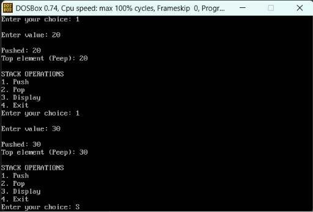
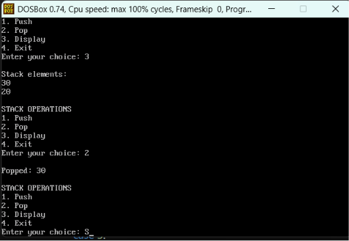
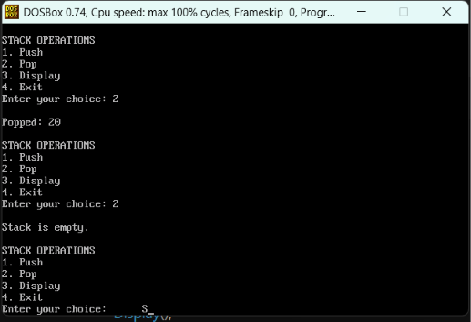

```c
#include <stdio.h>
#include <conio.h>

int stack[100], top = -1;

void Peek();

void Push(int value)
{
    top++;
    stack[top] = value;
    printf("\nPushed: %d", value);
    Peek();
}

void Pop()
{
    if(top == -1)
    {
        printf("\nStack is empty.");
    }
    else
    {
        printf("\nPopped: %d", stack[top]);
        top--;
    }
}

void Peek()
{
    if(top == -1)
    {
        printf("\nStack is empty.");
    }
    else
    {
        printf("\nTop element (Peep): %d", stack[top]);
    }
}

void Display()
{
    int i;

    if(top == -1)
    {
        printf("\nStack is empty.");
    }
    else
    {
        printf("\nStack elements:");

        for(i = top; i >= 0; i--)
        {
            printf("\n%d", stack[i]);
        }
    }
}

void main()
{
    int choice, value;

    while(1)
    {
        printf("\n\nSTACK OPERATIONS");
        printf("\n1. Push");
        printf("\n2. Pop");
        printf("\n3. Display");
        printf("\n4. Exit");

        printf("\nEnter your choice: ");
        scanf("%d", &choice);

        switch(choice)
        {
            case 1:
                printf("\nEnter value: ");
                scanf("%d", &value);
                Push(value);
                break;

            case 2:
                Pop();
                break;

            case 3:
                Display();
                break;

            case 4:
                printf("\nProgram Finished.");
                getch();
                return;

            default:
                printf("\nInvalid Choice.");
        }
    }
}

```

### output
 
 
 