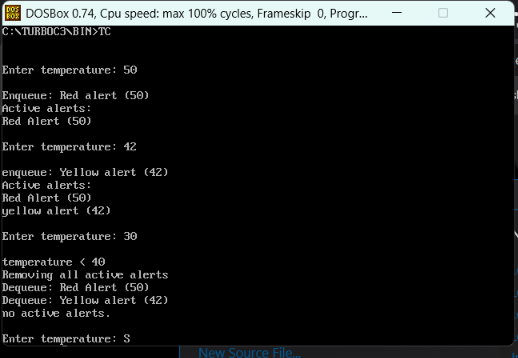
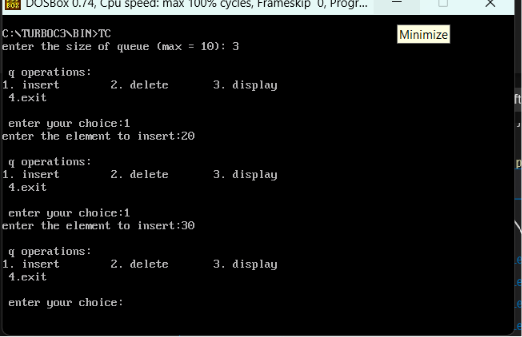
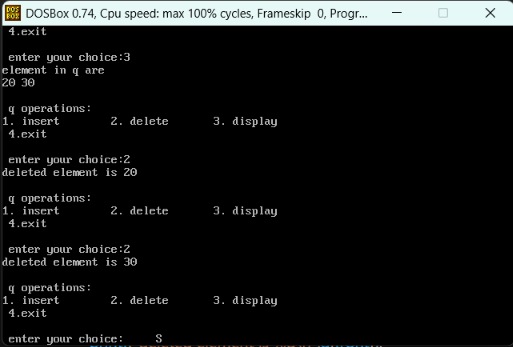
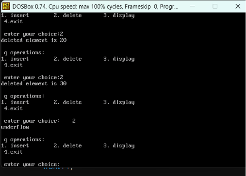

<p>
    <span style="float:left;">
        <h3> DSA  Experiment 2
    </span>
    <span style="float:right; text-align:right;"> 
        Name: Dev Mandora<br>
        Roll Number: 62 <br>
        Batch: SB4</h3>
    </span>
</p>

<br clear="both">

### Aim:

To implement a Linear Queue using an array.

### Objective:

-   To implement a Linear Queue using an array.
    
-   To perform Insert, Delete, and Display operations.
    
-   To understand FIFO (First In First Out) behavior.
    
-   To handle Overflow and Underflow conditions.
    

### Software Used:

-   DOSBox
    
-   Turbo C++
    

### Theory:

A Linear Queue is a linear data structure that follows the **FIFO (First In First Out)** principle. The element inserted first is deleted first. In a queue, insertion is performed from the `rear` and deletion is performed from the `front`. An array is used to store the elements of the queue. The program also checks for Overflow when the queue is full and Underflow when the queue is empty.

### Program:

```c
#include<stdio.h>
#include<conio.h>

int q[10], front = -1, rear = -1;

void insert(int temperature)
{
    if(rear >= 9)
    {
        printf("\nqueue overflow");
    }
    else
    {
        rear++;
        q[rear] = temperature;

        if(front == -1)
            front = 0;

        if(temperature >= 45)
            printf("\nEnqueue: Red alert (%d)", temperature);
        else if(temperature >= 43)
            printf("\nEnqueue: Orange Alert (%d)", temperature);
        else
            printf("\nenqueue: Yellow alert (%d)", temperature);
    }
}

void deletei()
{
    if(front == -1)
    {
        printf("\nno active alerts");
    }
    else
    {
        if(q[front] >= 45)
            printf("\nDequeue: Red Alert (%d)", q[front]);
        else if(q[front] >= 43)
            printf("\ndequeue: Orange alert (%d)", q[front]);
        else
            printf("\nDequeue: Yellow alert (%d)", q[front]);

        front++;

        if(front > rear)
        {
            front = -1;
            rear = -1;
        }
    }
}

void display()
{
    int i;

    if(front == -1)
    {
        printf("\nno active alerts.");
    }
    else
    {
        printf("\nActive alerts:");

        for(i = front; i <= rear; i++)
        {
            if(q[i] >= 45)
                printf("\nRed Alert (%d)", q[i]);
            else if(q[i] >= 43)
                printf("\norange Alert (%d)", q[i]);
            else
                printf("\nyellow alert (%d)", q[i]);
        }
    }
}

void main()
{
    int temperature;

    while(1)
    {
        printf("\n\nEnter temperature: ");

        if(scanf("%d", &temperature) != 1)
        {
            printf("\ninvalid inputd.");
            break;
        }

        if(temperature >= 40)
        {
            insert(temperature);
        }
        else
        {
            printf("\ntemperature < 40");
            printf("\nRemoving all active alerts");

            while(front != -1)
            {
                deletei();
            }
        }

        display();
    }

    getch();
}
```

### Output:
 
### program (basic queue)
```c
#include<stdio.h>
#include<conio.h>

int q[10], front = -1, rear = -1, i, n, x, choice;

void insert();
void deletei();
void display();

void main()
{
    printf("enter the size of queue (max = 10): ");
    scanf("%d",&n);

    do
    {
        printf("\n q operations:\n");
        
        printf("1. insert \t 2. delete \t 3. display \n 4.exit \n");
        printf("\n enter your choice:");
        scanf("%d",&choice);

        switch(choice)
        {
            case 1:
                insert();
                break;

            case 2:
                deletei();
                break;

            case 3:
                display();
                break;

            case 4:
                printf("program exit");
                break;

            default:
                printf("1. insert \t 2. delete \t 3. display \n 4.exit \n");
                break;
        }
    } while(choice != 4);
}

void insert()
{
    if(rear >= n - 1)
    {
        printf("overflow\n");
    }
    else
    {
        printf("enter the element to insert:");
        scanf("%d",&x);

        rear++;
        q[rear] = x;

        if(front == -1)
        {
            front = 0;
        }
    }
}

void display()
{
    if(front == -1)
    {
        printf("underflow");
    }
    else
    {
        printf("element in q are\n");

        for(i=front; i<=rear; i++)
        {
            printf("%d ",q[i]);
        }

        printf("\n");
    }
}

void deletei()
{
    if(front == -1)
    {
        printf("underflow\n");
    }
    else
    {
        printf("deleted element is %d\n",q[front]);
        front++;

        if(front > rear)
        {
            front = -1;
            rear = -1;
        }
    }
}


```
### output
 
 
 
### Outcome:

The Linear Queue was successfully implemented using an array. Insert, Delete, and Display operations were performed according to the FIFO principle.

### Conclusion:

The program demonstrates the implementation and basic operations of a Linear Queue using an array, including handling of Overflow and Underflow conditions.