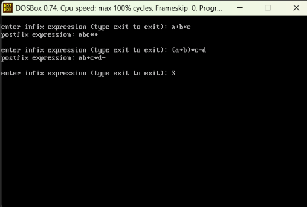

<p>
    <span style="float:left;">
        <h3> DSA Experiment 3
    </span>
    <span style="float:right; text-align:right;"> 
        Name: Dev Mandora<br>
        Roll Number: 62 <br>
        Batch: SB4</h3>
    </span>
</p>

<br clear="both">

### Aim:

To implement conversion of an Infix expression into its equivalent Postfix expression using a stack.

### Objective:

* To implement Infix to Postfix conversion using a stack.

* To understand the use of stack in expression conversion.

* To handle operator precedence and parentheses.

* To generate the equivalent Postfix expression from an Infix expression.

### Software Used:

* DOSBox

* Turbo C++

### Theory:

An **Infix expression** is an expression in which the operator is written between the operands. For example, `A+B`.

A **Postfix expression** is an expression in which the operator is written after the operands. For example, `AB+`.

The conversion from Infix to Postfix uses a **stack** to temporarily store operators. Operands are directly added to the Postfix expression, while operators are stored in the stack according to their priority. Parentheses are used to control the order of operations.

For example:

```text
Infix:   A+B*C
Postfix: ABC*+
```

Here, multiplication has higher priority than addition, so `*` is placed before `+` in the Postfix expression.

### Program:

```c
#include<stdio.h>
#include<conio.h>

char stack[50];
int top = -1;

void push(char ch)
{
    top++;
    stack[top] = ch;
}

char pop()
{
    char ch;

    ch = stack[top];
    top--;

    return ch;
}

int priority(char ch)
{
    if(ch == '+' || ch == '-')
        return 1;

    if(ch == '*' || ch == '/' || ch == '%')
        return 2;

    return 0;
}

void infix_to_postfix(char infix[], char postfix[])
{
    int i = 0, j = 0;
    char ch;

    while(infix[i] != '\0')
    {
        ch = infix[i];

        if((ch >= 'A' && ch <= 'Z') ||
           (ch >= 'a' && ch <= 'z') ||
           (ch >= '0' && ch <= '9'))
        {
            postfix[j] = ch;
            j++;
        }
        else if(ch == '(')
        {
            push(ch);
        }
        else if(ch == ')')
        {
            while(top != -1 && stack[top] != '(')
            {
                postfix[j] = pop();
                j++;
            }

            pop();
        }
        else
        {
            // pop operators with higher or equal priority
            while(top != -1 && priority(stack[top]) >= priority(ch))
            {
                postfix[j] = pop();
                j++;
            }

            push(ch);
        }

        i++;
    }

    while(top != -1)
    {
        postfix[j] = pop();
        j++;
    }

    // end of string
    postfix[j] = '\0';
}

void main()
{
    char infix[50], postfix[50];

    clrscr();

    while(1)
    {
        printf("\nenter infix expression (type exit to exit): ");
        scanf("%s", infix);

        if(infix[0] == 'e' &&
           infix[1] == 'x' &&
           infix[2] == 'i' &&
           infix[3] == 't' &&
           infix[4] == '\0')
        {
            printf("exited program\n");
            break;
        }

        infix_to_postfix(infix, postfix);

        printf("postfix expression: %s\n", postfix);
    }

    getch();
}
```

### Output:

 

### Outcome:

The Infix to Postfix expression conversion was successfully implemented using a stack. Operator precedence and parentheses were handled to generate the equivalent Postfix expression.

### Conclusion:

The program demonstrates the use of a stack for converting Infix expressions into Postfix expressions. It helps understand how operators and operands are processed according to their priority and order of evaluation.
