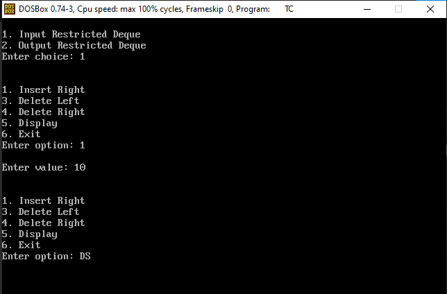
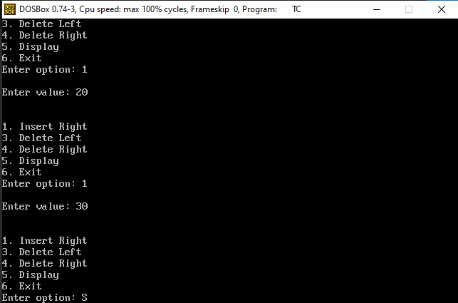
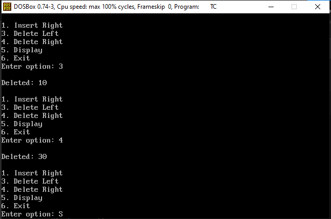
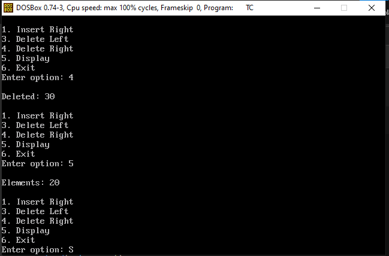
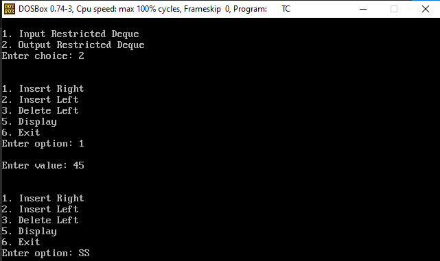
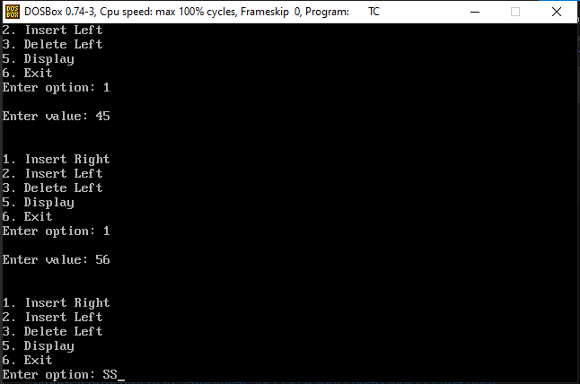
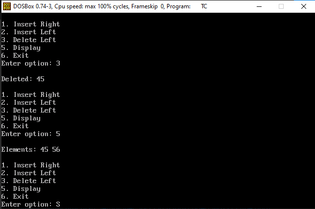
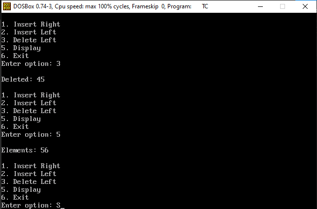

<p>
    <span style="float:left;">
        <h3> DSA Experiment 4
    </span>
    <span style="float:right; text-align:right;"> 
        Name: Dev Mandora<br>
        Roll Number: 62 <br>
        Batch: SB4</h3>
    </span>
</p>

<br clear="both">


### Aim:

To implement a Double-ended Queue (Deque) using an array and demonstrate Input Restricted Deque and Output Restricted Deque operations.

### Objective:

1. To implement a double-ended queue using an array.
2. To perform insertion and deletion operations from both ends of the deque.
3. To implement Input Restricted Deque.
4. To implement Output Restricted Deque.
5. To understand overflow and underflow conditions.

### Software Used:

- Turbo C / Turbo C++
- DOSBox

### Theory:

A Double-ended Queue (Deque) is a linear data structure in which insertion and deletion can be performed from both ends.

There are two types of restricted deque:

**Input Restricted Deque:**  
Insertion is allowed only from one end, while deletion is allowed from both ends.

**Output Restricted Deque:**  
Deletion is allowed only from one end, while insertion is allowed from both ends.

In this experiment, an array is used to implement the deque. The variables `left` and `right` are used to keep track of the two ends of the deque.

### Program:

```c
#include <stdio.h>
#include <conio.h>

#define MAX 10

int deque[MAX];
int left = -1, right = -1;

void insert_left()
{
    int x;

    if(left == (right + 1) % MAX)
    {
        printf("\nOVERFLOW");
        return;
    }

    printf("\nEnter value: ");
    scanf("%d", &x);

    if(left == -1)
        left = right = 0;
    else
    {
        left--;
        if(left < 0)
            left = MAX - 1;
    }

    deque[left] = x;
}

void insert_right()
{
    int x;

    if(left == (right + 1) % MAX)
    {
        printf("\nOVERFLOW");
        return;
    }

    printf("\nEnter value: ");
    scanf("%d", &x);

    if(left == -1)
        left = right = 0;
    else
    {
        right++;
        if(right == MAX)
            right = 0;
    }

    deque[right] = x;
}

void delete_left()
{
    if(left == -1)
    {
        printf("\nUNDERFLOW");
        return;
    }

    printf("\nDeleted: %d", deque[left]);

    if(left == right)
        left = right = -1;
    else
    {
        left++;
        if(left == MAX)
            left = 0;
    }
}

void delete_right()
{
    if(left == -1)
    {
        printf("\nUNDERFLOW");
        return;
    }

    printf("\nDeleted: %d", deque[right]);

    if(left == right)
        left = right = -1;
    else
    {
        right--;
        if(right < 0)
            right = MAX - 1;
    }
}

void display()
{
    int i;

    if(left == -1)
    {
        printf("\nQUEUE IS EMPTY");
        return;
    }

    printf("\nElements: ");

    i = left;

    while(i != right)
    {
        printf("%d ", deque[i]);
        i++;
        if(i == MAX)
            i = 0;
    }

    printf("%d", deque[right]);
}

int main()
{
    int choice, option;

    clrscr();

    printf("\n1. Input Restricted Deque");
    printf("\n2. Output Restricted Deque");
    printf("\nEnter choice: ");
    scanf("%d", &choice);

    do
    {
        printf("\n\n1. Insert Right");
        
        if(choice == 2)
            printf("\n2. Insert Left");

        printf("\n3. Delete Left");

        if(choice == 1)
            printf("\n4. Delete Right");

        printf("\n5. Display");
        printf("\n6. Exit");
        printf("\nEnter option: ");
        scanf("%d", &option);

        if(option == 1)
            insert_right();
        else if(option == 2 && choice == 2)
            insert_left();
        else if(option == 3)
            delete_left();
        else if(option == 4 && choice == 1)
            delete_right();
        else if(option == 5)
            display();
        else if(option != 6)
            printf("\nInvalid option.");

    } while(option != 6);

    return 0;
}
```
### Output

**Input Restricted Deque**

 
 
 
 

**Output Restricted Deque**
 
 
 
 
### Outcome:

The program successfully implements a double-ended queue using an array and demonstrates Input Restricted Deque and Output Restricted Deque operations.

### Conclusion:

The experiment demonstrates the implementation of a Deque using an array and the different insertion and deletion restrictions of Input Restricted and Output Restricted Deques.
