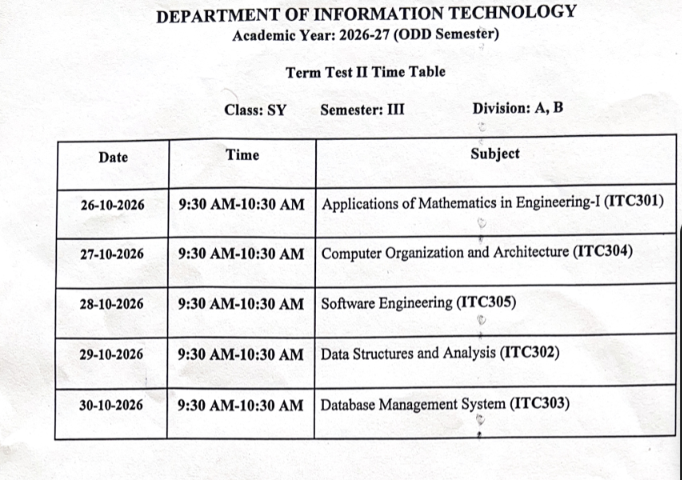
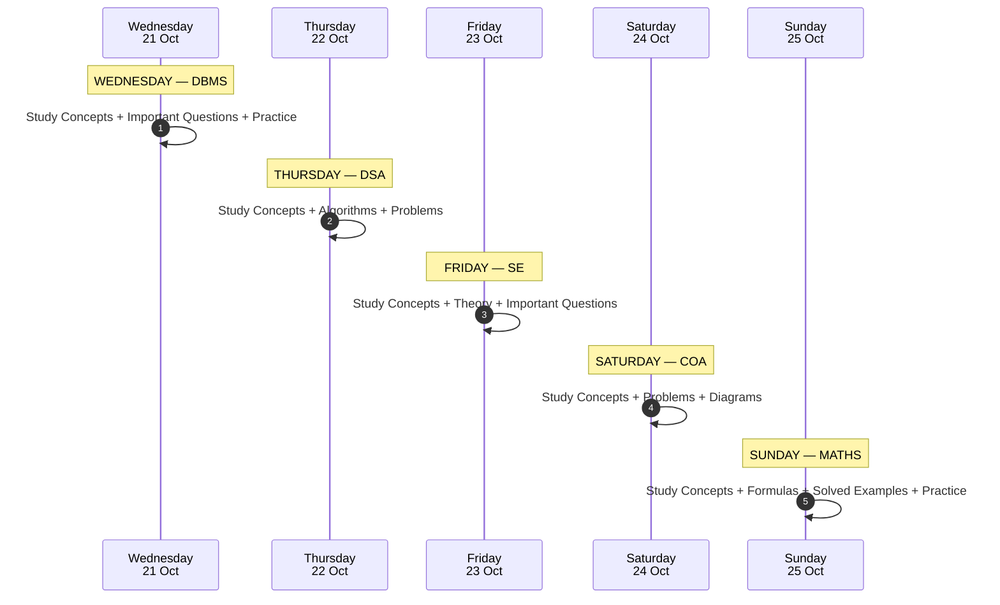
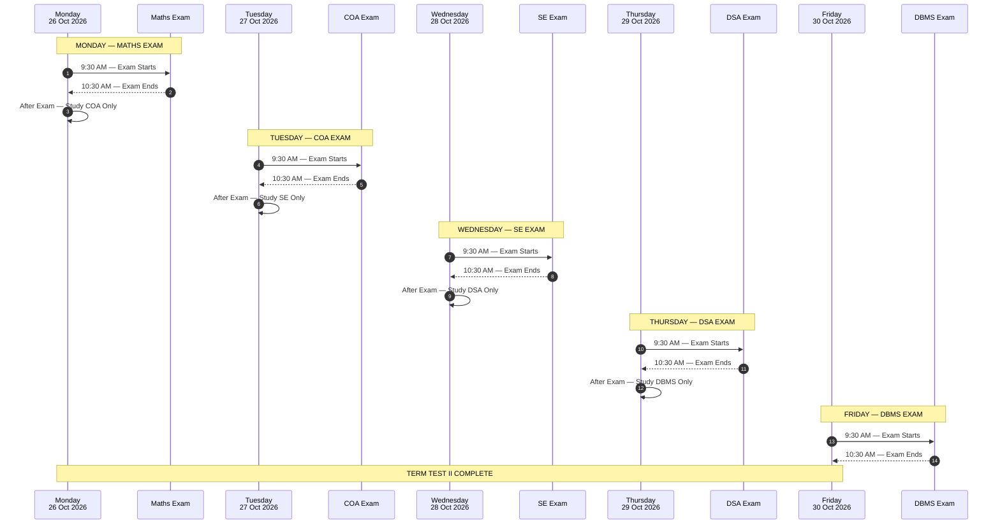

 # PT 2 Study Schedule

## Preparation — 21 to 25 October 2026

```mermaid
sequenceDiagram
    autonumber

    participant WED as Wednesday<br/>21 Oct
    participant THU as Thursday<br/>22 Oct
    participant FRI as Friday<br/>23 Oct
    participant SAT as Saturday<br/>24 Oct
    participant SUN as Sunday<br/>25 Oct

    Note over WED: WEDNESDAY — DBMS

    WED->>WED: Study Concepts + Important Questions + Practice

    Note over THU: THURSDAY — DSA

    THU->>THU: Study Concepts + Algorithms + Problems

    Note over FRI: FRIDAY — SE

    FRI->>FRI: Study Concepts + Theory + Important Questions

    Note over SAT: SATURDAY — COA

    SAT->>SAT: Study Concepts + Problems + Diagrams

    Note over SUN: SUNDAY — MATHS

    SUN->>SUN: Study Concepts + Formulas + Solved Examples + Practice
```

## Exam Week — 26 to 30 October 2026

```mermaid
sequenceDiagram
    autonumber

    participant MON as Monday<br/>26 Oct 2026
    participant MATHS as Maths Exam
    participant TUE as Tuesday<br/>27 Oct 2026
    participant COA as COA Exam
    participant WED as Wednesday<br/>28 Oct 2026
    participant SE as SE Exam
    participant THU as Thursday<br/>29 Oct 2026
    participant DSA as DSA Exam
    participant FRI as Friday<br/>30 Oct 2026
    participant DBMS as DBMS Exam

    Note over MON,MATHS: MONDAY — MATHS EXAM

    MON->>MATHS: 9:30 AM — Exam Starts
    MATHS-->>MON: 10:30 AM — Exam Ends
    MON->>MON: After Exam — Study COA Only

    Note over TUE,COA: TUESDAY — COA EXAM

    TUE->>COA: 9:30 AM — Exam Starts
    COA-->>TUE: 10:30 AM — Exam Ends
    TUE->>TUE: After Exam — Study SE Only

    Note over WED,SE: WEDNESDAY — SE EXAM

    WED->>SE: 9:30 AM — Exam Starts
    SE-->>WED: 10:30 AM — Exam Ends
    WED->>WED: After Exam — Study DSA Only

    Note over THU,DSA: THURSDAY — DSA EXAM

    THU->>DSA: 9:30 AM — Exam Starts
    DSA-->>THU: 10:30 AM — Exam Ends
    THU->>THU: After Exam — Study DBMS Only

    Note over FRI,DBMS: FRIDAY — DBMS EXAM

    FRI->>DBMS: 9:30 AM — Exam Starts
    DBMS-->>FRI: 10:30 AM — Exam Ends

    Note over MON,FRI: TERM TEST II COMPLETE
```
