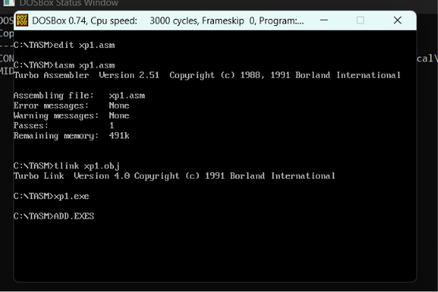
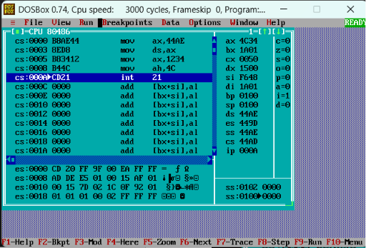
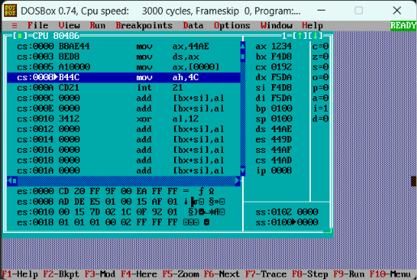
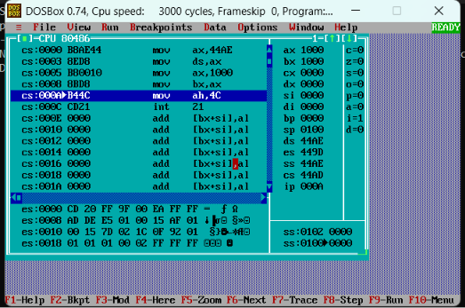
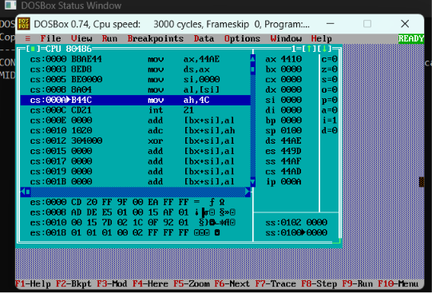
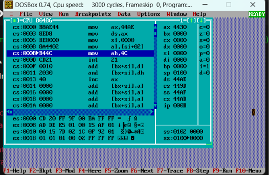

<p align="center">

<a href="https://ibb.co/0y4jv78d"></a>

<p>
    <span style="float:left;">
        <h3>MPMC Experiment 1
    </span>
    <span style="float:right; text-align:right;"> 
        Name: Dev  Mandora<br>
        Roll Number: 62 <br>
        Batch: SB4</h3>
    </span>
</p>

<br clear="both">

### Aim

Simulation of selected instructions to understand the addressing modes and instruction set of 8086 microprocessors.

### Lab Objective

The lab will cover hands-on experience with Assembly Language Programming of 8086 Microprocessor and C language programming of 8051 Microcontroller.

### Theory: Addressing Modes of 8086

The different ways in which a source operand is denoted in an instruction is known as **addressing modes**.

**Types of Addressing Modes:**

**1. Register Mode** – In this type of addressing mode, both the operands are registers.

**Examples:**

    MOV AX, BX
    XOR AX, DX
    ADD AL, BL

**2. Immediate Mode** – In this type of addressing mode, the source operand is an 8-bit or 16-bit data. The destination operand can never be immediate data.

**Examples:**

    MOV AX, 2000
    MOV CL, 0A
    ADD AL, 45
    AND AX, 0000

**Note:** To initialize the value of a segment register, a register is required.

**3. Displacement or Direct Mode** – In this type of addressing mode, the effective address is directly given in the instruction as displacement.

**Examples:**

    MOV AX, [DISP]
    MOV AX, [0500]

**4. Register Indirect Mode** – In this addressing mode, the effective address is in SI, DI, or BX.

**Physical Address:**

   ``` Physical Address = Segment Address + Effective Address```

**Examples:**

    MOV AX, [DI]
    ADD AL, [BX]
    MOV AX, [SI]

**5. Based Indexed Mode** – In this addressing mode, the effective address is the sum of the base register and index register.

**Base Registers:** BX, BP  
**Index Registers:** SI, DI

The physical memory address is calculated according to the base register.

**Examples:**

    MOV AL, [BP+SI]
    MOV AX, [BX+DI]

**6. Indexed Mode** – In this type of addressing mode, the effective address is the sum of the index register and displacement.

**Examples:**

    MOV AX, [SI+2000]
    MOV AL, [DI+3000]

**7. Based Mode** – In this addressing mode, the effective address is the sum of the base register and displacement.

**Example:**

    MOV AL, [BP+0100]

**8. Based Indexed Displacement Mode** – In this type of addressing mode, the effective address is the sum of the index register, base register, and displacement.

**Example:**

    MOV AL, [SI+BP+2000]

**9. String Mode** – This addressing mode is related to string instructions. The values of SI and DI are automatically incremented and decremented depending upon the value of the Direction Flag.

**Examples:**

    MOVSB
    MOVSW

**10. Input/Output Mode** – This addressing mode is related to input/output operations.

**Examples:**

    IN A, 45
    OUT A, 50

**11. Relative Mode** – In this addressing mode, the effective address is calculated with reference to the Instruction Pointer.

**Example:**

    JNZ 8-bit address
    IP = IP + 8-bit address

### Algorithm / Steps

To run an 8086 Assembly Language Program using the Turbo Assembler (TASM), follow a sequential process of writing, assembling, linking, and executing the code. Because TASM is a 16-bit DOS application, modern 64-bit systems require a DOS emulator like DOSBox to execute these steps.

### 1. Write Code

```text
edit filename.asm
```

Write the 8086 program, then **Save → Exit**.  
_Creates the source `.asm` file._

### 2. Assemble

```text
tasm filename.asm
```

_Checks the code for errors and creates a `.obj` file._

### 3. Link

```text
tlink filename.obj
```

_Converts the `.obj` file into an executable `.exe` file._

### 4. Execute

```text
filename.exe
```

_Runs the assembled program._

### 5. Debug

```text
td filename.exe
```

_Opens Turbo Debugger to execute instructions step-by-step and observe registers/memory._
***
### 1. Immediate Addressing Mode

**Aim:** Load an immediate value into a register.

```
.model small
.stack 100h
.data

.code
main proc
  mov ax,@data
  mov ds,ax

  mov ax,1234h

  mov ah,4ch
  int 21h
main endp
end main
```
Output:
 
 
***
### 2. Direct Addressing Mode

**Aim:** Access data using its memory address.
```
.model small
.stack 100h

.data
num dw 1234h

.code
main proc
        mov ax,@data
        mov ds,ax

        mov ax,num

        mov ah,4ch
        int 21h
main endp
end main
```
Output:
 
 
***
### 3. Register Addressing Mode

**Aim:** Transfer data between registers.

```
.model small
.stack 100h
.data

.code
main proc
        mov ax,@data
        mov ds,ax

        mov ax,1000h
	mov bx,ax

        mov ah,4ch
        int 21h
main endp
end main
```
Output:
 
 

***
### 4. Register Indirect Addressing Mode

**Aim:** Access memory using SI register.
```
.model small
.stack 100h

.data
array db 10h,20h,30h,40h

.code
main proc
        mov ax,@data
        mov ds,ax

     	lea si,array
	mov al,[si]

        mov ah,4ch
        int 21h
main endp
end main
```
Output:
 
 

***
### 5. Indexed Addressing Mode

**Aim:** Access array elements using an index.
```
.model small
.stack 100h

.data
array db 10h,20h,30h,40h

.code
main proc
        mov ax,@data
        mov ds,ax

     	lea si,array
	mov al,[si+2]

        mov ah,4ch
        int 21h
main endp
end main
```
Output:
 
 

***
### Conclusion

Thus, we studied assembly language programming format and tools, as well as the DOS function `INT 21H`. We also simulated a few instructions.

### Lab Outcomes

1.  Execute assembly language programs on microprocessor using arithmetic and logical instructions of 8086 microprocessors.
    
2.  Execute assembly language programs using loop instructions of 8086 microprocessors.
    
3.  Execute the selected instructions to understand addressing modes of 8051.
    
4.  Implement C language programs using instruction set of 8051.
    
5.  Implement C language programs for interfacing different devices with 8051.