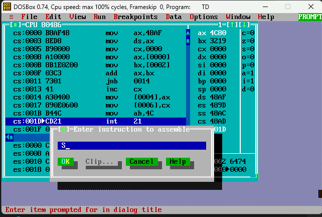
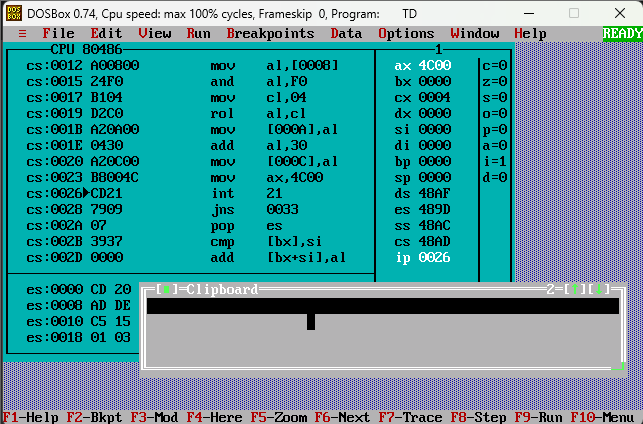

<p align="center">

<a href="https://ibb.co/0y4jv78d"></a>

<p>
    <span style="float:left;">
        <h3>MPMC Experiment 2
    </span>
    <span style="float:right; text-align:right;"> 
        Name: Dev  Mandora<br>
        Roll Number: 62 <br>
        Batch: SB4</h3>
    </span>
</p>

<br clear="both">


### Aim:
Implementation of arithmetic and logical operations using assembly language programme.

### Lab Objective:
a) Program to perform arithmetic operations on 16bit data.

b) To convert two digit packed BCD to unpacked BCD.


### Theory:

#### Arithmetic Operations in 8086:

- The 8086 microprocessor can perform arithmetic operations on 8-bit and 16-bit data using instructions like ADD, ADC, SUB, SBB, INC, DEC, MUL, DIV.
- Arithmetic operations are carried out using registers, memory, and immediate values.

#### Step 1: Hexadecimal Addition

```text
  4567H
+ 3219H
-------
  7780H
 ```
### Program 1: 16-bit Hexadecimal Addition

We take two 16-bit hexadecimal numbers and add them.
```asm
.model small

.data
a dw 4567H
b dw 3219H
c dw 0000H
d dw 0000H

.code
start:
  mov ax,@data
  mov ds,ax

  mov cx,0000H

  mov ax,a
  mov bx,b
  add ax,bx

  jnc teleport
  inc cx

teleport:
  mov c,ax
  mov d,cx
  mov ah,4CH
  int 21H

end start
```
 

***
### Program 2: Packed BCD to Unpacked BCD


Packed BCD stores two decimal digits in one byte.

For packed BCD `79H`:

-   Lower digit = `09H`
-   Higher digit = `07H`

ROL shifts the 4 higher bits (tens digit) to the lower nibble position.

```
0111 0000
     ROL 4
0000 0111 = 07H
```

The ASCII value is obtained by adding `30H`.

We take a **two-digit packed BCD** value and separate its digits.

```asm
.model small

.data
pbcd db 79H
dig1 db ?
dig2 db ?
asc1 db ?
asc2 db ?

.code
start:
  mov ax,@data
  mov ds,ax

  mov al,pbcd
  and al,0FH
  mov dig1,al
  add al,30H
  mov asc1,al

  mov al,pbcd
  and al,0F0H
  mov cl,04H
  rol al,cl
  mov dig2,al
  add al,30H
  mov asc2,al

  mov ax,4C00H
  int 21H

end start
```
 

### Outcome:

The required 16-bit arithmetic operation and packed BCD to unpacked BCD conversion were performed successfully.

### Conclusion:

The 8086 assembly language programs successfully performed arithmetic operation on 16-bit data and converted two-digit packed BCD into unpacked BCD.