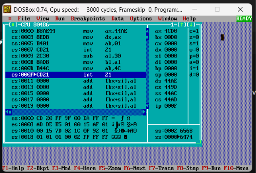
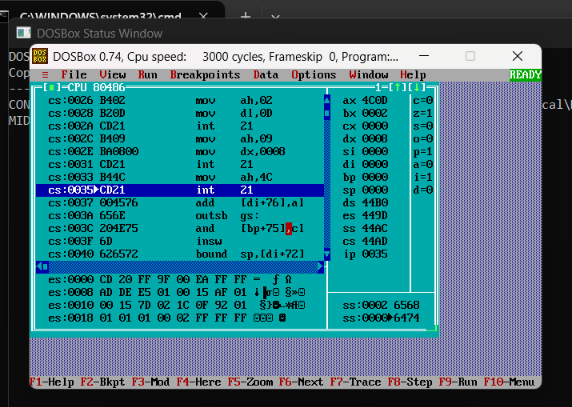
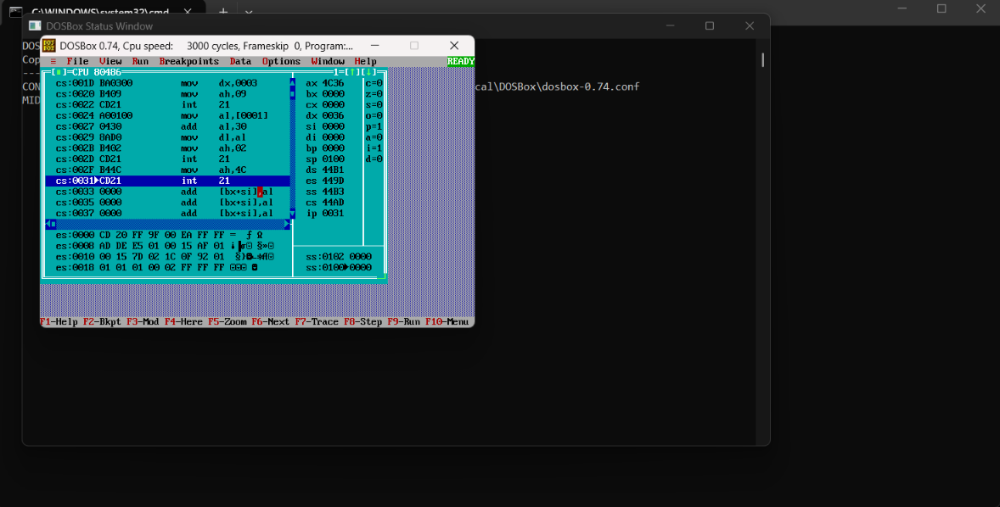

<p align="center">

<a href="https://ibb.co/0y4jv78d"></a>

<p>
    <span style="float:left;">
        <h3>MPMC Experiment 3
    </span>
    <span style="float:right; text-align:right;"> 
        Name: Dev Mandora<br>
        Roll Number: 62 <br>
        Batch: SB4</h3>
    </span>
</p>

<br clear="both">

### Aim:

To implement loop operations using Assembly Language Programming.

### Lab Objective:

a) WAP to convert ASCII value into decimal.

b) WAP to find whether the number is even or odd.

c) WAP to find the number of 1s in a given number.

### Theory:

#### Assembly Language:

Assembly language provides a low-level way to interact with computer hardware using mnemonics, registers and direct memory manipulation.

The important concepts used in this experiment are:

- **Registers** – Small storage locations inside the CPU used to hold data.
- **Instructions** – Perform arithmetic, logical and control operations.
- **Memory** – Stores data and program instructions.

#### Program 1: ASCII to Decimal Conversion

When a number is entered from the keyboard, it is received in ASCII format. The ASCII value of digit `0` is `30H`. By subtracting `30H` from the ASCII value, the corresponding decimal value is obtained.

#### Program 2: Even or Odd Number

The program accepts a single digit, converts it from ASCII to decimal and divides it by `2`.

- If the remainder is `0`, the number is even.
- If the remainder is not `0`, the number is odd.

#### Program 3: Count Number of 1s

The program analyzes an 8-bit number bit-by-bit using the `RCR` instruction.

- `num` stores the input number.
- `ones` stores the count of `1` bits.
- `zeros` stores the count of `0` bits.
- `RCR` moves each bit into the Carry Flag.
- If the Carry Flag is `1`, the `ones` counter is increased.
- Otherwise, the `zeros` counter is increased.
- The loop continues until all 8 bits are checked.

### Program 1: Convert ASCII to Decimal

The program accepts a digit from the keyboard and converts its ASCII value into its corresponding decimal value.

```asm
.model small

.data

.code
start:
    mov ax,@data
    mov ds,ax

    mov ah,1
    int 21h

    sub al,30h
    mov bl,al

    mov ah,4Ch
    int 21h

end start
````

### Program Explanation:

-   `MOV AH,1` accepts a character from the keyboard.
    
-   The entered digit is stored in `AL` in ASCII form.
    
-   `SUB AL,30H` converts the ASCII value into its decimal value.
    
-   The converted value is stored in `BL`.
    

### Output:

 

### Program 2: Find Whether the Number is Even or Odd

```asm
.model medium

.data
ev db "Even Number$"
od db "Odd Number$"

.code
start:
    mov ax,@data
    mov ds,ax

    mov ah,1
    int 21h

    sub al,30h
    mov ah,0

    mov bl,2
    div bl

    cmp ah,0
    je evennumber

oddnumber:
    mov ah,2
    mov dl,13
    int 21h

    mov ah,9
    mov dx,offset od
    int 21h

    jmp exitprog

evennumber:
    mov ah,2
    mov dl,13
    int 21h

    mov ah,9
    mov dx,offset ev
    int 21h

exitprog:
    mov ah,4Ch
    int 21h

end start
```

### Program Explanation:

-   `MOV AH,1` accepts a character from the keyboard.
    
-   `SUB AL,30H` converts the ASCII value into a decimal digit.
    
-   `DIV BL` divides the number by `2`.
    
-   The remainder is stored in `AH`.
    
-   `CMP AH,0` checks the remainder.
    
-   If the remainder is `0`, the number is even.
    
-   Otherwise, the number is odd.
    
-   The corresponding message is displayed.
    

### Output:

 

### Program 3: Find the Number of 1s in a Given Number

We take an 8-bit number and count the number of `1`s present in its binary representation.

For example:

```text
F3H = 11110011B

Number of 1s = 6
```
***
```asm
.model small
.stack 100h

.data
    num db 0F3h
    ones db 0
    zeros db 0
    msg db 'Number of 1s :$'

.code

main:
    mov ax,@data
    mov ds,ax

    mov al,num
    mov cl,8

count_loop:
    rcr al,1
    jc is_one

    inc zeros
    jmp next_bit

is_one:
    inc ones

next_bit:
    dec cl
    jnz count_loop

    mov dx,offset msg
    mov ah,09h
    int 21h

    mov al,ones
    add al,'0'
    mov dl,al

    mov ah,02h
    int 21h

    mov ah,4Ch
    int 21h

end main
```

### Program Explanation:

-   `MOV AL,num` loads the 8-bit number into `AL`.
    
-   `MOV CL,8` sets the loop counter to 8.
    
-   `RCR AL,1` rotates the number through the Carry Flag.
    
-   `JC is_one` checks whether the current bit is `1`.
    
-   `INC ones` increases the count of `1`s.
    
-   `INC zeros` increases the count of `0`s.
    
-   `DEC CL` decreases the loop counter.
    
-   `JNZ count_loop` repeats the process until all 8 bits are checked.
    
-   The number of `1`s is displayed.
    

### Output:

 

### Outcome:

The required ASCII conversion, even/odd checking and bit-counting operations were successfully performed using 8086 Assembly Language.

### Conclusion:

Thus, the experiment successfully demonstrated ASCII conversion, arithmetic operations, conditional instructions and loop operations in Assembly Language.