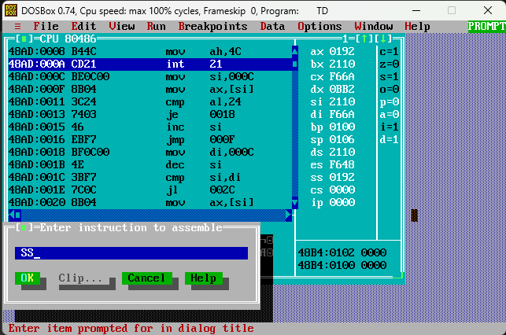
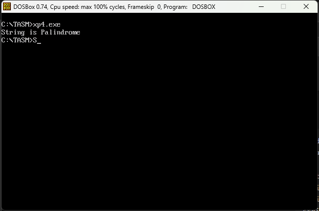
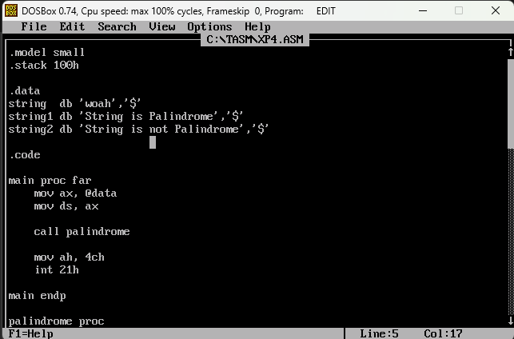
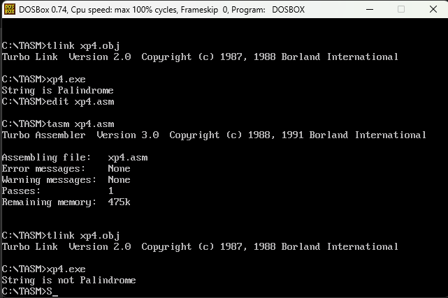
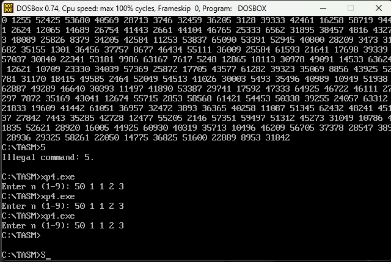
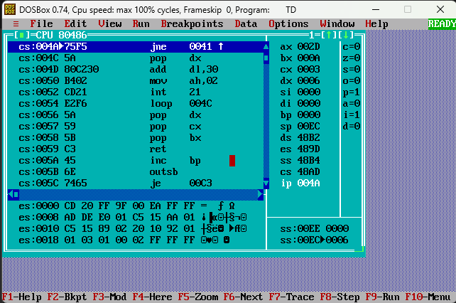
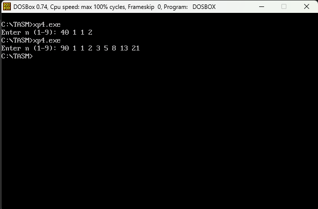

<div align = "center">

<a href="https://ibb.co/0y4jv78d" align="center"></a>
</div>
<div align="center"> <b>
<u>DEPARTMENT OF INFORMATION TECHNOLOGY</u>

Course: Microprocessor and Microcontroller Lab (ITL304)
 B.Tech. (Information Technology) – Semester III
Academic Year: 2026-27 (ODD Semester) </b>
</div>

<p>
    <span style="float:left;">
        <h3> MPMC  Experiment 4
    </span>
    <span style="float:right; text-align:right;"> 
        Name: Dev Mandora<br>
        Roll Number: 62 <br>
        Batch: SB4</h3>
    </span>
</p>

<br clear="both">

### Aim:

Implementation of loop operations using Assembly Language Programming.

### Lab Objective:

**a)** To check whether a given string is a palindrome or not using 8086 Assembly Language. A palindrome reads the same from both directions.  
Example: RACECAR → Palindrome; HELLO → Not Palindrome.

**b)** To generate the first **n Fibonacci numbers** using Assembly Language Programming.

### Theory:

Implementing string operations in assembly language requires a detailed understanding of the architecture's instruction set and memory management. String operations involve manipulating sequences of characters stored in contiguous memory locations. In x86 assembly, instructions like `MOVSB`, `MOVSW`, `MOVSD`, `LODSB`, `STOSB`, and `SCASB` are used for byte or word-level string operations.

The palindrome program uses registers as pointers to access characters from the beginning and end of the string. A loop is used to compare corresponding characters. If all characters match, the string is a palindrome; otherwise, it is not a palindrome.

The Fibonacci series is:

```text
0, 1, 1, 2, 3, 5, 8, 13, ...
```

Each number is obtained by adding the previous two numbers. The program starts with `0` and `1` and repeatedly calculates the next number using a loop.

***

### PROGRAM 1 — PALINDROME


```asm
.model small
.stack 100h

.data
string  db 'racecar','$'
string1 db 'String is Palindrome','$'
string2 db 'String is not Palindrome','$'

.code

main proc far
    mov ax, @data
    mov ds, ax

    call palindrome

    mov ah, 4ch
    int 21h

main endp

palindrome proc

    mov si, offset string

loop1:
    mov ax, [si]
    cmp al, '$'
    je label1
    inc si
    jmp loop1

label1:
    mov di, offset string
    dec si

loop2:
    cmp si, di
    jl output1

    mov ax, [si]
    mov bx, [di]

    cmp al, bl
    jne output2

    dec si
    inc di
    jmp loop2

output1:
    lea dx, string1
    mov ah, 09h
    int 21h
    ret

output2:
    lea dx, string2
    mov ah, 09h
    int 21h
    ret

palindrome endp

end main
```

### Output 1

**Input value:** `racecar`

 
 

### Output 2

**Input value:** `woah`

 
 
***

### PROGRAM 2 — FIBONACCI SERIES


```text
0, 1, 1, 2, 3, 5, 8, 13, ...
```

Each number is obtained by adding the previous two numbers.

### Program:

```asm
.MODEL SMALL
.STACK 100H

.DATA
MSG DB 'Enter n (1-9): $'

.CODE

MAIN PROC
    MOV AX, @DATA
    MOV DS, AX

    ; Display message
    LEA DX, MSG
    MOV AH, 09H
    INT 21H

    ; Read n
    MOV AH, 01H
    INT 21H
    SUB AL, '0'
    MOV CL, AL
    MOV CH, 0

    ; First two Fibonacci numbers
    MOV AX, 0
    MOV BX, 1

FIB:
    ; Save loop counter and Fibonacci values
    PUSH CX
    PUSH AX
    PUSH BX

    ; Display current number
    CALL DISPLAY

    ; Print space
    MOV DL, ' '
    MOV AH, 02H
    INT 21H

    ; Restore Fibonacci values
    POP BX
    POP AX
    POP CX

    ; Generate next number
    MOV DX, AX
    ADD DX, BX
    MOV AX, BX
    MOV BX, DX

    LOOP FIB

    MOV AH, 4CH
    INT 21H

MAIN ENDP


; Display number in AX

DISPLAY PROC
    PUSH BX
    PUSH CX
    PUSH DX

    MOV BX, 10
    XOR CX, CX

NEXT:
    XOR DX, DX
    DIV BX
    PUSH DX
    INC CX
    CMP AX, 0
    JNE NEXT

PRINT:
    POP DX
    ADD DL, '0'
    MOV AH, 02H
    INT 21H
    LOOP PRINT

    POP DX
    POP CX
    POP BX

    RET
DISPLAY ENDP

END MAIN
```

### Instruction Purpose

| Instruction | Purpose |
| --- | --- |
| `MOV AX, 0` | Stores first Fibonacci number |
| `MOV BX, 1` | Stores second Fibonacci number |
| `MOV CL, AL` | Stores number of terms `n` |
| `MOV DX, AX` | Copies current Fibonacci number |
| `ADD DX, BX` | Calculates next number |
| `MOV AX, BX` | Moves second number to first |
| `MOV BX, DX` | Stores next number as second |
| `LOOP FIB` | Repeats until `n` terms are generated |
| `DISPLAY` | Displays the number stored in `AX` |

### Example

If the input is:

```text
Enter n (1-9): 7
```

Output:

```text
0 1 1 2 3 5 8
```

### Flow

```text
Start
  ↓
Read n
  ↓
Set A = 0, B = 1
  ↓
Print A
  ↓
C = A + B
  ↓
A = B
  ↓
B = C
  ↓
Repeat n times
  ↓
Stop
```

### Code with Output:

 
 
> [!attention] registers are not working properly when the program is ran for the first few times but it runs perfectly after disabling numpad or something
> tried to prove it but the software now works normally pretending its the device fault
>  


### Conclusion:

The experiment successfully demonstrated how to check whether a string is a palindrome and generate the Fibonacci series. The required assembly language instructions, registers, loops, and arithmetic operations were used correctly to obtain the desired output.

### Lab Outcome:

Execute assembly language programs using loop instructions of 8086 microprocessors.