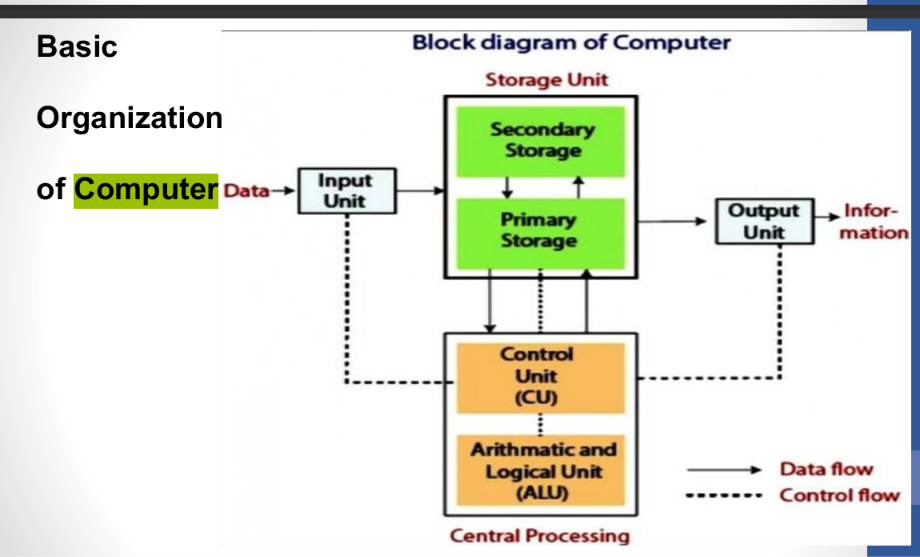
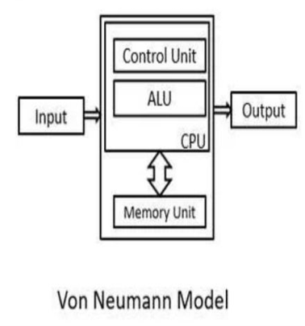
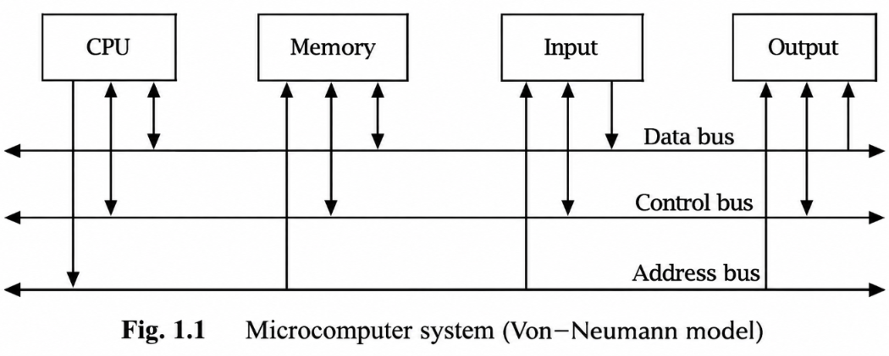
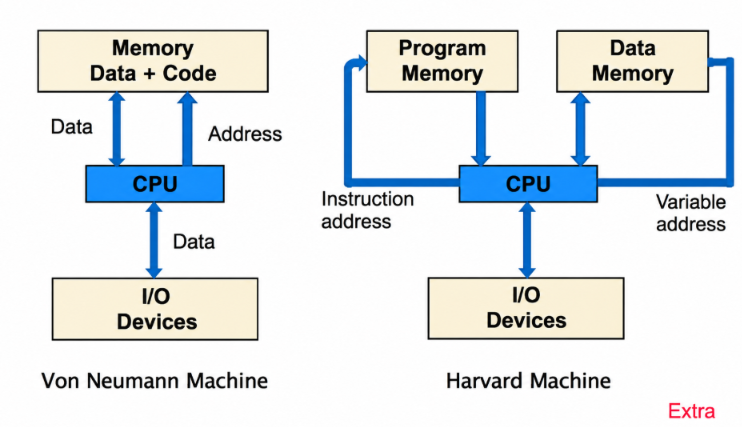
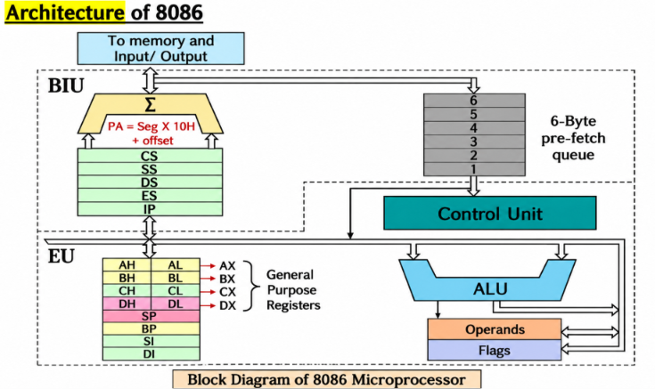
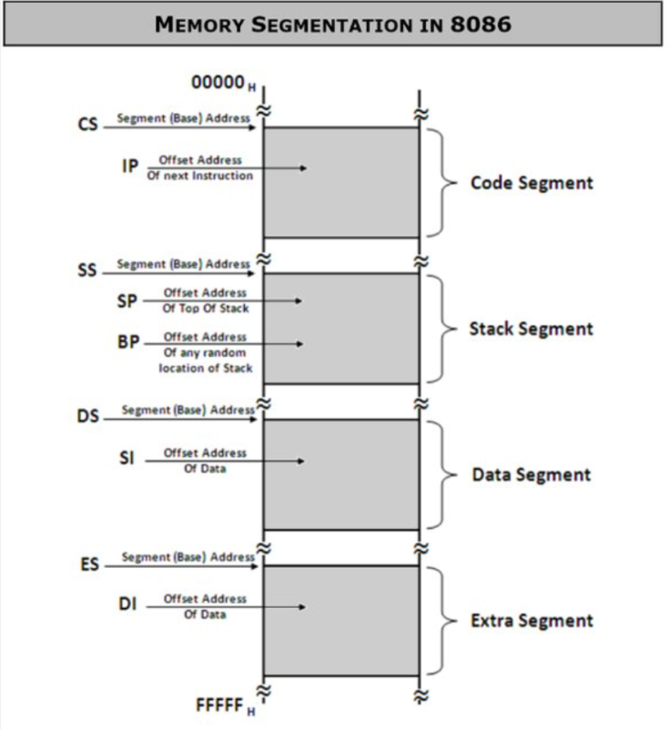
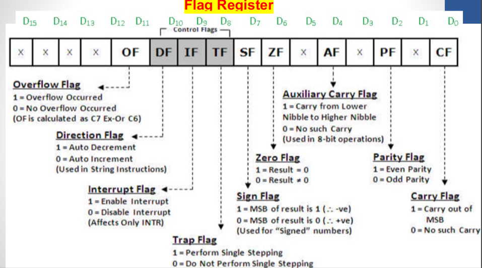
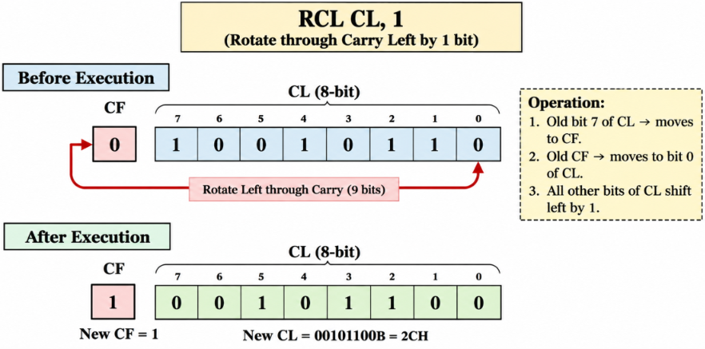
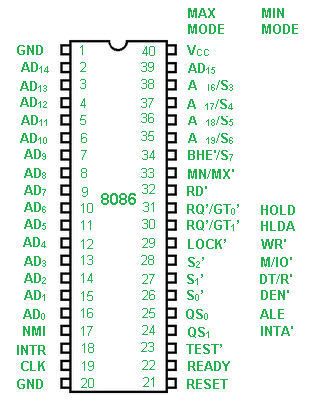

# COA Module 1 — Complete Exam Notes
> **Computer Organization and Architecture | Sem III | Last-minute-friendly notes**
>
> These notes follow the Module 1 PDF and its FAQ list. Explanations are expanded where useful for quick revision, especially for concepts that may be new if you came through a diploma route. Use the diagram placeholders as a guide for what to draw in the exam.

## How to use these notes
- First learn the **bold definitions** and the memory tricks.
- Practise drawing the functional-unit diagram, Von Neumann model, 8086 architecture, register organization, and 8086 pin diagram.
- For 8086 questions, remember the two big halves: **BIU fetches/transfers; EU decodes/executes**.
- For numerical performance questions, write the formula first, substitute values, then show units.

---

# FAQ 1. Describe the Block-Level Description of the Functional Units

## Definition
A computer is made up of several functional units that work together to accept data, process it, store it, and present the result. The main functional units are:
1. Input Unit
2. Central Processing Unit (CPU)
3. Storage/Memory Unit
4. Output Unit

## Block diagram

 


## 1. Input Unit
- Accepts data and instructions from the user or external environment.
- Converts input into a form the computer can process.
- Sends the data/instructions to memory or the CPU.
- Examples: keyboard, mouse, scanner, microphone, camera, sensors.

**Example:** A temperature sensor sends a reading to the computer. The input interface passes the reading to the system.

## 2. Central Processing Unit (CPU)
The CPU is often called the **brain of the computer**. It controls system operations and processes data.

### a. Arithmetic Logic Unit (ALU)
- Performs arithmetic operations: addition, subtraction, etc.
- Performs logical operations: AND, OR, NOT, XOR, comparisons, shifts, etc.
- Produces results and updates relevant status flags.

**Memory trick:** **ALU = Arithmetic + Logic Unit**. If the question asks “who calculates or compares?”, answer ALU.

### b. Control Unit (CU)
- Fetches instructions from memory and decodes them.
- Generates control signals to coordinate the CPU, memory and I/O.
- Directs the sequence of operations.
- It controls operations; it is not the unit that performs the arithmetic itself.

**Memory trick:** The CU is the manager; the ALU is the worker doing the calculations.

### c. Registers
- Small, very fast storage locations inside the CPU.
- Hold operands, addresses, instructions and intermediate results.
- Faster to access than main memory.

### d. Instruction Register and Decoder
- **Instruction Register (IR):** holds the current instruction being processed.
- **Instruction Decoder:** interprets the instruction and identifies the operation and operands.

## 3. Storage / Memory Unit
Stores programs, input data, intermediate results and final results.

### Primary memory
- **RAM:** volatile; contents are normally lost when power is switched off. Used for active programs and data.
- **ROM:** non-volatile; retains its contents without power. Commonly stores firmware/start-up instructions.

### Secondary storage
- Stores data and programs for long-term use.
- Examples: SSD, hard disk, memory card.
- Usually larger and cheaper per byte than RAM, but slower.

## 4. Output Unit
- Presents processed information in a form useful to the user or another device.
- Examples: monitor, printer, speakers, actuator/display.

## Four basic functions of a computer
1. **Data processing** — transforms data.
2. **Data storage** — stores data and instructions.
3. **Data movement** — transfers data between the computer and external devices.
4. **Control** — coordinates the other functions.

> [!hint] AI heatwave example
> A sensor sends temperature data through the **input unit**. Memory stores the readings. The CPU/ALU calculates trends, while the CU coordinates the steps. The output unit displays a heat alert or sends a warning.

> [!check] One-line recall
> **Input → Store → Process → Output**, with the **CU controlling** the whole operation.

---

# FAQ 2. Explain the Von Neumann Model in Detail

## Definition
The **Von Neumann model** is a stored-program computer design in which **instructions and data are stored in the same main memory** and use a common communication path.

The concept is associated with mathematician **John von Neumann** and was described in 1945. It forms the basis of many general-purpose computer designs.

## Diagram
 

 
*Keep the diagram neat. The key point to label is that instructions and data share the same memory.*

## Main components

### 1. Central Processing Unit (CPU)
The CPU contains:
- **Control Unit (CU):** fetches and decodes instructions and coordinates operations.
- **Arithmetic Logic Unit (ALU):** performs arithmetic and logical operations.
- **Registers:** temporarily hold instructions, data, addresses and results.

### 2. Memory Unit
- Stores both program instructions and data in a **single, unified memory space**.
- The CPU accesses instructions and data from this memory.
- This is the **stored-program concept**.

### 3. Input/Output (I/O) system
- Input devices provide data/instructions.
- Output devices present the results.
- Examples: keyboard, sensor, monitor, printer.

### 4. System bus
The bus is the communication pathway connecting the CPU, memory and I/O.

| Bus | Function | Easy way to remember |
|---|---|---|
| **Data bus** | Carries actual data and instruction bytes | “What is being sent?” |
| **Address bus** | Carries the address of the location to access | “Where?” |
| **Control bus** | Carries read, write and other control signals | “What action?” |

## Working of the Von Neumann model
The CPU repeatedly follows the instruction cycle:

1. **Fetch:** the CPU uses the Program Counter (PC) to locate and fetch the next instruction from memory.
2. **Decode:** the CU interprets the instruction and identifies the required operation and operands.
3. **Execute:** the ALU or another CPU unit performs the operation.
4. **Store/write back:** the result is stored in a register or memory when required.
5. **Update PC:** the processor proceeds to the next instruction unless a branch/jump changes the sequence.

**[DIAGRAM PLACEHOLDER — Draw a cycle: Fetch → Decode → Execute → Store/Write back → Fetch next instruction]**

## Advantages
- **Simple design:** instructions and data use the same memory system.
- **Flexible:** changing the program in memory allows the computer to perform a different task.
- **Lower hardware complexity/cost:** no need for completely separate main memories and buses for instructions and data.
- **General-purpose:** supports a wide variety of programs.

## Limitations
- **Von Neumann bottleneck:** instruction fetches and data transfers compete for the same memory path, which can limit performance.
- The CPU may have to wait for memory transfers.
- A shared memory system requires careful management because both instructions and data occupy it.

> [!hint] Memory trick
> **Von Neumann = one memory for both.** Think of a single road used by both delivery trucks (data) and buses carrying instructions. They can block each other.

## Harvard architecture — useful comparison
The Module 1 PDF also introduces Harvard architecture.

 
| Von Neumann | Harvard |
|---|---|
| Instructions and data share the same physical memory | Instructions and data use separate memories |
| Common path/bus for instruction and data transfers | Separate instruction and data paths |
| Simpler and generally cheaper | More complex and potentially more expensive |
| Instruction and data transfers can compete | Can fetch an instruction and access data concurrently |
| Common in general-purpose computer designs | Common in microcontrollers and DSP-style systems |

**Extra context:** Many modern processors combine aspects of both. Main memory is shared, while the CPU may use separate instruction and data caches.

> [!warning] Exam wording
> If the question says “Von Neumann model” or “Von Neumann architecture,” explain the stored-program concept, CPU, memory, I/O, buses, working, advantages and limitations. Add the diagram.

---

# FAQ 3. Compare Computer Organization and Computer Architecture

## Definitions
**Computer architecture** describes the features of a computer that are visible to the programmer and affect logical program execution. It describes **what the computer does**.

**Computer organization** describes how the architectural features are implemented using hardware units and their interconnections. It describes **how the computer does it**.

| Computer Architecture | Computer Organization |
|---|---|
| Describes **what** the computer does | Describes **how** it is implemented |
| Deals with functional behaviour | Deals with structural relationships and operational units |
| Includes instruction set, registers visible to the programmer, data types and addressing modes | Includes control signals, circuit design, interfaces, memory technology and hardware interconnections |
| More concerned with the logical/programmer-visible design | More concerned with physical implementation |
| Decided first during design | Decided after the architecture |
| Also called Instruction Set Architecture (ISA) in the relevant context | Often discussed as microarchitecture/implementation |
| Example: whether an instruction such as `ADD` is supported | Example: how the ALU and control circuitry execute `ADD` |

## Simple example
Imagine two processors support the same instruction set, so the same machine-code program can run on both. One may use a different cache, pipeline or control design. Their **architecture may be compatible**, while their **organization differs**.

> [!hint] Memory trick
> **Architecture = what is promised. Organization = how the promise is delivered.**
>
> Or: architecture is the recipe; organization is the kitchen setup used to cook it.

---

# FAQ 4. Performance Measures of Computer Architecture

Computer performance describes how quickly and efficiently a computer completes work. The PDF highlights three main measures: **response time, CPU execution time and throughput**.

## 1. Response time / turnaround time
- Time from the start of a task until its completion.
- Includes CPU execution, I/O waiting, memory/disk access, operating-system overhead and waiting for other processes.
- For a user, it answers: “How long did my task take?”

## 2. CPU execution time
- Time the CPU spends executing instructions for a task.
- A common formula is:

$$
T_{CPU} = \text{Instruction Count} \times CPI \times T_{clock}
$$

Where:
- **Instruction Count (IC or N):** number of instructions executed.
- **CPI:** average clock cycles per instruction.
- **Clock cycle time:** time for one clock cycle.

Since \(T_{clock}=1/f\), where \(f\) is clock frequency:

$$
T_{CPU} = \frac{IC \times CPI}{\text{Clock Frequency}}
$$

Also, \(\text{Clock Frequency}=1/T_{clock}\).

### Example
Suppose:
- Instruction count = 15,000
- Average CPI = 12
- Clock frequency = 3.3 GHz

$$
T_{clock}=\frac{1}{3.3\times10^9}\approx0.303\times10^{-9}\text{ s}
$$

$$
T_{CPU}=15000\times12\times\frac{1}{3.3\times10^9}
\approx54.5\times10^{-6}\text{ s}
$$

So CPU execution time is approximately **54.5 microseconds (µs)**.

**Unit reminder:** \(1\ \mu s = 10^{-6}\) seconds; \(1\ ns = 10^{-9}\) seconds.

## 3. Throughput
- Amount of work completed per unit time.
- Example: number of jobs, requests or sensor readings processed per second.
- Higher throughput means more work completed in the same time.

## Other useful terms
- **Clock rate:** number of clock cycles per second, measured in Hz (often GHz).
- **CPI:** average number of clock cycles needed per instruction.
- **Instruction count:** depends on the program and the instruction set/compiler.
- **Speedup:** old execution time divided by new execution time.

## What improves CPU execution time?
From the formula, execution time can be reduced by:
- reducing the instruction count,
- reducing average CPI,
- reducing clock-cycle time (increasing clock frequency).

These factors can interact; a higher clock rate alone does not guarantee a faster program.

> [!hint] Formula memory trick
> **Count × Cycles × Time** = instructions × cycles/instruction × time/cycle.
>
> The “instructions” and “per instruction” cancel conceptually, leaving total cycles × time per cycle = time.

> [!warning] Common confusion
> **Response time is not the same as CPU execution time.** Response time includes waiting and overhead; CPU execution time focuses on the CPU's work for the task.

---

# FAQ 5. Explain the Von Neumann Architecture and List the Performance Measures

This question combines FAQs 2 and 4. Use the same Von Neumann diagram and explanation, then add a separate performance-measures section.

## Von Neumann architecture
1. It follows the stored-program concept: data and instructions are stored in the same main memory.
2. The CPU contains the CU, ALU and registers.
3. The CU fetches and decodes instructions; the ALU performs arithmetic and logical operations.
4. Input devices supply data and output devices present results.
5. Data, address and control buses connect the components.
6. The instruction cycle consists of fetch, decode, execute and store/write back.
7. Its major limitation is the Von Neumann bottleneck caused by sharing the memory path.

## Performance measures
1. **Response time:** total time from starting a task to finishing it, including waiting and overhead.
2. **CPU execution time:** time spent executing the task on the CPU.

$$
T_{CPU}=IC\times CPI\times T_{clock}
$$

3. **Throughput:** amount of work completed per unit time.

For a combined question, do not forget to explain each measure rather than only listing the names.

---

# FAQ 6. Draw and Explain 8086 Microprocessor Architecture in Detail

## Introduction
The **Intel 8086** is a 16-bit microprocessor introduced in 1978 and the first processor in the x86 family. Its architecture is divided into two major units:

1. **Bus Interface Unit (BIU)**
2. **Execution Unit (EU)**

This division allows the BIU to fetch instructions while the EU executes previously fetched instructions, when possible.

## Architecture diagram

  

*The exact visual arrangement can vary. Keep the BIU and EU clearly separated and label their contents.*

## A. Bus Interface Unit (BIU)
The BIU handles communication between the processor and memory/I/O.

It contains:
- **Segment registers:** CS, DS, SS and ES.
- **Instruction Pointer (IP):** holds the offset of the next instruction to be fetched within the code segment.
- **Address-generation adder:** calculates the 20-bit physical address.
- **6-byte instruction queue:** stores prefetched instruction bytes.
- **Bus control/interface circuitry:** performs memory and I/O bus operations.

### Functions of the BIU
1. Fetches instruction bytes from memory.
2. Reads data from memory or I/O when required.
3. Writes data to memory or I/O when required.
4. Calculates physical addresses using segment and offset.
5. Stores prefetched instruction bytes in the 6-byte queue.
6. Supplies instruction bytes to the EU.

### Physical address calculation
The 8086 uses segment:offset addressing.

$$
\text{Physical Address}=(\text{Segment}\times10H)+\text{Offset}
$$

Equivalently, shift the segment value left by 4 bits and add the offset.

**Example:**

Segment = `1234H`, Offset = `0010H`

- Segment base = `1234H × 10H = 12340H`
- Physical address = `12340H + 0010H = 12350H`

The 8086 has a 20-bit address bus and can address \(2^{20}=1,048,576\) bytes = **1 MB**, from `00000H` to `FFFFFH`.

## B. Execution Unit (EU)
The EU decodes and executes instructions. It tells the BIU what instruction/data to fetch when a memory operation is needed.

It contains:
- 16-bit ALU
- Instruction decoder and control circuitry
- General-purpose registers
- Pointer and index registers
- Flag register

### Functions of the EU
1. Receives instruction bytes from the BIU queue.
2. Decodes the instruction.
3. Performs arithmetic and logical operations using the ALU.
4. Updates flags according to the operation.
5. Uses registers and requests memory/I/O transfers through the BIU.

## How BIU and EU work together
1. The BIU fetches instruction bytes from memory and places them in its 6-byte queue.
2. The EU takes instruction bytes from the queue and decodes them.
3. The EU executes the instruction.
4. If the instruction needs memory or I/O, the EU requests the BIU to perform the bus operation.
5. Meanwhile, the BIU can refill the queue when the bus is available.
6. When a branch/jump changes the instruction sequence, prefetched bytes may be discarded and fetching restarts at the new address.

This overlap improves performance, but the BIU and EU cannot both use the external bus for separate transfers at exactly the same time.

> [!hint] Memory trick
> **BIU = Bus, Bytes, Base address. EU = Execute, Evaluate, Update flags.**
>
> BIU is the delivery person; EU is the person opening the package and doing the work.

## Why is the queue useful?
The 6-byte queue lets the BIU fetch upcoming instruction bytes before the EU needs them. This reduces idle time and overlaps fetching with execution. This is a simple form of instruction prefetching, not a guarantee that every instruction executes in one cycle.

---

# FAQ 7. Explain the Instruction Set of 8086

## Definition
An **instruction set** is the collection of machine instructions a processor can execute. The 8086 instruction set includes data transfer, arithmetic, logical, shift/rotate, string, control-transfer and processor-control instructions.

## Main categories

### 1. Data transfer instructions
Move data between registers, memory, stack and I/O. Usually, they transfer data without performing arithmetic on it.

| Instruction | Meaning | Example |
|---|---|---|
| `MOV` | Copy source to destination | `MOV AX, BX` |
| `PUSH` | Place a word on the stack | `PUSH AX` |
| `POP` | Remove a word from the stack into an operand | `POP BX` |
| `XCHG` | Exchange two operands | `XCHG AX, BX` |
| `IN` | Read from an I/O port | `IN AL, DX` |
| `OUT` | Write to an I/O port | `OUT DX, AL` |
| `LEA` | Load effective address | `LEA SI, ARRAY` |
| `LDS/LES` | Load pointer and a segment register | Used with memory pointers |

**Important:** `MOV destination, source` copies the source into the destination. It does not mean both operands become equal through a two-way exchange.

### 2. Arithmetic instructions
Perform addition, subtraction, multiplication, division, increment, decrement and related operations.

| Instruction | Meaning |
|---|---|
| `ADD` | Destination = destination + source |
| `ADC` | Add source and carry flag |
| `SUB` | Destination = destination − source |
| `SBB` | Subtract source and borrow/carry |
| `INC` | Increase operand by 1 |
| `DEC` | Decrease operand by 1 |
| `MUL` | Unsigned multiplication |
| `IMUL` | Signed multiplication |
| `DIV` | Unsigned division |
| `IDIV` | Signed division |
| `CMP` | Compare by internally subtracting; result is not stored |

### 3. Logical instructions
Operate on individual bits.

| Instruction | Meaning |
|---|---|
| `AND` | Output bit is 1 only if both input bits are 1 |
| `OR` | Output bit is 1 if either input bit is 1 |
| `XOR` | Output bit is 1 if the input bits differ |
| `NOT` | Inverts every bit |
| `TEST` | Performs AND for flag-setting but does not store the result |

### 4. Shift and rotate instructions
- `SHL/SAL`: shift bits left; zero enters the least significant bit.
- `SHR`: logical shift right; zero enters the most significant bit.
- `SAR`: arithmetic shift right; preserves the sign bit.
- `ROL`: rotate left; the outgoing bit wraps around to the right.
- `ROR`: rotate right; the outgoing bit wraps around to the left.
- `RCL`: rotate left through the Carry Flag.
- `RCR`: rotate right through the Carry Flag.

### 5. String instructions
Operate on byte/word sequences, usually using SI, DI and a repeat prefix where appropriate.
- `MOVS`: move string data.
- `LODS`: load string element into accumulator.
- `STOS`: store accumulator into string destination.
- `CMPS`: compare string elements.
- `SCAS`: compare accumulator with string destination.

### 6. Control-transfer instructions
Change the normal sequence of execution.
- `JMP`: unconditional jump.
- Conditional jumps such as `JZ/JE`, `JNZ/JNE`, `JC`, `JNC`.
- `CALL`: call a procedure.
- `RET`: return from a procedure.
- `LOOP`: decrement CX and loop while the count is not zero.
- `INT`: invoke an interrupt.

### 7. Processor-control instructions
Control flags or processor operation.
- `CLC`: clear Carry Flag.
- `STC`: set Carry Flag.
- `CMC`: complement Carry Flag.
- `CLI/STI`: clear/set Interrupt Flag.
- `CLD/STD`: clear/set Direction Flag.
- `NOP`: no operation.
- `HLT`: halt until an event that resumes operation.

> [!hint] Quick memory trick
> **Move, Math, Logic, Shift/Rotate, String, Control, Processor-control.**
>
> If asked to “explain the instruction set,” start with the definition, then list the categories and give 2–4 examples per category. If asked for only a specific instruction, explain that instruction and its result/flags.

---

# FAQ 8. Describe Any Five Addressing Modes of 8086

## Definition
An **addressing mode** specifies how an instruction identifies its operand (the data to be used).

### 1. Immediate addressing
The actual constant value is included in the instruction.

Example:
```asm
MOV AX, 1234H
```
Meaning: copy the immediate value `1234H` into AX.

**Remember:** immediate = value is immediately present in the instruction.

### 2. Register addressing
The operand is in a register.

Example:
```asm
MOV AX, BX
```
Meaning: copy the contents of BX into AX.

### 3. Direct memory addressing
The instruction contains the memory offset of the operand.

Example:
```asm
MOV AL, [1234H]
```
Meaning: load AL from the memory byte at offset `1234H` in the default data segment (normally DS).

### 4. Register-indirect addressing
A register holds the memory offset of the operand. In 8086, BX, BP, SI or DI can be used for this form.

Example:
```asm
MOV AL, [BX]
```
Meaning: use the offset in BX to locate the memory byte, then copy it into AL.

### 5. Based addressing
A base register (BX or BP) is combined with a displacement to calculate the effective address.

Example:
```asm
MOV AX, [BX+04H]
```
Effective address = BX + `04H`.

### 6. Indexed addressing
An index register (SI or DI) holds the index/offset, optionally combined with a displacement.

Example:
```asm
MOV AX, [SI+08H]
```
Effective address = SI + `08H`.

### 7. Based-indexed addressing
Combines a base register (BX/BP) and an index register (SI/DI).

Example:
```asm
MOV AX, [BX+SI]
```
Effective address = BX + SI.

### 8. Based-indexed with displacement
Combines a base register, an index register and a displacement.

Example:
```asm
MOV AX, [BX+SI+10H]
```
Effective address = BX + SI + `10H`.

### 9. Relative addressing
A signed displacement is added to the instruction pointer for a branch target. Commonly used by conditional jumps and short/near jumps.

Example:
```asm
JNZ NEXT
```
If the condition is true, execution branches to `NEXT`.

## Quick comparison

| Mode | Where is the operand/value? | Example |
|---|---|---|
| Immediate | Value is inside instruction | `MOV AX, 1234H` |
| Register | Register | `MOV AX, BX` |
| Direct memory | Memory offset is given | `MOV AL, [1234H]` |
| Register indirect | Register contains offset | `MOV AL, [BX]` |
| Based | Base register + displacement | `MOV AX, [BX+04H]` |
| Indexed | Index register + displacement | `MOV AX, [SI+08H]` |
| Based-indexed | Base + index | `MOV AX, [BX+SI]` |

> [!hint] Memory trick
> **Immediate = the value; Register = in a register; Direct = address written; Indirect = register points to it.**
>
> If the exam asks for any five, explain the first five clearly with examples. You can use based/indexed modes as alternatives.

**Notation note:** Square brackets `[...]` indicate a memory operand. `BX` without brackets means the value stored in BX; `[BX]` means the memory location whose offset is stored in BX.

---

# FAQ 9. Explain the Features of the 8086 Microprocessor

The key features listed in the Module 1 PDF are:

1. **16-bit microprocessor:** its ALU and main registers process 16-bit data.
2. **20-bit address bus:** it can address \(2^{20}\) bytes, i.e. **1 MB** of memory.
3. **16-bit data bus:** transfers 16 bits of data in a bus operation.
4. **Multiplexed address/data lines:** AD0–AD15 carry the lower address during the first part of a bus cycle and data later. A16–A19 are multiplexed with status signals.
5. **6-byte instruction queue:** the BIU prefetches up to 6 instruction bytes to improve overlap between fetching and execution.
6. **Segmented memory:** uses code, data, stack and extra segments with segment registers.
7. **Two operating modes:** minimum mode for a single-processor system and maximum mode for systems involving bus arbitration/coprocessor arrangements.
8. **+5 V power supply** (as given in the course material).
9. **Clock input/timing:** clock signals synchronize internal operations.

## Address range
- Lowest address: `00000H`
- Highest address: `FFFFFH`
- Total: `1 MB`

Why 1 MB? A 20-bit address can represent \(2^{20}=1,048,576\) different byte addresses.

> [!hint] Memory trick
> **16-bit CPU, 20-bit address, 6-byte queue, 1 MB memory, 2 modes.**
>
> If you remember only one number chain: **16 – 20 – 6 – 1 MB – 2**.

---

# FAQ 10. Explain the Bus Interface Unit (BIU)

## Definition
The **Bus Interface Unit (BIU)** is the part of the 8086 that handles communication with memory and I/O devices and fetches instruction bytes.

## Main parts
1. Segment registers: CS, DS, SS and ES.
2. Instruction Pointer (IP).
3. Address-generation adder.
4. 6-byte instruction queue.
5. Bus control/interface circuitry.

## Functions
- Fetches instruction bytes from memory.
- Reads data from memory/I/O and writes data to memory/I/O.
- Calculates the physical address from segment and offset.
- Stores prefetched instruction bytes in the queue.
- Supplies instruction bytes to the EU.
- Coordinates external bus operations.

## Segment:offset address calculation
$$
\text{Physical Address}=(\text{Segment}\times10H)+\text{Offset}
$$

Example:
- CS = `2000H`
- IP = `0100H`
- Physical instruction address = `20000H + 0100H = 20100H`

## BIU and instruction queue
The queue holds up to 6 instruction bytes. The BIU can fetch bytes while the EU is executing an earlier instruction, as long as bus use permits. This improves performance by overlapping work.

> [!hint] BIU vs EU
> **BIU gets it; EU does it.** If the question mentions addresses, memory transfers, I/O transfers or instruction prefetching, those are BIU responsibilities.

---

# FAQ 11. Explain Register Organization in the 8086 Microprocessor

The 8086 has **14 programmer-visible 16-bit registers**, commonly grouped into general-purpose registers, segment registers, pointer/index registers and the flag register.

## 1. General-purpose registers
Each of AX, BX, CX and DX is 16 bits and can be split into two 8-bit parts.

| 16-bit register | High byte | Low byte | Common use |
|---|---|---|---|
| AX | AH | AL | Accumulator; arithmetic, I/O and some multiply/divide operations |
| BX | BH | BL | Base register; can help address memory |
| CX | CH | CL | Count register; loops and shift/rotate counts |
| DX | DH | DL | Data register; also used with AX in multiply/divide and for I/O port addressing |

Example: AX is made from AH and AL. If `AX = 1234H`, then `AH = 12H` and `AL = 34H`.

## 2. Segment registers
Each is 16 bits and holds a segment base used to form physical addresses.
 
| Register | Name / role |
|---|---|
| **CS** | Code Segment — base of the code segment |
| **DS** | Data Segment — base of the data segment |
| **SS** | Stack Segment — base of the stack segment |
| **ES** | Extra Segment — additional data segment, often used by string operations |

## 3. Pointer and index registers
| Register | Main purpose |
|---|---|
| **SP** | Stack Pointer — offset of the top of the stack |
| **BP** | Base Pointer — often used to access stack data |
| **SI** | Source Index — often points to source data |
| **DI** | Destination Index — often points to destination data |

These registers are 16 bits wide. In common 8086 addressing forms, BX/BP act as base registers and SI/DI as index registers.

## 4. Instruction Pointer (IP)
- Holds the offset of the next instruction to be fetched within the code segment.
- Used with CS to form the physical instruction address.

## 5. Flag register
- Stores status and control flags.
- Status flags describe results of operations; control flags affect processor behaviour.

**[DIAGRAM PLACEHOLDER — Draw the 8086 register organization: AX/AH/AL, BX/BH/BL, CX/CH/CL, DX/DH/DL; CS/DS/SS/ES; SP/BP/SI/DI; IP; FLAGS.]**

> [!hint] Register memory trick
> **AX adds, BX bases, CX counts, DX data/I/O.**
>
> Segment registers: **C-D-S-E** = Code, Data, Stack, Extra.
>
> **SI = Source Index; DI = Destination Index.** Think of copying a file from source to destination.

---

# FAQ 12. Explain the Execution Unit (EU)

## Definition
The **Execution Unit (EU)** decodes and executes instructions. It contains the ALU, instruction decoder/control circuitry, general-purpose registers, pointer/index registers and flag register.

## Main components
1. **ALU:** performs 16-bit arithmetic and logical operations, including addition, subtraction, AND, OR, XOR, increment, decrement, complement and shifts.
2. **Instruction decoder:** interprets the instruction received from the BIU's queue.
3. **Control circuitry:** directs internal operations and controls the execution sequence.
4. **General-purpose registers:** store operands and intermediate values.
5. **Pointer/index registers:** help with addresses and stack/string operations.
6. **Flag register:** records status results and controls selected operations.

## Working
1. Receives instruction bytes from the BIU queue.
2. Decodes the instruction.
3. Obtains operands from registers or requests the BIU to access memory.
4. Performs the operation using the ALU or other EU logic.
5. Updates flags when required.
6. Stores the result in a register or asks the BIU to write it to memory.

## BIU vs EU

| BIU | EU |
|---|---|
| Handles external bus operations | Executes instructions |
| Fetches instruction bytes | Decodes instruction bytes |
| Calculates physical addresses | Performs arithmetic and logic |
| Contains segment registers, IP and queue | Contains ALU, decoder, general registers and flags |
| Reads/writes memory and I/O | Requests BIU transfers when needed |

> [!hint] Exam one-liner
> **The BIU fetches and transfers; the EU decodes and executes.** Write this before explaining each unit.

---

# FAQ 13. Explain the Flag Register of the 8086 Microprocessor
 
## Definition
The 8086 flag register is a 16-bit register containing status and control flags. The commonly used flags are **CF, PF, AF, ZF, SF, TF, IF, DF and OF**. Some bit positions are reserved.

## Status flags
These describe the result of an operation.

| Flag | Full name | Meaning |
|---|---|---|
| **CF** | Carry Flag | Set when an unsigned addition produces a carry out, or subtraction requires a borrow |
| **PF** | Parity Flag | Set when the low byte of the result contains an even number of 1 bits |
| **AF** | Auxiliary Carry Flag | Set when there is a carry from bit 3 to bit 4; used in BCD-related operations |
| **ZF** | Zero Flag | Set when the result is zero |
| **SF** | Sign Flag | Copies the most significant bit of the result; for signed values, this is the sign bit |
| **OF** | Overflow Flag | Set when signed arithmetic produces a result outside the representable range |

## Control flags
These control selected processor behaviour.

| Flag | Full name | Meaning |
|---|---|---|
| **TF** | Trap Flag | Enables single-step execution for debugging |
| **IF** | Interrupt Flag | Enables maskable external interrupts when set |
| **DF** | Direction Flag | Controls direction of string operations: clear means increment SI/DI; set means decrement them |

## Important distinctions
- **CF vs OF:** CF concerns unsigned carry/borrow; OF concerns signed overflow.
- **ZF:** result equals zero.
- **SF:** result's most significant bit is 1.
- **IF:** controls maskable interrupts, not every possible interrupt.
- **DF:** affects the direction of string instructions.

> [!hint] Memory trick
> Status flags: **C P A Z S O** — Carry, Parity, Auxiliary, Zero, Sign, Overflow.
>
> Control flags: **T I D** — Trap, Interrupt, Direction.
>
> Say it as: **“CPAZSO tells the result; TID controls behaviour.”**

 

---

# FAQ 14. Explain `RCL CL, 1` and `AND AL, 05H`

## A. `RCL CL, 1`

### Meaning
`RCL` means **Rotate through Carry Left**. It rotates the destination operand one bit to the left through the Carry Flag.

For `RCL CL, 1`:
- Destination = CL (8-bit register).
- Count = 1 bit.
- The old most-significant bit of CL moves into CF.
- The old CF moves into the least-significant bit of CL.

### Example
Assume:
- `CL = 10010110B`
- `CF = 0`

Before:
```text
CF |       CL
 0 | 1 0 0 1 0 1 1 0
```

After rotating left through carry by 1:
```text
new CF = old bit 7 = 1
new CL = 0 0 1 0 1 1 0 0 = 00101100B
```

So:
- `CL = 2CH`
- `CF = 1`

 

> [!hint] Memory trick
> **RCL includes Carry in the rotation.** Imagine the Carry Flag is an extra bit attached to the left of CL; all 9 bits rotate together.

## B. `AND AL, 05H`

### Meaning
Performs a bitwise AND between AL and the immediate hexadecimal value `05H`, then stores the result in AL.

- `05H` in binary is `00000101B`.
- For AND, the result bit is 1 only when **both** corresponding input bits are 1.

### Example
Assume `AL = 3CH`.

```text
AL       = 00111100
05H      = 00000101
           --------
AL result= 00000100
```

Therefore:
- `AL = 04H`
- `ZF = 0` because the result is non-zero.
- `SF = 0` because the most significant bit is 0.
- `PF = 0` because `00000100` contains one 1 bit (odd parity).
- CF and OF are cleared to 0 by the AND instruction on 8086.
- AF is undefined for this operation.

### Why use AND with `05H`?
The mask `00000101B` keeps bit 0 and bit 2 of AL and clears all other bits. It can be used to test or extract selected bits.

> [!hint] Quick memory aid
> **AND = both bits must be 1.** Think of a launch system that needs two keys at once.
>
> `05H = 00000101B`, so only bit 0 and bit 2 can survive the AND mask.

---

# FAQ 15. Draw and Explain the Pin Configuration of the 8086 Microprocessor
 
## Overview
The 8086 is a **40-pin IC**. Its pins are used for address/data transfer, control, status, interrupts, clocking, power and bus arbitration. Several pins have different functions in minimum and maximum mode.

**[DIAGRAM PLACEHOLDER — Draw the 40-pin 8086 DIP pin configuration, numbered 1–20 down the left side and 21–40 up the right side. Use your lecturer's PDF pin diagram as the reference for exact pin positions.]**

**Exam strategy:** Draw the full pin diagram first, then explain the important signal groups rather than trying to write a paragraph about every pin.

## 1. Address/data bus signals
### AD0–AD15
- Multiplexed address/data lines.
- During T1, they carry the lower 16 address bits.
- During later states, they carry data.
- An external latch controlled by ALE stores the address before the lines are reused for data.

### A16/S3–A19/S6
- Carry the upper address bits during T1.
- Carry status information during later parts of the bus cycle.

### BHE̅/S7
- **BHE̅** means Bus High Enable (active low).
- Used with address bit A0 to select the upper byte, lower byte or both byte banks for a 16-bit transfer.

> [!hint] Memory trick
> **AD = Address first, Data afterwards.** The same pins change jobs over time — like a student using the same notebook first for rough work and then for the final answer.

## 2. Mode selection
### MN/MX̅
- Selects the operating mode.
- Logic 1: **minimum mode**, generally for a single-processor system.
- Logic 0: **maximum mode**, used when external bus-control/arbitration support is required.

## 3. Read/write and bus-control signals
### RD̅
- Active-low read signal.
- Indicates a read from memory or an I/O device.

### WR̅ (minimum mode)
- Active-low write signal.
- Indicates that data is to be written to memory or an I/O device.

### ALE — Address Latch Enable
- Indicates that a valid address is present on the multiplexed address/data lines.
- Controls an external latch to hold the address while the lines are reused for data.

### DEN̅ — Data Enable
- Enables the external data transceiver (active low).

### DT/R̅ — Data Transmit/Receive
- Selects the direction of data transfer through the transceiver.

### M/IO̅ (as named in the course material)
- Distinguishes memory operations from I/O operations. Check the bar/polarity shown on your lecturer's diagram when writing the logic level.

### HOLD and HLDA (minimum mode)
- **HOLD:** external device requests control of the buses.
- **HLDA:** processor acknowledges the request and releases the buses when it can.

## 4. Interrupt and ready signals
### INTR
- Maskable interrupt request input.
- The processor checks it at an appropriate instruction boundary and responds if interrupts are enabled.

### NMI
- Non-maskable interrupt input; used for high-priority events that should not be disabled by IF.

### INTA̅
- Interrupt acknowledge output, used in minimum mode.

### READY
- Indicates whether the memory/peripheral is ready.
- A not-ready device can cause the processor to insert wait states.

### RESET
- Resets the processor and restarts execution from its reset entry point.

### TEST
- Checked by the `WAIT` instruction; used to wait for an external condition.

## 5. Clock and power
- **CLK:** clock input used for processor timing.
- **VCC:** +5 V supply.
- **GND/VSS:** ground.

## 6. Maximum-mode signals
In maximum mode, several pins have alternate functions, including:
- **S0, S1, S2:** status outputs used by external bus-control logic to identify the bus cycle.
- **RQ/GT0̅ and RQ/GT1̅:** request/grant lines used for bus arbitration.
- **LOCK̅:** prevents other bus masters from taking control during a locked operation.
- **QS0 and QS1:** indicate the status of the instruction queue.

## Which pins matter for sensor/peripheral interfacing?
For the AI irrigation or climate-monitoring use case, the useful signal groups are:
- **AD0–AD15 and A16–A19:** address/data path to memory or mapped interfaces.
- **ALE:** latches the address from multiplexed lines.
- **RD̅ and WR̅:** control reading/writing.
- **M/IO̅:** distinguishes memory and I/O cycles.
- **READY:** supports slower external devices by inserting wait states.
- **INTR/NMI:** allow external events to request processor attention.
- **CLK and RESET:** provide timing and restart control.

The 8086 does not directly “understand” a sensor's physical signal. External interface circuitry converts the sensor output into digital data the processor can read.

> [!warning] Pin diagram caution
> Several 8086 pins are multiplexed and some names use an overbar to show active-low behaviour. Copy the pin positions and signal names from the course PDF's diagram; do not guess pin positions from memory.

---

# AI Use-Case Questions — Ready-to-Adapt Answers

These are application versions of the same theory questions. The computer architecture does not change; only the example and the wording change.

## AI Use Case 1. Explain the BIU and how it facilitates data and instruction transfer in a climate-monitoring system

The **Bus Interface Unit (BIU)** of the 8086 connects the processor to memory and I/O devices. It contains the segment registers, Instruction Pointer, address-generation circuitry, 6-byte instruction queue and bus interface circuitry.

In a climate-monitoring system, sensors provide temperature, humidity and pressure readings through suitable interface circuitry. The BIU helps by:
1. Fetching the program instructions from memory.
2. Calculating physical addresses using segment and offset.
3. Reading sensor data from the relevant memory/I/O interface.
4. Writing data or results to memory and output interfaces.
5. Prefetching up to 6 instruction bytes into the queue while the EU executes earlier instructions.

The EU processes the readings, and the system can display warnings when programmed conditions are met. The BIU handles data/instruction transfers; it does not itself perform the prediction or decision logic.

## AI Use Case 2. Describe the functional units used to process sensor data in a Climate Intelligence heatwave system

A climate-intelligence system uses the standard functional units of a computer:

1. **Input unit:** receives temperature, humidity and other sensor readings through suitable interfaces.
2. **Memory unit:** stores readings, program instructions and intermediate results.
3. **CPU:** processes the readings. The ALU performs calculations and comparisons; the CU coordinates the sequence of instructions; registers temporarily hold data.
4. **Output unit:** displays readings, heatwave alerts or early-warning messages.
5. **Secondary storage:** may store historical sensor data for later analysis.

**Flow:** Sensor → Input/interface → Memory/CPU processing → Output alert/display.

The system's prediction method depends on its program/model. The functional units provide the general mechanism for receiving, storing, processing and presenting data.

## AI Use Case 3. Explain 8086 architecture, highlighting BIU and EU in agricultural sensor processing

The 8086 is a 16-bit microprocessor divided into the BIU and EU.

- **BIU:** fetches instructions, calculates physical addresses, accesses memory/I/O and stores prefetched instruction bytes in its 6-byte queue.
- **EU:** decodes instructions, performs arithmetic/logical operations using the ALU, updates flags and controls execution.
- **Registers:** hold sensor readings, addresses, counters and intermediate results.
- **Memory:** stores program instructions, sensor readings and calculated values.

In an agricultural monitoring system, sensors may measure soil moisture and temperature. The interface supplies digital readings. The BIU transfers the readings/instructions; the EU executes comparisons and calculations; the program may then produce an irrigation recommendation through an output device. The processor does not automatically provide AI—the required decision logic must be implemented in software or connected to a suitable system.

## AI Use Case 4. Explain the 8086 pin configuration and identify signals for an AI-based irrigation advisory system

The 8086 is a 40-pin microprocessor. Its pins provide address/data transfer, read/write control, timing, interrupt handling, reset and bus arbitration.

For an irrigation advisory system:
- **AD0–AD15 and A16–A19:** carry address/data and upper address/status information.
- **ALE:** latches the address before the multiplexed lines carry data.
- **RD̅:** reads data from a sensor interface or memory.
- **WR̅:** writes data to an output/interface or memory.
- **M/IO̅:** identifies memory versus I/O operation.
- **READY:** allows the processor to wait for a slower interface.
- **INTR/NMI:** can request attention when an external event occurs.
- **CLK and RESET:** provide timing and processor restart control.

The sensor must be connected through suitable signal-conditioning and digital interface circuitry. The 8086 reads the digital value, processes it according to the program and sends a recommendation to a display or control interface.

---

# Quick Revision Sheet

## Definitions to memorise
- **Computer architecture:** programmer-visible features; what the computer does.
- **Computer organization:** hardware implementation; how the computer does it.
- **Von Neumann model:** instructions and data share one main memory.
- **BIU:** fetches instructions and handles memory/I/O bus transfers.
- **EU:** decodes and executes instructions.
- **Addressing mode:** tells how an instruction locates its operand.
- **Instruction set:** all machine instructions supported by the processor.
- **Throughput:** work completed per unit time.

## Numbers and facts
- 8086 is a **16-bit** microprocessor.
- Address bus is **20-bit**; maximum addressable memory is **1 MB**.
- Data bus is **16-bit**.
- Instruction queue is **6 bytes**.
- It has **14 programmer-visible 16-bit registers**, including IP and FLAGS.
- Physical address = `(segment × 10H) + offset`.
- `00000H` to `FFFFFH` = 1 MB address range.

## Diagram checklist
- [ ] Basic functional units of a computer
- [ ] Von Neumann model with data, address and control buses
- [ ] 8086 architecture with BIU, EU and 6-byte queue
- [ ] 8086 register organization
- [ ] 8086 flag register
- [ ] 8086 40-pin configuration
- [ ] RCL through-carry bit movement

## Formula checklist
$$
T_{CPU}=IC\times CPI\times T_{clock}
$$

$$
T_{CPU}=\frac{IC\times CPI}{\text{Clock Frequency}}
$$

$$
\text{Physical Address}=(\text{Segment}\times10H)+\text{Offset}
$$

## Last-minute memory tricks
- **Architecture = what; Organization = how.**
- **Von Neumann = one memory for instructions and data.**
- **Data bus = what; Address bus = where; Control bus = what action.**
- **BIU gets it; EU does it.**
- **AX adds, BX bases, CX counts, DX data/I/O.**
- **CS/DS/SS/ES = Code/Data/Stack/Extra.**
- **CF is unsigned carry/borrow; OF is signed overflow.**
- **AND requires both corresponding bits to be 1.**
- **RCL rotates through Carry; ROL rotates within the operand.**

> [!hint] AI: Final revision protocol
> Buddy, do not try to memorise every sentence word-for-word. Learn each answer's definition, diagram, 4–6 key points and one example. If the examiner changes “climate monitoring” to “agricultural sensors,” the hardware theory stays the same; only the application paragraph changes.
>
> And congratulations: this is the last COA chapter for today. Now stop and go enjoy your vacation (which would last for 8 hours hopefully full of Von Neumann and pin daigram nightmares). The syllabus will still be there when you return, unfortunately.
