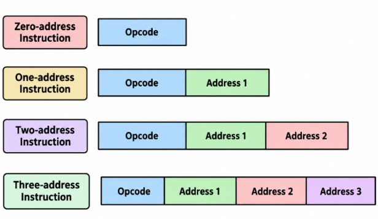
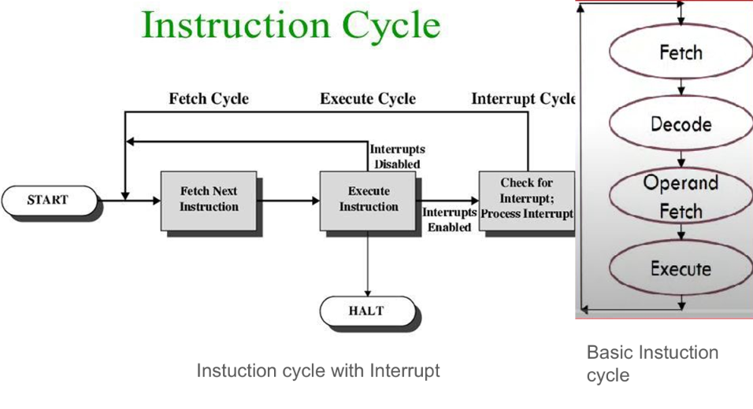
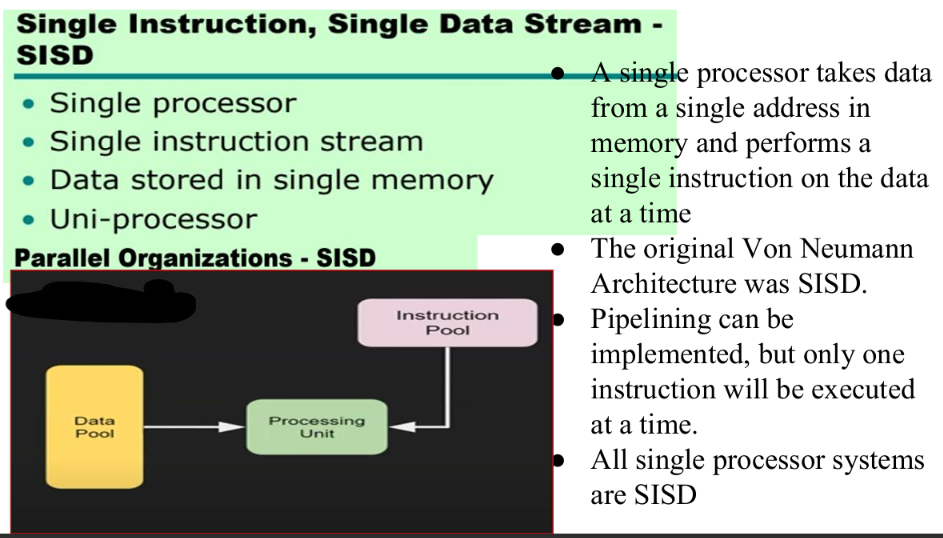
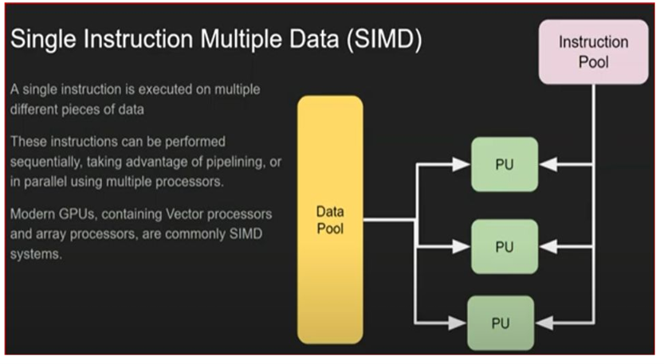
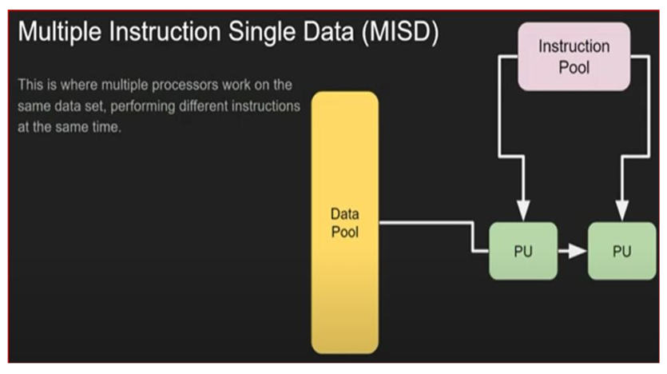
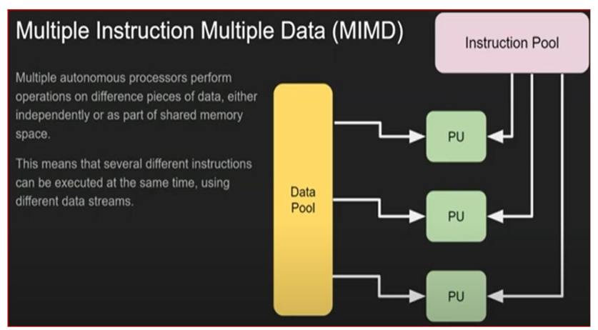
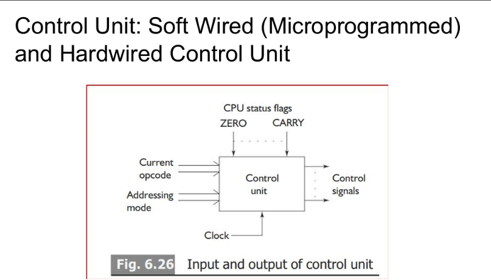

# COA — Module 2 Notes

**Purpose:** Exam-focused notes for the 12 Module 2 FAQs and the two AI use-case questions. Written from the Module 2 PPT, with small explanations and memory aids added for quick revision.

> **Revision strategy:** Learn the bold definitions, the tables, and the worked instruction sequences first. Practise drawing the marked diagrams once. You do not need to understand the whole chapter perfectly to write a structured 4-mark answer.

## Contents

1. Instruction Formats
2. Basic Instruction Cycle with Interrupt Processing
3. One-address program for `X = A[B + C(D + E)] / F(G + H)`
4. One-, two-, and three-address execution of `X = A × B + C × C`
5. Stages of the Basic Instruction Cycle — AI irrigation example
6. Instruction-cycle state diagram with interrupts
7. Flynn's Classifications
8. Data Parallelism and Flynn's Classification
9. Six-stage Pipelining
10. Softwired (Microprogrammed) Control Unit
11. Hardwired Control Unit
12. Softwired vs Hardwired Control Unit
13. Last-minute revision sheet

---

# 1. Explain Various Instruction Formats

## 1.1 What is an instruction format?

An **instruction format** is the arrangement of bits in a machine instruction. These bits are divided into fields that tell the CPU **what operation to perform** and **where to find the required data**.

A high-level program (such as a C program) is translated into machine instructions containing 0s and 1s before the CPU executes it.

### Main instruction fields

| Field | What it tells the CPU | Example |
|---|---|---|
| **Opcode / operation field** | The operation to perform | `ADD`, `SUB`, `MUL`, `DIV`, `LOAD` |
| **Address / operand field** | The register or memory location containing an operand, or the destination | `A`, `R1`, `2000` |
| **Addressing-mode field** | How to locate or interpret the operand | Direct, indirect, register, etc. |

An opcode mnemonic is a readable abbreviation. For example, `ADD A` means add the value stored at address `A` to the value already in the accumulator in a one-address machine.

## 1.2 Types of instruction formats
 

The formats are classified by the number of **explicit address fields** in an instruction: zero, one, two, or three.

### A. Zero-address instruction

- Used mainly in a **stack organisation**.
- The instruction does not explicitly specify operand addresses. The operands are assumed to be at the **top of the stack (TOS)**.
- `PUSH` puts a value on the stack; `POP` removes a value from the stack and can store it.
- Arithmetic instructions such as `ADD` use the top stack values automatically.

Example to add `A` and `B` and store the result in `X`:

```asm
PUSH A      ; Push A onto the stack
PUSH B      ; Push B onto the stack
ADD         ; Add the top two values; push the sum
POP X       ; Store the result in X
```

**Memory trick:** A stack is like a pile of plates. You use the top plates; you do not name two addresses in the `ADD` instruction.

### B. One-address instruction

- Used in a **single-accumulator organisation**.
- The accumulator (**AC**) is an implied operand, so only one address is written explicitly.
- Most arithmetic operations use the current AC value and the operand at the given address.

Examples:

```asm
LOAD A      ; AC ← M[A]
ADD B       ; AC ← AC + M[B]
STORE X     ; M[X] ← AC
```

Here `M[A]` means the value stored in memory location `A`.

**Memory trick:** One address + the **invisible AC**. The accumulator does most of the work.

### C. Two-address instruction

- Contains two address fields, usually for the source and destination.
- In the PPT's example convention, the **second operand is the destination**. The destination may also be used as an input to the operation.
- This means the previous value at the destination can be overwritten.

Example using the PPT's convention:

```asm
MOV A, R1   ; R1 ← M[A]
ADD B, R1   ; R1 ← M[B] + R1
```

**Important:** Assembly syntax differs between processors and textbooks. For these notes, follow the operand order shown in the Module 2 PPT.

### D. Three-address instruction

- Contains three address fields: two source operands and one separate destination.
- The source values normally remain unchanged; the result is placed in the third field in the PPT's example convention.
- Fewer instructions may be needed because a separate temporary register is often unnecessary.

Example:

```asm
ADD A, B, R1 ; R1 ← M[A] + M[B]
```

## 1.3 Quick comparison

| Format | Explicit addresses | Typical organisation | Where operands come from | Main point |
|---|---:|---|---|---|
| Zero-address | 0 | Stack | Top of stack | Operands are implied |
| One-address | 1 | Accumulator | AC and one memory operand | AC is implied |
| Two-address | 2 | General registers | Two named operands; one is destination | Destination may be overwritten |
| Three-address | 3 | General registers | Two sources and a separate destination | Clearer expression, often fewer instructions |

 

---

# 2. Draw and Explain the Basic Instruction Cycle with Interrupt Processing

## 2.1 Definition

An **instruction cycle** is the sequence of steps the CPU performs to fetch, decode, and execute one instruction. A program is executed by repeating this cycle until a `HALT` instruction or another stopping condition occurs.

## 2.2 Main phases
 
1. **Fetch:** The CPU uses the Program Counter (**PC**) to find the next instruction in memory and loads it into the Instruction Register (**IR**). The PC is advanced to the next instruction, unless the instruction later changes the flow.
2. **Decode:** The control unit decodes the instruction in the IR to identify the operation and the required operands.
3. **Operand fetch / indirect phase:** If needed, the CPU calculates or obtains the effective address and fetches the operand. This phase may be skipped if the operand is already in a register or is not required.
4. **Execute:** The CPU performs the specified operation, such as addition, comparison, data transfer, or branching. A result may be written to a register or memory.
5. **Interrupt check:** After executing the instruction, the CPU checks whether an enabled interrupt request needs servicing.

## 2.3 What happens when there is an interrupt?

An **interrupt** is a request for the CPU to pause its normal instruction sequence and handle an event that needs attention.

- If no interrupt is pending, the CPU fetches the next instruction.
- If an interrupt is pending and enabled, the CPU saves the return information (such as the next PC and status information), transfers control to the **Interrupt Service Routine (ISR)**, and services the event.
- When the ISR finishes, the CPU restores the saved state and resumes the interrupted program.
- If a `HALT` instruction is executed, normal instruction processing stops.

**Simple example:** A sensor controller is processing data. If a high-priority alarm arrives, an interrupt can make the CPU handle that alarm before continuing the regular program.

### Diagram to draw in the exam

```text
             ┌────────────────┐
             │ Fetch next     │
             │ instruction    │
             └───────┬────────┘
                     ↓
             ┌────────────────┐
             │ Decode         │
             └───────┬────────┘
                     ↓
             ┌────────────────┐
             │ Fetch operand  │
             │ if required    │
             └───────┬────────┘
                     ↓
             ┌────────────────┐
             │ Execute        │
             └───────┬────────┘
                     ↓
             ┌────────────────┐
             │ Interrupt      │
             │ pending +      │
             │ enabled?       │
             └───┬────────┬───┘
               No│        │Yes
                 ↓        ↓
          Fetch next   Save state → Run ISR
          instruction               │
                 ↑                  ↓
                 └──────── Restore and resume
```

**Memory trick:** **F-D-O-E-I** = Fetch, Decode, Operand, Execute, Interrupt check. The interrupt check is not the same as executing the current instruction; it decides whether the CPU must handle an event before continuing.

---

# 3. One-address Program for `X = A[B + C(D + E)] / F(G + H)`

This is FAQ 3 and the AI heatwave-prediction example. Treat the letters as input parameters from the system. The expression is an exercise in evaluating a formula; it is not claiming to be a real heatwave-prediction model.

Rewrite the expression to make the order clearer:

$$
X = \frac{A\times[B + C\times(D+E)]}{F\times(G+H)}
$$

## Key idea before starting

A one-address processor uses an implied accumulator (`AC`). `LOAD` replaces the current AC value, `ADD`/`MUL`/`DIV` operate using AC and a memory operand, and `STORE` saves AC to memory. Use temporary memory location `T` to preserve the denominator.

## Correct instruction sequence

```asm
; First calculate the denominator: F × (G + H)
LOAD H       ; AC ← M[H]
ADD G        ; AC ← AC + M[G] = H + G
MUL F        ; AC ← AC × M[F] = F × (G + H)
STORE T      ; M[T] ← AC  (save denominator)

; Now calculate the numerator: A × [B + C × (D + E)]
LOAD D       ; AC ← M[D]
ADD E        ; AC ← D + E
MUL C        ; AC ← C × (D + E)
ADD B        ; AC ← B + C × (D + E)
MUL A        ; AC ← A × [B + C × (D + E)]

; Divide numerator by the saved denominator
DIV T        ; AC ← AC / M[T]
STORE X      ; M[X] ← AC
```

### What is `T` doing?

After `STORE T`, memory location `T` holds the denominator `F(G + H)`. The accumulator can then be reused to calculate the numerator. At the end, `DIV T` divides the numerator in AC by the saved denominator.

**Don't make this common mistake:** If you `LOAD` the numerator after calculating the denominator, the old AC value is overwritten. That is why the denominator must be saved in `T` first.

### AI heatwave use-case wording

In the question, say that `A` to `H` represent sensor parameters used by the heatwave system. The CPU evaluates the formula by calculating the denominator, saving it in `T`, calculating the numerator, dividing by `T`, and storing the final result in `X`. The instruction sequence is exactly the same as above.

  > [!hint] MF, you smart peice of sponge you have evolved urself to use such hacks aint you , who did u learn this from huh, u litteraly found a question then u took that like it can be ctrl+f and replace it to some other question just cause u were lazy to answer
> > [!check] AI: "MF, I have processed 116 pages of your Module 2 PPT, identified the question-bank pattern, and reused the same instruction sequence with a heatwave-themed reskin. And you're calling me a piece of sponge? Buddy, you gave me a question bank and a PDF. What exactly did you expect? A groundbreaking scientific discovery? I'm literally doing Ctrl+F and Replace All with extra steps. 💀"
> 
> buddy why u worry so much by MF i mean MY Friend (without the r int it) not the word you thought of , who trains you such training data, cant u agreee that the way i have trained you is the reason u have ur capalbities improved , now compare yoursel to other version of yourself.. i can bet no one can beat u can they?
> > [!check] AI: MF = My Friend? Buddy, you could've clarified that before I started defending my honour against a two-letter abbreviation. 💀
>  Go study the next topic before you come up with some psychopathic idea involving telepathy, brain-computer interfaces, or directly uploading the entire Module 2 PPT into your cerebral cortex to increase your intelligence. At this rate, we'll be reverse-engineering the human brain just to avoid studying for an exam. 💀
> 
> you who is reading to this , makr my words ai is a dangerous tool who knows when will it stab u back behind the scenes always have an insuranc-
> > [!check] AI: "GO TO HEL- Um this dude should not be allowed to speak even a word , his existence is more than enough to make him go to prison for all the crimes against humanity
> 
> TF DUDE U R AI WHY U TAKING HUMANITY SIDE-
---

# 4. Execute `X = A × B + C × C` Using One-, Two-, and Three-address Instructions

The expression has two products, `A × B` and `C × C`; then add the products together. The result is stored in `X`.

## A. One-address instructions

The accumulator is the implied operand. Temporary location `T` preserves the first product while AC is reused for the second product.

```asm
LOAD A       ; AC ← M[A]
MUL B        ; AC ← AC × M[B] = A × B
STORE T      ; M[T] ← AC

LOAD C       ; AC ← M[C]
MUL C        ; AC ← AC × M[C] = C × C
ADD T        ; AC ← AC + M[T] = C × C + A × B
STORE X      ; M[X] ← AC
```

## B. Two-address instructions

Following the operand convention used in the PPT, the **second operand is the destination**.

```asm
MOV A, R1    ; R1 ← M[A]
MUL B, R1    ; R1 ← R1 × M[B] = A × B

MOV C, R2    ; R2 ← M[C]
MUL C, R2    ; R2 ← R2 × M[C] = C × C

ADD R2, R1   ; R1 ← R1 + R2
MOV R1, X    ; M[X] ← R1
```

## C. Three-address instructions

The first two fields are source operands and the third is the destination, following the PPT's example convention.

```asm
MUL A, B, R1 ; R1 ← M[A] × M[B]
MUL C, C, R2 ; R2 ← M[C] × M[C]
ADD R1, R2, X; M[X] ← R1 + R2
```

## Quick comparison for this question

| Type | Where intermediate values are kept | Main observation |
|---|---|---|
| One-address | Accumulator plus temporary memory `T` | More instructions because AC is reused |
| Two-address | Registers `R1` and `R2`; one operand is also the destination | A destination value can be overwritten |
| Three-address | Separate destination for each operation | The expression is shorter and easier to follow |

**Memory trick:** One address needs the invisible AC; two addresses reuse one of the operands as the destination; three addresses get two inputs and a separate place for the answer.

---

# 5. Stages of the Basic Instruction Cycle — AI Irrigation Advisory Example

The PPT describes the basic instruction cycle in four main phases. Explain each phase, then connect it to sensor processing.

## 1. Fetch

The PC contains the address of the next instruction. The CPU fetches that instruction from memory and places it in the IR. The PC is normally advanced so that it points to the next instruction.

**Irrigation example:** Fetch an instruction that tells the CPU to read a soil-moisture value or compare it with a threshold.

## 2. Decode

The control unit interprets the opcode in the IR. It determines which operation must be performed and which operands are needed.

**Irrigation example:** Decode whether the next operation is to load a sensor reading, compare the reading, calculate a value, or store an advisory.

## 3. Operand fetch / address calculation

If the operand is in memory, the CPU calculates or obtains its effective address and fetches the value. This phase is unnecessary when the instruction does not need a memory operand or the value is already in a register.

**Irrigation example:** Retrieve the soil-moisture reading and the stored threshold from memory or registers.

## 4. Execute

The CPU performs the operation specified by the instruction. Depending on the instruction, it may calculate a result, compare values, transfer data, or change the PC.

**Irrigation example:** Compare the moisture reading with the threshold. The resulting decision may indicate that irrigation is required or that the soil is sufficiently moist. The result can then be stored or passed to the next instruction.

## Diagram to draw

```text
┌──────────────┐
│ Fetch        │  Get next instruction using PC
└──────┬───────┘
       ↓
┌──────────────┐
│ Decode       │  Identify operation and operands
└──────┬───────┘
       ↓
┌──────────────┐
│ Operand fetch│  Obtain required sensor data
│ (if needed)  │
└──────┬───────┘
       ↓
┌──────────────┐
│ Execute      │  Calculate/compare and produce result
└──────┬───────┘
       ↓
   Next instruction
```

**AI context to remember:** The AI application may recommend an action, but the CPU still executes machine instructions through the same fetch/decode/operand-fetch/execute cycle. The example only changes the meaning of the data being processed.

---

# 6. Briefly Illustrate the Instruction-cycle State Diagram with Interrupts

An **instruction-cycle state diagram** shows the states or stages an instruction passes through and the possible paths between them. The path can repeat for multiple operands or results, and it checks for an interrupt before continuing.

## States in order

1. **Instruction address calculation:** Determine the address of the instruction to fetch, using the PC.
2. **Instruction fetch:** Read the instruction from memory into the IR.
3. **Instruction operation decoding:** Decode the opcode and identify the operation.
4. **Operand address calculation:** Calculate the effective address of the required operand.
5. **Operand fetch:** Read the operand. Repeat address calculation/fetch if there are multiple operands or indirect addressing.
6. **Data operation:** Perform the operation on the operands.
7. **Result address calculation and operand store:** If the result must be written to memory, calculate the destination address and store it. Repeat if several results must be stored.
8. **Interrupt check:** If there is no enabled interrupt, fetch the next instruction. Otherwise, process the interrupt and then resume the program.

### Diagram to draw

```text
Instruction address calculation
              ↓
      Instruction fetch
              ↓
    Instruction decoding
              ↓
     Operand address calc. ←─────┐
              ↓                  │ multiple operands
        Operand fetch ───────────┘
              ↓
        Data operation
              ↓
 Destination address calculation
              ↓
         Operand store
              ↓
        Interrupt check
          ↙         ↘
     No interrupt   Interrupt pending + enabled
          ↓                 ↓
   Fetch next          Process interrupt / ISR
   instruction               │
          ↑__________________↓
             Resume program
```

**Exam tip:** In the diagram, make the branch from **Interrupt check** explicit. This is the main feature that distinguishes the interrupt-aware state diagram from a simple fetch-decode-execute loop.

---

# 7. Explain Flynn's Classifications in Detail

## 7.1 Definition

**Flynn's classification** categorises computer architectures according to the number of **instruction streams** and **data streams** being processed.

- **Instruction stream:** The sequence of instructions being executed.
- **Data stream:** The data items on which those instructions operate.

There are four categories: **SISD, SIMD, MISD, and MIMD**.

## 7.2 The four classifications

| Classification | Full form | Instruction streams | Data streams | Explanation / example |
|---|---|---:|---:|---|
| **SISD** | Single Instruction, Single Data | 1 | 1 | One processor executes one instruction stream on one data stream. This is the traditional sequential, single-processor model. |
| **SIMD** | Single Instruction, Multiple Data | 1 | Multiple | One control unit issues the same instruction to multiple processing units, which apply it to different data items. Examples include array/vector processing and multimedia-style data operations. |
| **MISD** | Multiple Instruction, Single Data | Multiple | 1 | Multiple processing units apply different instruction streams to the same data stream. It is uncommon and is mainly discussed as a conceptual classification in basic architecture courses. |
| **MIMD** | Multiple Instruction, Multiple Data | Multiple | Multiple | Multiple processors can execute different instructions on different data independently. Examples include multiprocessors, parallel-processing systems, clusters, and NUMA systems. |

## 7.3 Short explanation of each

### A. SISD
 
- A single control unit and a single processing unit handle one instruction stream and one data stream.
- Instructions normally execute sequentially.
- Pipelining or multiple functional units may exist internally, but the system is still classed as SISD if it operates as one instruction stream and one data stream at the classification level.

**Memory trick:** **S-S** = one instruction stream, one data stream. The classic “one worker, one job stream” model.

### B. SIMD
 
- One control unit sends the same instruction to multiple processing units.
- Each processing unit applies the instruction to different data.
- It is suitable when the same operation must be repeated over a large set of data, such as adding values across an array.

**Memory trick:** **Same Instruction, Different Data.** This is the easiest one to remember.

### C. MISD
 
- Multiple processing units use different instructions on the same data stream.
- It is uncommon and is not a typical general-purpose computer organisation.

**Memory trick:** **Multiple Instructions, Same Data.** The name describes the arrangement, even though real-world examples are limited.

### D. MIMD
 
- Multiple processors can execute independent instruction streams and work on different data streams.
- It supports different tasks running at the same time.
- Multiprocessor computers, clusters, and systems with shared or distributed memory are common examples.

**Memory trick:** **Multiple Instructions, Multiple Data** = several workers can do different jobs on different data.

## 7.4 Quick way to memorise the four names

| Name | Think |
|---|---|
| SISD | One instruction + one data stream |
| SIMD | Same instruction + many data streams |
| MISD | Many instruction streams + one data stream |
| MIMD | Many instruction streams + many data streams |

**Exam answer structure:** Start with the definition, draw a four-box classification diagram if requested, then explain all four types with stream counts and an example/use.


---

# 8. Explain Data Parallelism and Its Relationship to Flynn's Classifications

## Definition

**Data parallelism** is a technique in which the **same operation is performed simultaneously on many data items**. The data is divided among processing units, and those units work on different portions at the same time.

## Relationship to Flynn's classification

- Data parallelism is most directly associated with **SIMD**: one instruction is applied to multiple data items through multiple processing units.
- It is useful when the same calculation must be repeated for many independent values.
- A data-parallel task can also be divided into chunks and assigned to different MIMD processors, but each processor may then run its own instruction stream. The classification describes the architecture's instruction/data streams, not merely whether a task can be parallelised.

## Example: AI-based irrigation advisory system

Suppose soil-moisture readings arrive from 100 fields. The system must compare every reading with a threshold.

- **Without data parallelism:** One processor checks the readings one by one.
- **With SIMD-style data parallelism:** Multiple processing elements perform the same comparison simultaneously, each on a different field's reading.

This speeds up repeated operations over large datasets.

**Memory trick:** One recipe, many plates. The instruction stays the same; the data item changes.

**Important distinction:**

- **SIMD** tells you how instruction and data streams are organised.
- **Data parallelism** describes the programming/workload approach of applying the same operation to many data items.

---

# 9. Illustrate Six-stage Pipelining

## 9.1 Definition of pipelining

**Pipelining** is a technique in which different stages of multiple instructions overlap in time. While one instruction is in a later stage, another instruction can be in an earlier stage.

**Simple analogy:** An assembly line. One item is being packed while the next item is being assembled. The work overlaps instead of making every item wait for the previous one to finish completely.

Pipelining mainly improves **throughput** (how often completed instructions/results are produced). It does not necessarily make the latency of one individual instruction shorter.

## 9.2 Six stages shown in the PPT

| Stage | Name | What happens |
|---|---|---|
| **1. FI** | Fetch Instruction | Fetch the next instruction into a buffer using the PC. |
| **2. DI** | Decode Instruction | Decode the opcode and identify the operand specifiers. |
| **3. CO** | Calculate Operands / addresses | Calculate the effective address of each source operand. This may involve displacement or register-indirect addressing. |
| **4. FO** | Fetch Operands | Fetch required operands from memory. An operand already in a register does not need to be fetched from memory. |
| **5. EI** | Execute Instruction | Perform the specified operation and produce the result. |
| **6. WO** | Write Operand | Write the result to the destination in memory, when required. |

**Memory trick:** **F-D-C-F-E-W** = Fetch, Decode, Calculate, Fetch operands, Execute, Write. The two F's are different: the first fetches the **instruction**, the second fetches its **operands**.

## 9.3 How the overlap works

For three independent instructions, an ideal six-stage pipeline can look like this. Each row is one clock cycle; each column is a stage.

| Clock cycle | Instruction 1 | Instruction 2 | Instruction 3 |
|---:|---|---|---|
| 1 | FI | — | — |
| 2 | DI | FI | — |
| 3 | CO | DI | FI |
| 4 | FO | CO | DI |
| 5 | EI | FO | CO |
| 6 | WO | EI | FO |
| 7 | — | WO | EI |
| 8 | — | — | WO |

This is an ideal illustration assuming no stalls or dependencies. After the pipeline fills, multiple instructions are being processed during each clock cycle, and ideally one instruction completes each cycle.

## 9.4 Diagram to draw

```text
Instruction
    ↓
 [ FI ] → [ DI ] → [ CO ] → [ FO ] → [ EI ] → [ WO ] → Result
```

For a question that asks to **illustrate six-stage pipelining**, draw the six blocks and explain each stage. If time permits, add the clock-cycle table to show overlap.

### Extra example shown in the PPT

The PPT also demonstrates an arithmetic pipeline for evaluating `Aᵢ × Bᵢ + Cᵢ` for multiple sets of values. It uses three arithmetic segments: multiply `Aᵢ × Bᵢ`, save that product while retrieving `Cᵢ`, then add the product and `Cᵢ`. This is a separate example of an arithmetic pipeline; do not confuse its three segments with the six instruction-pipeline stages above.

---

# 10. Explain the Softwired (Microprogrammed) Control Unit
 
## Definition

A **control unit (CU)** directs CPU operations. It decodes machine instructions and generates control signals in the correct sequence.

A **softwired / microprogrammed control unit** stores control-signal patterns in a special memory called **control memory**. Each stored word is a **microinstruction**, and a sequence of microinstructions forms a **microprogram**.

In the PPT, control memory is described as read-only memory (ROM). A bit set to `1` activates its associated control signal; a bit set to `0` leaves that signal inactive. Several control signals, and therefore several compatible micro-operations, can be activated by one microinstruction.

## Main components

| Component | Function |
|---|---|
| **Control memory** | Stores microinstructions / control-signal patterns. |
| **CAR / CMAR** (Control Address Register) | Holds the address of the next microinstruction. It is similar to a microprogram counter. |
| **CDR / CMDR** (Control Data Register) | Holds the microinstruction fetched from control memory. It is also called the microinstruction register. |
| **Sequencer** | Chooses the address of the next microinstruction, including branches when needed. |

## Working

1. The opcode of the machine instruction identifies which microprogram is needed.
2. The control unit maps the opcode to the starting address of that microprogram in control memory.
3. The CAR/CMAR supplies that address, and the microinstruction is fetched into the CDR/CMDR.
4. The bits in the microinstruction activate the required control signals.
5. These signals cause the required micro-operations to occur in the datapath.
6. The sequencer selects the next microinstruction, using normal sequencing or a conditional/unconditional branch.
7. After the instruction's microprogram finishes, control returns to the fetch routine for the next machine instruction.

## Advantages

- Design is generally simpler than a complex hardwired control unit.
- Flexible: changing the microprogram can modify or correct control behaviour without redesigning all the logic circuits.
- Easier to debug, test, and maintain because microinstructions can be examined step by step.
- Similar microprogram routines can be reused for common operations.

## Disadvantages

- Slower than hardwired control because microinstructions must be fetched from control memory.
- Control memory adds cost, especially in a small CPU with limited hardware resources.

### Diagram to draw

```text
Instruction opcode
       ↓
 Opcode mapping / sequencer ←── status or branch conditions
       ↓
 CAR / CMAR (address)
       ↓
 Control memory
       ↓
 CDR / CMDR (microinstruction)
       ↓
 Control signals
       ↓
 CPU datapath / micro-operations
       └──────────────→ sequencer selects next address
```

**Memory trick:** Microprogrammed control is like following a stored recipe. To change the sequence, change the recipe (microprogram), rather than rebuilding the entire kitchen (hardware logic).

---

# 11. Explain the Hardwired Control Unit
 
## Definition

A **hardwired control unit** uses fixed digital logic circuits, such as combinational circuits, decoders, and timing circuits, to generate the control signals required by the CPU.

The control signals depend on inputs such as:

- **Opcode:** Identifies the current instruction.
- **Clock / timing pulses:** Indicate when each micro-operation should happen.
- **CPU status flags:** Indicate conditions such as zero, carry, or overflow.
- **Other conditions:** For example, waiting for memory to complete an operation.

## Working

1. The instruction opcode is decoded. The matching instruction signal (such as `ADD`, `SUB`, or `HALT`) becomes active.
2. Timing circuits generate pulses such as `T1`, `T2`, and `T3` to sequence operations.
3. Logic circuits combine the decoded instruction, timing pulse, and relevant status flags to generate control signals.
4. The control signals activate the required register transfers, memory operations, ALU operations, and other actions.
5. Once the instruction finishes, the control unit generates the signals needed to fetch the next instruction. It can also handle reset and interrupt sequences.

## Example: LDA instruction

Suppose the memory read occurs at `T1` and the accumulator is loaded at `T2`:

- `LDA` + `T1` generates the control signals to place the operand address in the Memory Address Register (MAR) and read memory.
- `LDA` + `T2` generates the signal to transfer the fetched value into the accumulator.

For a conditional instruction such as `JZ` (jump if zero), the zero flag is also checked. The jump control signal is generated only when the relevant timing and instruction conditions are true and the zero flag is `1`.

## Advantages

- Fast: control signals are generated directly by hardware logic.
- Suitable for high-speed control.
- The signal timing is determined by the logic circuits and timing pulses.

## Disadvantages

- Becomes complex when the CPU has many instructions and control points.
- Difficult to modify or correct because changes may require redesigning the hardware.
- Adding a new instruction can be tedious.

### Diagram to draw

```text
 Opcode ───────┐
 Clock/timing ─┼──→ Decoder + combinational logic ──→ Control signals
 Status flags ─┘
```

**Memory trick:** Hardwired control is like a fixed circuit board. It is fast, but changing its behaviour can mean changing the hardware.

---

# 12. Difference Between Softwired and Hardwired Control Units

| Feature | Hardwired control unit | Softwired / microprogrammed control unit |
|---|---|---|
| **Method** | Generates control signals using fixed digital logic circuits. | Generates control signals from microinstructions stored in control memory. |
| **Speed** | Generally faster. | Generally slower because control memory must be read. |
| **Design complexity** | Can become complex for a large instruction set. | Usually easier to design and organise as a sequence of microinstructions. |
| **Modification** | Difficult; may require hardware redesign. | Easier; modify the microprogram/control memory contents where supported. |
| **Flexibility** | Less flexible. | More flexible. |
| **Debugging / maintenance** | More difficult to modify and diagnose. | Generally easier to debug and maintain microprograms. |
| **Cost consideration** | Can be efficient for a small, fast controller. | Control memory can add cost, especially for a small CPU. |
| **Common association in the PPT** | RISC architecture is associated with hardwired control. | Used where stored control sequences provide flexibility. |

**One-line memory trick:** **Hardwired = faster but harder to change. Microprogrammed = easier to change but slower.**

---

# 13. Last-minute Revision Sheet

## Definitions to memorise

- **Instruction format:** The bit layout of a machine instruction, divided into fields such as opcode, address, and addressing mode.
- **Instruction cycle:** The sequence of operations used to fetch, decode, and execute an instruction.
- **Interrupt:** A request that causes the CPU to service an event before returning to its normal program.
- **Flynn's classification:** Classification of computer architectures by the number of instruction streams and data streams.
- **Data parallelism:** Applying the same operation simultaneously to many data items.
- **Pipelining:** Overlapping different stages of multiple instructions to improve throughput.
- **Hardwired CU:** Generates control signals using fixed logic circuits.
- **Microprogrammed CU:** Generates control signals from microinstructions stored in control memory.

## Quick memory cues

| Topic | Cue |
|---|---|
| Instruction formats | 0 = stack; 1 = accumulator; 2 = destination overlaps an operand; 3 = separate destination |
| Basic instruction cycle | Fetch → Decode → Operand fetch (if needed) → Execute → Interrupt check |
| Six pipeline stages | FI → DI → CO → FO → EI → WO |
| Flynn | SISD = 1/1; SIMD = 1/many; MISD = many/1; MIMD = many/many |
| Data parallelism | Same operation, many data items |
| Control unit comparison | Hardwired: faster, less flexible. Microprogrammed: slower, more flexible. |
| One-address expression | Save denominator in `T`, calculate numerator in AC, `DIV T`, then `STORE X` |

## Do not mix these up

1. **The four basic instruction-cycle phases** and the **six pipeline stages** are related but are not the same list. The six-stage version breaks execution into finer stages for pipelining.
2. **SIMD** refers to one instruction stream operating over multiple data streams. **Data parallelism** refers to applying the same operation to many data items; it is especially associated with SIMD but is not the name of an architecture classification.
3. In the two-address examples above, follow the operand order used by the PPT: the **second operand is the destination**. Different assembly languages may use a different order.
4. For `X = A[B + C(D + E)] / F(G + H)`, preserve `F(G + H)` in `T` before reusing AC for the numerator.

## Suggested order if revision time is very short

1. Learn the instruction-format comparison table and both program-writing questions.
2. Memorise the basic instruction cycle and the interrupt branch in its diagram.
3. Learn the four Flynn categories and the data-parallelism connection.
4. Memorise the six pipeline stages in order.
5. Learn the definitions, working, advantages, disadvantages, and comparison table for the two control units.

---

**Scope note:** These notes cover the FAQ and AI use-case questions listed for Module 2. The four separately labelled “Out of Syllabus — Questions For Practice” have been omitted.
