# COA — Module 3 Notes
## Data Representation and Arithmetic Algorithms

**Purpose:** Exam-focused notes based on the uploaded 109-page Module 3 PPT and its end-of-PPT question bank. The listed questions are covered first; supporting concepts and likely numerical variations follow.

> **How to study:** Learn the answer/steps for each FAQ question first. Then practise the extra conversion examples and revise IEEE 754 representation. For numerical algorithms, write every intermediate step instead of memorising only the final answer.

> [!check] WATCH this videos before touching this notes
> [1. Concept of Binary, Hexadecimal and Decimal | Bharat Acharya Education](https://www.youtube.com/watch?v=jdhYjdg73gM) | MUST WATCH
> [2. COA | Signed Number Representation | Bharat Acharya Education](https://www.youtube.com/watch?v=3F3UsnLDLGo) | PARTIAL WATCH IS FINE
> [3. COA | Floating Point Number Formats IEEE 754 | Bharat Acharya Education](https://www.youtube.com/watch?v=WpGaEGq3q48&t=299s) | CAN SKIP 
> 

> [!hint] shortcut method to perform 2c quickly
> 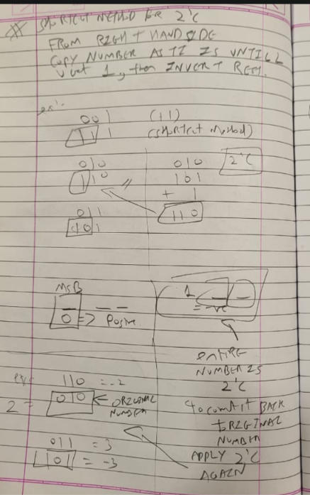 

> [!hint] trick to find range of any bits -> divide the total values by half then perform n-1 for postive and n+1 for negative number to get the range
>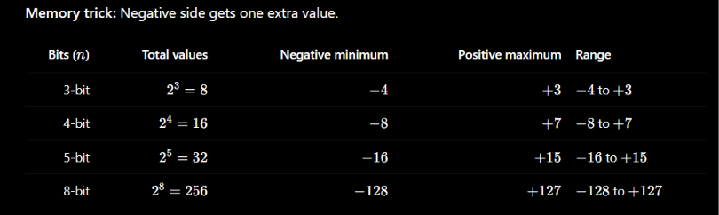 
 >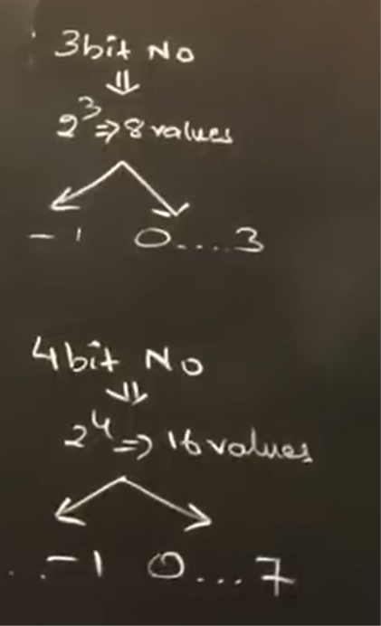
 > 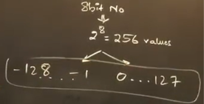 

> [!hint] sign maginitude (just replace msb with 1)
> 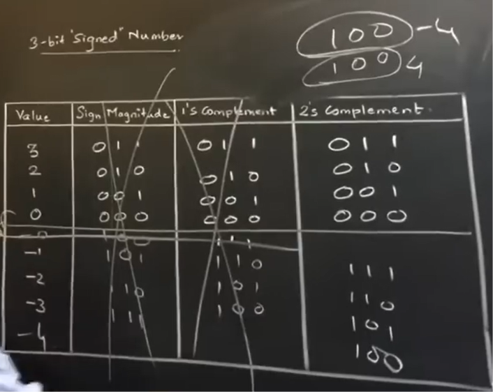
  > 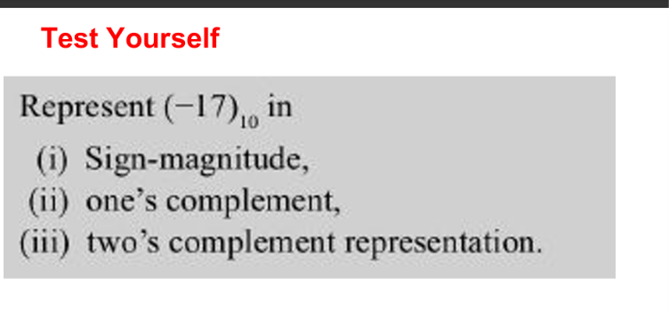  QUESTIONS LIKE ABOVE MAY BE ASKED IN EXAM
> P.S u R SMART ENOUGH TO FIGURE OUT 1C AND 2C BUT STILLL 
> 1C = INVERTER 
> 2C = INVERTER + 1 (OR USE THE SHORTCUT METHOD)
***
### binary addition -> use OR gate 
BUT WHAT IS OR GATE 
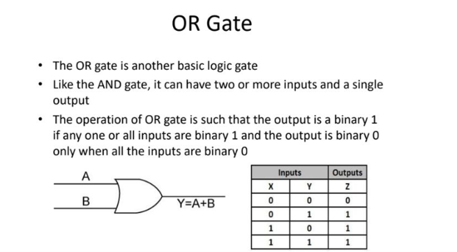 
`note: if u encounter this situation where  1+1+1`  then write `1` and with carry forward the extra `1` to next
### [Binary Subtraction - GeeksforGeeks ](https://www.geeksforgeeks.org/maths/binary-subtraction/) 
Binary subtraction is easily achieved using the rules added in the table below,

| ****Binary Number**** | ****Subtraction Value**** | Rule |
| :---: | :---: | :---: |
| 0 - 0 | 0   | When we subtract 0 from 0, we get 0 |
| 1 - 0 | 1   | When we subtract 0 from 1, we get 1 |
| 0 - 1 | 1 (Take 1 from the following high-order digit) | When we subtract 1 from 0, we get 1 with a borrow of 1 |
| 1 - 1 | 0   | When we subtract 1 from 1, we get 0 |

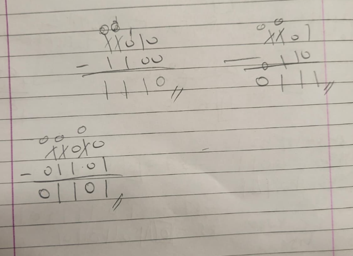 
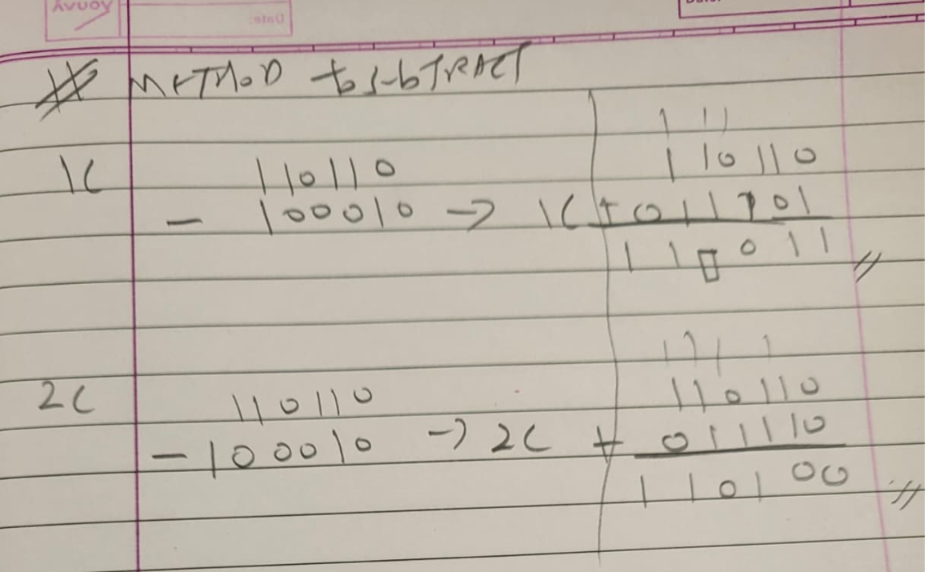 
### binary multiplication (ez)
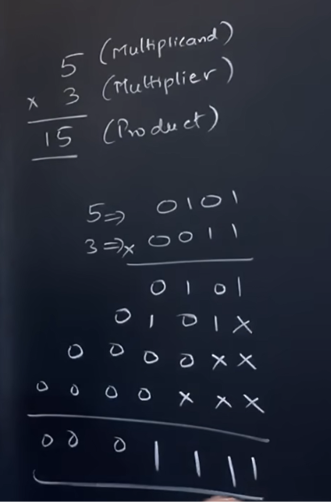 

### [Binary Division - GeeksforGeeks](https://www.geeksforgeeks.org/maths/binary-division/)

| Rules for Binary Division | Meaning |
| :---: | :---: |
| 0 / 0 = ∞ | If 0 (zero) is divided by another 0 (zero), then the result is meaningless. |
| 0 / 1 = 0 | if 0 (zero) is divided by 1 (one), then the result will be 0 (zero). |
| 1 / 0 = ∞ | If 1 (one) is divided by 0 (zero), then the result is meaningless. |
| 1 / 1 = 1 | If 1 (one) is divided by another 1 (one), then the result will be 1 (one). |

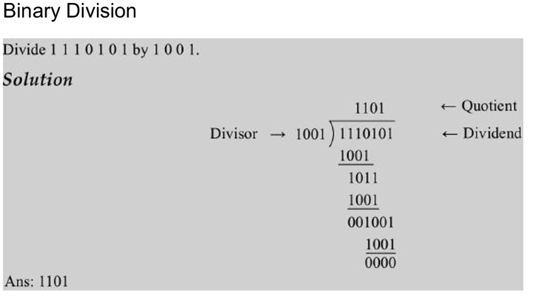 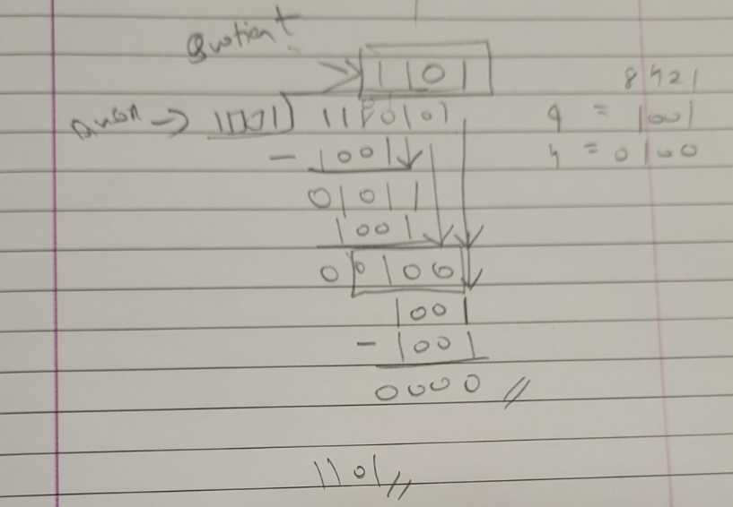 
***
> binary to decimal and decimal to binary  and also signed numbers to decimal
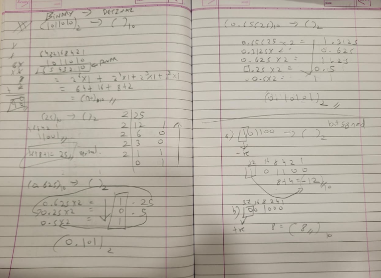

> octal to decimal and decimal to octal
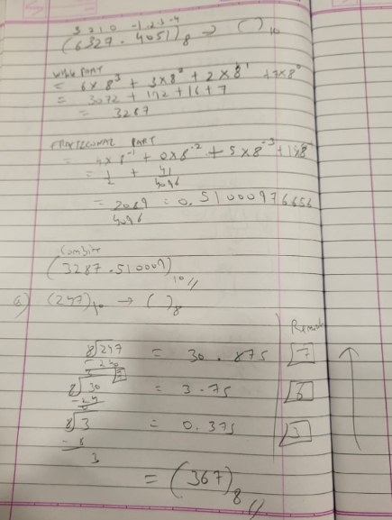 

> binary to octal and octal to binary
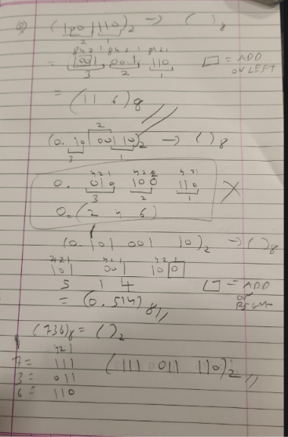 

> hexa to decimal and decimal to hexa
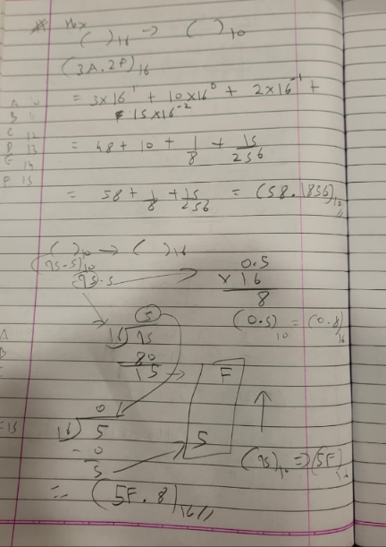 

> hexa to binary and binary to hexa + hexa to octal
 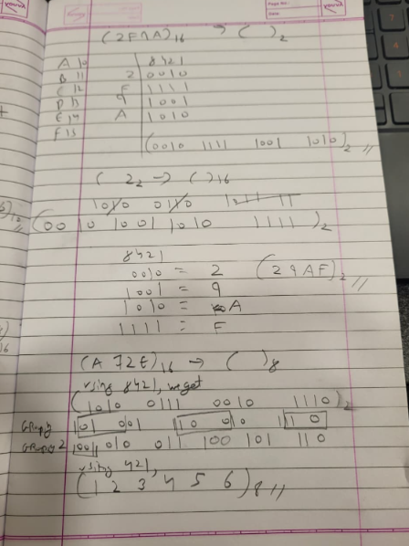 

> octal to hexa (MOST ANNOYING AND DIFFICULT SCREW THIS)
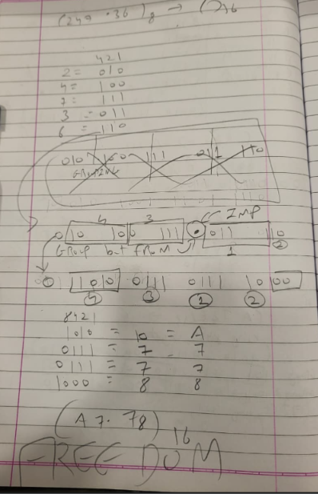 
***
# Part A — Question Bank Answers

## Q1. Explain the digital logic gates: NOT, AND, OR, NAND, NOR, EX-OR and EX-NOR

A **logic gate** is a digital circuit that performs a logical operation on one or more binary inputs and produces a binary output.
***
> [!abstract] sometimes between question there is a section like this shown
> this is basically the context for that question, its not necessarily needed in ur answer but without this context u wont be able to understand the answer so read it once
> for convivence i will mark such stuffs as #context
> 
#context

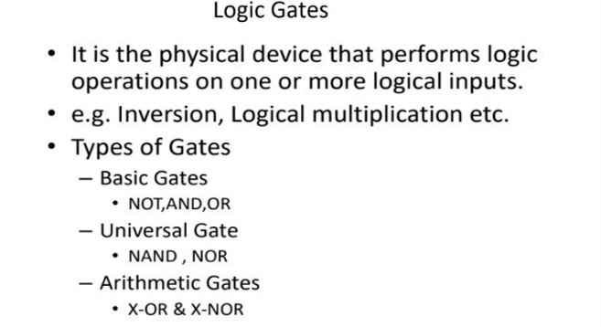 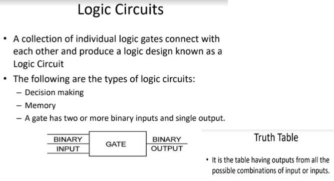 

***
### 1. NOT Gate
- Has one input.
- Produces the opposite of the input.


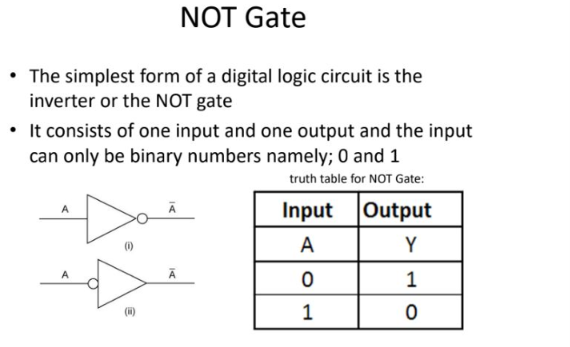 

### 2. AND Gate
- Output is 1 only when **both inputs are 1**.

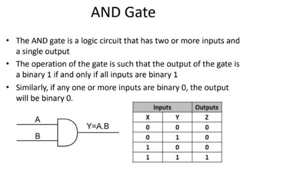 
### 3. OR Gate
- Output is 1 when **at least one input is 1**.

 
### 4. NAND Gate
- Opposite of AND.
- Output is 0 only when both inputs are 1.

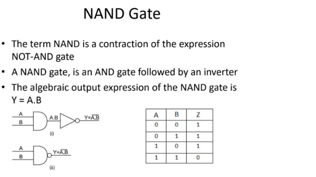 
### 5. NOR Gate
- Opposite of OR.
- Output is 1 only when both inputs are 0.

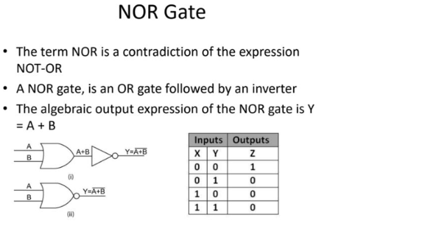 
***
#context
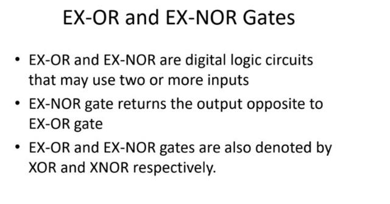 

### 6. EX-OR (XOR) Gate
- Output is 1 when the two inputs are **different**.

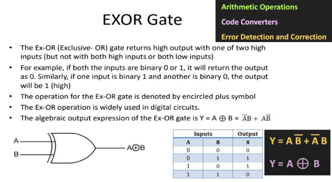 
### 7. EX-NOR (XNOR) Gate
- Opposite of XOR.
- Output is 1 when the two inputs are **the same**.

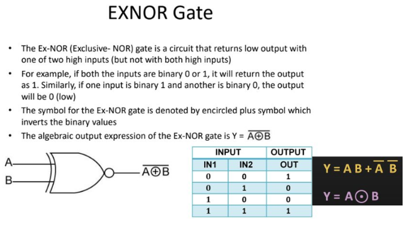 
### Combined truth table

| A | B | AND | OR | NAND | NOR | XOR | XNOR |
|---:|---:|---:|---:|---:|---:|---:|---:|
| 0 | 0 | 0 | 0 | 1 | 1 | 0 | 1 |
| 0 | 1 | 0 | 1 | 1 | 0 | 1 | 0 |
| 1 | 0 | 0 | 1 | 1 | 0 | 1 | 0 |
| 1 | 1 | 1 | 1 | 0 | 0 | 0 | 1 |


**Quick memory aid:**
- AND = if both has a signal then only signal otherwise nothing (for example `nuke trigger requires 2 keys to launch it`)
- OR = if even one of them has a signal then u win otherwise u lose (for example `just like wifi and mobile data, u have any one of them u r safe if u have none it means u are !@#$%^`)
- NAND = NOT-AND.  (look at innocent looking `and` and i want you to end its misery by `inverting` everything from it output)
- NOR = NOT-OR. (look at innocent looking `or` and i want you to end its misery by `inverting` everything from it output)
- XOR = different inputs give 1. (learn to read left side)
- XNOR = same inputs give 1. (learn to read left side)
> [!danger] NOT: "MFS U ALL FORGOT ME"
> is there a even a need to remember you.... definitely `not` 
> alright alright i am sorry i forgot to mention u well the thing is u r basically the inverter right, whatever we say to u, you do opposite of that so we forget you basically so in exam we will remember you do you understand not?
> > [!warning] NOT: "I dont know whether should i take that as a complemeent or offensive"
> flip off , you aint geeting much screen time anywhere just go away i wanna move on the next topic
---

## Q2. Explain Booth's multiplication algorithm with a flowchart

**Booth's algorithm** is an algorithm for multiplying signed binary numbers represented in 2's-complement form. It examines the multiplier bits in pairs to decide whether to add the multiplicand, subtract it, or do neither.

### Registers used
- `M`: multiplicand.
- `Q`: multiplier.
- `A`: accumulator; initially all zeroes.
- `Q-1`: extra bit; initially `0`.
- `n`: number of bits in the multiplier; also the iteration counter.
- `-M`: 2's complement of `M`.

### Decision table

| Pair `(Q0, Q-1)` | Operation on A |
|---|---|
| 00 | No operation |
| 01 | `A = A + M` |
| 10 | `A = A - M` (equivalent to adding `-M`) |
| 11 | No operation |

After the selected operation, perform an **arithmetic right shift (ARS)** on the combined registers `[A, Q, Q-1]`. Preserve the sign bit of `A` during the shift.

### Algorithm steps
1. Set `A = 0`, load the multiplier into `Q`, and load the multiplicand into `M`.
2. Set `Q-1 = 0` and set the count to `n`.
3. Inspect the pair `(Q0, Q-1)`:
   - `01`: add `M` to `A`.
   - `10`: subtract `M` from `A`.
   - `00` or `11`: do nothing.
4. Arithmetic-right-shift the combined `[A, Q, Q-1]` registers by one bit.
5. Decrement the count.
6. Repeat steps 3–5 until the count is zero.
7. The final product is stored in the combined register `[A, Q]`.

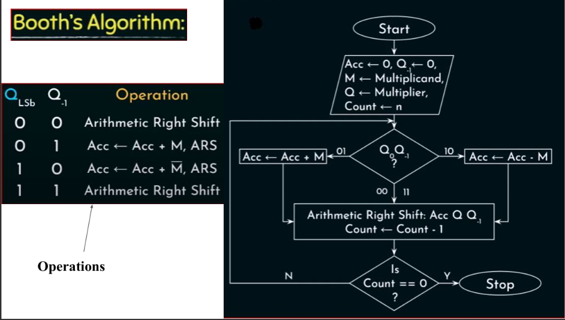 

### Important points
- The number of iterations equals the number of bits in `Q`.
- `A` and `Q` must use the same chosen register width for the calculation.
- Use arithmetic right shift, not logical right shift, because the sign bit must be preserved.
- For negative operands, first represent the signed operands in the chosen bit width using 2's complement.

---
## Q3. Apply Booth's Algorithm to Multiply 7 and 5
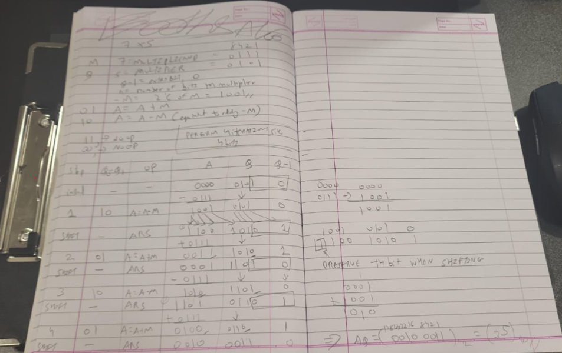 
- Multiplicand: M = `0111` (+7)
- Multiplier: Q = `0101` (+5)
- -M = `1001` (2's complement)
- Initial A = `0000`, Q<sub>-1</sub> = `0`, Count = 4

### Working Table

| Step | Q<sub>0</sub>Q<sub>-1</sub> | Operation | A | Q | Q<sub>-1</sub> |
|---|---|---|---|---|---|
| Initial | — | Initialise | `0000` | `0101` | `0` |
| 1 | `10` | A = A − M | `1001` | `0101` | `0` |
| Shift 1 | — | ARS | `1100` | `1010` | `1` |
| 2 | `01` | A = A + M | `0011` | `1010` | `1` |
| Shift 2 | — | ARS | `0001` | `1101` | `0` |
| 3 | `10` | A = A − M | `1010` | `1101` | `0` |
| Shift 3 | — | ARS | `1101` | `0110` | `1` |
| 4 | `01` | A = A + M | `0100` | `0110` | `1` |
| Shift 4 | — | ARS | `0010` | `0011` | `0` |

**Final Product:** AQ = `00100011`₂ = 35₁₀

**Answer:** 7 × 5 = 35

---

## Q4. Multiply 5 and 10 Using Booth's Algorithm

- Multiplicand: M = `00101` (+5)
- Multiplier: Q = `01010` (+10)
- -M = `11011` (2's complement)
- Initial A = `00000`, Q<sub>-1</sub> = `0`, Count = 5

### Working Table

| Step | Q<sub>0</sub>Q<sub>-1</sub> | Operation | A | Q | Q<sub>-1</sub> |
|---|---|---|---|---|---|
| Initial | — | Initialise | `00000` | `01010` | `0` |
| 1 | `00` | No operation | `00000` | `01010` | `0` |
| Shift 1 | — | ARS | `00000` | `00101` | `0` |
| 2 | `10` | A = A − M | `11011` | `00101` | `0` |
| Shift 2 | — | ARS | `11101` | `10010` | `1` |
| 3 | `01` | A = A + M | `00010` | `10010` | `1` |
| Shift 3 | — | ARS | `00001` | `01001` | `0` |
| 4 | `10` | A = A − M | `11100` | `01001` | `0` |
| Shift 4 | — | ARS | `11110` | `00100` | `1` |
| 5 | `01` | A = A + M | `00011` | `00100` | `1` |
| Shift 5 | — | ARS | `00001` | `10010` | `0` |

**Final Product:** AQ = `0000110010`₂ = 50₁₀

**Answer:** 5 × 10 = 50

**Note:** Use the Booth's algorithm flowchart given in Q2.

## Q5. Use restoring division to divide the unsigned integer 22 by 5

**Given:**
- Dividend = 22 = `10110₂`
- Divisor = 5 = `00101₂`
- Initialise A = `00000`, Q = `10110`, M = `00101`
- Count n = 5

### Working Table

| Step | Operation | A | Q |
|---|---|---|---|
| Initial | Initialise | `00000` | `10110` |
| 1 | Left shift [A,Q] | `00001` | `01100` |
|  | A = A − M | `11100` | `01100` |
|  | Negative: Restore A, Q₀ = 0 | `00001` | `01100` |
| 2 | Left shift [A,Q] | `00010` | `11000` |
|  | A = A − M | `11101` | `11000` |
|  | Negative: Restore A, Q₀ = 0 | `00010` | `11000` |
| 3 | Left shift [A,Q] | `00101` | `10000` |
|  | A = A − M | `00000` | `10000` |
|  | Non-negative: Keep A, Q₀ = 1 | `00000` | `10001` |
| 4 | Left shift [A,Q] | `00001` | `00010` |
|  | A = A − M | `11100` | `00010` |
|  | Negative: Restore A, Q₀ = 0 | `00001` | `00010` |
| 5 | Left shift [A,Q] | `00010` | `00100` |
|  | A = A − M | `11101` | `00100` |
|  | Negative: Restore A, Q₀ = 0 | `00010` | `00100` |

### Final Answer

- Quotient = Q = `00100₂` = 4
- Remainder = A = `00010₂` = 2

**Therefore, 22 ÷ 5 = 4 remainder 2.**

---

## Q6. Use restoring division to divide the unsigned integer 13 by 4
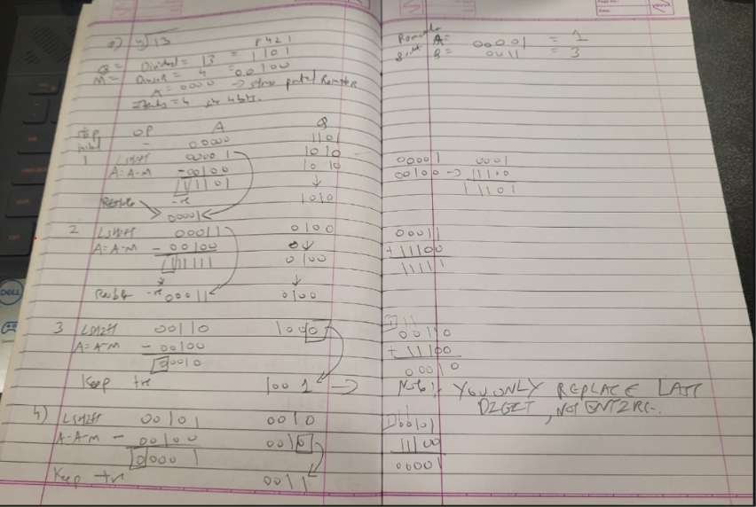 
**Given:**
- Dividend = 13 = `1101₂`
- Divisor = 4 = `00100₂`
- Initialise A = `00000`, Q = `1101`, M = `00100`
- Count n = 4

### Working Table

| Step | Operation | A | Q |
|---|---|---|---|
| Initial | Initialise | `00000` | `1101` |
| 1 | Left shift [A,Q] | `00001` | `1010` |
|  | A = A − M | `11101` | `1010` |
|  | Negative: Restore A, Q₀ = 0 | `00001` | `1010` |
| 2 | Left shift [A,Q] | `00011` | `0100` |
|  | A = A − M | `11111` | `0100` |
|  | Negative: Restore A, Q₀ = 0 | `00011` | `0100` |
| 3 | Left shift [A,Q] | `00110` | `1000` |
|  | A = A − M | `00010` | `1000` |
|  | Non-negative: Keep A, Q₀ = 1 | `00010` | `1001` |
| 4 | Left shift [A,Q] | `00101` | `0010` |
|  | A = A − M | `00001` | `0010` |
|  | Non-negative: Keep A, Q₀ = 1 | `00001` | `0011` |

### Final Answer

- Quotient = Q = `0011₂` = 3
- Remainder = A = `00001₂` = 1

**Therefore, 13 ÷ 4 = 3 remainder 1.**
---

## Q7. Number-system conversions — general method and practice

The PPT covers binary, octal, decimal and hexadecimal numbers, including integer and fractional conversions. Various conversions can be asked, so practise both integer and fractional parts.

### A. Know the bases and allowed digits

| Number system | Base | Allowed symbols |
|---|---:|---|
| Binary | 2 | `0, 1` |
| Octal | 8 | `0–7` |
| Decimal | 10 | `0–9` |
| Hexadecimal | 16 | `0–9, A, B, C, D, E, F` where A=10 through F=15 |

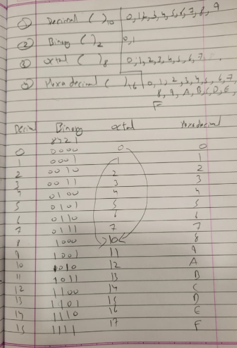 
A number system uses a **base (radix)**. In a positional number, each digit's value depends on its position and the base.

### B. Any base to decimal

Multiply each digit by its positional weight and add the results.
- To the left of the radix point, weights are `base⁰, base¹, base², ...` moving left.
- To the right of the radix point, weights are `base⁻¹, base⁻², ...` moving right.

Example:

`(1011010)₂ = 1×2⁶ + 0×2⁵ + 1×2⁴ + 1×2³ + 0×2² + 1×2¹ + 0×2⁰`

`= 64 + 16 + 8 + 2 = (90)₁₀`

### C. Decimal integer to another base

1. Divide the integer repeatedly by the target base.
2. Record each remainder.
3. Read the remainders from **bottom to top**.

For decimal-to-binary, divide by 2. For decimal-to-octal, divide by 8. For decimal-to-hexadecimal, divide by 16.

Example: convert `25₁₀` to binary.

| Division | Quotient | Remainder |
|---|---:|---:|
| 25 ÷ 2 | 12 | 1 |
| 12 ÷ 2 | 6 | 0 |
| 6 ÷ 2 | 3 | 0 |
| 3 ÷ 2 | 1 | 1 |
| 1 ÷ 2 | 0 | 1 |

Read remainders bottom to top: **`25₁₀ = 11001₂`**.

### D. Decimal fraction to another base

1. Multiply the fractional part by the target base.
2. Record the integer part of the result.
3. Continue with the new fractional part.
4. Read the recorded integer parts from **top to bottom**. Stop when the fraction becomes zero or when sufficient digits have been obtained.

Example: convert `0.625₁₀` to binary.

| Step | Fraction × 2 | Integer bit |
|---:|---:|---:|
| 1 | 0.625 × 2 = 1.25 | 1 |
| 2 | 0.25 × 2 = 0.5 | 0 |
| 3 | 0.5 × 2 = 1.0 | 1 |

Therefore, **`(0.625)₁₀ = (0.101)₂`**.

For a number with both integer and fractional parts, convert each part separately and join them with the radix point.

### E. Binary ↔ octal

- One octal digit corresponds to **3 binary bits**.
- Binary to octal: group bits in threes from the binary point, moving left and right. Add leading/trailing zeroes to complete a group if necessary.
- Octal to binary: replace each octal digit with its 3-bit binary equivalent.

Example: `(736)₈ = (111 011 110)₂ = (111011110)₂`.

### F. Binary ↔ hexadecimal

- One hexadecimal digit corresponds to **4 binary bits**.
- Binary to hexadecimal: group bits in fours starting at the binary point; pad with zeroes if needed.
- Hexadecimal to binary: replace each hex digit with its 4-bit binary equivalent.

Example: `(2F9A)₁₆ = (0010 1111 1001 1010)₂`.

### G. Octal ↔ hexadecimal

Convert through binary:
- Octal → binary by replacing each digit with 3 bits.
- Regroup the binary digits into groups of 4 and convert to hexadecimal.
- For hexadecimal → octal, convert each hex digit to 4 bits, regroup into groups of 3 and convert to octal.

### Suggested conversion practice

Practise these types from the PPT:
- Binary integer → decimal.
- Binary fraction → decimal.
- Decimal integer/fraction → binary.
- Decimal integer/fraction → octal.
- Octal → decimal and binary.
- Decimal → hexadecimal.
- Hexadecimal → binary and decimal.
- Binary → hexadecimal.
- Octal ↔ hexadecimal.

---

# Part B — Supporting Topics from the PPT

These topics are not all listed as separate FAQ questions, but they support number-system questions and are present in the module. Study them after Part A.

## 1. Binary number system and basic units

- Binary is a base-2 number system using only `0` and `1`.
- Computers use binary because digital circuits work with two states, such as ON/OFF.
- **MSB:** Most significant bit; the leftmost bit.
- **LSB:** Least significant bit; the rightmost bit.
- **1 nibble = 4 bits.**
- **1 byte = 8 bits.**
- The PPT lists **1 word = 16 bits** and **1 double word = 32 bits**.
- Adding leading zeroes to a non-negative binary number does not change its value.

## 2. Signed binary numbers

A signed representation uses a sign bit, usually the most significant bit (MSB):
- Sign bit `0` means positive.
- Sign bit `1` means negative.

### Sign-magnitude representation
The MSB indicates the sign; the remaining bits represent the magnitude.

Example using 8 bits:
- `01000100` = +68.
- `11000100` = −68 in sign-magnitude representation.

### 1's complement
Invert every bit: replace each `0` with `1` and each `1` with `0`.

Example:
- `0101` → `1010`.
- In 4-bit 1's-complement representation, `0101` represents +5 and `1010` represents −5.

### 2's complement
1. Find the 1's complement.
2. Add 1 to the result.

Example:
- Number: `0101`
- 1's complement: `1010`
- Add 1: `1011`
- Therefore, 4-bit `1011` represents −5 in 2's complement.

**Typical question from the PPT:** Represent −17 using sign-magnitude, 1's complement and 2's complement. Use the bit width specified in the question. If no width is supplied, state your chosen width before solving.

> **Exam caution:** Do not confuse sign-magnitude with 1's complement or 2's complement. The same bit pattern can represent different values under different schemes.

## 3. Binary addition and subtraction

### Binary addition rules

| A | B | Sum | Carry |
|---:|---:|---:|---:|
| 0 | 0 | 0 | 0 |
| 0 | 1 | 1 | 0 |
| 1 | 0 | 1 | 0 |
| 1 | 1 | 0 | 1 |

When adding multiple columns, include the carry from the previous column.

### Binary subtraction rules

| Minuend | Subtrahend | Difference | Borrow |
|---:|---:|---:|---:|
| 0 | 0 | 0 | 0 |
| 0 | 1 | 1 | 1 |
| 1 | 0 | 1 | 0 |
| 1 | 1 | 0 | 0 |

The PPT includes these operations as supporting material. Practise at least one multi-bit addition and subtraction problem.

## 4. IEEE 754 floating-point representation

The PPT includes IEEE 754 single-precision and double-precision number representations. This is **not explicitly listed among the seven Module 3 FAQ questions**, but it is a syllabus topic in the slides and appeared as a topic in the previous paper image provided in the conversation. Prepare the basic format and one conversion example.

Floating-point representation stores a number in sign, exponent and fraction (mantissa/significand) fields.
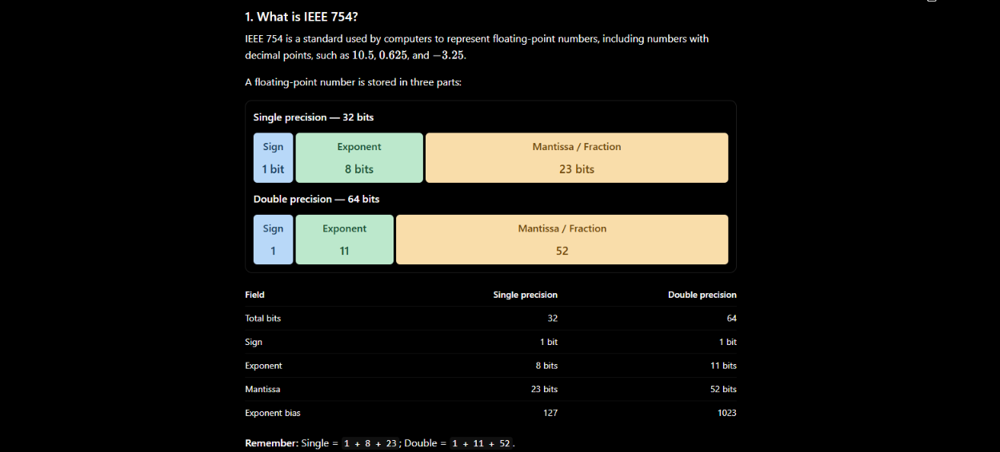 
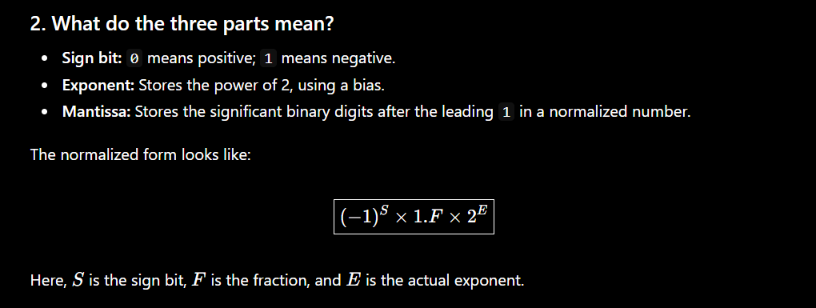 
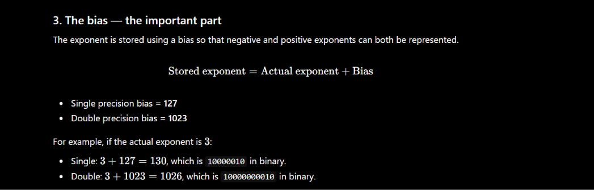 
| Format | Total bits | Sign | Exponent | Fraction field | Bias |
|---|---:|---:|---:|---:|---:|
| Single precision | 32 | 1 bit | 8 bits | 23 bits | 127 |
| Double precision | 64 | 1 bit | 11 bits | 52 bits | 1023 |

### Steps to represent a decimal number in IEEE 754

1. Determine the sign bit: `0` for positive, `1` for negative.
2. Convert the absolute value to binary.
3. Normalise it into the form `1.xxxxx × 2^e` for a non-zero normalised number.
4. Add the exponent bias to `e`:
   - Single precision: `e + 127`.
   - Double precision: `e + 1023`.
5. Convert the biased exponent to binary using the appropriate exponent-field width.
6. Store the bits after the leading `1` in the fraction field, padding with zeroes to the required width.
7. Join the sign, exponent and fraction fields.

### Example: represent +85.125

**Step 1 — Convert to binary**

- `85₁₀ = 1010101₂`
- `0.125₁₀ = 0.001₂`
- Therefore, `85.125₁₀ = 1010101.001₂`

**Step 2 — Normalise**

> ## 1. What Does Normalization Mean?
>
> Normalization means moving the binary point until there is **exactly one `1` before the binary point**.
>
> For example, consider:
>
> ```text
> 1010.1
> ```
>
> We want to rewrite it as:
>
> ```text
> 1.0101
> ```
>
> We have not changed the digits or their order. We have only moved the binary point.
>
> ## 2. How to Normalize a Binary Number
>
> **Example:** Normalize (10.5)<sub>10</sub> for IEEE 754 representation.
>
> ### Step 1: Convert the decimal number to binary
>
> (10.5)<sub>10</sub> = (1010.1)<sub>2</sub>
>
> ### Step 2: Move the binary point
>
> Move the binary point until only one `1` remains to its left.
>
> ```text
> Original:     1010.1
> Normalized:   1.0101
> ```
>
> The binary point moves **3 places to the left**.
>
> ### Step 3: Write the normalized form
>
> (1010.1)<sub>2</sub> = (1.0101)<sub>2</sub> × 2<sup>3</sup>
>
> Therefore, the actual exponent is **3**.
>
> **Why do we multiply by 2<sup>3</sup>?**
>
> Moving the binary point three places to the left makes the number 8 times smaller. Multiplying by 2<sup>3</sup> = 8 balances this change.
>
> ## 3. More Examples
>
> | Original binary number | Normalized form | Actual exponent |
> |---|---|---:|
> | `10.1` | 1.01 × 2<sup>1</sup> | 1 |
> | `100.1` | 1.001 × 2<sup>2</sup> | 2 |
> | `1010.1` | 1.0101 × 2<sup>3</sup> | 3 |
> | `0.101` | 1.01 × 2<sup>-1</sup> | -1 |
>
> ### Remember
>
> - Move the point **left** → positive exponent.
> - Move the point **right** → negative exponent.
> - Count the number of places the point moves.
> - The normalized form must have exactly one `1` before the point.
>
> ## 4. Practice Question
>
> Normalize the following binary number:
>
> (110.1)<sub>2</sub>
>
> Choose the correct answer:
>
> - A. 1.101 × 2<sup>2</sup>
> - B. 1.101 × 2<sup>3</sup>
> - C. 11.01 × 2<sup>1</sup>
>
> **Answer: A**
>
> The binary point moves two places to the left:
>
> (110.1)<sub>2</sub> = (1.101)<sub>2</sub> × 2<sup>2</sup>
>
> ## 5. How Normalization Helps in IEEE 754
>
> After normalizing a binary number:
>
> 1. The sign bit is `0` for positive numbers and `1` for negative numbers.
> 2. Add the exponent bias to the actual exponent.
>    - Single precision bias = 127
>    - Double precision bias = 1023
> 3. Convert the biased exponent to binary.
> 4. Store the fraction after the leading `1` as the mantissa.
> 5. Combine the sign bit, exponent and mantissa.
>
> **Example:** Represent (10.5)<sub>10</sub> using single precision.
>
> (1010.1)<sub>2</sub> = (1.0101)<sub>2</sub> × 2<sup>3</sup>
>
> - Sign bit: `0`
> - Actual exponent: `3`
> - Stored exponent: 3 + 127 = 130
> - Exponent in binary: `10000010`
> - Mantissa: `01010000000000000000000` (23 bits)
>
> **Final 32-bit representation:**
>
> ```text
> 0 10000010 01010000000000000000000
> ```

`coming back to our main topic we get this`

`1010101.001₂ = 1.010101001₂ × 2⁶`

- Sign bit = `0`.
- Exponent = `6`.
- Fraction begins `010101001...`.
> # IEEE 754: Finding the Mantissa
>
> ## 1. Remember the Format
>
> | Field | Single Precision | Double Precision |
> |---|---:|---:|
> | Sign bit | 1 bit | 1 bit |
> | Exponent | 8 bits | 11 bits |
> | Mantissa | 23 bits | 52 bits |
> | Exponent bias | 127 | 1023 |
> | Total | 32 bits | 64 bits |
>
> ## 2. How to Find the Mantissa
>
> 1. Convert decimal to binary.
> 2. Normalize into `1.F × 2ᴱ`.
> 3. Remove the leading `1.`.
> 4. Copy the remaining fraction bits.
> 5. Add zeros to the **right** until the required length is reached.
>
> - Single precision: 23 mantissa bits.
> - Double precision: 52 mantissa bits.
> - The leading `1` is not stored for normalized numbers.
>
> ## 3. Example: 10.5
>
> - Binary: `1010.1`
> - Normalized: `1.0101 × 2³`
> - Fraction bits: `0101`
>
> **Single-precision mantissa (23 bits):**
>
> `01010000000000000000000`
>
> **Double-precision mantissa (52 bits):**
>
> `0101000000000000000000000000000000000000000000000000`
>
> ## 4. More Examples
>
> | Decimal | Normalized Form | Mantissa Bits |
> |---:|---|---|
> | 3 | `1.1 × 2¹` | `1` |
> | 5 | `1.01 × 2²` | `01` |
> | 6 | `1.1 × 2²` | `1` |
> | 7 | `1.11 × 2²` | `11` |
> | 10 | `1.010 × 2³` | `010` |
> | 12 | `1.1 × 2³` | `1` |
> | 13 | `1.101 × 2³` | `101` |
> | 2.5 | `1.01 × 2¹` | `01` |
>
> The table shows the fraction bits before padding. Add zeros to the right to get 23 bits for single precision or 52 bits for double precision.
>
> ## 5. Exam Shortcut
>
> **Normalize → Remove `1.` → Copy fraction bits → Pad zeros on the right.**
>
> - Sign bit: `0` = positive, `1` = negative.
> - Single precision: `1 + 8 + 23 = 32 bits`.
> - Double precision: `1 + 11 + 52 = 64 bits`.
>
> **Note:** These rules apply to normalized, ordinary finite numbers. Subnormal numbers use a different representation.


**Single precision**
- Biased exponent = `6 + 127 = 133 = 10000101₂`.
- Fraction field: `01010100100000000000000`.
- Final fields: `0 10000101 01010100100000000000000`.
- Hexadecimal form shown in the PPT: `42AA4000`.

**Double precision**
- Biased exponent = `6 + 1023 = 1029 = 10000000101₂`.
- Fraction field: `010101001` followed by zeroes to make 52 bits.
- Final fields: `0 10000000101 0101010010000000000000000000000000000000000000000000`.
- Hexadecimal form shown in the PPT: `4055480000000000`.

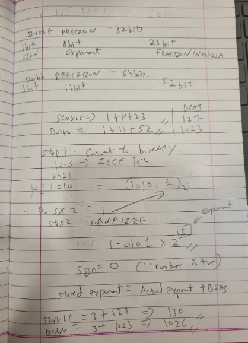 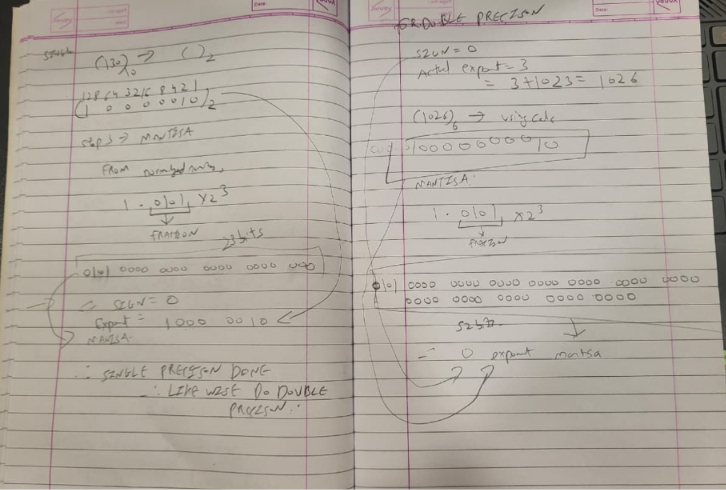 

---

# Part C — Extra Exam Checklist

Use this checklist after you have studied the direct FAQ answers.

## Must prepare first
- [x] Truth table and function of all seven logic gates.
- [x] Booth's algorithm steps and flowchart.
- [x] Booth's algorithm numerical: `7 × 5`.
- [x] Booth's algorithm numerical: `5 × 10`.
- [ ] Restoring division: `22 ÷ 5`.
- [ ] Restoring division: `13 ÷ 4`.
- [x] Number-system conversions between binary, octal, decimal and hexadecimal.

## Supporting concepts to cover
- [x] Decimal integer-to-base conversion using repeated division.
- [x] Decimal fraction-to-base conversion using repeated multiplication.
- [x] Binary/octal grouping in sets of 3 bits.
- [x] Binary/hexadecimal grouping in sets of 4 bits.
- [x] Sign-magnitude, 1's complement and 2's complement.
- [x] Basic binary addition and subtraction.
- [x] IEEE 754 single- and double-precision format.


---

# Scope Note: AI Use-Case Examples

The prompt supplied two additional AI-use-case questions:
1. Evaluate `X = A[B + C(D + E)] / F(G + H)` using one-address instructions for an AI heatwave-prediction system.
2. Explain the stages of the basic instruction cycle for an AI irrigation-advisory system.

These are **instruction-format / basic-instruction-cycle topics from Module 2**, not topics taught in this Module 3 PPT on data representation and arithmetic algorithms. They are therefore not answered here. Study them in the Module 2 notes instead.

---

## Source-based scope

These notes are based on the uploaded *COA Module 03 — Data Representation and Arithmetic Algorithms* PPT, including its FAQ on Module 3. They prioritise the questions provided by the student, then cover supporting concepts that appear in the slides. The exact wording and selection of questions on the actual test cannot be guaranteed.
