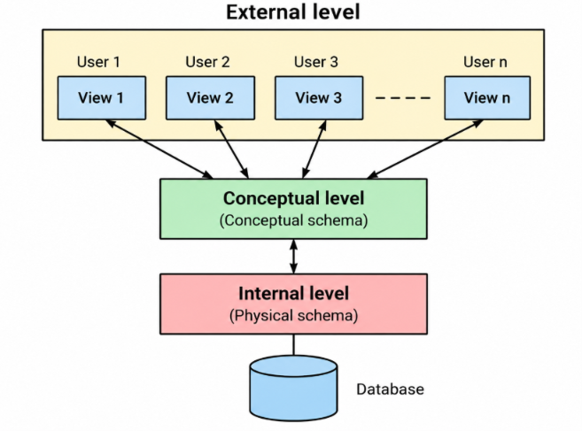
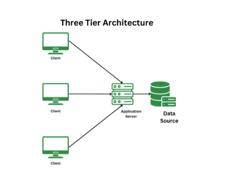
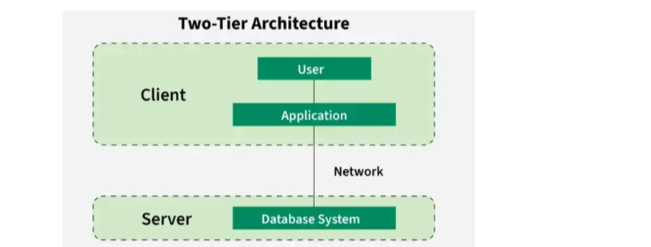
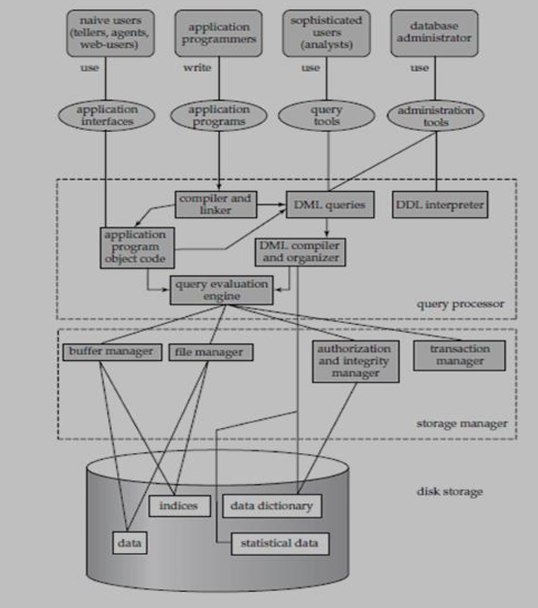
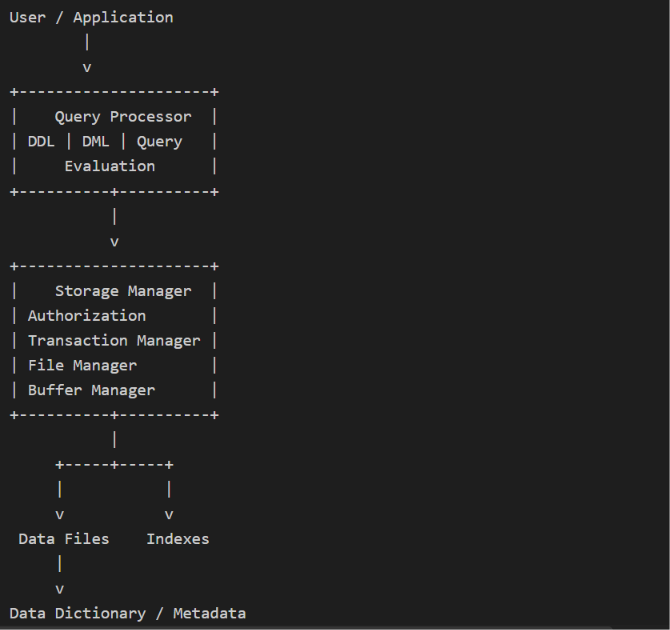

# DBMS — Unit Test 1 Complete Notes

**Semester:** III  
**Subject:** Database Management System (DBMS)

> [!note] #context
> This is organized **topic-wise**, not question-wise. The goal is to learn the concepts once and then handle whatever wording the examiner throws at you.
>
> The main source is the **UT1 DBMS question-and-answer material**, with the detailed Chapter 1 PPT used to expand Module 1. Module 2 is treated as the **new EER-heavy territory**, and Module 3 is treated as **completely new Relational Algebra territory** for a diploma student. The source material explicitly covers DBMS foundations, three-schema architecture, data independence, DBMS architecture, DBA, ER/EER concepts, ER-to-relational mapping, relational-model terms, integrity constraints, and relational algebra operators. 

---

# How to Study This Without Losing Your Soul

Do not memorize every sentence.

For theory:

**Definition → diagram → 4–6 key points → example → memory trick.**

For ER/EER:

**Read requirements → identify entities → identify attributes → identify relationships → decide cardinality/participation → draw → convert to tables.**

For Relational Algebra:

**Understand the English sentence first → decide rows/columns/tables → choose operator → write expression.**

> [!hint] AI
> The examiner can rename the system from “Heatwave Intelligence System” to “Underwater Potato Monitoring Database” and the DBMS does not suddenly become a new subject. The entities change; the concepts do not.

---

# MODULE 1 — DATABASE SYSTEM CONCEPTS AND ARCHITECTURE

## 1. What is a Database?

A **database** is an organized collection of related data stored so that it can be accessed, managed and updated efficiently.

Example:

A college database may contain:

- Student details
- Course details
- Faculty details
- Attendance
- Marks
- Timetable

A climate-monitoring database may contain temperature, humidity, location and historical observations.

---

## 2. What is DBMS?

A **Database Management System (DBMS)** is software used to create, store, organize, retrieve and manage data in a database.

It provides facilities such as:

- Data security
- Data integrity
- Concurrent access
- Backup
- Recovery
- Data retrieval and manipulation
- Authorization

### Simple definition for exam

> **DBMS is software that allows users to create, store, retrieve, update and manage data in a database efficiently and securely.**

### Why do we need DBMS?

Imagine storing your entire college system as random `.txt` files:

```text
student.txt
student_final.txt
student_final2.txt
student_REAL_FINAL.txt
student_REAL_FINAL_USE_THIS.txt
```

Congratulations. You have invented the file-system nightmare.

A DBMS gives structure, control and centralized management.

> [!hint] Memory trick
> **S-C-R-U-M** → **Store, Create, Retrieve, Update, Manage.**

Much better. DBMS accidentally became Scrum.

---

# 3. Main Characteristics of a Database System

The detailed Chapter 1 material emphasizes the following characteristics.

## 3.1 Self-Describing Nature

A DBMS stores information about the database itself in a **catalog/data dictionary**.

This metadata may describe:

- Table names
- Attributes
- Data types
- Constraints
- Storage information
- Relationships

### Example

For a `STUDENT` table, metadata may say:

```text
Table: STUDENT
Columns: Roll_No, Name, Branch, Age
Roll_No: INTEGER
Name: VARCHAR
Roll_No: PRIMARY KEY
```

This description is **metadata** — data about data.

> [!hint] Memory trick
> **Metadata = “data's passport.”**
>
> It does not contain the actual student information; it describes how that information is organized.

---

## 3.2 Insulation Between Programs and Data

The structure of data is maintained separately from application programs.

This gives **program-data independence**.

The application does not need to know every physical detail about how records are stored.

For example, changing the storage organization should not require rewriting every application program.

---

## 3.3 Data Abstraction

**Data abstraction** means hiding unnecessary or complex storage details from users and showing only the information they actually need.

Example:

A student sees:

```text
Name: Dev
Roll No: 62
Branch: IT
```

The student does not need to know:

```text
Block 17
Offset 4301
Index node B+
Disk sector 281
```

The DBMS handles those details.

---

## 3.4 Multiple Views of Data

Different users may need different portions of the same database.

Example:

```text
Same Database
      |
      +---- Student View
      |
      +---- Faculty View
      |
      +---- Accountant View
      |
      +---- Administrator View
```

A student may see marks but not salary information.

An HR manager may see employee salary details.

A company directory may show employee names and departments while hiding salary and private information.

> [!note] #context
> This idea becomes important again in the **External/View level** of the three-schema architecture. Do not memorize it twice; remember that the external level exists mainly to give users customized views.

---

## 3.5 Data Sharing and Multi-User Transaction Processing

A DBMS allows several users to access the database concurrently.

The DBMS must prevent inconsistent results.

### Concurrency control

Concurrency control ensures that multiple transactions can occur without corrupting the database state.

### Recovery subsystem

Recovery ensures that completed transactions remain properly recorded even after failures.

### OLTP

**OLTP = Online Transaction Processing**.

It supports many concurrent transactions such as:

- ATM transactions
- Ticket bookings
- Online purchases
- Banking transactions

> [!hint] Memory trick
> **Multiple users + same database = DBMS must act like a traffic police officer.**
>
> Everyone gets to use the road, but nobody is allowed to crash into everyone else.

---


## 4. Applications of DBMS

| Application | What DBMS is used for |
| --- | --- |
| **Banking & Finance** | Manages customer accounts, deposits, loans, transactions, credit-card records and financial information. |
| **Aviation & Transport** | Manages flight schedules, passenger registrations, reservations and seat bookings. |
| **Healthcare** | Manages patient records, doctor details, appointments, diagnostic reports, billing and pharmacy information. |
| **Sales & E-commerce** | Manages products, inventory, orders, cart data, payments and purchase history. |
| **Universities** | Manages student registration, courses, marks, timetables and library records. |
| **Manufacturing** | Manages supply chains, production, inventory, warehouses and orders. |
| **Telecommunication** | Manages calls, messages, data usage, billing and network information. |
| **Web-based Services** | Manages social-media users, connections, posts, likes, online shopping and recommendations. |
| **Document Databases** | Manages collections of articles, patents and research papers. |
| **Navigation Systems** | Manages locations, roads, railway routes and bus routes. |

> [!hint] **Exam trick**  
> If the question asks **“Applications of DBMS”**, write **5–6 applications with one line explaining what data is managed in each**. Don't just list names.

This is much faster to **read → remember → reproduce in the exam**.

---

# 5. File System vs Database System

## What is a File System?

In a file-based approach, data is stored in separate files and application programs are written to manage those files.

Example:

```text
student.txt
fees.txt
attendance.txt
marks.txt
```

The programs themselves often need to know how the files are structured.

## Drawbacks of File System

### 1. Inefficient storage and retrieval

Searching and retrieving data can become inefficient.

### 2. Data redundancy

The same information may appear in multiple files.

Example:

```text
student.txt       → Dev, IT
fees.txt          → Dev, IT
library.txt       → Dev, IT
```

The same information is repeated.

### 3. Concurrent-access problems

One user may be reading while another is updating or deleting data.

### 4. Poor crash recovery

If a crash occurs while data is being written, information may be lost or left inconsistent.

### 5. Difficult security

Protecting individual files and controlling different levels of access is difficult.

### 6. Program-data dependence

Applications are tightly coupled with file structure.

### 7. Difficult relationship management

Representing complex relationships across many separate files is hard.

---

# 6. Advantages of DBMS Over File System

| File System Problem | DBMS Solution |
|---|---|
| Data redundancy | Controls/reduces redundancy |
| Poor sharing | Supports multi-user data sharing |
| Weak security | Authorization and access control |
| Poor recovery | Backup and recovery mechanisms |
| Difficult relationships | Represents complex relationships |
| Poor integrity | Enforces integrity constraints |
| Slow retrieval | Uses efficient storage structures/indexes |
| Concurrent-access problems | Provides concurrency control |
| Program-data dependence | Provides data abstraction/independence |

### Core points to remember

- Control redundancy
- Share data
- Restrict unauthorized access
- Backup and recovery
- Efficient query processing
- Multiple user interfaces/views
- Complex relationships
- Integrity constraints

> [!hint] Memory trick
> Think of DBMS as upgrading from **“files everywhere”** to **“one controlled system.”**
>
> **R-S-S-R-Q-V-R-I**
>
> **R**obots **S**teal **S**ecrets, **R**ob **Q**uickly, **V**anish **R**ight **I**nside.
>
> - **R** — Redundancy
> - **S** — Sharing
> - **S** — Security
> - **R** — Recovery
> - **Q** — Query efficiency
> - **V** — Views
> - **R** — Relationships
> - **I** — Integrity

---

# 7. Advantages of File System Over DBMS

Yes, this sounds cursed, but it is technically a possible question.

For small/simple applications, a file system can have advantages:

- Simple to use
- Lower cost
- Less resource consumption
- Easy implementation
- Suitable for small amounts of data
- No DBMS overhead

### Example

If you need to store three lines of configuration data for a tiny utility, deploying a full DBMS would be like bringing a bulldozer to move a chair.

---

# 8. Data Abstraction

**Data abstraction** is the process of hiding unnecessary details of data organization and storage from the user.

The three levels are:

1. External/View Level
2. Conceptual/Logical Level
3. Physical/Internal Level

 

---

## 8.1 Physical / Internal Level

Lowest level.

Describes **how data is physically stored**.

Includes concepts such as:

- Disk blocks
- Record formats
- File organization
- Sequential/random access
- Index structures
- B+ trees
- Hashing

The user does not need to know these details.

### Example

An employee file might physically use an index on SSN (social security number) and block compression.

> [!hint] Memory trick
> **Physical = Where/how it sits.**

---

## 8.2 Conceptual / Logical Level

Describes the logical structure of the entire database.

It specifies:

- Entities
- Attributes
- Relationships
- Data types
- Constraints

There is normally **one conceptual schema per database**.

### Example

```text
EMPLOYEE
Employee_ID
Name
BirthDate
DepartmentNo
Salary
```

We know what the data means without caring which disk block contains it.

> [!hint] Memory trick
> **Logical = What the database contains and how things relate.**

---

## 8.3 External / View Level

Highest level.

Describes how individual users see the database.

Different users can have different views.

### Example

```text
HR Manager → Name + Employee ID + Salary
Directory  → Name + Department
Student    → Name + Roll No + Marks
```

> [!hint] Memory trick
> **External = What the user actually sees.**

---

# 9. Three-Schema / ANSI-SPARC Architecture

The three-schema architecture separates the database into:


 

### Why is this architecture useful?

It provides:

- Data abstraction
- Multiple views
- Data independence
- Separation between user views and physical storage

### Example

Consider a company database.

**Internal:** records stored using indexes/blocks.

**Conceptual:** Employee, Department, Salary, etc.

**External:** HR sees salary; directory users do not.

---

# 10. Data Independence

**Data Independence** is the ability to modify a schema at one level without requiring changes to applications at a higher level.

There are two types.

---

## 10.1 Physical Data Independence

Ability to modify the **physical/internal schema** without rewriting application programs or changing the conceptual schema.

### Examples

- Changing file organization
- Adding/changing an index
- Reorganizing storage
- Moving data to another storage device

### Example

Suppose sensor data changes from a normal file organization to indexed storage for faster searching.

Applications still use the same logical data.

> [!hint] Memory trick
> **Physical changes stay physical.**
>
> Change the storage room; nobody upstairs needs to know.

---

## 10.2 Logical Data Independence

Ability to modify the **conceptual/logical schema** without forcing application programs or external views to be rewritten.

### Examples

- Adding an attribute
- Splitting a logical table
- Changing logical database structure

### Example

Add:

```text
Satellite_Type
```

to the logical schema without breaking existing views that do not use it.

> [!hint] Memory trick
> **Logical changes stay behind the views.**

### Comparison

| Physical Data Independence | Logical Data Independence |
|---|---|
| Deals with physical storage | Deals with logical schema |
| Changes internal schema | Changes conceptual schema |
| Higher conceptual/external levels remain unaffected | External views/applications remain unaffected |
| Example: change file organization | Example: add an attribute |

> [!warning] Important
> **Logical data independence is generally harder to achieve** because application programs depend more directly on the logical structure of the data.

---

# 11. Two-Tier vs Three-Tier Client-Server Architecture

Do not confuse this with the **three-schema architecture**.

### Three-schema architecture

About **levels of database abstraction**.

### Three-tier architecture
 
About **where the application components run**.

---

## Two-Tier Architecture
 
```text
Client
  |
  | request
  v
Database Server
```

The client directly communicates with the database server.

### Client contains

- User interface
- Application/business logic

### Server contains

- DBMS
- Query processing
- Database storage

### Advantage

Simple.

### Disadvantage

Scalability and maintenance can become difficult.

---

## Three-Tier Architecture

```text
+----------------------+
| Presentation Layer   |
| User Interface       |
+----------+-----------+
           |
           v
+----------------------+
| Application Layer    |
| Business Logic       |
+----------+-----------+
           |
           v
+----------------------+
| Database Layer       |
| DBMS + Data          |
+----------------------+
```

### Tier 1 — Presentation Layer

User interface.

Example: web browser/app screen.

### Tier 2 — Application Layer

Business logic, validation and transaction processing.

### Tier 3 — Database Layer

DBMS, files, metadata and database operations.

### Advantages

- Better security
- Better scalability
- Easier maintenance
- Separation of responsibilities
- Reusable components

### Disadvantages

- More complex
- More difficult to set up
- Extra layers can introduce performance overhead

> [!hint] Memory trick
> **Presentation → Processing → Persistence**
>
> See it → Think it → Store it.

---

# 12. Detailed DBMS Architecture

The DBMS acts as an interface between users/applications and the stored database.

 
> [!attention] Overall flow (dont draw this in exam)
> 

***

## 12.1 DDL Interpreter / Compiler

Handles **DDL commands**.

It processes database definitions such as:

- Tables
- Schemas
- Views
- Constraints

It stores metadata in the **data dictionary/system catalog**.

---

## 12.2 DML Compiler

Processes DML commands such as:

- SELECT
- INSERT
- UPDATE
- DELETE

It converts high-level commands into lower-level instructions that the DBMS can execute.

---

## 12.3 Query Optimizer

Chooses an efficient way to execute a query.

Example:

If an index exists, using it may be faster than scanning the entire table.

> [!hint] Memory trick
> **Compiler understands; optimizer chooses the least stupid route.**

---

## 12.4 Query Evaluation Engine

Executes the lower-level instructions generated by the query processor.

---

## 12.5 Storage Manager

Acts as an interface between the database stored on disk and the queries/applications.

It manages:

- Storing data
- Retrieving data
- Updating data
- File access
- Buffer management

### Components of Storage Manager

#### Authorization and Integrity Manager

Checks:

- User permissions
- Integrity constraints

#### Transaction Manager

Keeps the database in a consistent state during transactions and failures.

#### File Manager

Manages:

- Disk space
- File structures
- Storage allocation

#### Buffer Manager

Moves database pages between secondary storage and main memory.

It keeps frequently used pages in memory to reduce disk access.

> [!hint] Memory trick
> **Buffer = temporary parking area between disk and RAM.**

---

## 12.6 Data Dictionary / System Catalog

Contains metadata about the database.

May include:

- Table names
- Attribute names
- Data types
- Attribute lengths
- Number of rows
- Relationships
- Constraints
- Authorization information
- Storage information

---

## 12.7 Data Files

Contain the actual stored database data.

---

## 12.8 Indexes

Provide faster access to data items.

> [!hint] Memory trick
> An index is like the index of a textbook. You do not read 600 pages to find “DBMS Architecture”; you jump to the page.

---

# 13. Database Administrator — DBA

A **Database Administrator (DBA)** is responsible for designing, implementing, maintaining, securing and managing the database environment.

## Main responsibilities

1. Install and upgrade the database server/tools.
2. Allocate storage.
3. Plan future storage requirements.
4. Modify the database structure when required.
5. Enroll users.
6. Control user access.
7. Maintain database security.
8. Monitor and optimize performance.
9. Plan backup and recovery.
10. Restore databases.
11. Maintain archived data.
12. Monitor replication.
13. Generate required reports/queries.
14. Coordinate with database vendors when necessary.

> [!hint] Memory trick
> **DBA = Database's Adult-in-Charge.**
>
> Security, storage, users, performance, backup, recovery, maintenance.

### DBA vs Database User

| Database User | DBA |
|---|---|
| Uses database for a purpose | Manages the database itself |
| Retrieves/updates data | Controls access and security |
| Uses existing structures | Designs/maintains structures |
| Focuses on application needs | Focuses on health of entire DBMS |

---

## 14. Types of Database Users

| Category | Type / Role | Main Responsibility / Usage | Examples |
| --- | --- | --- | --- |
| Database Administrators | —   | Manage security, authorization, performance and recovery. | —   |
| Database Designers | Logical Designers | Define data, entities, attributes, relationships and constraints without considering physical storage. | —   |
| Database Designers | Physical Designers | Map the logical model to physical storage. | —   |
| System Analysts | —   | Analyze user/business requirements and convert them into specifications. | —   |
| Application Programmers | —   | Implement and maintain programs that use the database. | —   |
| End Users | Casual Users | Access the database occasionally. | —   |
| End Users | Naive / Parametric Users | Perform repetitive, predefined operations. | Bank teller, Reservation clerk |
| End Users | Sophisticated Users | Use complex queries or analytical tools. | Scientists, Engineers, Data analysts |
| Workers Behind the Scene | —   | Work on database-related systems but do not normally use the database as part of their regular job. | Tool developers, Operators, Maintenance personnel, System administrators |

> [!hint] Quick comparison  
> DBA → Manage  
> Designer → Design  
> Analyst → Analyze requirements  
> Programmer → Build applications  
> End User → Use database  
> Behind the Scene → Support the system
***
# 15. DBMS Languages

There are four major categories in the supplied material.

## 15.1 DDL — Data Definition Language

Used to define database structures.

Examples:

```sql
CREATE
ALTER
DROP
```

## 15.2 DML — Data Manipulation Language

Used to retrieve and modify data.

Examples:

```sql
SELECT
INSERT
UPDATE
DELETE
```

### High-level / non-procedural DML

Specifies **what** data to retrieve rather than exactly how to retrieve it.

### Low-level / procedural DML

Retrieves data one record at a time and may use loops.

## 15.3 DCL — Data Control Language

Controls permissions.

```sql
GRANT
REVOKE
```

- `GRANT` → give permission
- `REVOKE` → take permission back

## 15.4 TCL — Transaction Control Language

Controls transactions.

```sql
COMMIT
SAVEPOINT
ROLLBACK
```

- `COMMIT` → save work
- `SAVEPOINT` → create a rollback point
- `ROLLBACK` → undo changes back to a suitable rollback point/transaction state

> [!hint] Memory trick
> **DDL = Design**
>
> **DML = Manipulate**
>
> **DCL = Control**
>
> **TCL = Transaction**

---
