# DBMS — CHAPTER 2 NOTES
## Entity Relationship Model (ER) + Extended ER (EER)

> [!warning] #context — NEW TERRITORY
> You already know basic DBMS concepts from diploma, but **Extended ER (EER)** is one of the areas that was not properly covered before.
>
> Do not treat this as “just another diagram.” First understand **entities, attributes and relationships**; then learn what EER adds on top of ordinary ER.

---

# 16. What is an Entity?

An **entity** is a real-world object or concept about which data is stored.

Examples:

```text
Student
Teacher
Patient
Course
Book
Farmer
Sensor
```

A particular student, such as Dev with Roll No. 62, is an **entity instance**.

> [!hint] Memory trick
> **Entity = a real-world “thing” about which we store data.**

---

# 17. Entity Type vs Entity Set

## Entity Type

An **entity type** is a category or structure describing similar entities.

Example:

```text
STUDENT
```

It describes what information a student entity should have.
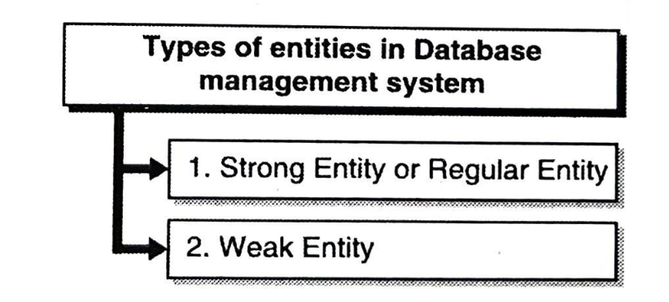 

## Entity Set

An **entity set** is the collection of entities belonging to an entity type.

Example:

```text
STUDENT
-----------------
Dev
Harshal
Aarnav
...
```

> [!hint] Memory trick
> **Type = blueprint. Set = actual collection.**

---

# 18. Strong / Regular Entity

A **strong (regular) entity** has its own key attribute that uniquely identifies it.

Example:

```text
STUDENT
Roll_No  ← Primary Key
Name
Branch
```

`Roll_No` identifies each student.

A strong entity does **not** depend on another entity for its identification.

> [!hint] Memory trick
> **Strong = has its own identity.**
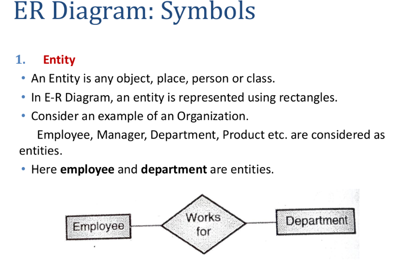 
---

# 19. Weak Entity

A **weak entity** depends on a strong/owner entity for identification or existence.

It does not have a complete identifying key of its own.

Example:

```text
EMPLOYEE
   |
   | owns
   v
DEPENDENT
```

A dependent may be identified using:

```text
Employee_ID + Dependent_Name
```

Here:

- `Employee_ID` comes from the owner entity.
- `Dependent_Name` acts as a **partial key**.
- Together they can uniquely identify the dependent.
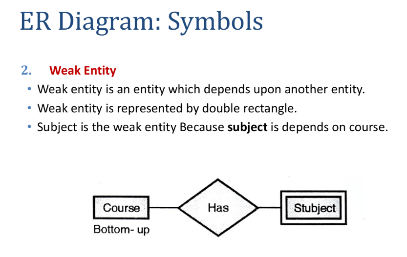 
## Diagram notation

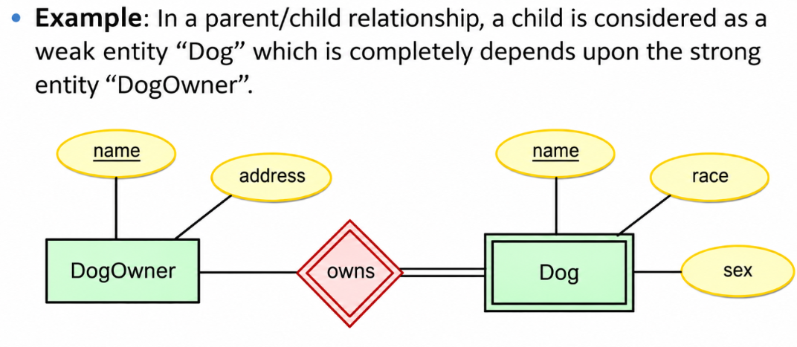 

> [!note] #context
> A weak entity commonly has a **partial key**. The partial key alone may not uniquely identify it; combined with the owner's key, it does.

> [!hint] Memory trick
> **Weak entity = “I need my parent to tell you who I am.”**
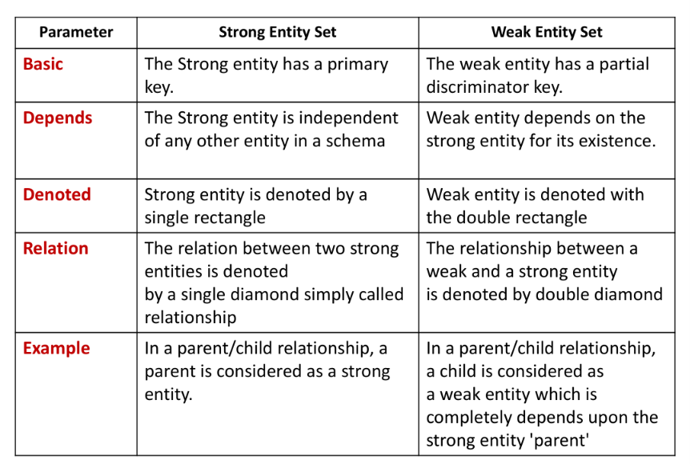 
---

# 20. Attributes

An **attribute** describes a property of an entity.

Example:

```text
STUDENT
 ├── Roll_No
 ├── Name
 ├── Gender
 ├── Phone
 └── Date_of_Birth
```

There are several important types of attributes.

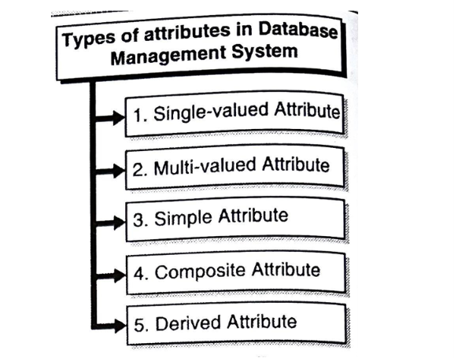 

---

## 20.1 Simple Attribute

A **simple attribute** cannot be meaningfully divided further.

Examples:

- Age
- Gender
- Salary
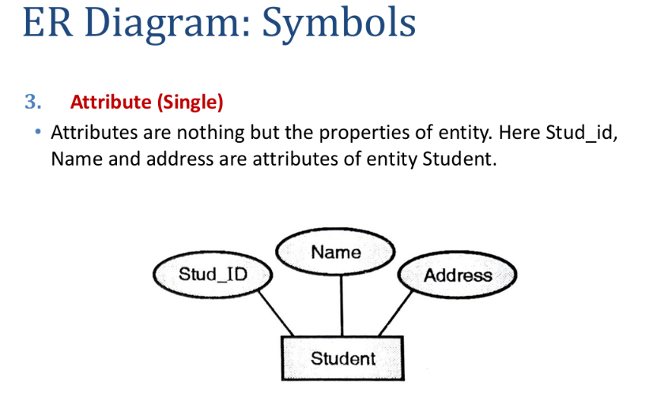
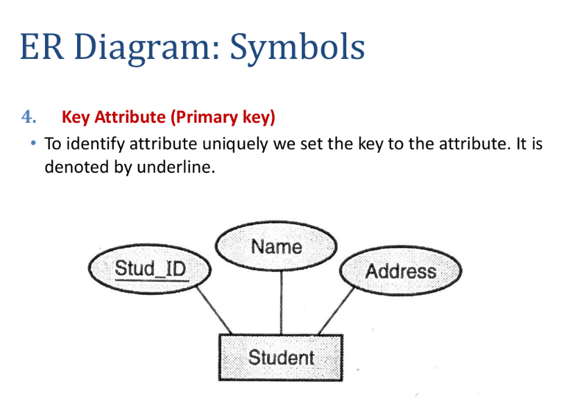 
---

## 20.2 Composite Attribute

A **composite attribute** can be divided into smaller meaningful parts.

Example:

```text
Name
├── First_Name
├── Middle_Name
└── Last_Name
```

Here, `Name` is composite because it can be broken into smaller attributes.

> [!hint] Memory trick
> **Composite = composed of smaller parts.**
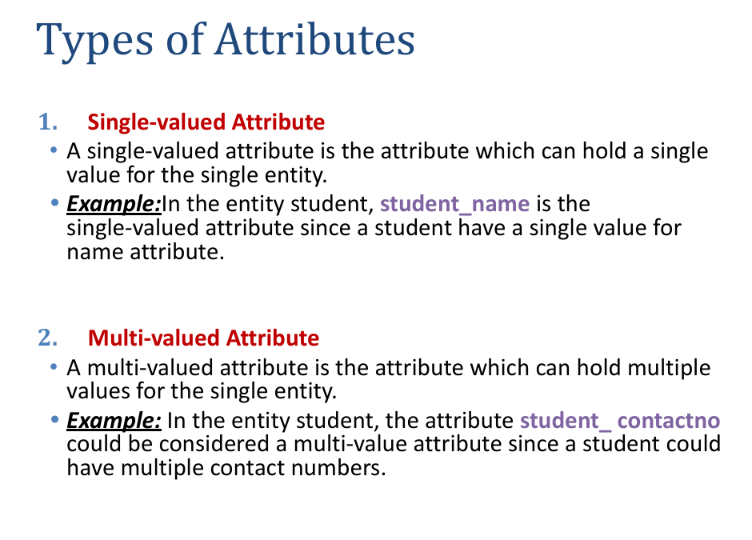 
---

## 20.3 Single-Valued Attribute

A **single-valued attribute** has one value for each entity.

Example:

```text
Student_ID = 62
```

One student has one Student ID.

---

## 20.4 Multi-Valued Attribute

A **multi-valued attribute** can contain multiple values for one entity.

Example:

```text
Phone_Number
├── 9000000001
└── 9000000002
```

One student may have multiple phone numbers.

**[DIAGRAM PLACEHOLDER — Draw a double ellipse for a multivalued attribute.]**
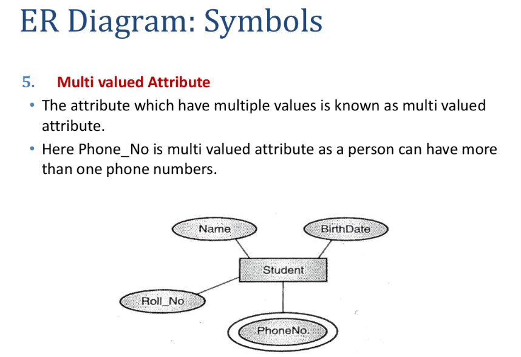 
> [!hint] Memory trick
> **Multi = multiple values for one entity.**
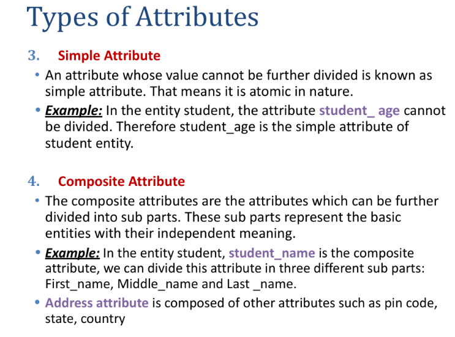 
---

## 20.5 Derived Attribute

A **derived attribute** is calculated from another attribute or attributes.

Example:

```text
Date_of_Birth → Age
```

Age can be calculated from Date of Birth and the current date.

**[DIAGRAM PLACEHOLDER — Draw a dashed ellipse for a derived attribute.]**
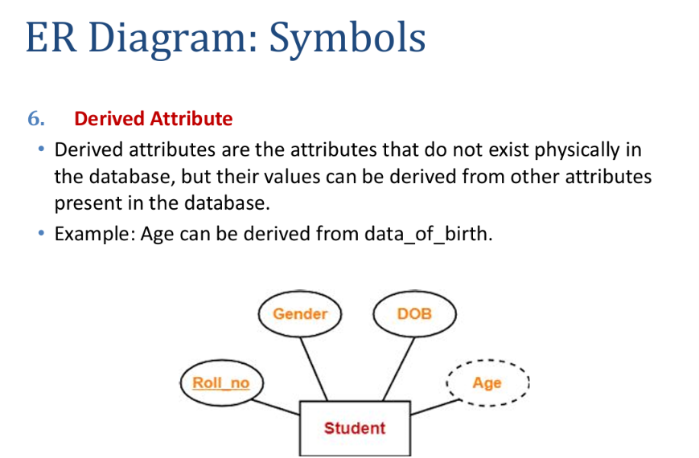 
> [!hint] Memory trick
> **Derived = not stored directly; calculated when needed.**
>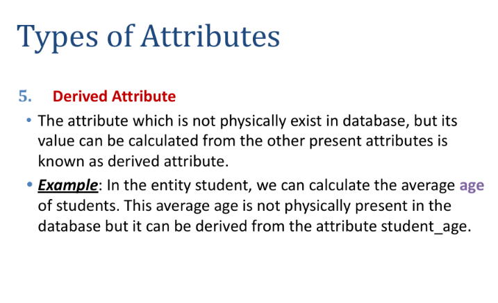 
> Age is the classic victim. Nobody needs to permanently store “21” if DOB already exists and the current date can calculate it.

---
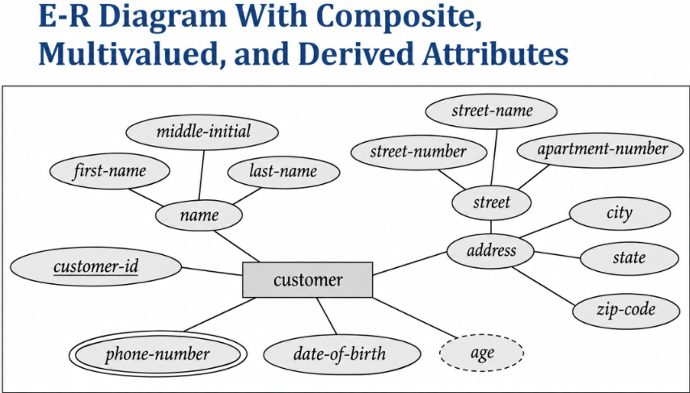 
# 21. Keys

Keys are used to identify entities/tuples and establish relationships between relations.

---

## 21.1 Primary Key

A **primary key** uniquely identifies each entity/row.

Example:

```text
STUDENT(Roll_No, Name, Branch)
```

`Roll_No` can be the primary key.

A primary key must uniquely identify each record.

---

## 21.2 Candidate Key

A **candidate key** is a minimal attribute set that can uniquely identify a tuple.

There may be multiple candidate keys.

Example:

```text
STUDENT(Student_ID, Email, Name)
```

If both `Student_ID` and `Email` are unique, both can be candidate keys.

One candidate key is selected as the primary key.

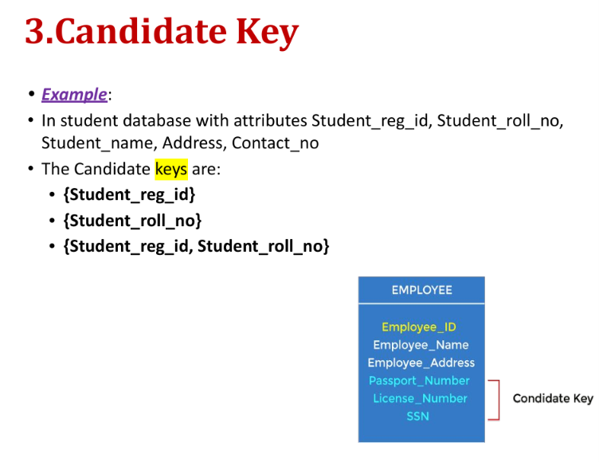 

---

## 21.3 Super Key

A **super key** is any attribute set that uniquely identifies a tuple, even if it contains extra attributes.

Example:

```text
Student_ID
Student_ID + Name
Student_ID + Branch
```

If `Student_ID` is already unique, all three can be super keys.

However:

```text
Student_ID
```

is minimal, so it can be a candidate key.

> [!hint] Memory trick
> **Candidate = could become primary.**
>
> **Super = unique, even with unnecessary baggage.**
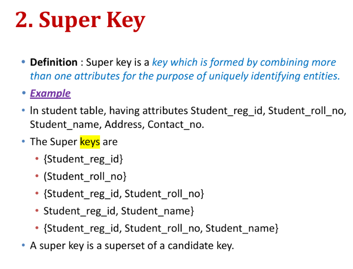 
---

## 21.4 Foreign Key

A **foreign key** is an attribute in one relation that refers to a key in another relation.

Example:

```text
DEPARTMENT(Dept_ID, Dept_Name)

EMPLOYEE(Emp_ID, Name, Dept_ID)
                         ^
                         |
                         FK → DEPARTMENT.Dept_ID
```

`EMPLOYEE.Dept_ID` refers to `DEPARTMENT.Dept_ID`.

> [!hint] Memory trick
> **Primary = identifies me.**
>
> **Foreign = points to someone else.**
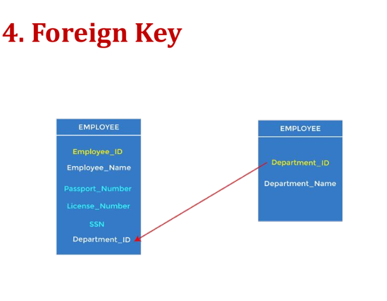 
---

# 22. Relationships

A **relationship** represents an association between entities.

Example:

```text
STUDENT ─── enrolls ─── COURSE
```

Here:

- `STUDENT` = entity
- `COURSE` = entity
- `enrolls` = relationship

Relationships are usually represented using a **diamond** in a standard ER diagram.
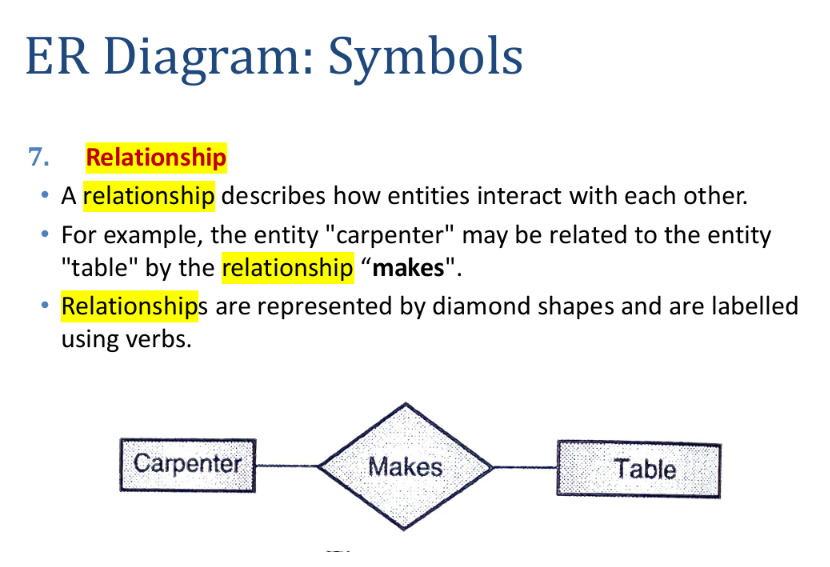 
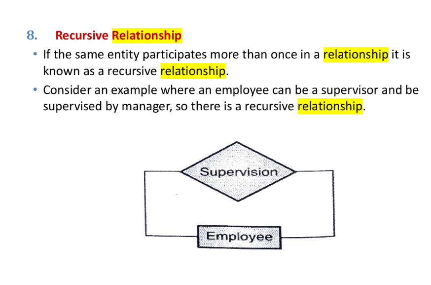 
> [!hint] Memory trick
> **Entity = thing. Relationship = connection between things.**

---

# 23. Cardinality Constraints

**Cardinality** tells us how many entities can participate in a relationship.

The common types are:

- 1:1
- 1:N
- N:1
- M:N

---

## 23.1 1:1 — One to One

One entity in A is associated with at most one entity in B and vice versa.

Example:

```text
PERSON ─── has ─── PASSPORT
```

One person has one passport, and one passport belongs to one person.
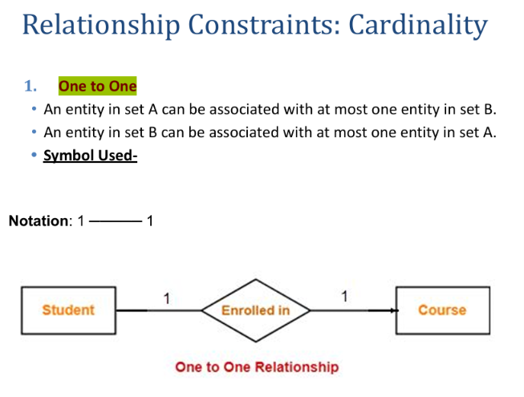 

---

## 23.2 1:N — One to Many

One entity in A may relate to many entities in B.

Example:

```text
DEPARTMENT 1 ───── N EMPLOYEE
```

One department can have many employees.
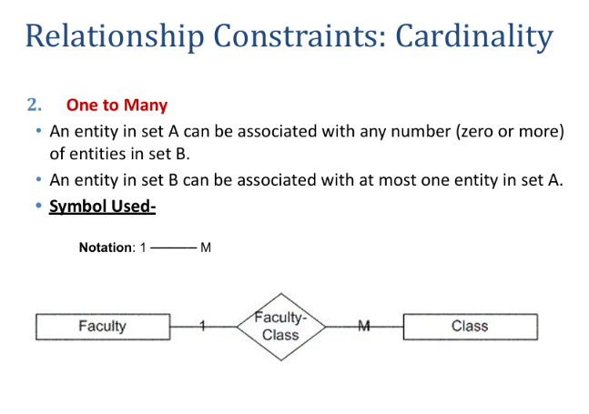 

---

## 23.3 N:1 — Many to One

Many entities in A relate to one entity in B.

Example:

```text
EMPLOYEE N ───── 1 DEPARTMENT
```

Many employees can belong to one department.
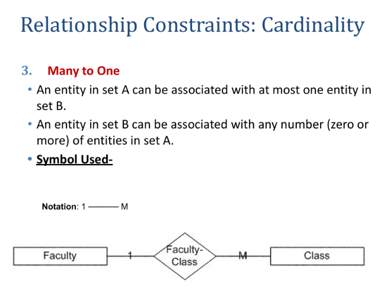 

---

## 23.4 M:N — Many to Many

Many entities on both sides can relate to many entities on the other side.

Example:

```text
STUDENT M ───── N COURSE
```

A student can take many courses, and a course can have many students.

> [!hint] Memory trick
> Just ask: **“How many on each side?”**
>
> `1:1` = one-one
>
> `1:N` = one controls many
>
> `M:N` = everyone is dating everyone and the ER diagram has become a social disaster.
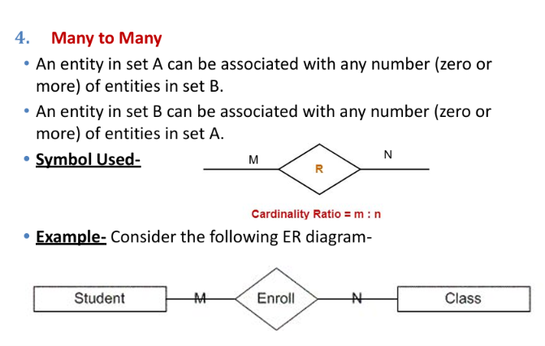
> 
---

# 24. Participation Constraints

**Participation** tells us whether participation in a relationship is mandatory or optional.

---

## 24.1 Total Participation

Every entity in the entity set **must** participate in at least one relationship instance.

Represented using a **double line** in common ER notation.

Example:

> Every `EMPLOYEE` must belong to a department.

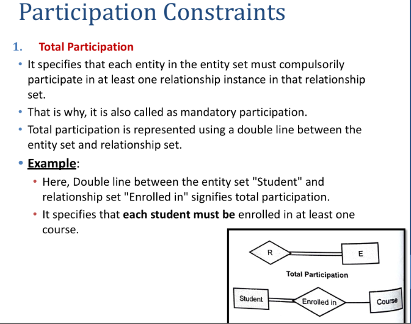 

---

## 24.2 Partial Participation

An entity **may or may not** participate in a relationship.

Represented using a **single line**.

Example:

> A department may temporarily have no employees.

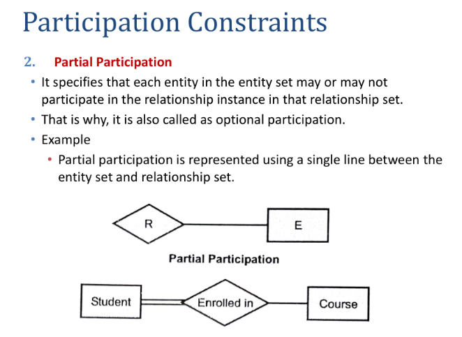 

> [!hint] Memory trick
> **Total = must. Partial = maybe.**

---

# 25. Standard ER / EER Notations

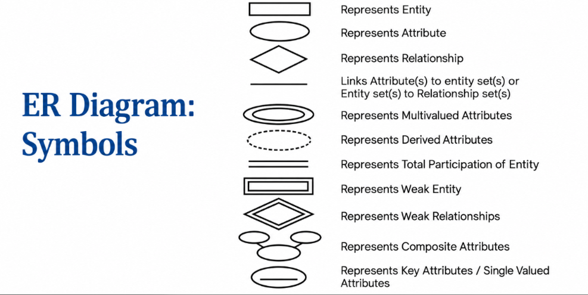 
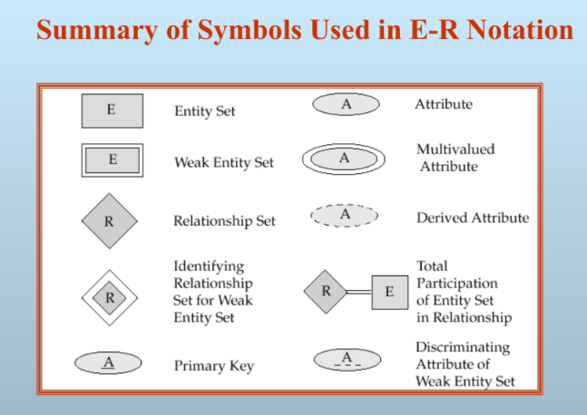 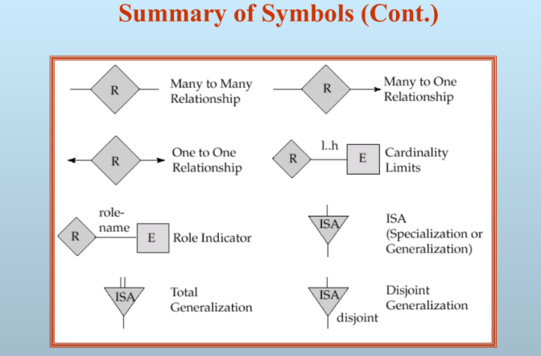 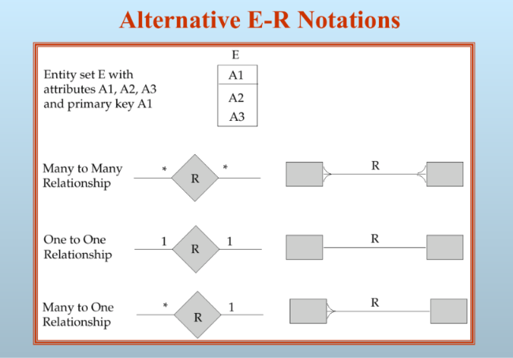 
```text
Rectangle              = Entity
Double Rectangle       = Weak Entity
Diamond                = Relationship
Double Diamond         = Identifying (weak) Relationship
Ellipse                = Attribute
Double Ellipse         = Multivalued Attribute
Dashed Ellipse         = Derived Attribute
Underlined Attribute   = Key Attribute
Single Line            = Partial Participation
Double Line            = Total Participation
Triangle / ISA         = Specialization / Generalization
```

> [!hint] Memory trick
> **Rectangle = thing. Diamond = relationship. Oval = detail.**

If you remember those three shapes, most ER diagrams become much easier.

---

# 26. EER — Extended Entity Relationship Model

The **Extended Entity Relationship (EER) model** extends the basic ER model with additional concepts.

Important EER concepts include:

- Specialization
- Generalization
- Disjoint constraints
- Overlapping constraints
- Completeness constraints
- Aggregation
- Inheritance through higher-level entities

> [!warning] #context — IMPORTANT
> EER is one of the more important **new areas** in this chapter. Understand the diagrams instead of only memorizing definitions.

---

# 27. Specialization

**Specialization** divides one higher-level entity into more specific lower-level entity types.

It follows a **top-down** approach.

Example:

```text
              EMPLOYEE
               /    \
              /      \
         MANAGER    ENGINEER
```

`EMPLOYEE` is the higher-level entity.

`MANAGER` and `ENGINEER` are specialized entity types.

Additional attributes can be attached:

```text
MANAGER  → Department
ENGINEER → Skill
```

### Key points

- Top-down approach
- One higher-level entity → multiple specialized subtypes
- Subtypes inherit common attributes from the supertype

> [!hint] Memory trick
> **Specialization = One → Many**
>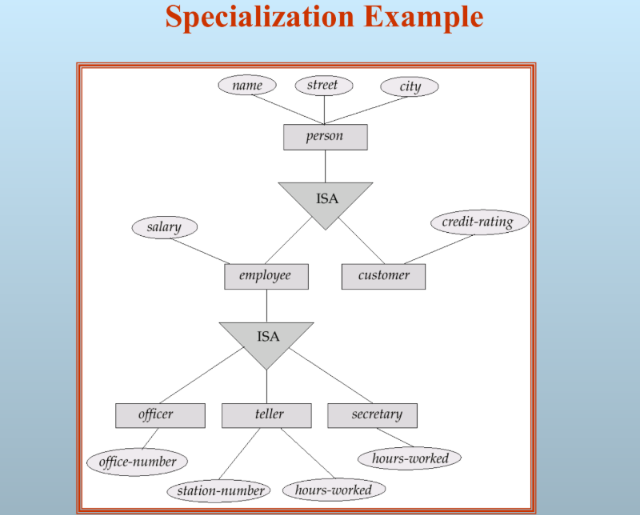 
> Start with one general thing and split it into specialized types.

---

# 28. Generalization

**Generalization** combines two or more lower-level entity types into a common higher-level entity.

It follows a **bottom-up** approach.

Example:

```text
       STUDENT      TEACHER
           \        /
            \      /
             PERSON
```

Common attributes such as:

- Name
- Age
- Address

can be moved to the common `PERSON` entity.

### Key points

- Bottom-up approach
- Multiple lower-level entities → one higher-level entity
- Common attributes are moved to the generalized entity

> [!hint] Memory trick
> **Generalization = Many → One**
>
> **Specialization splits. Generalization combines.**

> [!hint] AI
> Specialization is going downward:
>
> **“What specific types does this thing have?”**
>
> Generalization is going upward:
>
> **“What common parent can these things share?”**

---

# 29. Disjoint Constraint

In a **disjoint specialization**, an entity can belong to **at most one subclass**.

It is commonly represented by `d`.

Example:

```text
             EMPLOYEE
                |
                d
              /   \
         ENGINEER  MANAGER
```

Under the disjoint rule, one employee cannot simultaneously belong to both subclasses.

> [!hint] Memory trick
> **Disjoint = one bucket only.**

---

# 30. Overlapping Constraint

In an **overlapping specialization**, an entity can belong to **more than one subclass**.

It is commonly represented by `o`.

Example:

```text
              PERSON
                |
                o
              /   \
          DOCTOR  RESEARCHER
```

One person may be both a doctor and a researcher.

> [!hint] Memory trick
> **Overlap = same person can occupy multiple buckets.**

---

# 31. Completeness: Total vs Partial Specialization

Do not confuse this with relationship participation.

## Total Specialization

Every higher-level entity **must belong to at least one subclass**.

Example:

```text
             EMPLOYEE
                ||
              /    \
          MANAGER  ENGINEER
```

Every employee must be either a manager or an engineer.

## Partial Specialization

Some higher-level entities **may belong to no subclass**.

Example:

```text
             EMPLOYEE
                |
              /   \
          MANAGER  ENGINEER
```

Some employees may be neither a manager nor an engineer.

> [!note] #context
> **Total/partial participation** and **total/partial specialization** are related but not the same idea.
>
> - Participation → whether an entity participates in a relationship.
> - Specialization completeness → whether every supertype entity belongs to a subtype.

---

# 32. Role Names

A **role name** describes the role played by an entity in a relationship.

Role names become especially important when the **same entity type participates more than once**.

Example:

```text
EMPLOYEE ─── supervises ─── EMPLOYEE
```

The two occurrences of `EMPLOYEE` have different roles:

```text
Supervisor
Subordinate
```

Without role names, the diagram becomes confusing because the same entity type appears twice.

> [!hint] Memory trick
> Same entity twice?
>
> **Give each appearance a job title.**

---

# 33. Aggregation

**Aggregation** treats a relationship between entities as a higher-level object that can participate in another relationship.

Example:

```text
COACHING_CENTER ── Offers ── COURSE
                         |
                     aggregation
                         |
                      ENQUIRES
                         |
                      VISITOR
```

The visitor is interested in the specific **Center–Course offering**, not merely the center or course independently.

**[DIAGRAM PLACEHOLDER — Draw COACHING_CENTER — OFFERS — COURSE as an aggregated relationship connected to VISITOR through ENQUIRES.]**

> [!hint] Memory trick
> **Aggregation = relationship gets promoted to “thing-like” status.**
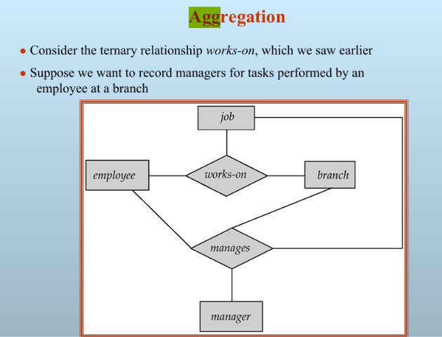 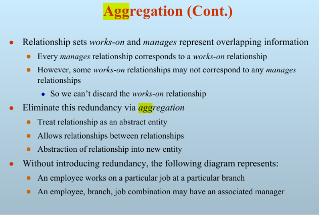 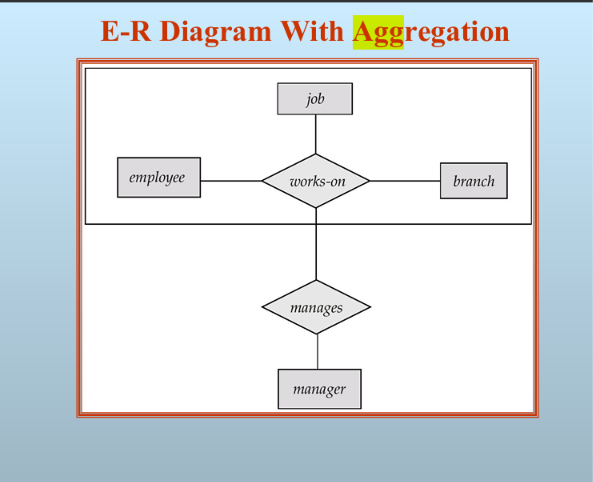 
---
> [!abstract] now the below part is all about ER diagrams and a bit of EER 
> it includes practice and examples stolen from who knows where so if you are the author then dont blame me if i didnt gave you credit instead i hope in exam u get more marks than me (i will also get more marks then u but the thing is my handwriting is the reason it will get lesser than you. )
> > [!attention] AI: "You Lazy Duck why don't you practice good handwriting"
> > its a crime far more worse than genocide for me to be able to do that

> [!tip] if u are skipping er diagram then its find just go to last page cause its important otherwise ctrl+f -> uhm i mean look below  `Chapter 2 — Final Revision Sheet `
> and go there
# 34. Designing an ER Diagram — Actual Method

When the examiner gives a story and asks you to draw an ER diagram, use this order.

## Step 1 — Find nouns

Nouns often become entities.

Example:

> A hospital stores patients, doctors, appointments and reports.

Possible entities:

```text
PATIENT
DOCTOR
APPOINTMENT
REPORT
```

---

## Step 2 — Find properties

Properties become attributes.

```text
PATIENT
Patient_ID
Name
Age
Gender
Phone
```

---

## Step 3 — Find verbs

Verbs often become relationships.

```text
PATIENT ─── books ─── APPOINTMENT
DOCTOR  ─── attends ─── APPOINTMENT
```

---

## Step 4 — Find keys

Every strong entity needs an identifying key.

Example:

```text
PATIENT
Patient_ID ← Key
```

---

## Step 5 — Determine cardinality

Ask:

```text
Can one A have many B?
Can one B have many A?
```

Then decide whether the relationship is:

```text
1:1
1:N
N:1
M:N
```

---

## Step 6 — Determine participation

Ask:

```text
Must every entity participate?
Or is it optional?
```

Then decide:

```text
Total
Partial
```

---
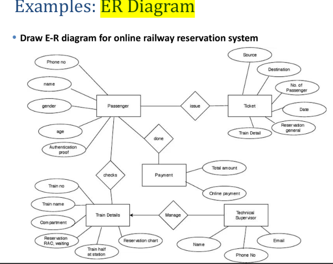 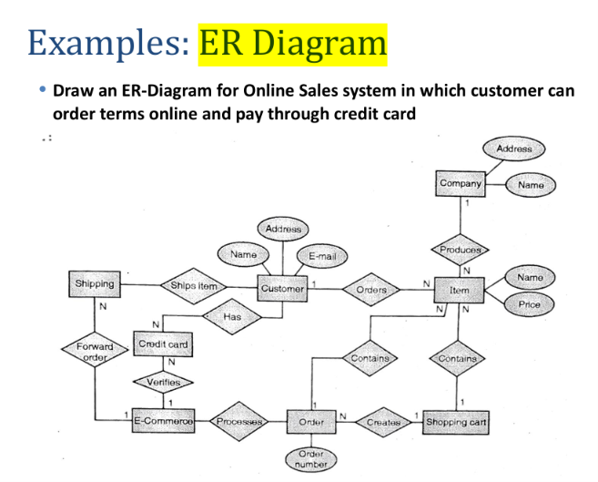 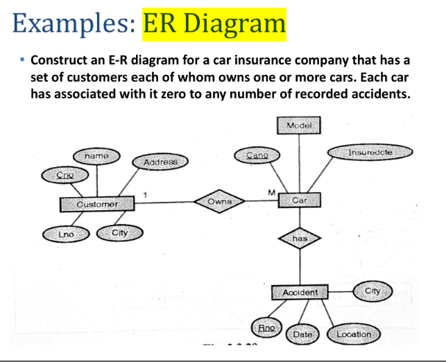 

> [!todo] PRACTICE
> 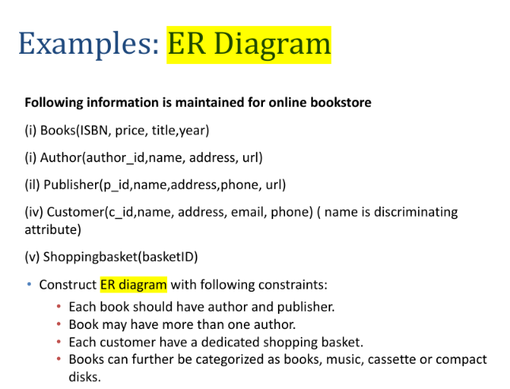
> 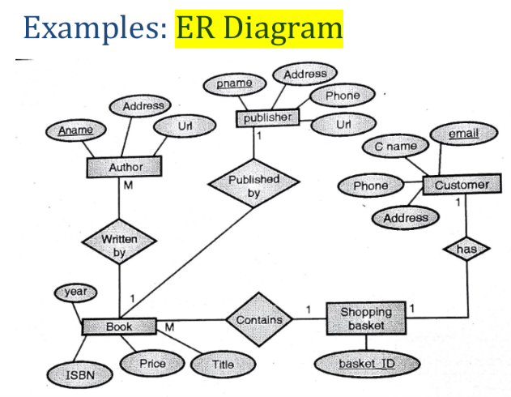 
## Step 7 — Check for EER

Ask:

- Is there a parent/subtype structure?
- Is specialization needed?
- Can subclasses overlap?
- Is specialization total or partial?
- Is a relationship itself participating in another relationship?

ER/EER models are converted into relational schemas by mapping entities, attributes, relationships, and specialization/generalization into relational tables.

**1. Strong Entity Mapping:**  
Each strong entity is converted into a separate relation. The key attribute of the entity is used as the Primary Key (PK).

**2. Weak Entity Mapping:**  
A weak entity is mapped to a separate relation using the key of its owner entity along with its partial key. This mapping is not required in the given ER/EER model as no weak entity is present.

**3. 1:1 Mapping:**  
For a one-to-one relationship, the primary key of one participating entity can be placed as a foreign key in the other relation. No 1:1 relationship is present in the given model.

**4. 1:N Mapping:**  
For a one-to-many relationship, the primary key of the entity on the 1-side is added as a foreign key to the relation on the N-side.

**5. M:N Mapping:**  
For a many-to-many relationship, a separate relation is created containing the keys of the participating entities. No M:N relationship is present in the given model.

**6. Multivalued Attribute Mapping:**  
A multivalued attribute is represented using a separate relation. No multivalued attribute is present in the given model.

**7. N-ary Relationship Mapping:**  
An N-ary relationship involving more than two entities is represented using a separate relation. No N-ary relationship is present in the given model.

**8. Generalization / Specialization Mapping:**  
For generalization/specialization, the superclass and its subclasses are represented using separate relations. The key of the superclass is used in the subclass relations.
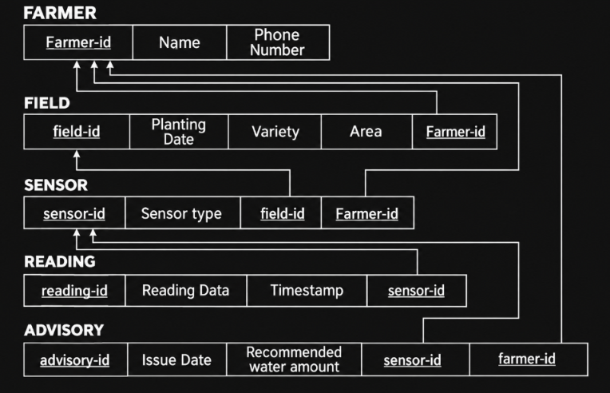 
> [!hint] AI
> ER diagram questions are not artistic competitions. Marks come from correct **entities, attributes, relationships, keys and constraints**, not from making the diagram look beautiful.

---

# 35. Worked ER / Relational Examples From the UT1 Material

These examples are useful for understanding how a real-world system can be represented through entities, attributes, keys and relationships.

---

## 35.1 Heatwave and Climate Monitoring System

The supplied material uses the following design.

### LOCATION

```text
LOCATION(
    Location_ID,
    City,
    Latitude,
    Longitude
)
```

Primary key:

```text
Location_ID
```

### CLIMATE_RECORD

```text
CLIMATE_RECORD(
    Record_ID,
    Date,
    Temperature,
    Humidity,
    Location_ID
)
```

Primary key:

```text
Record_ID
```

Foreign key:

```text
Location_ID → LOCATION(Location_ID)
```

### HEATWAVE_EVENT

```text
HEATWAVE_EVENT(
    Event_ID,
    Start_Date,
    End_Date,
    Severity,
    Record_ID
)
```

Foreign key:

```text
Record_ID → CLIMATE_RECORD(Record_ID)
```

### ALERT

```text
ALERT(
    Alert_ID,
    Message,
    Timestamp,
    Status,
    Event_ID
)
```

Foreign key:

```text
Event_ID → HEATWAVE_EVENT(Event_ID)
```

**[DIAGRAM PLACEHOLDER — Draw: LOCATION 1:N CLIMATE_RECORD, CLIMATE_RECORD 1:N HEATWAVE_EVENT, and HEATWAVE_EVENT 1:N ALERT.]**


---

## 35.2 Urine Test Strip Management System

The supplied material gives:

### PATIENT

```text
PATIENT(
    Patient_ID,
    Name,
    Age,
    Gender,
    Phone_No,
    Address
)
```

### URINE_TEST

```text
URINE_TEST(
    Test_ID,
    Test_Date,
    Time,
    Status,
    Patient_ID
)
```

### TEST_STRIP

```text
TEST_STRIP(
    Strip_ID,
    Type,
    Expiry_Date,
    Manufacturer,
    Batch_No
)
```

### STAFF

```text
STAFF(
    Staff_ID,
    Name,
    Role,
    Department,
    Phone_No
)
```

### TEST_RESULT

```text
TEST_RESULT(
    Result_ID,
    pH,
    Protein,
    Ketone,
    Bilirubin,
    Specific_Gravity,
    Staff_ID,
    Test_ID,
    Strip_ID
)
```

Foreign keys include:

```text
Staff_ID → STAFF(Staff_ID)
Test_ID  → URINE_TEST(Test_ID)
Strip_ID → TEST_STRIP(Strip_ID)
```

**[DIAGRAM PLACEHOLDER — Draw PATIENT → URINE_TEST → TEST_RESULT, with STAFF and TEST_STRIP connected to TEST_RESULT.]**

---

## 35.3 AI Model Database

The supplied material gives:

### DATASET

```text
DATASET(
    Dataset_ID,
    Name,
    Description,
    Type,
    Size
)
```

### MODEL

```text
MODEL(
    Model_ID,
    Name,
    Type,
    Version,
    Created_Date,
    Dataset_ID
)
```

### TRAINING_RUN

```text
TRAINING_RUN(
    Run_ID,
    Start_Date,
    End_Date,
    Epochs,
    Learning_Rate,
    Accuracy,
    Model_ID
)
```

### CLASS

```text
CLASS(
    Class_ID,
    Name,
    Description
)
```

### DATA_SAMPLE

```text
DATA_SAMPLE(
    Sample_ID,
    Input,
    Label,
    Created_Date,
    Size,
    Class_ID,
    Run_ID
)
```

Primary/foreign-key relationships:

```text
MODEL.Dataset_ID → DATASET.Dataset_ID
TRAINING_RUN.Model_ID → MODEL.Model_ID
DATA_SAMPLE.Class_ID → CLASS.Class_ID
DATA_SAMPLE.Run_ID → TRAINING_RUN.Run_ID
```

**[DIAGRAM PLACEHOLDER — Draw DATASET → MODEL → TRAINING_RUN, with DATA_SAMPLE connected to CLASS and TRAINING_RUN.]**
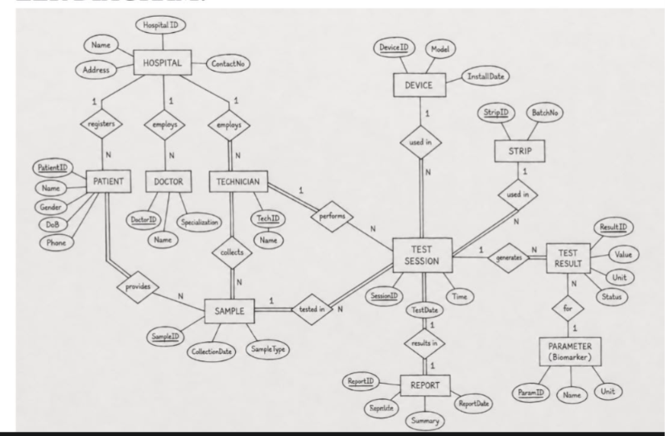 

---

## 35.4 Sugarcane Irrigation System

The supplied material lists:

```text
FARMER(
    Farmer_ID,
    Name,
    Phone,
    Address
)

FIELD(
    Field_ID,
    Location,
    Area,
    Soil_Type,
    Farmer_ID
)

CROP(
    Crop_ID,
    Crop_Name,
    Variety,
    Planting_Date,
    Field_ID
)

SENSOR(
    Sensor_ID,
    Sensor_Type,
    Installation_Date,
    Field_ID
)

SENSOR_READING(
    Reading_ID,
    Moisture_Level,
    Temperature,
    Reading_DateTime,
    Sensor_ID
)

IRRIGATION_SCHEDULE(
    Schedule_ID,
    Irrigation_Date,
    Start_Time,
    Duration,
    Field_ID
)

ALERT(
    Alert_ID,
    Alert_Type,
    Message,
    Alert_DateTime,
    Schedule_ID
)

IRRIGATION_EVENT(
    Event_ID,
    Start_Time,
    End_Time,
    Water_Used,
    Schedule_ID,
    Pump_ID
)

PUMP(
    Pump_ID,
    Pump_Name,
    Capacity,
    Status,
    WaterSource_ID
)

WATER_SOURCE(
    WaterSource_ID,
    Source_Type,
    Location,
    Available_Quantity
)
```

**[DIAGRAM PLACEHOLDER — Draw the main chain FARMER → FIELD → CROP/SENSOR/IRRIGATION_SCHEDULE, SENSOR → SENSOR_READING, SCHEDULE → IRRIGATION_EVENT → PUMP → WATER_SOURCE, and SCHEDULE → ALERT.]**
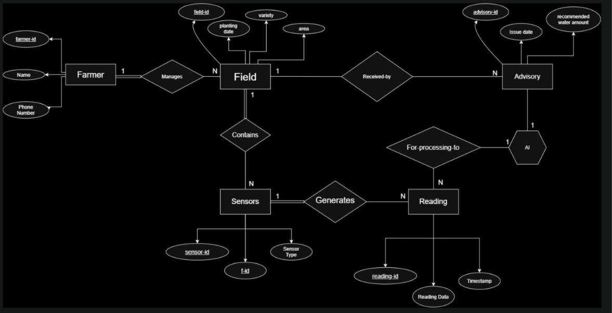 

> [!note] #context
> Do not memorize this exact farming database unless your teacher specifically gives it. Learn how the entities were identified from the story. The same method works for a different application.

---

## 35.5 Satellite Monitoring System

The material lists these entities/relations:

```text
SATELLITE(
    Satellite_ID,
    Name,
    Type,
    Launch_Date
)

IMAGE(
    Image_ID,
    Capture_Date,
    Resolution,
    File_URL,
    Satellite_ID,
    Area_ID,
    Database_ID
)

AREA(
    Area_ID,
    Name,
    Latitude,
    Longitude
)

USER(
    User_ID,
    Name,
    Email,
    Role
)

GROUND_STATION(
    Station_ID,
    Name,
    Location,
    Contact
)

DATABASE(
    Database_ID,
    Name,
    Location
)

DATA(
    Data_ID,
    Type,
    Value,
    Timestamp,
    Station_ID,
    Unit_ID
)

PROCESSING_UNIT(
    Unit_ID,
    Name,
    Algorithm,
    Status
)

EVENT(
    Event_ID,
    Event_Type,
    Description,
    Date_Time,
    Area_ID
)
```

**[DIAGRAM PLACEHOLDER — Draw the major relationships between SATELLITE, IMAGE, AREA, DATABASE, GROUND_STATION, DATA, PROCESSING_UNIT, USER and EVENT.]**
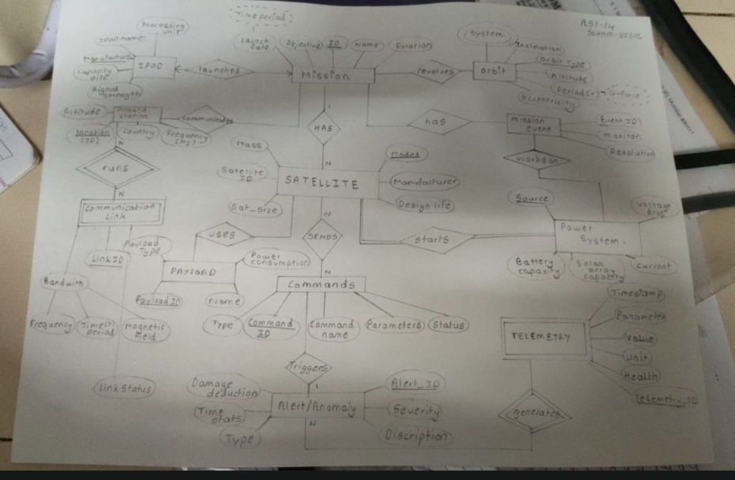 
> [!danger] if this comes then declare surrender

---

# Chapter 2 — Final Revision Sheet

## Basic ER

```text
Entity        → thing
Attribute     → property
Relationship  → association
Key           → identifier
Cardinality   → how many
Participation → must/may participate
```

---

## Attribute Types

```text
Simple          → cannot be divided
Composite       → can be divided
Single-valued   → one value
Multi-valued    → multiple values
Derived         → calculated value
```

---

## Key Types

```text
Primary     → chosen unique identifier
Candidate   → minimal possible unique identifier
Super       → any unique identifier set, even with extra attributes
Foreign     → references a key in another relation
```

---

## Cardinality

```text
1:1 → one to one
1:N → one to many
N:1 → many to one
M:N → many to many
```

---

## Participation

```text
Total   = mandatory
Partial = optional
```

---

## EER

```text
Specialization = One → Many
Generalization = Many → One
Disjoint       = one subclass at most
Overlapping    = multiple subclasses allowed
Aggregation    = relationship treated as a higher-level object
```

---

# Chapter 2 — Memory Tricks

> [!hint] ER shapes
> **Rectangle = thing**
>
> **Diamond = relationship**
>
> **Oval = detail**

> [!hint] Strong vs weak
> **Strong = has its own identity**
>
> **Weak = needs its owner**

> [!hint] Keys
> **Primary = identifies me**
>
> **Candidate = could become primary**
>
> **Super = unique + extra baggage**
>
> **Foreign = points elsewhere**

> [!hint] Cardinality
> Ask:
>
> **“How many on each side?”**

> [!hint] Participation
> **Total = must**
>
> **Partial = maybe**

> [!hint] Specialization vs Generalization
> **Specialization = split**
>
> **Generalization = combine**

> [!hint] Disjoint vs Overlap
> **Disjoint = one bucket**
>
> **Overlap = multiple buckets**

> [!hint] Role names
> Same entity twice?
>
> **Give each appearance a job title.**

> [!hint] Aggregation
> **A relationship gets promoted to thing-like status.**

---

# Chapter 2 — Diagrams You Should Be Able to Draw

Before the exam, practise these without looking:

- [x] Strong entity vs weak entity notation
- [ ] Weak entity with identifying relationship
- [ ] Simple/composite attributes
- [ ] Multivalued attribute
- [ ] Derived attribute
- [ ] 1:1 relationship
- [ ] 1:N relationship
- [ ] M:N relationship
- [ ] Total vs partial participation
- [ ] Complete ER notation sheet
- [ ] Specialization hierarchy
- [ ] Generalization hierarchy
- [ ] Disjoint specialization
- [ ] Overlapping specialization
- [ ] Total vs partial specialization
- [ ] Role names
- [ ] Aggregation
- [ ] One complete ER diagram from a real-world scenario

---

# Chapter 2 — Exam Answer Strategy

## If asked: “What is an Entity?”

Write:

> An entity is a real-world object or concept about which data is stored.

Then give 2–3 examples such as:

```text
Student
Teacher
Course
Patient
```

---

## If asked: “Explain Weak Entity”

Write:

1. Definition
2. Explain dependency on strong/owner entity
3. Give one example
4. Show partial key
5. Draw weak-entity notation

Example:

```text
EMPLOYEE
   |
   | owns
   v
DEPENDENT
```

---

## If asked: “Explain Attribute Types”

Write:

```text
Simple
Composite
Single-valued
Multi-valued
Derived
```

Give one example for each and draw the important notation where required.

---

## If asked: “Explain Cardinality”

Write:

```text
1:1
1:N
N:1
M:N
```

Give one example and explain how many entities can participate on each side.

---

## If asked: “Specialization vs Generalization”

Use this:

| Specialization | Generalization |
|---|---|
| Top-down | Bottom-up |
| One → Many | Many → One |
| Splits a higher-level entity | Combines lower-level entities |
| Example: Employee → Manager, Engineer | Example: Student + Teacher → Person |

> [!hint] One-line memory
> **Specialization splits. Generalization combines.**

---

## If asked: “Disjoint vs Overlapping”

| Disjoint | Overlapping |
|---|---|
| At most one subclass | More than one subclass allowed |
| Represented by `d` | Represented by `o` |
| One bucket | Multiple buckets |

---

## If asked to Draw an ER Diagram From a Story

Use:

```text
Nouns
  ↓
Entities

Properties
  ↓
Attributes

Verbs
  ↓
Relationships

IDs
  ↓
Keys

“How many?”
  ↓
Cardinality

“Must or optional?”
  ↓
Participation

Parent/subtype?
  ↓
EER
```

> [!hint] AI
> Do not try to memorize every example database. The examiner can change the story completely.
>
> Learn the **method**:
>
> **Nouns → Entities → Attributes → Relationships → Keys → Cardinality → Participation → EER constraints.**

---

# Chapter 2 — Ultra-Short Revision

```text
ENTITY
= real-world thing

ATTRIBUTE
= property of entity

RELATIONSHIP
= association between entities

PRIMARY KEY
= uniquely identifies

FOREIGN KEY
= points to another relation

WEAK ENTITY
= depends on owner

CARDINALITY
= how many can participate

PARTICIPATION
= must or optional

SPECIALIZATION
= split

GENERALIZATION
= combine

DISJOINT
= one subclass

OVERLAP
= multiple subclasses

AGGREGATION
= relationship treated as a higher-level object
```

> [!hint] Final memory line
> **Thing → Property → Connection → Identity → How many → Must/maybe → Split/combine.**
>
> If you can follow that chain, you can reconstruct most of Chapter 2 instead of trying to memorize the entire chapter word-for-word.
