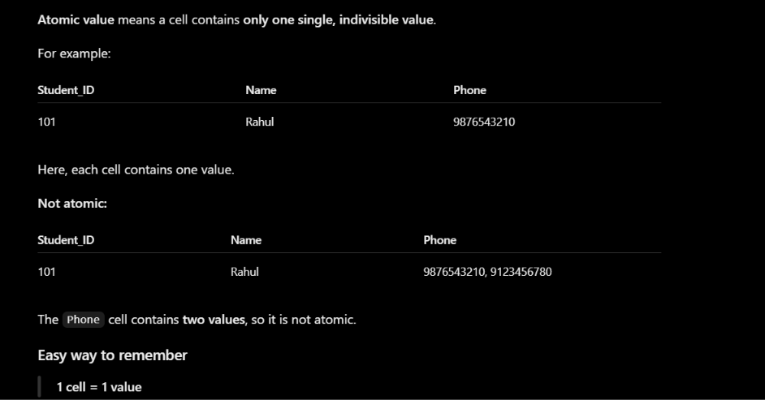

# DBMS — MODULE 3 NOTES

**Subject:** Database Management System (DBMS)  
**Module:** 3 — Relational Model, EER-to-Relational Mapping & Relational Algebra

> [!note] #context
> This module has three connected parts:
>
> **Relational Model → EER/ER to Relational Mapping → Relational Algebra**
>
> Since you already know SQL, Relational Algebra is explained by connecting every operation to the SQL idea first. The aim is to understand **what the operation does**, then learn its notation.

---

# 1. Introduction to the Relational Model

The **Relational Model** stores data in the form of **tables (relations)**.

It was proposed by **E. F. Codd** and became widely used because tables are simple to understand and powerful query languages can be built on top of them.

Example:

```text
STUDENT

+---------+-------+------+
| Roll_No | Name  | Dept |
+---------+-------+------+
| 1       | Dev   | IT   |
| 2       | Alex  | CS   |
| 3       | Sam   | IT   |
+---------+-------+------+
```

A relational database is made up of multiple tables that can be connected through common attributes.

For example:

```text
STUDENT(Stud_ID, Name, Dept_ID)
DEPARTMENT(Dept_ID, Dept_Name)
```

`Dept_ID` connects the two relations.

> [!hint] Why is it called "Relational"?
> Because data is represented as **relations (tables)** and relationships between data can be represented through common attributes/keys.

---

# 2. Three Major Components of the Relational Model

According to Codd's relational model, there are three major components.

| Component | Meaning |
|---|---|
| **Data Structure** | How data is represented using relations, attributes and domains |
| **Data Manipulation** | Operations used to retrieve, modify or derive data |
| **Data Integrity** | Rules that keep the database in a valid and consistent state |

Think:

```text
What is stored?       → Data Structure
What can I do with it? → Data Manipulation
What keeps it valid?  → Data Integrity
```

---

# 3. Characteristics of the Relational Model

The relational model has the following important characteristics:

1. Data is represented using **tables**.
2. Tables consist of **rows and columns**.
3. Each column represents an **attribute**.
4. Each row represents a **tuple/record**.
5. Every cell contains a single **atomic value**.  
6. Each attribute has a specific **domain/data type**.
7. A key is used to uniquely identify tuples.
8. Tables can be related using common attributes/keys.
9. SQL and relational algebra can be used to manipulate the data.
10. Users can be given different levels of access to data.

---

# 4. Advantages of the Relational Model

## 4.1 Ease of Use

Tables containing rows and columns are easy to understand.

For example:

```text
STUDENT

ID | Name | Branch
1  | Dev  | IT
2  | Alex | CS
```

The structure is immediately understandable.

## 4.2 Flexibility

Information from multiple tables can be combined using operations such as **joins**.

Example:

```text
STUDENT
   +
DEPARTMENT
   ↓
JOIN
   ↓
Student + Department details
```

## 4.3 Security

Different users can be given different levels of access.

Example in a college:

```text
Student
→ Can view own data

Teacher
→ Can view students they teach

Class Teacher
→ Can view students in their class

Principal
→ Can access the entire database
```

---

# 5. Data Independence in the Relational Model

**Data independence** means that changes to the database structure should not unnecessarily require changes to application programs.

Example:

If the size/data type of a database field is changed appropriately, the application should not need to be rewritten just because of that database-level change.

This idea is closely related to:

- Physical data independence
- Logical data independence

These are also part of Codd's rules and are discussed below.

---

# 6. Relational Terminology

These terms are extremely important.

## 6.1 Relation

A **relation** is a table containing rows and columns.

```text
STUDENT
```

is a relation.

## 6.2 Tuple

A **tuple** is one row of a relation.

```text
(1, Dev, IT)
```

is one tuple of the STUDENT relation.

## 6.3 Attribute

An **attribute** is a column of a relation.

```text
Roll_No
Name
Dept
```

are attributes of STUDENT.

## 6.4 Domain

A **domain** is the set of valid/allowed values for an attribute.

Example:

```text
Age → INTEGER values
Dept → IT, CS, EXTC, ...
```

The domain restricts what values can be stored.

## 6.5 Degree

The **degree** of a relation is the number of attributes/columns.

```text
STUDENT(Roll_No, Name, Dept)
```

Degree = `3`

## 6.6 Cardinality

The **cardinality** of a relation is the number of tuples/rows.

If:

```text
STUDENT
1 | Dev
2 | Alex
3 | Sam
```

then cardinality = `3`.

> [!hint] Memory trick
> **Degree = columns**
>
> **Cardinality = rows**

---

# 7. Relation Schema

A **relation schema** describes the structure of a relation.

General form:

```text
R(A1, A2, A3, ..., An)
```

Example:

```text
CUSTOMER(Cust_ID, Cust_Name, Address, Phone)
```

Here:

- `CUSTOMER` → relation name
- `Cust_ID`, `Cust_Name`, `Address`, `Phone` → attributes
- Each attribute has a domain

A **relation state** is the actual collection of tuples currently stored in that schema.

Think:

```text
Schema → design/structure
State  → current data
```

---

# 8. Properties of a Relation

A relation in the relational model follows these important properties:

1. Each relation contains one type of record.
2. Each attribute has a unique name within the relation.
3. Each row represents a tuple.
4. No two tuples are identical.
5. Each cell contains an **atomic** value.
6. Rows have no fixed ordering.
7. Columns have no fixed ordering.
8. `NULL` may represent an unknown or inapplicable value.

### Atomic value

Consider:

```text
Phone = 9876543210
```

This is one value.

A single attribute should not contain something like:

```text
9876543210, 8765432109, 7654321098
```

when the design requires atomic values. A multivalued attribute is normally represented separately.

---

# 9. Keys

Keys were introduced in the previous module, but they are important for relational schemas and mapping.

## Candidate Key

A **candidate key** is an attribute or combination of attributes that:

1. uniquely identifies every tuple, and
2. is minimal.

Example:

```text
EMPLOYEE

Employee_ID
SSN
Name
```

If both `Employee_ID` and `SSN` uniquely identify an employee, both can be candidate keys.

## Primary Key

One candidate key is selected as the **Primary Key**.

Example:

```text
Employee_ID → Primary Key
SSN         → Candidate Key
```

> **Candidate keys = possible choices**
>
> **Primary key = chosen candidate key**

---

# 10. Relational Schema Diagram

A schema diagram shows the tables and how they are related.

Example:

```text
DEPARTMENT
-----------
Dept_ID       PK
Dept_Name


        Dept_ID (from department table is connecting to employee table)
           │
           │
           ▼
EMPLOYEE
--------
Emp_ID        PK
Name
Dept_ID       FK
```

The Primary Key of one relation can appear as a Foreign Key in another relation.

> [!hint] Think of a schema diagram as the **blueprint of the database**, not the actual data.

---

# 11. Codd's Rules

E. F. Codd proposed rules describing what a relational DBMS should provide.

The PPT presents **Rule 0 through Rule 12**.

Do not try to memorize the wording exactly. Understand the idea of each rule.

---

## Rule 0 — Foundation Rule

The system must be capable of managing the database using its relational capabilities.

All the other rules are derived from this foundation.

**Simple idea:**

> A true relational DBMS must actually provide relational database capabilities.

---

## Rule 1 — Information Representation

All information in the database should be represented in the form of values in tables.

**Simple idea:**

```text
Information → Tables
```

---

## Rule 2 — Guaranteed Access / Systematic Treatment of NULL Values

The PPT emphasizes systematic treatment of `NULL`.

`NULL` can represent situations such as:

- value is unknown
- value is missing
- value is not applicable

`NULL` is **not the same as**:

```text
''
```

or a blank space, or the number `0`.

---

## Rule 3 — Guaranteed Access Rule

Every individual data value should be logically accessible using:

```text
Table name
+
Primary key
+
Attribute/column name
```

Example:

```text
STUDENT
Student_ID = 101
Attribute = Name
```

This combination should be enough to identify the required value.

---

## Rule 4 — Active Online Catalog

The database should maintain information about its own structure in an **online catalog/data dictionary**.

The catalog can contain metadata such as:

```text
Table names
Column names
Data types
Constraints
Relationships
```

Authorized users should be able to access this information using the normal query language.

> **Data about data = Metadata**

---

## Rule 5 — Comprehensive Data Sublanguage Rule

The DBMS should provide a strong relational language that supports operations such as:

- Data Definition
- Data Manipulation
- View definition
- Security
- Integrity constraints
- Transaction management

The language should be usable both interactively and inside application programs.

---

## Rule 6 — View Updating Rule

A **view** is a virtual table created from a query.

If a view is theoretically updatable, the system should allow appropriate updates to that view.

Example idea:

```text
EMPLOYEE table
      ↓
   QUERY
      ↓
  EMPLOYEE_VIEW
```

The rule deals with the ability to update such views when they are theoretically updatable.

---

## Rule 7 — High-Level Insert, Update and Delete

The DBMS should support operations that affect **multiple rows**, not just one row at a time.

Example:

```sql
UPDATE EMPLOYEE
SET Salary = Salary * 1.05;
```

One statement can update many employees.

> **High-level = operate on a set of rows**

---

## Rule 8 — Physical Data Independence

Changes to the physical storage of data should not require changes to application programs.

Example:

```text
Old storage method
      ↓
Change storage method
      ↓
Application still works
```

**Physical = how/where data is stored**

---

## Rule 9 — Logical Data Independence

Changes to the logical structure should not unnecessarily affect user applications.

Example:

```text
Before:
A single table

After:
Table split into two related tables
```

The application should ideally continue working through the appropriate abstraction.

> [!hint] Physical vs Logical
> **Physical → storage changes**
>
> **Logical → structure/schema changes**

---

## Rule 10 — Integrity Independence

Integrity constraints should be defined independently from application programs and stored as part of the database description/catalog.

Example:

```text
Salary > 0
PK cannot be NULL
FK must reference valid data
```

Changing such a constraint should not require rewriting every application.

---

## Rule 11 — Distribution Independence

If the database is distributed across multiple locations, the user should not need to know where the data is physically stored.

Example:

```text
Mumbai database server
        +
Pune database server
        +
Delhi database server
        ↓
User sees one database
```

> **Distributed behind the scenes; transparent to the user.**

---

## Rule 12 — Non-Subversion Rule

If a low-level or alternative access method is provided, it must not bypass the integrity and security rules of the relational DBMS.

In simple words:

> **No shortcut should be allowed to bypass relational controls.**

---

# 12. ER/EER Model to Relational Model

The ER/EER model is used to design the conceptual structure.

The relational model is used to represent that design using tables.

```text
ER / EER Model
      ↓
Mapping Algorithm
      ↓
Relational Tables
      ↓
PKs + FKs + Constraints
```

The PPT gives **9 mapping steps/options**:

1. Regular entity
2. Weak entity
3. Binary 1:1 relationship
4. Binary 1:N relationship
5. Binary M:N relationship
6. Multivalued attribute
7. N-ary relationship
8. Specialization / Generalization
9. Union type / Category

The first 7 are the standard ER-to-relational mapping steps. Steps 8 and 9 cover EER constructs.

---

### Step 1 — Mapping a Regular/Strong Entity

For every strong entity:

1. Create a relation.
2. Include all simple attributes.
3. Break composite attributes into their simple components.
4. Select one key attribute as the Primary Key.

Example:

```text
ER Entity:

EMPLOYEE
- SSN
- Name
- Address
```

Relational schema:

```text
EMPLOYEE(SSN, Name, Address)

PK = SSN
```

If Address is composite:

```text
Address
├── Street
├── City
└── PIN
```

store:

```text
EMPLOYEE(SSN, Name, Street, City, PIN)
```

---

### Step 2 — Mapping a Weak Entity

A weak entity depends on an owner entity.

For a weak entity:

1. Create a new relation.
2. Include its simple attributes.
3. Include the owner's Primary Key as a Foreign Key.
4. Combine the owner's key with the weak entity's partial key to form the Primary Key.

Example:

```text
EMPLOYEE
SSN
Name

DEPENDENT
Dependent_Name
Age
```

Mapping:

```text
EMPLOYEE(SSN, Name)

DEPENDENT(
    SSN,
    Dependent_Name,
    Age
)

PK = (SSN, Dependent_Name)
FK = SSN
```

Why composite PK?

Because:

```text
Dependent_Name = Rahul
```

may exist for multiple employees.

But:

```text
SSN + Dependent_Name
```

uniquely identifies the dependent.

> [!hint] Memory trick
> **Weak = Owner PK + Partial Key**

---

### Step 3 — Mapping a Binary 1:1 Relationship

For a binary 1:1 relationship, the PPT gives three possible approaches.

## Approach 1 — Foreign Key

Choose one of the two relations and place the Primary Key of the other relation as a Foreign Key.

Prefer the entity with **total participation**.

Example:

```text
PERSON
Person_ID
Name

PASSPORT
Passport_ID
Issue_Date
Person_ID
```

Here:

```text
PASSPORT.Person_ID → PERSON.Person_ID
```

---

## Approach 2 — Merged Relation

The two entities and their relationship can be merged into one relation when appropriate.

This is especially suitable when both sides have total participation.

---

## Approach 3 — Cross-Referenced Relations

Another option is to keep separate relations and maintain references according to the relationship requirements.

### Exam focus

The most important idea is:

> **1:1 → place one side's PK as FK in the other, preferably on the total-participation side.**

---

### Step 4 — Mapping a Binary 1:N Relationship

For a 1:N relationship:

> Put the Primary Key of the **1-side** into the relation representing the **N-side**.

Example:

```text
DEPARTMENT 1 ───── N EMPLOYEE
```

Schemas:

```text
DEPARTMENT(
    Dept_ID PK,
    Dept_Name
)

EMPLOYEE(
    Emp_ID PK,
    Name,
    Dept_ID FK
)
```

Why?

One department can have many employees, so each employee stores the department to which they belong.

> [!hint] Memory trick
> **1 gives its key to N.**

---

### Step 5 — Mapping a Binary M:N Relationship

An M:N relationship requires a **new relation**.

Example:

```text
STUDENT M ───── N COURSE
```

A student can take many courses, and a course can have many students.

Create:

```text
STUDENT(
    Student_ID PK,
    Name
)

COURSE(
    Course_ID PK,
    Course_Name
)

ENROLLMENT(
    Student_ID FK,
    Course_ID FK,
    Grade
)

PK = (Student_ID, Course_ID)
```

The new relation contains:

- PK of first entity
- PK of second entity
- any attributes of the relationship

> [!hint] Memory trick
> **M:N → Make a New relation.**

---

### Step 6 — Mapping a Multivalued Attribute

A multivalued attribute can contain multiple values for one entity.

Example:

```text
EMPLOYEE
SSN = 101
Phone = 9876
Phone = 8765
```

Instead of storing multiple values in one field, create a separate relation.

```text
EMPLOYEE(
    SSN,
    Name
)

EMPLOYEE_PHONE(
    SSN,
    Phone
)

PK = (SSN, Phone)
FK = SSN
```

The Primary Key is the combination of:

```text
Owner PK + Multivalued attribute
```

---

### Step 7 — Mapping an N-ary Relationship

An N-ary relationship involves more than two entity types.

For example:

```text
SUPPLIER
   \
    \
     SUPPLY
    /     \
 PART      PROJECT
```

Create a new relation containing the Primary Keys of all participating entities.

Example:

```text
SUPPLY(
    Supplier_ID,
    Part_No,
    Project_ID,
    Quantity
)

PK = (Supplier_ID, Part_No, Project_ID)
```

Any simple relationship attributes such as `Quantity` are also included.

---

### Step 8 — Mapping Specialization / Generalization

The PPT gives four options.

Suppose:

```text
           EMPLOYEE
          /        \
      ENGINEER    MANAGER
```

Superclass:

```text
EMPLOYEE
```

Subclasses:

```text
ENGINEER
MANAGER
```

---

### Option 8A — Superclass + Subclass Relations

Create one relation for the superclass and one for each subclass.

Example:

```text
EMPLOYEE(Emp_ID, Name)

ENGINEER(Emp_ID, Engineering_Field)

MANAGER(Emp_ID, Management_Level)
```

The subclass key is also the superclass key and acts as a Foreign Key.

This option works for:

- Total or partial specialization
- Disjoint or overlapping specialization

---

### Option 8B — Subclass Relations Only

Create relations for the subclasses containing:

- inherited superclass attributes
- subclass-specific attributes

Example:

```text
ENGINEER(
    Emp_ID,
    Name,
    Engineering_Field
)

MANAGER(
    Emp_ID,
    Name,
    Management_Level
)
```

This works when specialization is **total**, because every superclass entity belongs to at least one subclass.

It is especially suitable for **disjoint** specialization.

---

### Option 8C — Single Relation + One Type Attribute

Create one relation containing:

- superclass attributes
- all subclass attributes
- one type/discriminator attribute

Example:

```text
EMPLOYEE(
    Emp_ID,
    Name,
    Engineering_Field,
    Management_Level,
    Employee_Type
)
```

`Employee_Type` tells which subclass the employee belongs to.

This is recommended when subclasses are **disjoint**.

Potential problem:

> Subclass-specific columns can contain many `NULL` values.

---

### Option 8D — Single Relation + Multiple Type Attributes

Create one relation containing:

- superclass attributes
- subclass attributes
- one Boolean/type attribute for each subclass

Example:

```text
EMPLOYEE(
    Emp_ID,
    Name,
    Engineering_Field,
    Management_Level,
    IsEngineer,
    IsManager
)
```

For an overlapping specialization:

```text
IsEngineer = TRUE
IsManager  = TRUE
```

is possible.

Therefore this option is recommended for **overlapping** specialization.

---

### Specialization Mapping — Quick Comparison

| Option | Main idea | Best suited for |
|---|---|---|
| **8A** | Superclass + subclass tables | Any specialization |
| **8B** | Only subclass tables | Total specialization |
| **8C** | One table + one type field | Disjoint specialization |
| **8D** | One table + multiple Boolean type fields | Overlapping specialization |

> [!hint] Memory
> **8C = one Type**
>
> **8D = multiple Type flags**

---

### Step 9 — Mapping Union Types / Categories

A **category (union type)** is a subclass whose members can come from different superclasses.

Example:

```text
PERSON
BANK
COMPANY
   \ | /
    OWNER
```

A vehicle owner could be:

- a Person
- a Bank
- a Company

The problem is that these superclasses may have **different Primary Keys**.

The PPT uses a **surrogate key** for the category.

Example:

```text
OWNER(
    OwnerId,
    ...
)

PK = OwnerId
```

`OwnerId` acts as the common key for the category.

> **Category = UNION of possible superclasses**


#  ER-to-Relational Mapping — Final Cheat Sheet

```text
Strong Entity
→ Create table + PK

Weak Entity
→ Owner PK + Partial Key

1:1
→ PK of one side becomes FK of the other

1:N
→ 1-side PK goes to N-side

M:N
→ Create new relation

Multivalued Attribute
→ Create new relation

N-ary Relationship
→ Create new relation containing all participating PKs

Specialization / Generalization
→ Use one of Options 8A–8D

Category / Union
→ Use category relation, commonly with surrogate key
```

---

# 24. Data Manipulation in the Relational Model

Data manipulation means retrieving, deriving or modifying information stored in relations.

The relational model supports formal query languages.

Two formal languages discussed in the PPT are:

```text
Relational Algebra
Relational Calculus
```

---

# 25. Relational Algebra

**Relational Algebra** is a formal query language used to query and manipulate data stored in relational databases.

It is a **procedural language**.

That means:

> It describes **how to obtain the required result** by specifying the sequence of operations.

Example:

```text
First filter employees
        ↓
Then join with another table
        ↓
Then select required columns
```

The result of every relational algebra operation is itself a **relation**, so another operation can be applied to it.

---

# 26. Relational Calculus

Relational Calculus is also a formal query language, but it is **declarative/non-procedural**.

It describes:

> **What data is required**, rather than the exact sequence of operations.

It has two forms:

1. **Tuple Relational Calculus (TRC)**
2. **Domain Relational Calculus (DRC)**

### Relational Algebra vs Relational Calculus

| Relational Algebra | Relational Calculus |
|---|---|
| Procedural | Declarative |
| Describes how | Describes what |
| Operation order matters | Operation order is not specified |
| Closer to programming style | Closer to logical/natural language |

> [!hint] Memory
> **Algebra = HOW**
>
> **Calculus = WHAT**

---

# 27. Relational Algebra Operations

The PPT groups the operations as follows.

## Unary Operations

Operate on one relation:

```text
Selection     σ
Projection    π
Rename        ρ
```

## Set-Theory Operations

```text
Union         ∪
Intersection  ∩
Difference    −
Cartesian     ×
```

## Binary Relational Operations

```text
Join
Division
```

## Additional Operations

```text
Outer Joins
Outer Union
Aggregate Functions
```

The PPT specifically discusses:

```text
SUM
COUNT
AVG
MIN
MAX
```

---

# 28. Relational Algebra — Symbol Cheat Sheet
| Operation | Symbol | Simple meaning |
|---|---:|---|
| Selection | $\sigma$ | Filter rows |
| Projection | $\pi$ | Select columns |
| Rename | $\rho$ | Rename relation/attributes |
| Union | $\cup$ | Combine either relation |
| Intersection | $\cap$ | Common tuples |
| Difference | $-$ | First but not second |
| Cartesian Product | $\times$ | Every possible combination |
| Join | $\bowtie$ | Combine related tuples |
| Division | $\div$ | Associated with **every** required tuple |
| Left Outer Join | ⟕ | Keep all left tuples |
| Right Outer Join | ⟖ | Keep all right tuples |
| Full Outer Join | ⟗ | Keep all tuples from both |

# 29. Selection — $\sigma$

Selection filters **rows** according to a condition.

It is similar to the SQL `WHERE` clause.

### Example relation

```text
STUDENT

ID | Name | CGPA
---|------|-----
1  | A    | 8.5
2  | B    | 9.6
3  | C    | 9.2
4  | D    | 8.9
5  | E    | 6.5
```

Question:

> Find students whose CGPA is greater than 9.

### SQL

```sql
SELECT *
FROM STUDENT
WHERE CGPA > 9;
```

### Relational Algebra

```text
σ CGPA > 9 (STUDENT)
```

Result:

```text
2 | B | 9.6
3 | C | 9.2
```

Only rows changed.

> [!hint] Memory trick
> **Selection = SELECT rows that satisfy a condition**
>
> $\sigma$ = rows**

---

# 30. Selection with Multiple Conditions

Example:

> Find students whose CGPA is greater than 9 and whose name is C.

```text
σ CGPA > 9 AND Name = 'C' (STUDENT)
```

Common logical operators:

```text
AND → ∧
OR  → ∨
NOT → ¬
```

### Multiple Selection Operations

The PPT notes that selection operations can be applied in a cascade.

Conceptually:

```text
σ condition1 ( σ condition2 (R) )
```

is equivalent to applying both conditions together:

```text
σ condition1 AND condition2 (R)
```

---

# 31. Projection — $\pi$

Projection selects **columns** from a relation.

It is similar to choosing columns in SQL `SELECT`.

Using:

```text
STUDENT

ID | Name | CGPA
1  | A    | 8.5
2  | B    | 9.6
3  | C    | 9.2
4  | D    | 8.9
5  | E    | 6.5
```

Question:

> List all student names.

### SQL

```sql
SELECT Name
FROM STUDENT;
```

### Relational Algebra

```text
π Name (STUDENT)
```

Result:

```text
A
B
C
D
E
```

Projection can remove duplicate tuples.

Example:

```text
EMPLOYEE

Name | Dept
Dev  | IT
Sam  | IT
Alex | HR
```

```text
π Dept (EMPLOYEE)
```

Result:

```text
IT
HR
```

`IT` appears only once.

> [!hint] Memory trick
> **Projection = columns**
>
> $\pi$ = columns

---

# 32. Selection vs Projection

This distinction is extremely important.

| Selection | Projection |
|---|---|
| Filters rows | Selects columns |
| Uses a condition | Uses an attribute list |
| SQL `WHERE` | SQL `SELECT column` |
| $\sigma$ | $\pi$ |
| Horizontal filtering | Vertical selection |

Example:

```text
σ CGPA > 9 (STUDENT)
```

→ fewer **rows**

```text
π Name, CGPA (STUDENT)
```

→ fewer **columns**

---

# 33. Selection + Projection

Most practical queries use both.

Question:

> Find the names of students whose CGPA is greater than 9.

### SQL

```sql
SELECT Name
FROM STUDENT
WHERE CGPA > 9;
```

### Relational Algebra

```text
π Name (
    σ CGPA > 9 (STUDENT)
)
```

Read from inside to outside:

```text
STUDENT
   ↓
filter CGPA > 9
   ↓
keep Name
   ↓
answer
```

> [!hint] Query pattern
> **WHERE → Selection**
>
> **Required columns → Projection**

---

# 34. Rename — $\rho$

Rename changes:

- relation name
- attribute names
- or both

It is useful when a query needs multiple references to a relation.

### Rename relation

```text
ρ S (STUDENT)
```

`STUDENT` is now referred to as `S`.

### Rename attributes

```text
ρ (Student_ID, Student_Name, CGPA) (STUDENT)
```

### Rename both

```text
ρ S(Student_ID, Student_Name, CGPA) (STUDENT)
```

### SQL connection

The closest SQL idea is an alias:

```sql
FROM STUDENT AS S
```

> [!hint] Memory
> **ρ = Rename = SQL AS**

Rename is especially important in self-joins and queries where the same relation appears more than once.

---

# 35. Relational Algebra Expressions

Several operations can be combined.

There are two ways:

## Method 1 — Nested expression

```text
π Name, Salary (
    σ Dept = 'IT' (EMPLOYEE)
)
```

## Method 2 — Intermediate relations

```text
IT_EMPLOYEES ← σ Dept = 'IT' (EMPLOYEE)

RESULT ← π Name, Salary (IT_EMPLOYEES)
```

The second form is useful when explaining the steps of a query.

---

# 36. Union — $\cup$

Union combines tuples that occur in either relation or both.

```text
R ∪ S
```

means:

```text
R OR S
```

### Example

```text
IT_STUDENTS

ID
--
1
2
3
```

```text
SPORTS_STUDENTS

ID
--
2
3
4
```

Then:

```text
IT_STUDENTS ∪ SPORTS_STUDENTS
```

gives:

```text
1
2
3
4
```

Duplicate `2` and `3` are removed.

### SQL

```sql
SELECT ID FROM IT_STUDENTS
UNION
SELECT ID FROM SPORTS_STUDENTS;
```

---

# 37. Union Compatibility

For `R ∪ S` to be valid, the two relations must be **type compatible**.

They must have:

1. The same number of attributes.
2. Corresponding attributes with compatible domains.

Example:

```text
R(Student_ID, Name)
S(Student_ID, Name)
```

is compatible.

But:

```text
R(Student_ID, Name)
S(Student_ID, Name, Age)
```

is not compatible because the number of attributes differs.

> [!warning] Exam point
> The same idea applies to **Union, Intersection and Difference**.

---

# 38. Intersection — $\cap$

Intersection returns tuples that exist in **both** relations.

```text
R ∩ S
```

means:

```text
R AND S
```

Example:

```text
ACCOUNT

ID
--
1
2
3
4
```

```text
LOAN

ID
--
3
5
```

Then:

```text
ACCOUNT ∩ LOAN
```

gives:

```text
3
```

### SQL

```sql
SELECT ID FROM ACCOUNT
INTERSECT
SELECT ID FROM LOAN;
```

---

# 39. Difference — $-$

Difference returns tuples that are present in the **first relation but not the second**.

```text
R − S
```

means:

```text
R but NOT S
```

Example:

```text
ACCOUNT

ID
--
1
2
3
4
```

```text
LOAN

ID
--
3
4
```

Then:

```text
ACCOUNT − LOAN
```

gives:

```text
1
2
```

### Important

Difference is **not commutative**.

```text
R − S ≠ S − R
```

---

# 40. Union vs Intersection vs Difference

| Operation | Meaning | Memory |
|---|---|---|
| $R \\cup S$ | In R or S or both | **Either** |
| $R \\cap S$ | In both R and S | **Both** |
| $R - S$ | In R but not S | **First only** |

---

# 41. Cartesian Product — $\times$

Cartesian Product combines **every tuple of one relation with every tuple of the other relation**.

It is the same basic idea as SQL `CROSS JOIN`.

Example:

```text
STUDENT

ID | Name
1  | Dev
2  | Alex
```

```text
COURSE

ID | Course
10 | DBMS
20 | DSA
30 | COA
```

Every student is paired with every course:

```text
Dev  | DBMS
Dev  | DSA
Dev  | COA
Alex | DBMS
Alex | DSA
Alex | COA
```

Number of tuples:

```text
2 × 3 = 6
```

### SQL

```sql
SELECT *
FROM STUDENT
CROSS JOIN COURSE;
```

### Relational Algebra

```text
STUDENT × COURSE
```

The two relations do **not** need to be union-compatible.

If:

```text
R has n rows
S has m rows
```

then:

```text
R × S has n × m rows
```

and if R has `n` attributes and S has `m` attributes, the result has:

```text
n + m attributes
```

> [!hint] Memory trick
> **Cartesian = Everybody meets everybody**

---

# 42. Why Cartesian Product Alone Is Usually Not Useful

A Cartesian Product creates every possible combination, including unrelated ones.

For example:

```text
EMPLOYEE × DEPENDENT
```

could pair an employee with someone else's dependent.

To make it meaningful, apply a condition.

```text
EMPLOYEE × DEPENDENT
        ↓
σ Employee.SSN = Dependent.ESSN
        ↓
Only actual employee-dependent pairs
```

This idea leads directly to **Join**.

---

# 43. Join — $\bowtie$

A Join combines related tuples from two relations using a join condition.

Conceptually:

```text
Cartesian Product
        ↓
Selection using join condition
        ↓
Join
```

Formally:

```text
R ⋈condition S
=
σcondition (R × S)
```

Example:

```text
EMPLOYEE

Emp_ID | Name | Dept_ID
1      | Dev  | 10
2      | Alex | 20
3      | Sam  | 10
```

```text
DEPARTMENT

Dept_ID | Dept_Name
10      | IT
20      | HR
```

Join using:

```text
EMPLOYEE.Dept_ID = DEPARTMENT.Dept_ID
```

Result:

```text
Dev  | 10 | IT
Alex | 20 | HR
Sam  | 10 | IT
```

Only related combinations remain.

---

# 44. Theta Join

A **Theta Join** is a Join where the condition can be a general Boolean comparison.

The condition can use:

```text
=
<
>
<=
>=
<>
AND
OR
```

Example:

```text
EMPLOYEE ⋈ Employee.Salary > Department.MinimumSalary DEPARTMENT
```

The important point:

> **Theta Join is the general form of Join.**

If the condition is:

```text
Salary > MinimumSalary
```

it is a Theta Join.

If the condition is:

```text
Dept_ID = Dept_ID
```

it is an Equi Join.

---

# 45. Equi Join

An **Equi Join** is a special case of Theta Join where the condition uses only equality `=`.

Example:

```text
EMPLOYEE

Emp_ID | Name | Dept_ID
1      | Dev  | 10
2      | Alex | 20
```

```text
DEPARTMENT

Dept_ID | Dept_Name
10      | IT
20      | HR
```

### SQL

```sql
SELECT E.Name, D.Dept_Name
FROM EMPLOYEE E
JOIN DEPARTMENT D
ON E.Dept_ID = D.Dept_ID;
```

### Relational Algebra

```text
EMPLOYEE ⋈ E.Dept_ID = D.Dept_ID DEPARTMENT
```

> [!hint] Memory
> **Equi = Equal = `=`**

---

# 46. Natural Join

A **Natural Join** automatically joins relations using corresponding common attributes with the **same name**.

Example:

```text
EMPLOYEE

Emp_ID | Dept_ID | Name
1      | 10      | Dev
2      | 20      | Alex
```

```text
DEPARTMENT

Dept_ID | Dept_Name
10      | IT
20      | HR
```

Both relations contain:

```text
Dept_ID
```

So:

```text
EMPLOYEE ⋈ DEPARTMENT
```

automatically matches:

```text
EMPLOYEE.Dept_ID = DEPARTMENT.Dept_ID
```

and the common attribute is not unnecessarily duplicated in the result.

### Important

If the attributes are named differently:

```text
EMPLOYEE.Dept_ID
DEPARTMENT.Department_ID
```

Natural Join cannot automatically identify them as the same join attribute.

Rename may be required first.

---

# 47. Theta vs Equi vs Natural Join

| Join | Condition |
|---|---|
| **Theta Join** | General comparison/Boolean condition |
| **Equi Join** | Equality `=` only |
| **Natural Join** | Same-name common attributes automatically matched |

Think:

```text
Theta
  ↓
General condition

Equi
  ↓
Only =

Natural
  ↓
Same-name common attributes
```

---

# 48. Inner Join vs Outer Join

An **Inner Join** keeps only tuples that have a matching tuple in the other relation.

An **Outer Join** can preserve unmatched tuples.

Example:

```text
EMPLOYEE

Emp_ID | Dept_ID
1      | 10
2      | 20
3      | 30
```

```text
DEPARTMENT

Dept_ID | Dept_Name
10      | IT
20      | HR
```

Employee 3 has no matching department.

An inner join removes employee 3.

An outer join can keep employee 3 and fill missing department values with `NULL`.

---

# 49. Left Outer Join

A **Left Outer Join** keeps **every tuple from the left relation**.

```text
R ⟕ S
```

If a left tuple has no match in S, the attributes from S are filled with `NULL`.

Using the previous example:

```text
EMPLOYEE LEFT JOIN DEPARTMENT
```

Result conceptually:

```text
Emp_ID | Dept_ID | Dept_Name
1      | 10      | IT
2      | 20      | HR
3      | 30      | NULL
```

### SQL

```sql
SELECT E.Emp_ID, E.Dept_ID, D.Dept_Name
FROM EMPLOYEE E
LEFT JOIN DEPARTMENT D
ON E.Dept_ID = D.Dept_ID;
```

> **LEFT = keep everything on the left**

---

# 50. Right Outer Join

A **Right Outer Join** keeps **every tuple from the right relation**.

```text
R ⟖ S
```

Suppose:

```text
DEPARTMENT

Dept_ID | Dept_Name
10      | IT
20      | HR
30      | Finance
```

and no employee belongs to department 30.

The Right Outer Join still keeps:

```text
30 | Finance
```

with employee-side values as `NULL`.

### SQL

```sql
SELECT E.Emp_ID, E.Dept_ID, D.Dept_Name
FROM EMPLOYEE E
RIGHT JOIN DEPARTMENT D
ON E.Dept_ID = D.Dept_ID;
```

> **RIGHT = keep everything on the right**

---

# 51. Full Outer Join

A **Full Outer Join** keeps unmatched tuples from **both** relations.

```text
R ⟗ S
```

Result contains:

```text
matching rows
+
unmatched rows from R
+
unmatched rows from S
```

Missing values are represented using `NULL`.

### SQL

```sql
SELECT *
FROM EMPLOYEE E
FULL OUTER JOIN DEPARTMENT D
ON E.Dept_ID = D.Dept_ID;
```

> **FULL = lose nothing from either side**

---

# 52. Outer Join Summary

| Join | Keeps |
|---|---|
| Inner Join | Only matching tuples |
| Left Outer Join | All left + matching right |
| Right Outer Join | Matching left + all right |
| Full Outer Join | All left + all right |

### Choosing the correct one

Ask:

> **Which rows must not disappear?**

```text
Left rows must stay  → LEFT OUTER JOIN
Right rows must stay → RIGHT OUTER JOIN
Both must stay       → FULL OUTER JOIN
Only matches needed  → INNER JOIN
```

---

# 53. Division — $\div$

Division is used for questions involving:

```text
ALL
EVERY
EACH required item
```

The formal condition from the PPT is:

If:

```text
R(A1, A2, ..., An)
S(B1, B2, ..., Bm)
```

and the attributes of S are a proper subset of the attributes of R, then:

```text
R ÷ S
```

returns the attributes of R that are **not present in S**.

More importantly, the result contains those tuples from R that are associated with **every tuple in S**.

---

# 54. Division Example

Suppose:

```text
ENROLL

Student | Course
------- | ------
101     | DBMS
101     | DSA
102     | DBMS
103     | DBMS
103     | DSA
```

Required courses:

```text
REQUIRED

Course
------
DBMS
DSA
```

Question:

> Find students who completed **ALL required courses**.

Check:

```text
101 → DBMS + DSA → YES
102 → DBMS only   → NO
103 → DBMS + DSA → YES
```

Therefore:

```text
ENROLL ÷ REQUIRED
```

gives:

```text
101
103
```

> [!hint] Memory trick
> **ALL / EVERY → Division**

---

# 55. Complete Set of Relational Algebra Operations

The PPT identifies the following as a **complete set**:

```text
Selection       σ
Projection      π
Union           ∪
Difference      −
Rename          ρ
Cartesian       ×
```

Other operations can be expressed using combinations of these.

### Intersection

```text
R ∩ S
=
(R ∪ S) − ((R − S) ∪ (S − R))
```

### Join

```text
R ⋈condition S
=
σcondition (R × S)
```

This is important because it shows that a Join can be constructed using:

```text
Cartesian Product + Selection
```

---

# 56. Aggregate Functions

Aggregate functions produce **summary information** from multiple tuples.

The PPT lists:

```text
SUM
COUNT
AVG
MIN
MAX
```

Suppose:

```text
EMPLOYEE

Emp_ID | Dept | Salary
1      | IT   | 60000
2      | IT   | 70000
3      | HR   | 40000
```

## COUNT

Counts tuples.

```sql
SELECT COUNT(*)
FROM EMPLOYEE;
```

Concept:

```text
COUNT(EMPLOYEE)
```

Result:

```text
3
```

## SUM

Adds values.

```sql
SELECT SUM(Salary)
FROM EMPLOYEE;
```

Result:

```text
170000
```

## AVG

Calculates average.

```sql
SELECT AVG(Salary)
FROM EMPLOYEE;
```

Result:

```text
56666.67
```

approximately.

## MIN

Returns the smallest value.

```sql
SELECT MIN(Salary)
FROM EMPLOYEE;
```

Result:

```text
40000
```

## MAX

Returns the largest value.

```sql
SELECT MAX(Salary)
FROM EMPLOYEE;
```

Result:

```text
70000
```

> [!note] Notation
> The PPT presents aggregate functions as an additional relational algebra operation. Exact notation can vary between textbooks, so use the notation shown by your teacher if a specific notation is expected in the exam.

---

# 57. Grouping with Aggregates

Aggregation becomes more useful when values are grouped.

Example:

```text
EMPLOYEE

Emp_ID | Dept | Salary
1      | IT   | 60000
2      | IT   | 70000
3      | HR   | 40000
```

Question:

> Find the average salary of each department.

### SQL

```sql
SELECT Dept, AVG(Salary)
FROM EMPLOYEE
GROUP BY Dept;
```

Conceptually:

```text
Group by Dept
      ↓
Calculate AVG(Salary)
      ↓
Return one result for each department
```

Result:

```text
IT → 65000
HR → 40000
```

---

# 58. Distinct Values

Relational Algebra treats relations as sets, so duplicate tuples are removed.

Example:

```text
EMPLOYEE

Dept
----
IT
IT
HR
```

Projection:

```text
π Dept (EMPLOYEE)
```

produces:

```text
IT
HR
```

In SQL, the equivalent explicit operation is:

```sql
SELECT DISTINCT Dept
FROM EMPLOYEE;
```

---

# 59. Query Solving Method

For relational algebra questions, **do not start by writing symbols**.

First understand the English question.

Use this process:

```text
Question
   ↓
Which tables are needed?
   ↓
Do I need to combine tables?
   ↓
Is there a condition?
   ↓
Which columns are required?
   ↓
Is it asking for BOTH?
   ↓
Is it asking for ALL?
   ↓
Write the RA expression
```
| Question says | Think |
|---|---|
| `where`, `whose`, `greater than` | Selection $\sigma$ |
| `find only names/IDs` | Projection $\pi$ |
| `rename`, `alias` | Rename $\rho$ |
| `either` | Union $\cup$ |
| `both` | Intersection $\cap$ |
| `in first but not second` | Difference $-$ |
| `every possible combination` | Cartesian Product $\times$ |
| `match related rows` | Join $\bowtie$ |
| `general comparison condition` | Theta Join $\bowtie_{\theta}$ |
| `=` join condition | Equi Join $\bowtie_{condition}$ |
| `same-name common attributes` | Natural Join $\bowtie$ |
| `keep all left rows` | Left Outer Join ⟕ |
| `keep all right rows` | Right Outer Join ⟖ |
| `keep all rows from both` | Full Outer Join ⟗ |
| `all`, `every` | Division $\div$ |
| `count`, `sum`, `average`, etc. | Aggregate Functions |

---
> [!attention] Practice below part or this entire chapter is waste

# Relational Algebra — Quick Review + Practice

## Quick Comparison

| Operation | Symbol | Main idea | SQL idea |
|---|---:|---|---|
| Selection | $\sigma$ | Filter rows | `WHERE` |
| Projection | $\pi$ | Select columns | `SELECT` |
| Rename | $\rho$ | Rename relation/attributes | `AS` |
| Union | $\cup$ | Combine compatible relations | `UNION` |
| Intersection | $\cap$ | Common tuples | `INTERSECT` |
| Difference | $-$ | First relation, not second | `EXCEPT` |
| Cartesian Product | $\times$ | Every possible pair | `CROSS JOIN` |
| Theta Join | $\bowtie_{\theta}$ | Join using any condition | `JOIN ... ON condition` |
| Equi Join | $\bowtie_{=}$ | Join using `=` | `JOIN ... ON A = B` |
| Natural Join | $\bowtie$ | Match same-name common attributes | `NATURAL JOIN` |
| Left Outer Join | ⟕ | Keep all left tuples | `LEFT JOIN` |
| Right Outer Join | ⟖ | Keep all right tuples | `RIGHT JOIN` |
| Full Outer Join | ⟗ | Keep all tuples from both | `FULL OUTER JOIN` |
| Division | $\div$ | Match **every** required tuple | `ALL / EVERY` logic |
| Aggregate | — | Summary values | `COUNT`, `SUM`, `AVG`, `MIN`, `MAX` |

> [!hint]
> **σ = rows, π = columns, ρ = rename, ∪ = either, ∩ = both, − = first not second, × = combinations, ⋈ = join, ÷ = every.**

---

# Practice — Relational Algebra

The goal of every question is to write the **SQL query first**, then convert the same query into **Relational Algebra**.

## Sample Data

Use these small relations for most questions.

### STUDENT

| Ssn | Name | Dept |
|---|---|---|
| S1 | Amit | IT |
| S2 | Ravi | CS |
| S3 | Neha | IT |
| S4 | Priya | EXTC |

### COURSE

| Course_id | Course_Name | Dept |
|---|---|---|
| C1 | DBMS | IT |
| C2 | DSA | CS |
| C3 | COA | IT |

### ENROLL

| Ssn | Course_id | Grade |
|---|---|---|
| S1 | C1 | A |
| S1 | C3 | B |
| S2 | C2 | A |
| S3 | C1 | A |

### EMPLOYEE

| Emp_ID | Name | Dept_ID | Salary |
|---|---|---|---:|
| E1 | Amit | D1 | 50000 |
| E2 | Ravi | D2 | 60000 |
| E3 | Neha | D1 | 70000 |

### DEPARTMENT

| Dept_ID | Dept_Name |
|---|---|
| D1 | IT |
| D2 | HR |

### PART

| Part_ID | Part_Name | Color |
|---|---|---|
| P1 | Bolt | Red |
| P2 | Nut | Green |
| P3 | Screw | Yellow |

### DEALER

| Dealer_ID | Dealer_Name |
|---|---|
| D1 | ABC |
| D2 | XYZ |

### SUPPLIES

| Dealer_ID | Part_ID |
|---|---|
| D1 | P1 |
| D1 | P2 |
| D1 | P3 |
| D2 | P1 |
| D2 | P2 |

---

# 1. Selection $\sigma$

### Q1
**Problem:** Find students from the IT department.

**SQL**
```sql
SELECT *
FROM STUDENT
WHERE Dept = 'IT';
```

**Relational Algebra**
```text
σ Dept = 'IT' (STUDENT)
```

### Q2
**Problem:** Find students from the CS department.

**SQL**
```sql
SELECT *
FROM STUDENT
WHERE Dept = 'CS';
```

**Relational Algebra**
```text
σ Dept = 'CS' (STUDENT)
```

### Q3
**Problem:** Find employees earning more than 60000.

**SQL**
```sql
SELECT *
FROM EMPLOYEE
WHERE Salary > 60000;
```

**Relational Algebra**
```text
σ Salary > 60000 (EMPLOYEE)
```

### Q4
**Problem:** Find employees earning exactly 50000.

**SQL**
```sql
SELECT *
FROM EMPLOYEE
WHERE Salary = 50000;
```

**Relational Algebra**
```text
σ Salary = 50000 (EMPLOYEE)
```

---

# 2. Projection $\pi$

### Q1
**Problem:** Display only student names.

**SQL**
```sql
SELECT Name
FROM STUDENT;
```

**Relational Algebra**
```text
π Name (STUDENT)
```

### Q2
**Problem:** Display student names and departments.

**SQL**
```sql
SELECT Name, Dept
FROM STUDENT;
```

**Relational Algebra**
```text
π Name, Dept (STUDENT)
```

### Q3
**Problem:** Display employee names.

**SQL**
```sql
SELECT Name
FROM EMPLOYEE;
```

**Relational Algebra**
```text
π Name (EMPLOYEE)
```

### Q4
**Problem:** Display course names and departments.

**SQL**
```sql
SELECT Course_Name, Dept
FROM COURSE;
```

**Relational Algebra**
```text
π Course_Name, Dept (COURSE)
```

---

# 3. Rename $\rho$

### Q1
**Problem:** Rename `STUDENT` as `S`.

**SQL**
```sql
SELECT *
FROM STUDENT AS S;
```

**Relational Algebra**
```text
ρ S (STUDENT)
```

### Q2
**Problem:** Rename `EMPLOYEE` as `E`.

**SQL**
```sql
SELECT *
FROM EMPLOYEE AS E;
```

**Relational Algebra**
```text
ρ E (EMPLOYEE)
```

### Q3
**Problem:** Rename `Name` as `Student_Name`.

**SQL**
```sql
SELECT Name AS Student_Name
FROM STUDENT;
```

**Relational Algebra**
```text
ρ Student_Name / Name (STUDENT)
```

### Q4
**Problem:** Rename `Course_Name` as `Subject`.

**SQL**
```sql
SELECT Course_Name AS Subject
FROM COURSE;
```

**Relational Algebra**
```text
ρ Subject / Course_Name (COURSE)
```

---

# 4. Union $\cup$

Union needs **union-compatible relations**.

Use:

### IT_STUDENTS

| Name |
|---|
| Amit |
| Neha |

### CS_STUDENTS

| Name |
|---|
| Ravi |

### Q1
**Problem:** Find students who are in IT or CS.

**SQL**
```sql
SELECT Name FROM IT_STUDENTS
UNION
SELECT Name FROM CS_STUDENTS;
```

**Relational Algebra**
```text
IT_STUDENTS ∪ CS_STUDENTS
```

### Q2
**Problem:** Combine the names of IT and CS students.

**SQL**
```sql
SELECT Name FROM IT_STUDENTS
UNION
SELECT Name FROM CS_STUDENTS;
```

**Relational Algebra**
```text
IT_STUDENTS ∪ CS_STUDENTS
```

### Q3
**Problem:** Combine the two course-name lists.

Assume `IT_COURSES(Name)` and `CS_COURSES(Name)`.

**SQL**
```sql
SELECT Name FROM IT_COURSES
UNION
SELECT Name FROM CS_COURSES;
```

**Relational Algebra**
```text
IT_COURSES ∪ CS_COURSES
```

### Q4
**Problem:** Combine two compatible employee-name lists.

Assume `EMP_A(Name)` and `EMP_B(Name)`.

**SQL**
```sql
SELECT Name FROM EMP_A
UNION
SELECT Name FROM EMP_B;
```

**Relational Algebra**
```text
EMP_A ∪ EMP_B
```

---

# 5. Intersection $\cap$

### Q1
**Problem:** Find students who are in both IT and CS lists.

**SQL**
```sql
SELECT Name FROM IT_STUDENTS
INTERSECT
SELECT Name FROM CS_STUDENTS;
```

**Relational Algebra**
```text
IT_STUDENTS ∩ CS_STUDENTS
```

### Q2
**Problem:** Find common names in two employee lists.

Assume `EMP_A(Name)` and `EMP_B(Name)`.

**SQL**
```sql
SELECT Name FROM EMP_A
INTERSECT
SELECT Name FROM EMP_B;
```

**Relational Algebra**
```text
EMP_A ∩ EMP_B
```

### Q3
**Problem:** Find common courses in two course lists.

Assume `COURSE_A(Name)` and `COURSE_B(Name)`.

**SQL**
```sql
SELECT Name FROM COURSE_A
INTERSECT
SELECT Name FROM COURSE_B;
```

**Relational Algebra**
```text
COURSE_A ∩ COURSE_B
```

### Q4
**Problem:** Find common student IDs in two enrollment lists.

Assume `ENROLL_A(Ssn)` and `ENROLL_B(Ssn)`.

**SQL**
```sql
SELECT Ssn FROM ENROLL_A
INTERSECT
SELECT Ssn FROM ENROLL_B;
```

**Relational Algebra**
```text
ENROLL_A ∩ ENROLL_B
```

---

# 6. Difference $-$

### Q1
**Problem:** Find students in IT but not in CS.

**SQL**
```sql
SELECT Name FROM IT_STUDENTS
EXCEPT
SELECT Name FROM CS_STUDENTS;
```

**Relational Algebra**
```text
IT_STUDENTS − CS_STUDENTS
```

### Q2
**Problem:** Find employees in list A but not list B.

**SQL**
```sql
SELECT Name FROM EMP_A
EXCEPT
SELECT Name FROM EMP_B;
```

**Relational Algebra**
```text
EMP_A − EMP_B
```

### Q3
**Problem:** Find courses in list A but not list B.

**SQL**
```sql
SELECT Name FROM COURSE_A
EXCEPT
SELECT Name FROM COURSE_B;
```

**Relational Algebra**
```text
COURSE_A − COURSE_B
```

### Q4
**Problem:** Find students enrolled in A but not B.

**SQL**
```sql
SELECT Ssn FROM ENROLL_A
EXCEPT
SELECT Ssn FROM ENROLL_B;
```

**Relational Algebra**
```text
ENROLL_A − ENROLL_B
```

---

# 7. Cartesian Product $\times$

### Q1
**Problem:** Generate every possible student-course combination.

**SQL**
```sql
SELECT *
FROM STUDENT
CROSS JOIN COURSE;
```

**Relational Algebra**
```text
STUDENT × COURSE
```

### Q2
**Problem:** Generate every possible employee-department combination.

**SQL**
```sql
SELECT *
FROM EMPLOYEE
CROSS JOIN DEPARTMENT;
```

**Relational Algebra**
```text
EMPLOYEE × DEPARTMENT
```

### Q3
**Problem:** Generate every possible dealer-part combination.

**SQL**
```sql
SELECT *
FROM DEALER
CROSS JOIN PART;
```

**Relational Algebra**
```text
DEALER × PART
```

### Q4
**Problem:** Generate every possible student and employee combination.

**SQL**
```sql
SELECT *
FROM STUDENT
CROSS JOIN EMPLOYEE;
```

**Relational Algebra**
```text
STUDENT × EMPLOYEE
```

---

# 8. Theta Join $\bowtie_{\theta}$

Theta Join allows a **general condition** such as `<`, `>`, `<=`, `>=`, `=` or `!=`.

### Q1
**Problem:** Match employees with departments where the employee's department ID is greater than the department ID.

**SQL**
```sql
SELECT *
FROM EMPLOYEE E
JOIN DEPARTMENT D
ON E.Dept_ID > D.Dept_ID;
```

**Relational Algebra**
```text
EMPLOYEE ⋈ Employee.Dept_ID > Department.Dept_ID DEPARTMENT
```

### Q2
**Problem:** Match employees with departments where the employee department ID is not equal to the department ID.

**SQL**
```sql
SELECT *
FROM EMPLOYEE E
JOIN DEPARTMENT D
ON E.Dept_ID != D.Dept_ID;
```

**Relational Algebra**
```text
EMPLOYEE ⋈ Employee.Dept_ID != Department.Dept_ID DEPARTMENT
```

### Q3
**Problem:** Match employees with departments where the employee department ID is less than or equal to the department ID.

**SQL**
```sql
SELECT *
FROM EMPLOYEE E
JOIN DEPARTMENT D
ON E.Dept_ID <= D.Dept_ID;
```

**Relational Algebra**
```text
EMPLOYEE ⋈ Employee.Dept_ID <= Department.Dept_ID DEPARTMENT
```

### Q4
**Problem:** Match employees and departments using the condition that employee ID is greater than department ID.

**SQL**
```sql
SELECT *
FROM EMPLOYEE E
JOIN DEPARTMENT D
ON E.Emp_ID > D.Dept_ID;
```

**Relational Algebra**
```text
EMPLOYEE ⋈ Employee.Emp_ID > Department.Dept_ID DEPARTMENT
```

---

# 9. Equi Join $\bowtie_{=}$

Equi Join uses **equality only**.

### Q1
**Problem:** Match employees with their departments.

**SQL**
```sql
SELECT *
FROM EMPLOYEE E
JOIN DEPARTMENT D
ON E.Dept_ID = D.Dept_ID;
```

**Relational Algebra**
```text
EMPLOYEE ⋈_{EMPLOYEE.Dept_ID = DEPARTMENT.Dept_ID} DEPARTMENT
```

### Q2
**Problem:** Find employee names and department names.

**SQL**
```sql
SELECT E.Name, D.Dept_Name
FROM EMPLOYEE E
JOIN DEPARTMENT D
ON E.Dept_ID = D.Dept_ID;
```

**Relational Algebra**
```text
π E.Name, D.Dept_Name (
    EMPLOYEE ⋈_{EMPLOYEE.Dept_ID = DEPARTMENT.Dept_ID} DEPARTMENT
)
```

### Q3
**Problem:** Find students with their enrolled course IDs.

**SQL**
```sql
SELECT S.Name, E.Course_id
FROM STUDENT S
JOIN ENROLL E
ON S.Ssn = E.Ssn;
```

**Relational Algebra**
```text
π Name, Course_id (
    STUDENT ⋈_{STUDENT.Ssn = ENROLL.Ssn} ENROLL
)
```

### Q4
**Problem:** Find course names and enrolled student IDs.

**SQL**
```sql
SELECT C.Course_Name, E.Ssn
FROM COURSE C
JOIN ENROLL E
ON C.Course_id = E.Course_id;
```

**Relational Algebra**
```text
π Course_Name, Ssn (
    COURSE ⋈_{COURSE.Course_id = ENROLL.Course_id} ENROLL
)
```

---

# 10. Natural Join $\bowtie$

Natural Join automatically matches **same-name common attributes**.

### Q1
**Problem:** Match employees with departments using their common `Dept_ID`.

**SQL**
```sql
SELECT *
FROM EMPLOYEE
NATURAL JOIN DEPARTMENT;
```

**Relational Algebra**
```text
EMPLOYEE ⋈ DEPARTMENT
```

### Q2
**Problem:** Find employee names with their department names.

**SQL**
```sql
SELECT Name, Dept_Name
FROM EMPLOYEE
NATURAL JOIN DEPARTMENT;
```

**Relational Algebra**
```text
π Name, Dept_Name (EMPLOYEE ⋈ DEPARTMENT)
```

### Q3
**Problem:** Match students with enrollment records using common `Ssn`.

**SQL**
```sql
SELECT *
FROM STUDENT
NATURAL JOIN ENROLL;
```

**Relational Algebra**
```text
STUDENT ⋈ ENROLL
```

### Q4
**Problem:** Find student names and grades.

**SQL**
```sql
SELECT Name, Grade
FROM STUDENT
NATURAL JOIN ENROLL;
```

**Relational Algebra**
```text
π Name, Grade (STUDENT ⋈ ENROLL)
```

---

# 11. Left Outer Join ⟕

### Q1
**Problem:** Show all employees, even if they have no matching department.

**SQL**
```sql
SELECT *
FROM EMPLOYEE E
LEFT JOIN DEPARTMENT D
ON E.Dept_ID = D.Dept_ID;
```

**Relational Algebra**
```text
EMPLOYEE ⟕_{EMPLOYEE.Dept_ID = DEPARTMENT.Dept_ID} DEPARTMENT
```

### Q2
**Problem:** Show all departments, with employees when available.

**SQL**
```sql
SELECT *
FROM DEPARTMENT D
LEFT JOIN EMPLOYEE E
ON D.Dept_ID = E.Dept_ID;
```

**Relational Algebra**
```text
DEPARTMENT ⟕_{DEPARTMENT.Dept_ID = EMPLOYEE.Dept_ID} EMPLOYEE
```

### Q3
**Problem:** Show every student and their enrollment information if available.

**SQL**
```sql
SELECT *
FROM STUDENT S
LEFT JOIN ENROLL E
ON S.Ssn = E.Ssn;
```

**Relational Algebra**
```text
STUDENT ⟕_{STUDENT.Ssn = ENROLL.Ssn} ENROLL
```

### Q4
**Problem:** Show every course and its enrollment information if available.

**SQL**
```sql
SELECT *
FROM COURSE C
LEFT JOIN ENROLL E
ON C.Course_id = E.Course_id;
```

**Relational Algebra**
```text
COURSE ⟕_{COURSE.Course_id = ENROLL.Course_id} ENROLL
```

---

# 12. Right Outer Join ⟖

### Q1
**Problem:** Show all departments, even if no employee belongs to them.

**SQL**
```sql
SELECT *
FROM EMPLOYEE E
RIGHT JOIN DEPARTMENT D
ON E.Dept_ID = D.Dept_ID;
```

**Relational Algebra**
```text
EMPLOYEE ⟖_{EMPLOYEE.Dept_ID = DEPARTMENT.Dept_ID} DEPARTMENT
```

### Q2
**Problem:** Show all courses, even if no student is enrolled.

**SQL**
```sql
SELECT *
FROM ENROLL E
RIGHT JOIN COURSE C
ON E.Course_id = C.Course_id;
```

**Relational Algebra**
```text
ENROLL ⟖_{ENROLL.Course_id = COURSE.Course_id} COURSE
```

### Q3
**Problem:** Show all students, even if they have no enrollment.

**SQL**
```sql
SELECT *
FROM ENROLL E
RIGHT JOIN STUDENT S
ON E.Ssn = S.Ssn;
```

**Relational Algebra**
```text
ENROLL ⟖_{ENROLL.Ssn = STUDENT.Ssn} STUDENT
```

### Q4
**Problem:** Show all parts, even if no dealer supplies them.

**SQL**
```sql
SELECT *
FROM SUPPLIES S
RIGHT JOIN PART P
ON S.Part_ID = P.Part_ID;
```

**Relational Algebra**
```text
SUPPLIES ⟖_{SUPPLIES.Part_ID = PART.Part_ID} PART
```

---

# 13. Full Outer Join ⟗

### Q1
**Problem:** Show all employees and all departments, including unmatched rows.

**SQL**
```sql
SELECT *
FROM EMPLOYEE E
FULL OUTER JOIN DEPARTMENT D
ON E.Dept_ID = D.Dept_ID;
```

**Relational Algebra**
```text
EMPLOYEE ⟗_{EMPLOYEE.Dept_ID = DEPARTMENT.Dept_ID} DEPARTMENT
```

### Q2
**Problem:** Show all students and all enrollment records.

**SQL**
```sql
SELECT *
FROM STUDENT S
FULL OUTER JOIN ENROLL E
ON S.Ssn = E.Ssn;
```

**Relational Algebra**
```text
STUDENT ⟗_{STUDENT.Ssn = ENROLL.Ssn} ENROLL
```

### Q3
**Problem:** Show all courses and all enrollment records.

**SQL**
```sql
SELECT *
FROM COURSE C
FULL OUTER JOIN ENROLL E
ON C.Course_id = E.Course_id;
```

**Relational Algebra**
```text
COURSE ⟗_{COURSE.Course_id = ENROLL.Course_id} ENROLL
```

### Q4
**Problem:** Show all dealers and all parts, including unmatched ones.

**SQL**
```sql
SELECT *
FROM DEALER D
FULL OUTER JOIN SUPPLIES S
ON D.Dealer_ID = S.Dealer_ID;
```

**Relational Algebra**
```text
DEALER ⟗_{DEALER.Dealer_ID = SUPPLIES.Dealer_ID} SUPPLIES
```

---

# 14. Division $\div$

Division is used when the question contains **ALL / EVERY**.

Use:

### REQUIRED_PART

| Part_ID |
|---|
| P1 |
| P2 |

`SUPPLIES(Dealer_ID, Part_ID)` contains which dealer supplies which part.

### Q1
**Problem:** Find dealers who supply **all required parts**.

**SQL**
```sql
SELECT Dealer_ID
FROM SUPPLIES
GROUP BY Dealer_ID
HAVING COUNT(DISTINCT Part_ID) = 2;
```

**Relational Algebra**
```text
π Dealer_ID, Part_ID (SUPPLIES)
÷
REQUIRED_PART
```

### Q2
**Problem:** Find dealers who supply every part in `REQUIRED_PART`.

**SQL**
```sql
SELECT D.Dealer_ID
FROM DEALER D
WHERE NOT EXISTS (
    SELECT *
    FROM REQUIRED_PART R
    WHERE NOT EXISTS (
        SELECT *
        FROM SUPPLIES S
        WHERE S.Dealer_ID = D.Dealer_ID
        AND S.Part_ID = R.Part_ID
    )
);
```

**Relational Algebra**
```text
π Dealer_ID, Part_ID (SUPPLIES) ÷ REQUIRED_PART
```

### Q3
**Problem:** Find students who are enrolled in **all courses** in `REQUIRED_COURSE`.

Assume `REQUIRED_COURSE(Course_id)`.

**SQL**
```sql
SELECT Ssn
FROM ENROLL
GROUP BY Ssn
HAVING COUNT(DISTINCT Course_id) =
       (SELECT COUNT(*) FROM REQUIRED_COURSE);
```

**Relational Algebra**
```text
π Ssn, Course_id (ENROLL)
÷
REQUIRED_COURSE
```

### Q4
**Problem:** Find dealers who supply every required part.

**SQL**
```sql
SELECT Dealer_ID
FROM SUPPLIES
GROUP BY Dealer_ID
HAVING COUNT(DISTINCT Part_ID) =
       (SELECT COUNT(*) FROM REQUIRED_PART);
```

**Relational Algebra**
```text
π Dealer_ID, Part_ID (SUPPLIES)
÷
REQUIRED_PART
```

---

# 15. Aggregate Functions

Aggregate operations produce summary values.

### Q1
**Problem:** Count the number of students.

**SQL**
```sql
SELECT COUNT(*) AS Total_Students
FROM STUDENT;
```

**Relational Algebra**
```text
COUNT(STUDENT)
```

### Q2
**Problem:** Find the average employee salary.

**SQL**
```sql
SELECT AVG(Salary) AS Average_Salary
FROM EMPLOYEE;
```

**Relational Algebra**
```text
AVG(Salary)(EMPLOYEE)
```

### Q3
**Problem:** Find the highest employee salary.

**SQL**
```sql
SELECT MAX(Salary) AS Highest_Salary
FROM EMPLOYEE;
```

**Relational Algebra**
```text
MAX(Salary)(EMPLOYEE)
```

### Q4
**Problem:** Find the number of students in each department.

**SQL**
```sql
SELECT Dept, COUNT(*) AS Total
FROM STUDENT
GROUP BY Dept;
```

**Relational Algebra**
```text
GROUP BY Dept, COUNT(Ssn) → Total (STUDENT)
```

---

# Final Practice Pattern

For every RA question, use this order:

```text
1. Read the English problem
        ↓
2. Identify the required relation(s)
        ↓
3. JOIN if required
        ↓
4. Filter using σ
        ↓
5. Select required columns using π
        ↓
6. Check special words:
   BOTH → ∩
   EITHER → ∪
   NOT IN → −
   ALL / EVERY → ÷
        ↓
7. Write SQL
        ↓
8. Convert the same logic to RA
```

## Fast Symbol Revision

```text
σ  → rows
π  → columns
ρ  → rename
∪  → either
∩  → both
−  → first but not second
×  → every combination
⋈  → join
⟕  → keep left
⟖  → keep right
⟗  → keep both
÷  → all / every
```

## Join Revision

```text
Theta Join
→ general condition

Equi Join
→ equality (=)

Natural Join
→ same-name common attributes
```
