# Chapter 1: Introduction to Data Structures and Analysis

## 1. Introduction to Data Structures

A **data structure** is a group of data elements stored under one name that defines a particular way of storing and organizing data in a computer for efficient use.

**Examples:** Arrays, linked lists, queues, stacks, binary trees and hash tables.

### Applications of Data Structures
-   Compiler Design: Uses trees and stacks to analyze expressions and convert source code into machine code.
    
-   Operating Systems: Uses queues for process scheduling and memory management.
    
-   Statistical Analysis Packages: Use arrays and matrices to store and process statistical data.
    
-   Numerical Analysis: Uses arrays and matrices to perform mathematical computations.
    
-   Artificial Intelligence: Uses trees and graphs for search, decision-making and problem-solving.
    
-   DBMS: Uses data structures to store, organize, search and retrieve data efficiently.
    
-   Simulation: Uses queues and lists to represent and process real-world events.
    
-   Graphics: Uses arrays, trees and graphs to represent and manipulate graphical objects.

### Data Structures and DBMS

- Network data model – Graphs
- Hierarchical data model – Trees
- RDBMS – Arrays

### Importance of Data Structures
- Data structures are essential ingredients of efficient algorithms.
- They help programmers manage large amounts of data easily and efficiently.
- Some design methods and programming languages emphasize data structures and algorithms as key elements of software design.
- Programmers aim to develop efficient programs, not just programs that solve problems.

**Example:** First analyze the problem and identify its performance goals. Then select the most appropriate data structure.

### Steps to Select a Data Structure
1. **Analyze the problem:** Identify basic operations such as insertion, deletion and searching.
2. **Quantify resource constraints:** Determine the resources required for each operation.
3. **Select the data structure:** Choose the structure that best meets the requirements.

### Why Is Selection Important?
Different data structures support different operations:
- Some allow insertion only at the beginning, while others allow insertion at any position.
- Some allow sequential access, while others support random access.

Therefore, selecting the appropriate data structure can significantly affect program performance.

## 2. Need of Data Structures

Data structures organize, store and manage data efficiently.

1. **Efficient Data Organization:** Organize data for easy access and management.
2. **Faster Operations:** Make searching, inserting, deleting and updating faster.
3. **Better Memory Utilization:** Reduce memory wastage.
4. **Improved Program Performance:** Make programs faster and more efficient.
5. **Handling Large Data:** Manage large amounts of data easily.
6. **Foundation for Algorithms:** Help algorithms work efficiently.
7. **Real-World Applications:** Used in databases, operating systems, browsers, search engines and AI.

**In summary:** Data structures help manage data efficiently and make programs faster and more reliable.
### Common Data Structures: Purpose and Applications (do this table properly)

| Data Structure | Need / Purpose | Common Applications |
|---|---|---|
| Array | Stores elements of the same type in contiguous memory (one after another); provides fast random access using an index. | Student records, image processing, matrices, lookup tables |
| Linked List | Stores dynamic data and supports frequent insertion and deletion without shifting elements. | Music playlists, memory management, undo operations, polynomial representation |
| Stack (LIFO) | Processes the last inserted item first. | Function calls, expression evaluation, browser back button, undo/redo |
| Circular Queue | Reuses vacant spaces in a queue to utilize memory efficiently. | Circular buffers, CPU scheduling, streaming applications |
| Hash Table (Hash Map) | Provides fast searching, insertion and deletion using key-value pairs. | Databases, caches, symbol tables, dictionaries |
| Tree | Represents hierarchical relationships between data. | File systems, XML/HTML documents, organization charts, family trees |
| Binary Tree | Stores hierarchical data with at most two children per node. | Expression trees, decision trees, arithmetic expression evaluation |
| Graph | Represents relationships between interconnected objects. | Social networks, road maps, computer networks, recommendation systems |

### Why Do We Need Different Data Structures?

- **Arrays:** Provide fast indexed access.
- **Linked Lists:** Allow dynamic memory allocation and efficient insertion/deletion.
- **Stacks:** Support reverse-order processing.
- **Queues:** Manage sequential processing of tasks.
- **Trees:** Represent hierarchical information efficiently.
- **Heaps:** Support priority-based processing.
- **Hash Tables:** Enable near-constant-time data retrieval.
- **Graphs:** Model complex relationships and networks.
- **Tries:** Support efficient string and prefix searching.

## 3. Types of Data Structures

Data structures are generally classified into two main categories:

1. Primitive data structures
2. Non-primitive data structures

### 3.1 Primitive Data Structures

Primitive data structures are the fundamental data types supported by a programming language.

**Examples:**
- Integer
- Real
- Character
- Boolean

The terms *data type*, *basic data type* and *primitive data type* are often used interchangeably.

### 3.2 Non-Primitive Data Structures

Non-primitive data structures are created using primitive data structures.

**Examples:** Linked lists, stacks, trees and graphs.

They are further classified into:
1. Linear data structures
2. Non-linear data structures

### 3.3 Linear Data Structures

A **linear data structure** stores elements in a linear or sequential order.

**Examples:** Arrays, linked lists, stacks and queues.

Linear relationships between elements can be represented in two ways:
1. Using sequential memory locations.
2. Using links between elements.

### 3.4 Non-Linear Data Structures

A **non-linear data structure** does not store elements in a sequential order. The relationship of adjacency is not maintained linearly between its elements.

**Examples:** Trees and graphs.

### Classification Summary

| Category | Definition | Examples |
|---|---|---|
| Primitive | Fundamental data types supported by a programming language. | Integer, real, character, boolean |
| Non-primitive | Data structures created using primitive data structures. | Linked list, stack, tree, graph |
| Linear | Elements are stored in a sequential order. | Array, linked list, stack, queue |
| Non-linear | Elements are not stored in a sequential order. | Tree, graph |

**Remember:** Non-primitive data structures are divided into linear and non-linear structures.

***
# Arrays, Linked Lists and Stacks

## 1. Arrays

An **array** is a collection of similar data elements having the same data type. Elements are stored in **contiguous memory locations (one after another)** and accessed using an index (subscript).

### Syntax in C

```c
type name[size];
```

**Example:**

```c
int marks[10];
```

This declares an integer array that can store 10 elements.

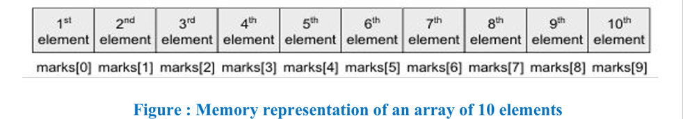 
### Limitations of Arrays

1. **Fixed Size:** The size of an array is fixed.
2. **Contiguous Memory:** Requires consecutive memory locations (one after another), which may not always be available.
3. **Insertion and Deletion:** May require shifting elements from their positions.

---

## 2. Linked Lists

A **linked list** is a flexible, dynamic linear data structure in which elements, called **nodes**, are connected sequentially using pointers.

Unlike arrays, linked lists do not require a fixed size. Memory is allocated to each node when it is added to the list.

### Structure of a Node

Each node contains two parts:
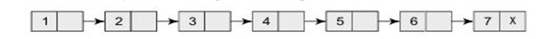 
1. **Data:** Stores the value or information.
2. **Link/Pointer:** Stores the address of the next node.

The last node contains a `NULL` pointer, indicating the end of the list.

The number of nodes is limited only by the available memory.


### Advantages

- Insertion and deletion are easier.
- Size can grow or shrink dynamically.
- Does not require contiguous memory locations.

### Disadvantages

- Searching is slow because nodes must be traversed sequentially.
- Requires extra memory to store pointers.

---

## 3. Stacks

A **stack** is a linear data structure in which insertion and deletion take place at only one end, called the **top**.

A stack follows the **LIFO (Last In, First Out)** principle, meaning the last element inserted is the first element removed.

Stacks can be implemented using arrays or linked lists.

### Stack Variables

- **`top`:** Stores the position of the topmost element.
- **`MAX`:** Stores the maximum number of elements the stack can hold.

For an array-based stack:

- `top = -1` indicates an empty stack.
- `top = MAX - 1` indicates a full stack.

**Example:** If `top = 4` and `MAX = 10`, the stack contains 5 elements, and 5 more can be inserted.

**[Diagram Placeholder: Array Implementation of a Stack]**
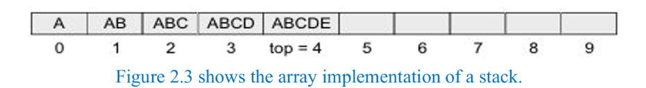 
### Basic Stack Operations

| Operation | Description |
|---|---|
| **Push** | Adds an element to the top of the stack. |
| **Pop** | Removes the topmost element. |
| **Peek (Peep)** | Returns the topmost element without removing it. |

### Stack Overflow and Underflow

- **Overflow:** Occurs when an element is inserted into a full stack.
- **Underflow:** Occurs when an element is removed from an empty stack.

### Applications of Stacks

-   Function Call Management: Stores function calls and returns to the previous function after execution.
    
-   Expression Evaluation: Evaluates mathematical expressions using operators and operands.
    
-   Recursion: Manages repeated function calls until the base condition is met.
    
-   Undo/Redo Operations: Tracks previous actions to undo or redo changes.
    
-   Browser History: Allows users to return to previously visited web pages.

---

## 4. Difference Between Linked List and Stack (important)

| Parameter | Linked List | Stack |
|---|---|---|
| **Definition** | Linear structure where nodes are connected using pointers. | Linear structure that follows LIFO. |
| **Organization** | Nodes are connected sequentially using pointers. | Insertion and deletion occur only at the top. |
| **Access** | Nodes are accessed by traversing from the head. | Only the top element is directly accessible. |
| **Insertion** | Possible at the beginning, end or any position. | Performed only at the top using Push. |
| **Deletion** | Possible from the beginning, end or any position. | Performed only from the top using Pop. |
| **Memory Allocation** | Dynamic; nodes are created as needed. | Can be implemented using an array or linked list. |
| **Pointer Requirement** | Each node contains one or more pointers. | Requires pointers if implemented using a linked list. |
| **Searching** | Requires traversal; takes O(n) time. | Not a primary operation; searching takes `O(n)`. |
| **Access Time** | Sequential access; random access is not possible. | Top element is accessible in `O(1)` time. |
| **Implementation** | More complex due to pointer manipulation. | Simpler to implement and manage. |
| **Operations** | Insert, Delete, Traverse, Search. | Push, Pop, Peek, IsEmpty. |
| **Applications** | Dynamic memory management, graph representation, polynomial manipulation, hash chaining. | Function calls, expression evaluation, recursion, undo/redo, browser history. |

---

## 5. Quick Revision

- **Array:** Fixed-size collection of same-type elements stored in contiguous memory.
- **Linked List:** Dynamic structure in which nodes are connected using pointers.
- **Stack:** LIFO structure where insertion and deletion occur only at the top.
- **Linked List advantage:** Easier insertion/deletion and dynamic size.
- **Linked List disadvantage:** Slow searching and extra memory for pointers.
- **Stack operations:** Push, Pop and Peek.
- **Overflow:** Insertion into a full stack.
- **Underflow:** Deletion from an empty stack.
***

# Queues and Trees

## 1. Queues

A **queue** is a linear data structure that follows the **FIFO (First In, First Out)** principle. The element inserted first is removed first.

- Elements are inserted at the **rear** and deleted from the **front**.
- Queues can be implemented using arrays or linked lists.
- Every queue has two variables:
  - **Front:** Points to the element to be deleted.
  - **Rear:** Points to the position where the next element is inserted.

### Array Representation of a Queue

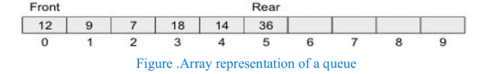 
**Example:** If `front = 0` and `rear = 5`, inserting `45` increments `rear` to `6`, and the value is stored at that position.
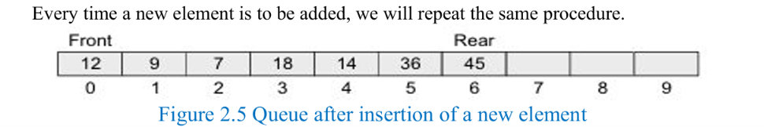 

### Deletion in a Queue

When an element is deleted, the value of `front` is incremented. Deletion takes place only from the front.

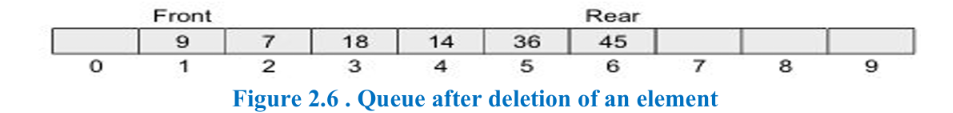 
### Queue Overflow and Underflow

- **Overflow:** Occurs when an element is inserted into a full queue.
- **Full Condition:** `rear = MAX - 1`
- **Underflow:** Occurs when an element is deleted from an empty queue.
- **Empty Condition:** `front = NULL` and `rear = NULL` (as given in the PPT).

Here, `MAX` represents the maximum capacity of the queue. Since array indexing starts from `0`, the last index is `MAX - 1`.

---

## 2. Trees

A **tree** is a non-linear data structure consisting of nodes arranged in a hierarchical order.
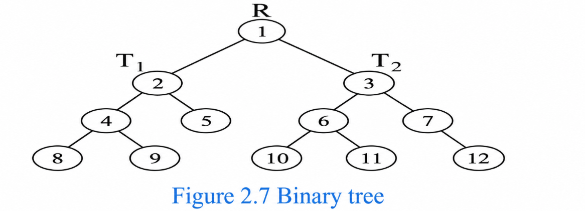 
- The topmost node is called the **root node**.
- The remaining nodes form subtrees of the root.
- The simplest form of a tree is a binary tree.

### Binary Tree

A **binary tree** consists of a root node and left and right subtrees, where both subtrees are also binary trees.

Each node contains:
1. **Data:** Stores the value.
2. **Left Pointer:** Points to the left subtree.
3. **Right Pointer:** Points to the right subtree.

- The `root` pointer points to the root node.
- If `root = NULL`, the tree is empty.
- The left subtree is called the left successor of the root when it is non-empty.
- The right subtree is called the right successor of the root when it is non-empty.

 

**Example:** If node `1` is the root, node `2` is its left child and node `3` is its right child.

- The left subtree contains nodes `2, 4, 5, 8, 9`.
- The right subtree contains nodes `3, 6, 7, 10, 11, 12`.

### Advantages of Trees

- Provide quick searching, insertion and deletion operations.

### Disadvantages of Trees

- Deletion algorithms can be complicated.

---

## 3. Complete Binary Tree (Level-Order)

A **complete binary tree** fills each level from left to right before moving to the next level.

**Example:** Construct a complete binary tree using the numbers `1, 2, 3, ..., 12`.

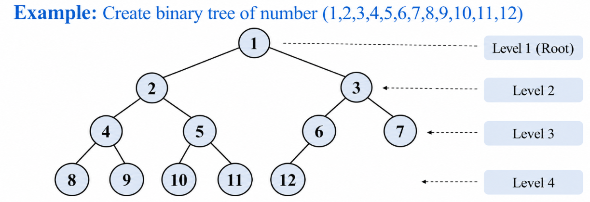 
The numbers are placed `level by level, from left to right.`

---

## 4. Balanced Binary Search Tree (BST)

A **Binary Search Tree (BST)** is a binary tree that follows these rules:

- All values in the left subtree are strictly `less` than the node's value.
- All values in the right subtree are strictly `greater` than the node's value.

A **balanced BST** aims to maintain a small height for efficient operations.
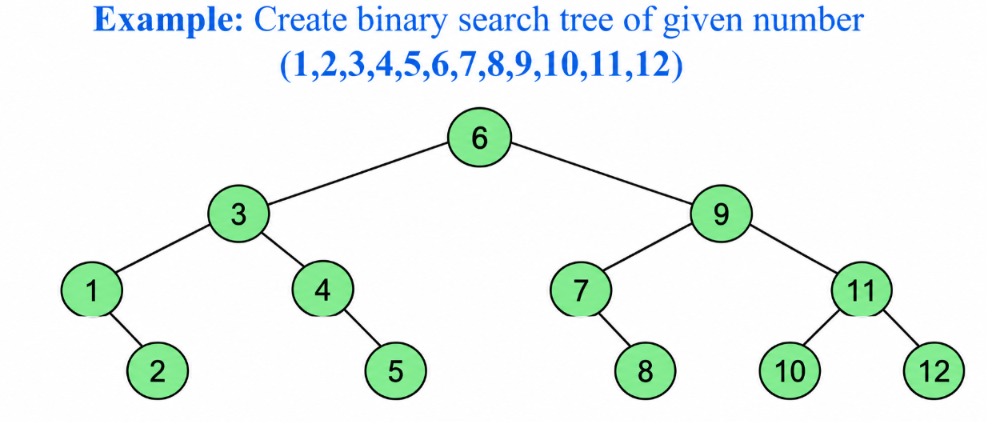 

### Constructing a Balanced BST

To construct a balanced BST from sorted numbers:
```sql
1. Choose the middle number as the root.
2. Repeat the process for the left half to create the left subtree.
3. Repeat the process for the right half to create the right subtree.
4. Continue until all numbers are placed.
```
### Example: BST for Numbers 1 to 12

**Step 1: Find the root**

The middle of `1` to `12` is approximately `6.5`. Choose `6` as the root.

**Step 2: Construct the left subtree**

For numbers `1` to `5`, choose `3` as the left child of `6`.

**Step 3: Construct the right subtree**

For numbers `7` to `12`, choose `9` as the right child of `6`.

**Step 4: Continue**

Repeat the same process for the remaining left and right ranges until all numbers are placed.

 

### Quick Revision

- **Queue:** Linear data structure that follows FIFO.
- **Front:** Position from which elements are deleted.
- **Rear:** Position where elements are inserted.
- **Queue Overflow:** Insertion into a full queue.
- **Queue Underflow:** Deletion from an empty queue.
- **Tree:** Non-linear data structure with a hierarchical arrangement.
- **Binary Tree:** Each node has at most two children.
- **Complete Binary Tree:** Levels are filled from left to right.
- **BST:** Left subtree values are smaller and right subtree values are greater than the node's value.
- **Balanced BST:** Uses a balanced arrangement to keep tree height small.

***
# 5. Graphs

A **graph** is a non-linear data structure consisting of **vertices (nodes)** and **edges** that connect the vertices.

- A graph is a generalization of a tree that allows complex relationships between nodes.
- Unlike trees, graphs do not restrict nodes to having only one parent.
- Graphs do not have a root node.
- Two nodes connected by an edge are called **neighbours**.
- A graph can represent cities connected by roads or workstations connected in a computer network.

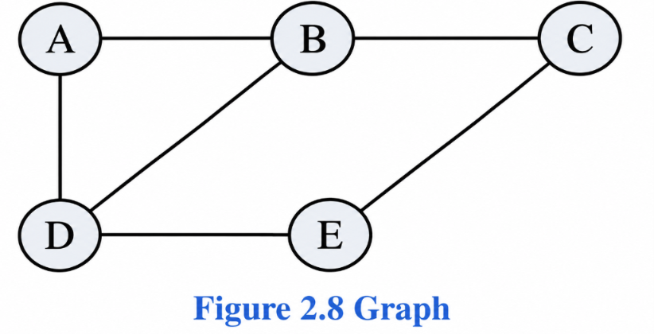 

**Example:** In Figure 2.8, node A has two neighbours: B and D.

### Applications of Graphs
-   Social Networks: Represent connections between people.
    
-   Road Maps: Represent cities connected by roads.
    
-   Computer Networks: Represent computers connected through network links.
    
-   Finding the Shortest Path: Find the shortest route between two locations.
    
-   Searching Connected Nodes: Find nodes connected to a particular node.
### Advantages
- Best models real-world situations and relationships.

### Disadvantages
- Some graph algorithms are slow and complex.

---

# 6. Static and Dynamic Data Structures

Data structures organize and store data efficiently to reduce the complexity of operations, especially time complexity.

Data structures are classified into two types:

1. Static Data Structures
2. Dynamic Data Structures

## 6.1 Static Data Structures

A **static data structure** has a fixed size. Its contents can be modified, but its allocated memory size cannot be changed during program execution.

**Example:** Array
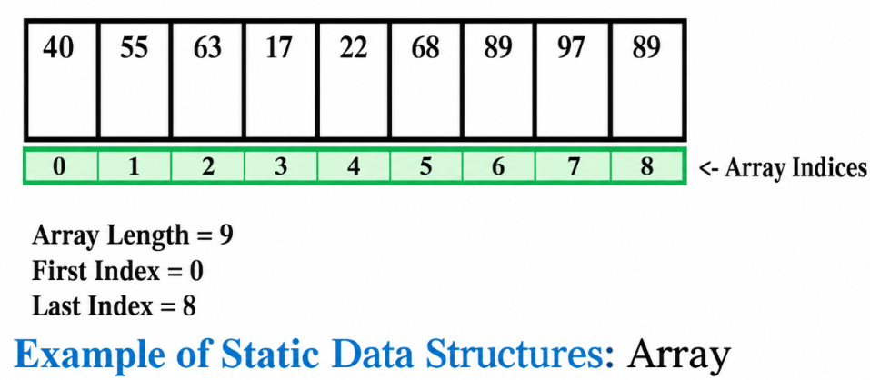 
### Characteristics
- Memory is allocated at compile-time.
- Size remains fixed during program execution.
- Index-based access is fast because the element's address can be calculated easily.

### Advantages of Static Data Structures

1. **Fast Access:** Elements can be accessed quickly using indexing.
2. **Predictable Memory Usage:** Memory requirements are known in advance.
3. **Easy Implementation:** Fixed size makes the structure easier to implement and optimize.
4. **Efficient Memory Management:** No frequent memory reallocation is required.
5. **Simplified Code:** No need for dynamic memory allocation.
6. **Reduced Overhead:** Less overhead because memory allocation and deallocation do not occur frequently.

## 6.2 Dynamic Data Structures

A **dynamic data structure** has a variable size that can grow or shrink during program execution.

**Example:** Linked List
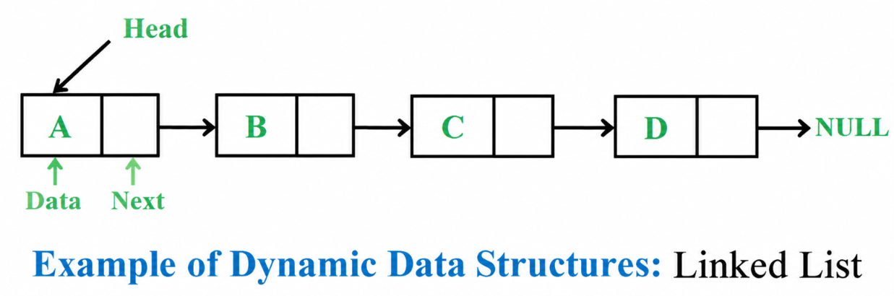 
### Characteristics
- Memory is allocated at run-time.
- Size can change during program execution.
- Memory can be dynamically allocated or deallocated.
- Accessing elements by index may be slower because pointers and traversal may be required.

### Advantages of Dynamic Data Structures

1. **Flexibility:** Size can grow or shrink according to requirements.
2. **Reduced Memory Waste:** Memory is allocated as needed.
3. **Efficient Insertion and Deletion:** Certain operations can be faster than in static structures because elements may not need shifting.
4. **Simplified Code:** Can simplify operations on data structures that need frequent resizing.
5. **Scalability:** Can adapt as the amount of data increases.

---

## 6.3 Difference Between Static and Dynamic Data Structures (important)

| Aspect | Static Data Structure | Dynamic Data Structure |
|---|---|---|
| **Memory Allocation** | Allocated at compile-time. | Allocated at run-time. |
| **Size** | Fixed; cannot be changed during execution. | Can be changed during execution. |
| **Memory Utilization** | May be inefficient if allocated memory is unused. | Can use memory more efficiently by allocating it as needed. |
| **Access Time** | Generally faster with direct indexing. | May be slower due to pointer usage and traversal. |
| **Examples** | Arrays, stacks, queues and trees with fixed size. | Linked lists, trees with variable size and hash tables. |

### Quick Revision

- **Graph:** Non-linear structure consisting of vertices and edges.
- **Vertex:** A node in a graph.
- **Edge:** A connection between two vertices.
- **Neighbours:** Nodes connected by an edge.
- **Static Data Structure:** Fixed size; memory allocated at compile-time.
- **Dynamic Data Structure:** Variable size; memory allocated at run-time.
- **Static Example:** Array.
- **Dynamic Example:** Linked List.
- **Static Advantage:** Fast indexed access and predictable memory usage.
- **Dynamic Advantage:** Flexibility and reduced memory waste.
***
# Operations on Data Structures, ADT and Analysis of Algorithms

## 1. Operations on Data Structures

Different operations can be performed on data structures to manage and process data.

### 1. Traversing
Traversing means accessing each data item exactly once for processing.

**Example:** Printing the names of all students in a class.

### 2. Searching
Searching is used to find the location of data items that satisfy a given condition. The item may or may not be present in the collection.

**Example:** Finding students who scored 100 marks in Mathematics.

### 3. Inserting
Inserting means adding new data items to a collection.

**Example:** Adding the details of a new student.

### 4. Deleting
Deleting means removing a particular data item from a collection.

**Example:** Removing the name of a student who has left the course.

### 5. Sorting
Sorting means arranging data in a particular order, such as ascending, descending or alphabetical order.

**Example:** Arranging students' names alphabetically or scores in descending order to find the top three winners.

### 6. Merging
Merging means combining two sorted lists into a single sorted list.

---

## 2. Abstract Data Type (ADT)

An **Abstract Data Type (ADT)** is a theoretical model that defines what a data structure does and which operations can be performed on it, without specifying how it is implemented.

It describes the data, its allowed values and its operations while hiding the internal implementation details.

### Example of ADT

A stack can be implemented using an array or a linked list. However, the user only needs to know the available operations, such as `push()` and `pop()`, not how the stack stores its data internally.

### Types of ADT

| ADT | Description | Operations |
|---|---|---|
| **List ADT** | Represents a sequential collection of elements. | `insert()`, `remove()`, `get()` |
| **Stack ADT** | Follows LIFO (Last In, First Out). | `push()`, `pop()`, `peek()` |
| **Queue ADT** | Follows FIFO (First In, First Out). | `enqueue()`, `dequeue()` |

### Data Type
A **data type** is the set of values that a variable can hold.

**Examples in C:** `int`, `char`, `float` and `double`.

### Meaning of Abstract
- Abstract means considering something without focusing on its detailed implementation.
- In C, a structure can be considered as an ADT without focusing on its implementation.
- An ADT describes the data and the operations that can be performed on it.

### Advantages of ADT
- Hides implementation details.
- Makes data easier to use.
- Allows different implementations of the same ADT.
- Simplifies program design and maintenance.

---
> [!attention] IN EXAMS 
> before writing any algorithim or wahtever you must and should write the `ADT` for that 
### Abstract Data Type (ADT) Examples 

## 1. Array ADT
An Array ADT stores a collection of elements of the same data type in indexed positions. Each element can be accessed directly using its index. It supports operations for accessing, modifying, inserting, deleting and searching elements.

**Operations:** `get(index)`, `set(index, value)`, `insert()`, `delete()`, `search()`, `traverse()`.

## 2. Linked List ADT
A Linked List ADT stores a collection of elements called nodes, connected through links. It allows the collection to grow or shrink dynamically and supports insertion and deletion without shifting all the remaining elements.

**Operations:** `insert()`, `delete()`, `search()`, `traverse()`, `isEmpty()`.

## 3. Stack ADT
A Stack ADT stores elements according to the LIFO (Last In, First Out) principle, meaning the last element inserted is the first one removed. Insertion and deletion are performed only at the top of the stack.

**Operations:** `push()` – insert an element, `pop()` – remove the top element, `peek()` – view the top element, `isEmpty()`, `isFull()`.

## 4. Queue ADT
A Queue ADT stores elements according to the FIFO (First In, First Out) principle, meaning the first element inserted is the first one removed. Elements are inserted at the rear and deleted from the front.

**Operations:** `enqueue()` – insert an element, `dequeue()` – remove an element, `front()` – view the front element, `isEmpty()`, `isFull()`.

## 5. Tree ADT
A Tree ADT stores elements in a hierarchical structure consisting of nodes connected through parent-child relationships. It is used to represent hierarchical data and supports operations for adding, removing, searching and traversing nodes.

**Operations:** `insert()`, `delete()`, `search()`, `traverse()`, `findParent()`.

## 6. Graph ADT
A Graph ADT stores a collection of vertices (nodes) connected by edges. It represents relationships between objects, such as cities connected by roads or computers connected in a network. It supports operations for managing vertices, edges and connections.

**Operations:** `addVertex()`, `removeVertex()`, `addEdge()`, `removeEdge()`, `search()`, `traverse()`.
***
## 3. Introduction to Analysis of Algorithms

An **algorithm** is a formally defined set of instructions used to solve a particular problem or perform a calculation.

- An algorithm provides a blueprint for writing a program.
- It is an effective procedure that solves a problem in a finite number of steps.
- A well-defined algorithm produces an answer and terminates.
- Algorithms can be implemented using programming languages such as C, C++ or Java.
- Algorithms help achieve software reuse because the same solution can be implemented in different languages.
- Multiple algorithms may solve the same problem. The choice depends on their time and space complexity.

---

## 4. Different Approaches to Designing an Algorithm

Algorithms manipulate data stored in data structures. Complex algorithms are often divided into smaller units called **modules**.

### Modularization
**Modularization** is the process of dividing a complex algorithm into smaller modules.

It improves:
- Clarity of design
- Implementation
- Debugging
- Testing
- Documentation
- Maintenance

There are two main approaches to algorithm design:

1. Top-down approach
2. Bottom-up approach
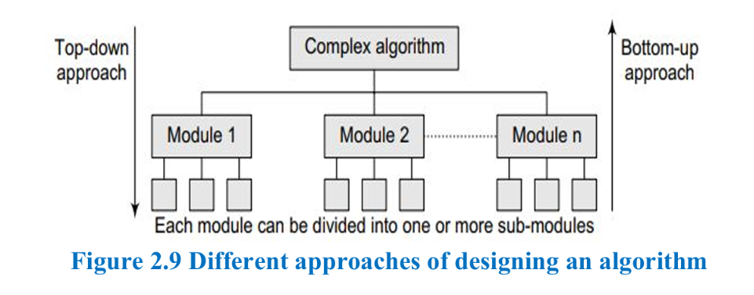 
### 4.1 Top-Down Approach

The **top-down approach** starts with a complex algorithm and divides it into smaller modules and sub-modules.

This process continues until each module reaches the required level of simplicity.

It follows **stepwise refinement**, where an abstract design is gradually converted into a more detailed design.
 

**Advantages:**
- Easy to document modules.
- Simplifies test-case generation.
- Makes implementation easier.
- Simplifies debugging.

### 4.2 Bottom-Up Approach

The **bottom-up approach** starts by designing the basic or concrete modules and combines them to form higher-level modules.

This process continues until the complete algorithm is designed.

 

**Advantages:**
- Supports information hiding.
- Identifies what should be encapsulated within a module.
- Provides an abstract interface for modules.

**Limitation:** Applying a strict bottom-up approach can be difficult because some top-down activities may also be required.

---

## 5. Difference Between Top-Down and Bottom-Up Approaches (important)

| Top-Down Approach | Bottom-Up Approach |
| --- | --- |
| 1. Starts with the main problem. | Starts with smaller problems. |
| 2. Divides the problem into smaller modules. | Combines smaller modules into a complete system. |
| 3. Follows stepwise refinement. | Follows module combination. |
| 4. Moves from general to detailed design. | Moves from basic to complex design. |
| 5. Higher-level modules are designed first. | Lower-level modules are designed first. |
| 6. Testing and debugging are easier. | Supports information hiding and encapsulation. |
#### Example 
| Top-Down Approach | Bottom-Up Approach |
| --- | --- |
| Start with the complete Online Shopping System. | Start with basic modules like Login and Cart. |
| Divide it into smaller modules like Product Search and Payment. | Combine these modules to build the complete system. |
| Example: Break the system into smaller parts. | Example: Build the system by combining smaller parts. |
### Quick Revision

- **Traversing:** Accessing each data item exactly once.
- **Searching:** Finding a data item that satisfies a condition.
- **Inserting:** Adding a new data item.
- **Deleting:** Removing a data item.
- **Sorting:** Arranging data in a particular order.
- **Merging:** Combining two sorted lists into one sorted list.
- **ADT:** Defines what a data structure does, not how it works internally.
- **Algorithm:** A finite set of instructions to solve a problem.
- **Modularization:** Dividing an algorithm into smaller modules.
- **Top-Down:** Breaks a large problem into smaller modules.
- **Bottom-Up:** Combines basic modules to build a complete algorithm.
***
# 1. Control Structures Used in Algorithms

An algorithm uses three main control structures to control the order in which steps are executed.

| Control Structure | Meaning | Example |
| --- | --- | --- |
| Sequence | Executes steps one after another in order. | Adding two numbers. |
| Decision | Executes steps based on a condition. | If `x = y`, print EQUAL. |
| Repetition | Repeats steps until a condition is met. | Printing the first 10 natural numbers. |

## 1. Sequence

-   Executes each step in a specified order.
    
-   Example: Input two numbers → Add them → Display the sum.
    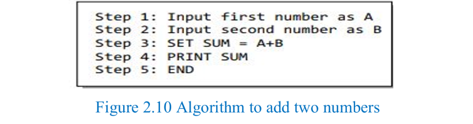 

## 2. Decision

-   Executes a step depending on whether a condition is true or false.
    
-   Uses statements such as `if-then`.
    
-   Example: If `x = y`, print `EQUAL`.
    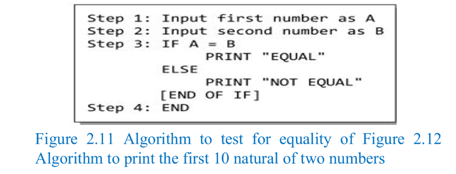 

## 3. Repetition

-   Repeats one or more steps a number of times.
    
-   Uses loops such as `while`, `do-while` and `for`.
    
-   Example: Print the first 10 natural numbers.
 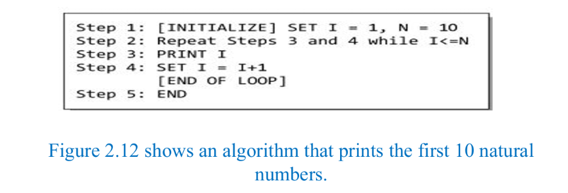    

# 2. Characteristics of Algorithms

An algorithm has the following characteristics.

## Core Operational Characteristics

| Characteristic | Simple Meaning |
| --- | --- |
| 1. Finiteness | Must finish after a finite number of steps. |
| 2. Definiteness | Every step must be clear and unambiguous. |
| 3. Input | Accepts zero or more well-defined inputs. |
| 4. Output | Must produce at least one well-defined output. |
| 5. Effectiveness | Every step must be simple and practically executable. |

## Design and Execution Characteristics

| Characteristic | Simple Meaning |
| --- | --- |
| 6. Feasibility | Must be possible to implement using available resources. |
| 7. Language Independence | Logic should not depend on a particular programming language. |
| 8. Determinism | The same input should produce the same output. |
| 9. Generality | Should solve a class of similar problems, not just one specific case. |

## Easy way to remember

-   Finiteness: Ends.
    
-   Definiteness: Clear steps.
    
-   Input: Takes data.
    
-   Output: Gives a result.
    
-   Effectiveness: Steps are executable.
    
-   Feasibility: Practically possible.
    
-   Language Independence: Works with different programming languages.
    
-   Determinism: Same input, same output.
    
-   Generality: Solves similar types of problems.
***
