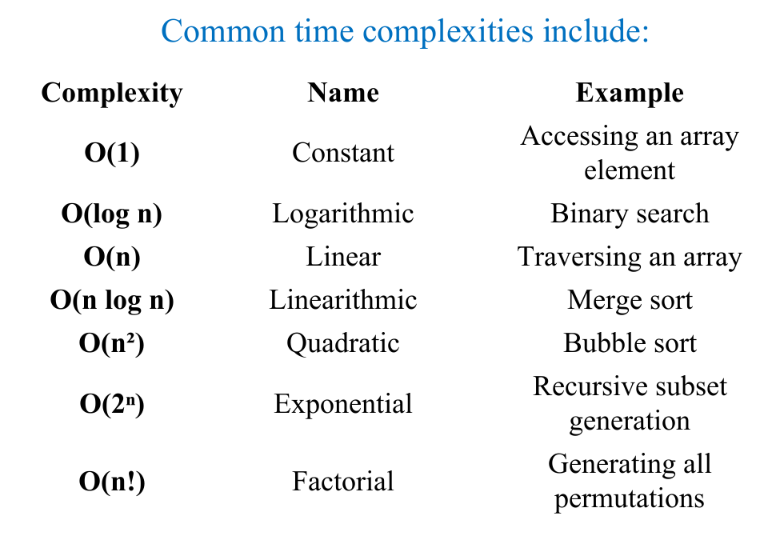
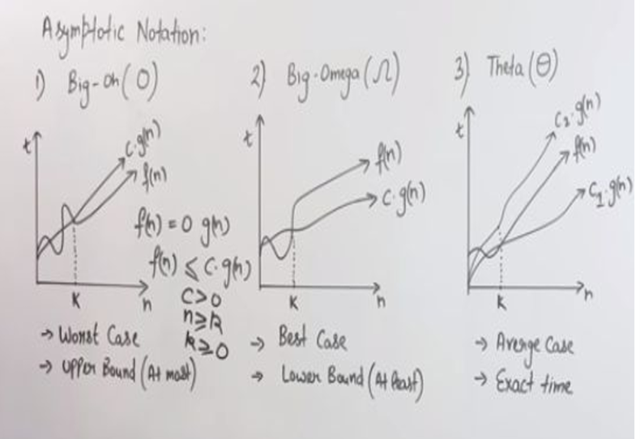

# Time and Space Complexities — Exam Notes


## 1. Analysis of an Algorithm

**Algorithm analysis** means determining the resources required to execute an algorithm, mainly:
- **Time:** how the running time or number of operations grows.
- **Space:** how much computer memory is required during execution.

Algorithms may process different input sizes, so time and space complexity are expressed as functions of input size \(n\).

### Time Complexity
Time complexity describes how the running time or number of machine instructions grows with the input size.

It mainly depends on:
- The size of the input.
- The algorithm used.

### Space Complexity
Space complexity describes the amount of computer memory required during execution as a function of input size.

Space is divided into two parts:

| Part | Meaning | Examples |
|---|---|---|
| **Fixed part** | Memory that does not depend on the particular input size in the same way as variable storage. | Instructions, constants, variables, fixed structured variables. |
| **Variable part** | Memory that can change during execution. | Recursion stack, dynamically allocated arrays or other structures. |


## 2. Types of Time Complexity

### 2.1 Worst-Case Time Complexity
The maximum running time for inputs of a given size. It gives an upper bound on the running time for any input of that size.

**Example — Linear Search:** The item is at the last position or is not present, so the algorithm may examine all \(n\) elements: \(O(n)\).

### 2.2 Average-Case Time Complexity
The expected running time for a typical input, based on an assumed probability distribution of inputs. The source describes this using the assumption that inputs of a given size are equally likely.

**Example — Linear Search:** On average, the algorithm examines a portion of the list, giving \(O(n)\) average-case growth.

### 2.3 Best-Case Time Complexity
The minimum work required under the most favourable input conditions.

**Example — Linear Search:** If the desired item is the first element, only one comparison is needed: \(O(1)\).

The source advises not to choose an algorithm based only on best-case performance; average and worst-case performance are also important.

### 2.4 Amortized Time Complexity
```
## textbook defiinition is very hard difiifcult to understand
Amortized analysis considers a sequence of related operations and averages their total cost over all operations in that sequence. It gives a guaranteed average cost per operation over the sequence, even when an individual operation may be expensive.
```
> [!abstract] Amortized time complexity is the average cost per operation over a sequence of operations, including both cheap and expensive operations.
>Remember: A few expensive operations are spread across many operations to calculate the average cost.

Imagine you're adding items to a box.

-   Usually, adding an item takes 1 second.
    
-   But when the box becomes full, you must get a bigger box and move all the existing items. This might take 10 seconds.
    
-   After that, adding items is easy again.
    

So, some operations are cheap, while a few operations are expensive.

Amortized time complexity calculates the average cost per operation over a sequence of operations, including both cheap and expensive ones.

### Example

Suppose you perform 5 operations:

| Operation | Time taken |
| --- | --- |
| 1   | 1 second |
| 2   | 1 second |
| 3   | 10 seconds |
| 4   | 1 second |
| 5   | 1 second |
| Total | 14 seconds |


Average cost per operation = Total time / Number of operations = 14 / 5 = 2.8 seconds

Even though one operation took 10 seconds, the average cost was only 2.8 seconds.


## 3. Time–Space Trade-off

More than one algorithm may solve the same problem:
- One algorithm may use less memory but take more time.
- Another may take less time but use more memory.

Choosing a balance between execution time and memory usage is called the **time–space trade-off**.

**Key idea:** An algorithm that is fast may need extra memory, while one that saves memory may take longer.

## 4. Expressing Complexity

Complexity is expressed as a function \(f(n)\), where \(n\) is the input size.

We analyse complexity to:
1. Predict how resource usage grows as input size increases.
2. Compare algorithms that solve the same problem.
3. understand the efficiency of an algorithm for large inputs.

**Big O notation** is commonly used to express an upper bound on growth.

## 5. Analysing Loops

For simple statements without loops or recursion, the number of instructions can be counted directly. When loops are present, the number of iterations affects efficiency.

### 5.1 Linear Loop

In a linear loop, the control variable is increased or decreased by a fixed amount each iteration.

```js
for (i = 0; i < n; i++)
    statement;
```

The loop runs approximately \(n\) times.

**Time complexity:** \(O(n)\)


```js
for (i = 0; i < 100; i++)
    statement block;
```

This runs 100 times. For a general loop factor \(n\), the source gives \(f(n)=n\).

If the loop increments by 2:

```js
for (i = 0; i < n; i += 2)
    statement;
```

It runs about \(n/2\) times. The source gives \(f(n)=n/2\). In Big O notation, constant factors are ignored, so this is still \(O(n)\).

### 5.2 Logarithmic Loop

In a logarithmic loop, the control variable is multiplied or divided in each iteration rather than increased or decreased by a fixed amount.

```js
for (i = 1; i < n; i *= 2)
    statement;
```
The value of `i` doubles in each iteration: 1, 2, 4, 8, 16, ...

The loop runs approximately `log₂(n)` times.

**Time Complexity:** `O(log n)`

A loop that repeatedly divides the control variable by 2 also has logarithmic time complexity.

**Example:** If `n = 1000`, then `log₂(1000) ≈ 10`. Therefore, the loop runs approximately 10 times.

### 5.3 Nested Loops

A **nested loop** is a loop inside another loop. To find its time complexity, count the iterations of both loops and multiply them when the inner loop runs the same number of times for each outer iteration.

#### A. Linear–Logarithmic Loop

```c
for (i = 0; i < n; i++)
    for (j = 1; j < n; j *= 2)
        statement;
````

-   Outer loop runs `n` times.
    
-   Inner loop runs about `log₂(n)` times.
    
-   Total iterations = `n × log₂(n)`.
    

Time Complexity: `O(n log n)`

Example: If `n = 10`, the outer loop runs 10 times and the inner loop runs about `log₂(10)` times.

#### B. Quadratic Loop


```c
for (i = 0; i < n; i++)
    for (j = 0; j < n; j++)
        statement;
```

-   Outer loop runs `n` times.
    
-   Inner loop runs `n` times for each outer iteration.
    
-   Total iterations = `n × n = n²`.
    

Time Complexity: `O(n²)`

Example: If `n = 10`, total iterations = `10 × 10 = 100`.

#### C. Dependent Quadratic Loop

The number of inner loop iterations depends on the value of the outer loop variable.


```c
for (i = 0; i < n; i++)
    for (j = 0; j <= i; j++)
        statement;
```

-   The inner loop runs 1 time, then 2 times, then 3 times, and so on.
    
-   Total iterations = `1 + 2 + 3 + ... + n`.
    

Formula:

`Total iterations = n(n + 1) / 2`

Example: If `n = 10`:

`Total iterations = 10 × 11 / 2 = 55`

Time Complexity: `O(n²)`

When simplifying Big O, constants and lower-order terms are ignored.

## 6. Common Time Complexities

| Complexity | Name | Example |
|---|---|---|
| `O(1)` | Constant | Accessing an array element |
| `O(log n)` | Logarithmic | Binary search |
| `O(n)` | Linear | Traversing an array |
| `O(n log n)` | Linearithmic | Merge sort |
| `O(n²)` | Quadratic | Bubble sort |
| `O(2ⁿ)` | Exponential | Generating subsets recursively |
| `O(n!)` | Factorial | Generating all permutations |

### Growth Order

From slower growth to faster growth:

`O(1) ≤ O(log n) ≤ O(n) ≤ O(n log n) ≤ O(n²) ≤ O(n³)`

Exponential `O(2ⁿ)` and factorial `O(n!)` complexities grow very quickly as `n` increases.

 

## 7. Analysing Time Complexity

Instead of measuring actual running time in seconds, count how the number of operations increases with input size `n`.

### Example 1: Single Loop

```c
for (i = 1; i <= n; i++)
    print(i);
````

-   The loop runs `n` times.
    
-   Total operations = `n`.
    

Time Complexity: `O(n)`

### Example 2: Nested Loops


```c
for (i = 1; i <= n; i++)
    for (j = 1; j <= n; j++)
        print(i, j);
```

-   Outer loop runs `n` times.
    
-   Inner loop runs `n` times for each outer iteration.
    
-   Total operations = `n × n = n²`.
    

Time Complexity: `O(n²)`

### Counting Basic Operations

To analyse an algorithm, count:

-   Comparisons: Checking conditions.
    
-   Assignments: Giving values to variables.
    
-   Arithmetic operations: Addition, subtraction, multiplication, etc.
    

When simplifying Big O expressions, ignore constant factors and lower-order terms.

Example:

`4n² + 3n + 5 = O(n²)`

The highest-growth term is `n²`, so the complexity is `O(n²)`.

## 8. Analysing Space Complexity

Space complexity measures the extra memory used by an algorithm. The PDF's example excludes the input itself unless that input storage is required as part of the analysis.

### Example 1: One extra variable

```c
sum = 0
for each element in array
    sum += element
```

Only the variable `sum` is used as extra storage.

**Space complexity:** \(O(1)\)

### Example 2: An extra array

If an algorithm creates another array containing \(n\) elements, the extra memory grows with \(n\).

**Space complexity:** \(O(n)\)
## 9. Asymptotic Notation

Asymptotic notation describes how an algorithm's time or space requirements grow as input size `n` becomes large.

The three main notations are **Big O**, **Big Omega**, and **Big Theta**.
 
| Notation | Bound | Simple Meaning |
|---|---|---|
| `O` — Big O | Upper bound | At most this rate of growth |
| `Ω` — Big Omega | Lower bound | At least this rate of growth |
| `Θ` — Big Theta | Tight bound | Upper and lower bounds have the same growth rate |

**Important:** Big O, Big Omega, and Big Theta describe mathematical bounds. Worst-case, best-case, and average-case refer to which running-time function is being analysed.

### 9.1 Big O Notation — O

Big O describes an asymptotic **upper bound** for large input sizes.

If `f(n) = O(g(n))`, there must be positive constants `c` and `n₀` such that:

`0 ≤ f(n) ≤ c × g(n)` for all `n ≥ n₀`

Where:
- `f(n)` = function being analysed.
- `g(n)` = proposed upper-bound function.
- `c` = positive constant.
- `n₀` = point from which the inequality holds.

**Rules:**
- Ignore constant multipliers.
- Ignore lower-order terms.
- Keep the term with the highest growth rate.

Examples:

- `O(4n) = O(n)`
- `10 = O(1)`
- `2n³ + 1 = O(n³)`
- `3n² + 5 = O(n²)`
- `2n³ + 3n² + 5n - 10 = O(n³)`

#### Example 1: Show that `4n² = O(n³)`

We need to find constants `c > 0` and `n₀` such that:

`0 ≤ 4n² ≤ c × n³`

Choose `c = 4`.

For `n ≥ 1`:

`4n² ≤ 4n³`

Therefore:
- `c = 4`
- `n₀ = 1`

Hence, `4n² = O(n³)`.

#### Example 2: Show that `400n³ + 20n² = O(n³)`

For `n ≥ 1`:

`n² ≤ n³`

Therefore:

`400n³ + 20n² ≤ 400n³ + 20n³`

`400n³ + 20n² ≤ 420n³`

Choose `c = 420` and `n₀ = 1`.

Hence, `400n³ + 20n² = O(n³)`.

#### Example 3: Why `10n³ + 20n` is not `O(n²)`

Assume that:

`10n³ + 20n ≤ c × n²`

Dividing both sides by `n²`:

`10n + 20/n ≤ c`

As `n` increases, `10n + 20/n` grows without limit.

Therefore, no fixed constant `c` can satisfy the condition for all sufficiently large `n`.

Hence, `10n³ + 20n` is **not** `O(n²)`.

### 9.2 Big Omega Notation — Ω

Big Omega describes an asymptotic **lower bound**. It means that the function grows at least as fast as the specified bound from some point onwards.

If `f(n) = Ω(g(n))`, there must be positive constants `c` and `n₀` such that:

`0 ≤ c × g(n) ≤ f(n)` for all `n ≥ n₀`

#### Example: Show that `5n² + 10n = Ω(n²)`

For `n ≥ 1`:

`5n² ≤ 5n² + 10n`

Choose:
- `c = 5`
- `n₀ = 1`

Hence, `5n² + 10n = Ω(n²)`.

### 9.3 Big Theta Notation — Θ

Big Theta describes a **tight asymptotic bound**. The function is bounded both above and below by constant multiples of the same function.

If `f(n) = Θ(g(n))`, there must be positive constants `c₁`, `c₂`, and `n₀` such that:

`0 ≤ c₁ × g(n) ≤ f(n) ≤ c₂ × g(n)`

for all `n ≥ n₀`.

#### Example: Show that `n²/2 - 2n = Θ(n²)`

For `n ≥ 5`:

`(1/10)n² ≤ n²/2 - 2n ≤ (1/2)n²`

Choose:
- `c₁ = 1/10`
- `c₂ = 1/2`
- `n₀ = 5`

Hence, `n²/2 - 2n = Θ(n²)`.

### Quick Comparison of the Three Notations

| Feature | Big O — `O` | Big Omega — `Ω` | Big Theta — `Θ` |
|---|---|---|---|
| Bound | Upper | Lower | Upper and lower |
| Meaning | At most | At least | Same growth rate |
| Condition | `f(n) ≤ c × g(n)` | `c × g(n) ≤ f(n)` | `c₁g(n) ≤ f(n) ≤ c₂g(n)` |
| Constants | Positive `c` | Positive `c` | Positive `c₁`, `c₂` |


## 10. Categories of Algorithms by Big O

| Category | Complexity | Example |
|---|---|---|
| Constant time | `O(1)` | Accessing an array element |
| Logarithmic time | `O(log n)` | Binary search |
| Linear time | `O(n)` | Traversing an array |
| Polynomial time | `O(nᵏ)`, where `k > 1` | Nested loops |
| Exponential time | `O(2ⁿ)` | Generating subsets recursively |


- Constant and logarithmic complexities grow slowly.
- Linear complexity grows proportionally to `n`.
- Quadratic and cubic complexities grow much faster.
- Exponential complexity increases very rapidly.

## 11. Limitations of Big O Notation

1. Some algorithms are difficult to analyse mathematically.
2. There may not be enough information to calculate average-case behaviour.
3. Big O describes how complexity grows with input size, not the amount of programming effort required.
4. Big O ignores constant factors.

**Example:**

`O(n²)` and `O(100000n²)` belong to the same Big O class, even though their actual running times may differ greatly.

## 13. Last-Minute Revision

- **Time complexity:** How running time grows with input size.
- **Space complexity:** How memory usage grows with input size.
- **Worst case:** Maximum work.
- **Average case:** Expected work under an input distribution.
- **Best case:** Minimum work.
- **Amortized:** Average cost over a sequence of operations.
- **Time–space trade-off:** Balance time against memory.
- **Linear loop:** \(O(n)\).
- **Logarithmic loop:** \(O(\log n)\).
- **Linear–logarithmic nested loop:** \(O(n\log n)\).
- **Two full nested loops:** \(O(n^2)\).
- **Dependent quadratic loop:** \(n(n+1)/2\), simplified to \(O(n^2)\).
- **Big O:** Upper bound.
- **Big Omega:** Lower bound.
- **Big Theta:** Tight bound.
- **Simplification:** Ignore constant factors and lower-order terms.
