# Unit II — Stacks and Queues


# Part A — Stack

## 1. Introduction to Stack

A **stack** is a linear data structure in which elements are inserted and deleted from only one end, called the **TOP**.

A stack follows the **LIFO (Last-In, First-Out)** principle. This means the element inserted last is the first one to be removed.

### Real-life example
A stack of plates works like a stack:
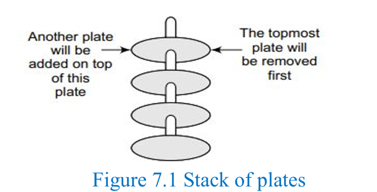 
- A new plate is placed on top.
- The topmost plate is removed first.
- Plates are added and removed from the same end.

### Stack and function calls
Stacks are used to manage function calls. For example:

`Function A → Function B → Function C → Function D`

When A calls B, B is placed on top of the system stack. When B finishes, it is removed and A continues. The same process applies to calls from B to C and C to D. The most recently called function finishes first.
>  shortify the diagram contents as per you in exam 
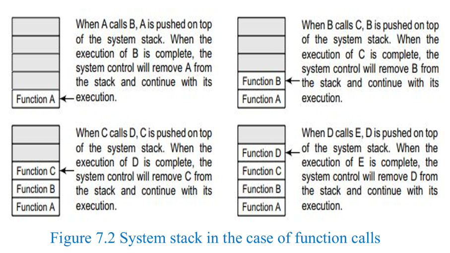 
### Key points
- Stack is a **linear data structure**.
- It follows **LIFO**.
- Insertion and deletion take place only at **TOP**.
- Common operations are **push, pop, and peek**.

## 2. Array Representation of a Stack

A stack can be represented using a linear array in computer memory.

Two important variables are used:

- **TOP:** Stores the index/address of the topmost element.
- **MAX:** Stores the maximum number of elements the stack can hold.

For an array with indices starting at `0`:
- `TOP = -1` (or `NULL` in the PDF's terminology) indicates an empty stack.
- `TOP = MAX - 1` indicates a full stack.

> **Note:** The PDF uses `TOP = NULL` for an empty stack. In array implementations, `TOP = -1` is also commonly used when array indices begin at zero. Follow the convention used by your teacher or question.

### Example
Suppose the array contains:

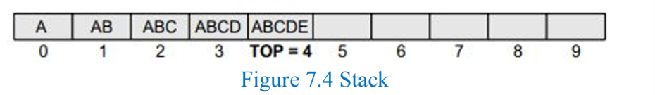 

The current top element is `5`, so `TOP = 4`. Five more elements can be stored if `MAX = 10`.

## 3. Operations on a Stack

The three basic stack operations are:

| Operation | Meaning |
|---|---|
| **Push** | Inserts an element at the top |
| **Pop** | Removes the topmost element |
| **Peek** | Returns the topmost element without removing it |

### 3.1 Push Operation
> [!tip] Consider this Definition and bullet point as a part of ADT which you will and must write in EXAMS
**Definition:** Push inserts a new element at the top of the stack.

Before inserting, check whether the stack is full.

- If `TOP = MAX - 1`, the stack is full and an **OVERFLOW** message is produced.
- Otherwise, increment `TOP` and store the new value at `STACK[TOP]`.

### Algorithm: PUSH

```text
Step 1: IF TOP = MAX - 1
            PRINT "OVERFLOW"
            Go to Step 4
        [END OF IF]

Step 2: SET TOP = TOP + 1
Step 3: SET STACK[TOP] = VALUE
Step 4: END
```

### Example
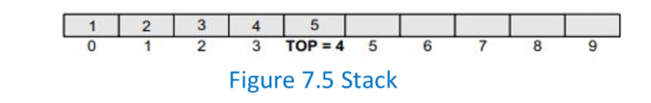 
Push `6`:
1. Check whether the stack is full.
2. Increment `TOP` to `5`.
3. Store `6` at `STACK[5]`.

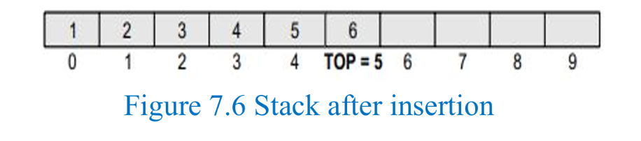 
### Important term
**Overflow:** Attempting to push an element into a full stack.

### 3.2 Pop Operation

**Definition:** Pop removes the topmost element from the stack.

Before deleting, check whether the stack is empty.

- If the stack is empty (`TOP = NULL` in the PDF), an **UNDERFLOW** message is produced.
- Otherwise, save the top element if needed, then decrement `TOP`.

### Algorithm: POP

```text
Step 1: IF TOP = NULL
            PRINT "UNDERFLOW"
            Go to Step 4
        [END OF IF]

Step 2: SET VAL = STACK[TOP] //we do this to save it in a temp incase we need to restore it
Step 3: SET TOP = TOP - 1
Step 4: END
```

### Example
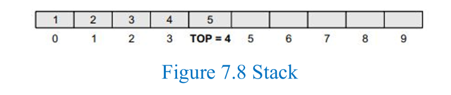 

Pop:
1. Check whether the stack is empty.
2. Store the top value (`5`) in `VAL`, if required.
3. Decrement `TOP` to `3`.
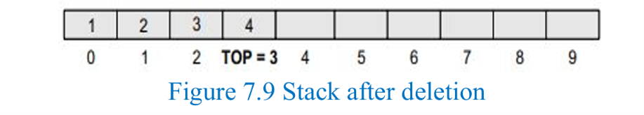 
The logical stack now contains `[1, 2, 3, 4]`, with `TOP = 3`.

> [!checklist] Important term
**Underflow:** Attempting to pop an element from an empty stack.

### 3.3 Peek Operation (sometimes also said as Peep)

**Definition:** Peek returns the value of the topmost element without deleting it.

- If the stack is empty, display an appropriate message.
- Otherwise, return `STACK[TOP]`.

### Algorithm: PEEK

```text
Step 1: IF TOP = NULL
            PRINT "STACK IS EMPTY"
            Go to Step 3
        [END OF IF]

Step 2: RETURN STACK[TOP]
Step 3: END
```

### Example
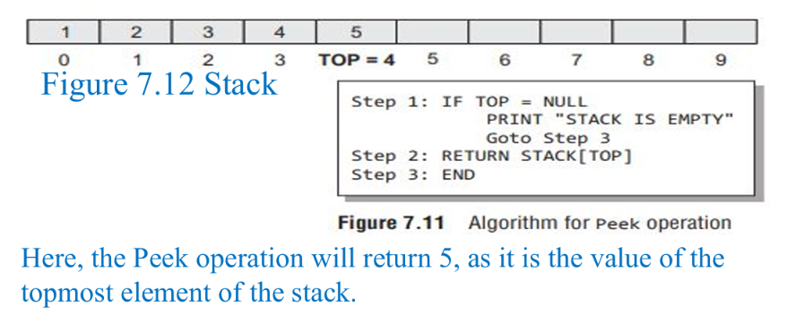 
The stack remains unchanged.

## 4. Linked Representation of a Stack

An array-based stack has a fixed size that must be declared in advance. If the maximum size is unknown, a linked representation can be used.

### Structure of a linked stack
Each node contains two parts:
1. **DATA:** Stores the element.
2. **NEXT:** Stores the address of the next node.
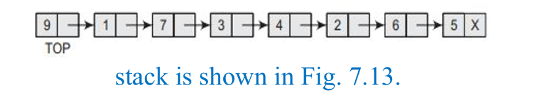 
The linked list's **START** pointer is used as **TOP**.

- All insertions and deletions occur at the node pointed to by `TOP`.
- `TOP = NULL` means the stack is empty.
- The stack grows by allocating new nodes as required.

### Array representation vs linked representation

| Array Stack | Linked Stack |
|---|---|
| Uses an array | Uses linked-list nodes |
| Has a fixed capacity | Can grow by allocating nodes, subject to available memory |
| Suitable when maximum size is known | Useful when maximum size is not known in advance |
| May have unused array positions | Each node stores data and a next pointer |
| Stack storage is proportional to the array capacity | Storage for `n` elements is `O(n)` |

The that linked-stack operations typically take `O(1)` time and storage for `n` elements is `O(n)`.

## 5. Operations on a Linked Stack

A linked stack supports **push, pop, and peek**.

### 5.1 Push in a Linked Stack

**Definition:** Inserts a new node at the beginning of the linked stack and makes it the new `TOP`.

Steps:
1. Allocate memory for a new node called `NEW_NODE`.
2. Store the value in `NEW_NODE->DATA`.
3. If `TOP = NULL`, set `NEW_NODE->NEXT = NULL` and set `TOP = NEW_NODE`.
4. Otherwise, set `NEW_NODE->NEXT = TOP`, then set `TOP = NEW_NODE`.

### Algorithm: PUSH in a Linked Stack

```text
Step 1: Allocate memory for the new node and name it NEW_NODE
Step 2: SET NEW_NODE->DATA = VAL
Step 3: IF TOP = NULL
            SET NEW_NODE->NEXT = NULL
            SET TOP = NEW_NODE
        ELSE
            SET NEW_NODE->NEXT = TOP
            SET TOP = NEW_NODE
        [END OF IF]
Step 4: END
```

### Example
Before push:

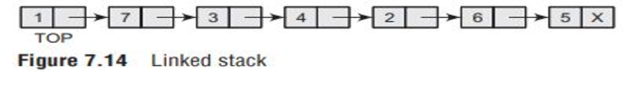 

Push `9`:

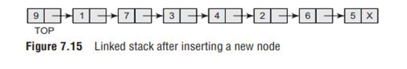 

The new node becomes the topmost node.

### 5.2 Pop in a Linked Stack

**Definition:** Removes the node pointed to by `TOP`.

- If `TOP = NULL`, the stack is empty, so display **UNDERFLOW**.
- Otherwise, save the current top node in a temporary pointer.
- Move `TOP` to the next node.
- Free the old top node.

### Algorithm: POP in a Linked Stack

```text
Step 1: IF TOP = NULL
            PRINT "UNDERFLOW"
            Go to Step 5
        [END OF IF]

Step 2: SET PTR = TOP
Step 3: SET TOP = TOP->NEXT
Step 4: FREE PTR
Step 5: END
```

### Example
Before pop:

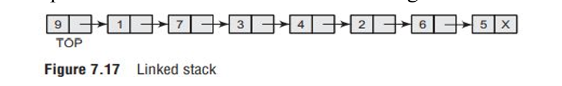 

After pop:

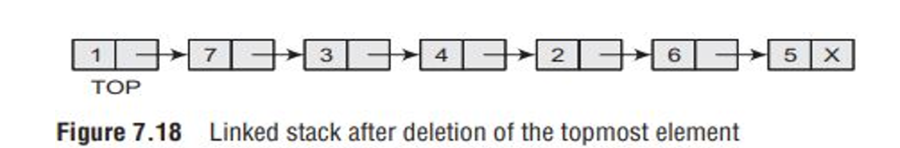 

The old top node (`9`) is removed.

### 5.3 Peek in a Linked Stack

```
Step 1: IF TOP = NULL
            PRINT "UNDERFLOW"
        [END OF IF]
Step 2: SET VAL = TOP->DATA
Step 3: RETURN VAL
Step 4: END
```

## 6. Applications of Stacks


1. Reversing a list/string
2. Checking parentheses
3. Converting infix expressions to postfix
4. Evaluating postfix expressions
5. Converting infix expressions to prefix
6. Evaluating prefix expressions
7. Recursion
8. Tower of Hanoi

### 6.1 Reversing a List

Steps:
1. Read each element from the array, starting at the first index.
2. Push each element onto a stack.
3. After all elements have been pushed, pop them one at a time.
4. Store each popped element back into the array, starting at the first index.

Because a stack follows LIFO, the elements are retrieved in reverse order.

### 6.2 Checking Parentheses

A stack can be used to check whether brackets in an algebraic expression are valid.

Basic idea:
- Each opening bracket must have a matching closing bracket.
- The brackets must close in the correct order.

Examples :
- `(A+B}` — **Invalid** (why? `(` expects `)` not `}`)
- `{A + (B - C)}` — **Valid**

## 7. Stack Complexity and Suitability

| Operation / Property | Array Stack | Linked Stack |
|---|---|---|
| Push | `O(1)` | `O(1)` |
| Pop | `O(1)` | `O(1)` |
| Peek | `O(1)` | `O(1)` |
| Storage for `n` elements | `O(n)` for an array sized to hold `n` elements | `O(n)` |

These are the usual operation costs for the implementations described. An array push can report overflow when its fixed capacity is reached; a linked push requires memory for a new node.

Stacks are suitable when the **most recently added item must be processed first**, such as nested function calls, reversing data, and checking nested parentheses.


## Quick Revision

## Important Definitions

| Term | Definition |
|---|---|
| Stack | Linear data structure where insertion and deletion occur at TOP |
| LIFO | Last-In, First-Out |
| TOP | Pointer/index indicating the top element |
| MAX | Maximum capacity of an array stack |
| Push | Insert an element at TOP |
| Pop | Remove the topmost element |
| Peek | Read the topmost element without removing it |
| Overflow | Attempt to push onto a full array stack |
| Underflow | Attempt to pop from an empty stack |
| Linked stack | Stack implemented using linked-list nodes |


## Last-Minute Memory Points

-   Stack = LIFO
    
-   Push = insert
    
-   Pop = remove
    
-   Peek = view top
    
-   Full stack + push = overflow
    
-   Empty stack + pop = underflow
    
-   Array stack: `TOP = MAX - 1` means full.
    
-   Linked stack: `TOP = NULL` means empty.
    
-   Linked push: add a node at the beginning.
    
-   Linked pop: move `TOP` to `TOP->NEXT`, then free the old node.
    
-   Stack applications: reversal, parentheses checking, expression conversion/evaluation, recursion, Tower of Hanoi.
***
# Stacks

## 1. Polish Notations

Polish notations are three different but equivalent ways of writing arithmetic expressions.

| Notation | Meaning | Example |
|---|---|---|
| Infix | Operator between operands | `A + B` |
| Postfix | Operator after operands | `AB+` |
| Prefix | Operator before operands | `+AB` |

- Infix is the usual way of writing arithmetic expressions.
- Postfix expressions are evaluated from left to right.
- Prefix expressions are evaluated from left to right.

Example: `(A + B) * C`

- Infix: `(A+B)*C`
- Postfix: `AB+C*`
- Prefix: `*+ABC`

## 2. Operator Precedence

| Priority | Operators |
|---|---|
| Higher | `*`, `/`, `%` |
| Lower | `+`, `-` |

Brackets are used to specify the order of evaluation.

## [3. Infix to Postfix Conversion The Easy Way - YouTube CLICK ME TO TELEPORT TO YOUTUBE VIDEO](https://www.youtube.com/watch?v=vXPL6UavUeA) 

To convert an infix expression into postfix, place each operator after its operands while maintaining the correct order of operations.

| Infix | Postfix |
|---|---|
| `(A-B)*(C+D)` | `AB-CD+*` |
| `(A+B)/(C+D)-(D*E)` | `AB+CD+/DE*-` |
| `(A+B)*C` | `AB+C*` |

## 4. Infix to Prefix Conversion

To convert an infix expression into prefix, place each operator before its operands.

| Infix | Prefix |
|---|---|
| `(A+B)*C` | `*+ABC` |
| `(A-B)*(C+D)` | `*-AB+CD` |
| `(A+B)/(C+D)-(D*E)` | `-/+AB+CD*DE` |

> [!attention] digitial version of example is not made since i dont trust ai so u can skip this unless ur brain has OCR
> 
> 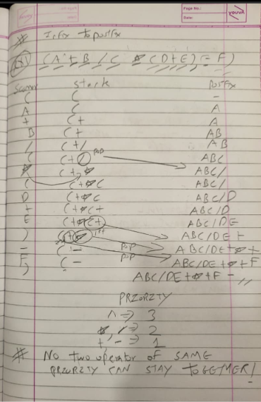
> 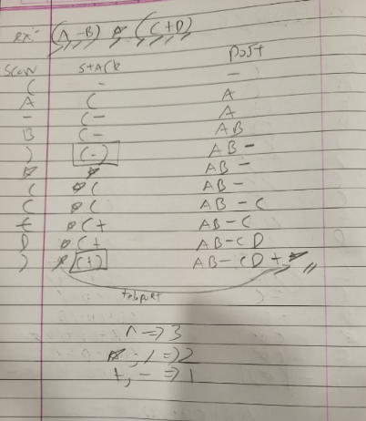
> 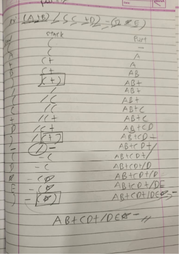 
## Example 1

Infix: `(A+B/C*(D+E)-F)`
### Quick rules

1.  Operand → add directly to postfix.
    
2.  `(` → push onto stack.
    
3.  `)` → pop until `(`, then discard `(`.
    
4.  Operator → pop higher- or equal-priority operators first, stopping at `(`; then push the new operator.
    
5.  End → pop all remaining operators.

Operator priority:

-   `^` → 3
    
-   `*`, `/` → 2
    
-   `+`, `-` → 1

  > [!check] No two operator of same priority can stay together so the one one the left will be eliminated and go to postfix side
  > its a rule made by the cruel fate for the creator as well as users of postfix who has remain single for its whole life and will continue to remain so i pray and hope that there never comes a time that you have to use it yourself or i wont even wish this on my worst enemy (wait i would definietly and so should u cause why not)
> > [!cite] famous last words said by yours truly - Probz (may no one suffer the same fate) (P.S the guy is very much alive even at this momment dont u dare mourn)


## 5. [Evaluate the postfix expression CLICK ME TO TELEPORT TO YOUTUBE VIDEO](https://www.youtube.com/shorts/wBI42bg6l-s)
In postfix evaluation, a stack is used to calculate the result.

Rules:
1. Scan the expression from left to right.
2. If the character is an operand, push it onto the stack.
3. If it is an operator, pop the required operands and perform the operation.
4. Push the result back onto the stack.
5. The final value remaining in the stack is the answer.

Example:
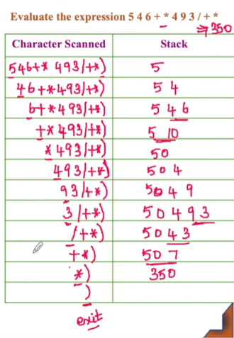 
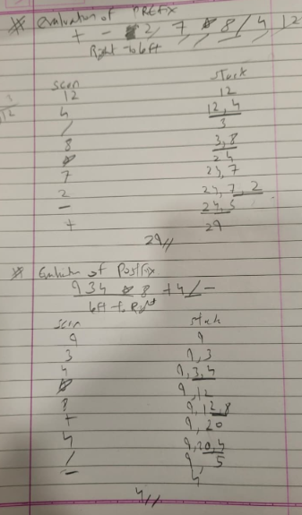 
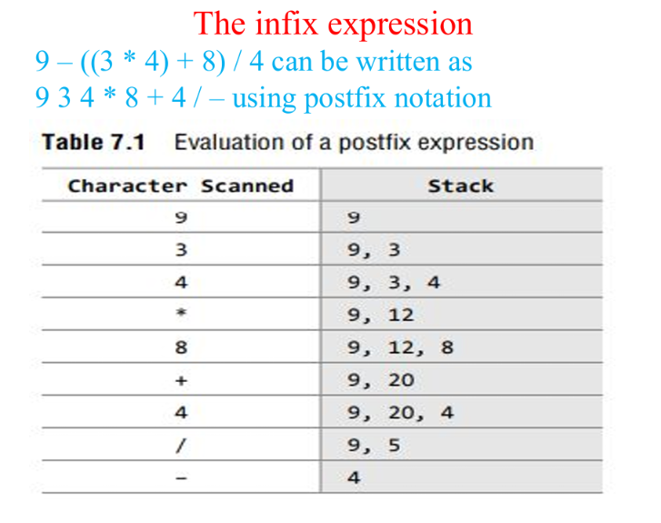 

## infix to prefix?
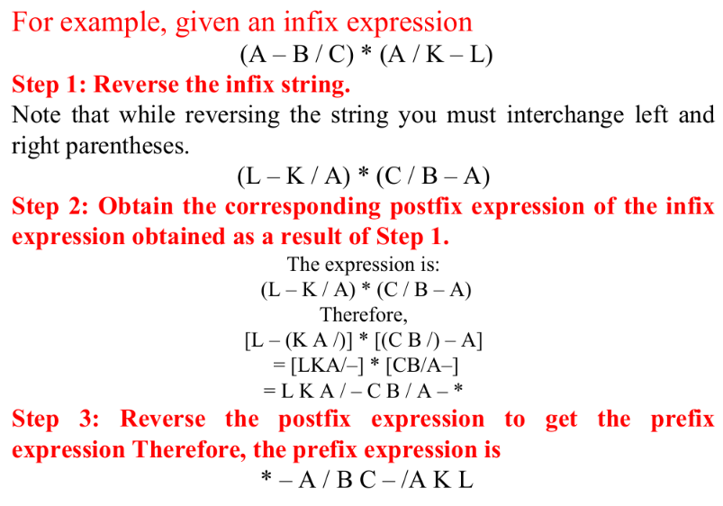 

sound easy? then why dont u try this and also do prefix
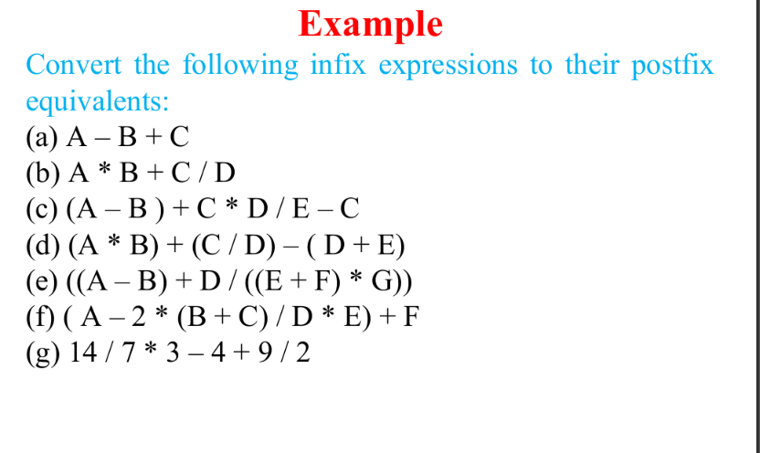 
## 6. Evaluation of a Prefix Expression

In prefix evaluation, scan the expression from **right to left**. Push operands onto the stack. When an operator is encountered, pop the operands, perform the operation, and push the result back.

Example from the PDF:
> [!attention] if u refering the ppt then there is typo in this sum so follow this notes

Prefix expression: `+-27*8/412`
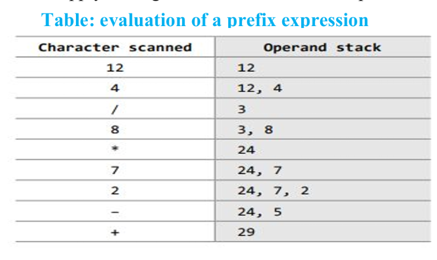 
The PDF's evaluation table gives the final answer as `29`.
 
## 7. Recursion

A recursive function is a function that calls itself to solve a smaller version of a problem until it reaches a condition where no further recursive call is required.

Example: Factorial

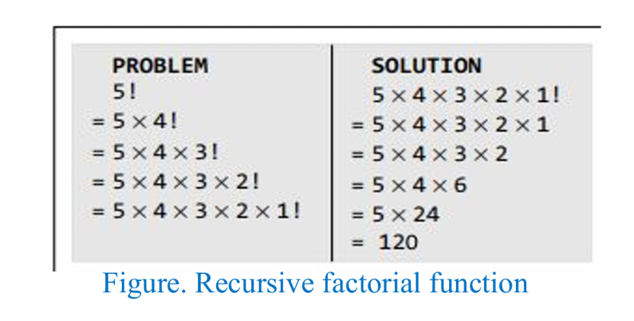 

A recursive function uses the system stack to temporarily store the return address and local variables of the calling function.

### Advantages of recursion

- Recursive solutions are often shorter and simpler.
- Code can be clearer and easier to understand.
- It follows a divide-and-conquer approach.
- It can be more efficient in some cases.

### Disadvantages of recursion

- Recursion can be difficult to understand.
- Deep recursion requires more stack space.
- It generally uses more memory and execution time than an equivalent non-recursive solution.
- Finding bugs can be difficult.

## 8. Tower of Hanoi
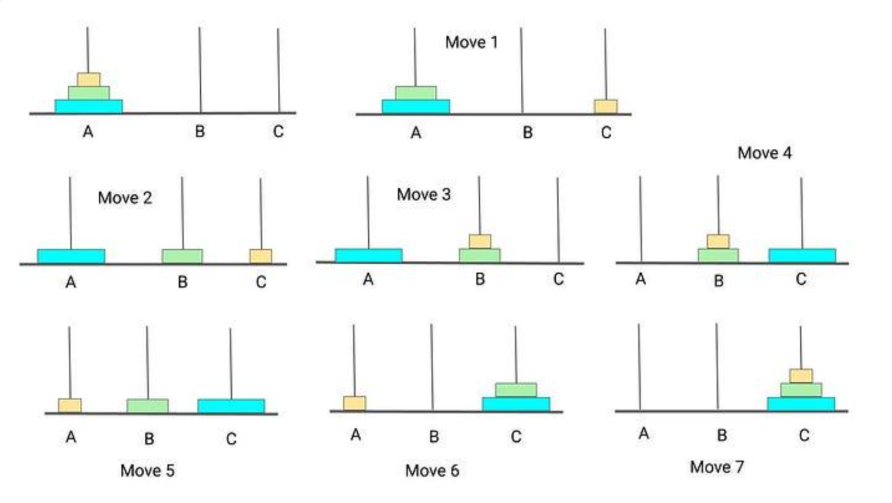 (the rigged games photos u may have seen while travelling in train yes that game uses this)
Tower of Hanoi is a problem that uses recursion to move disks between three rods.
 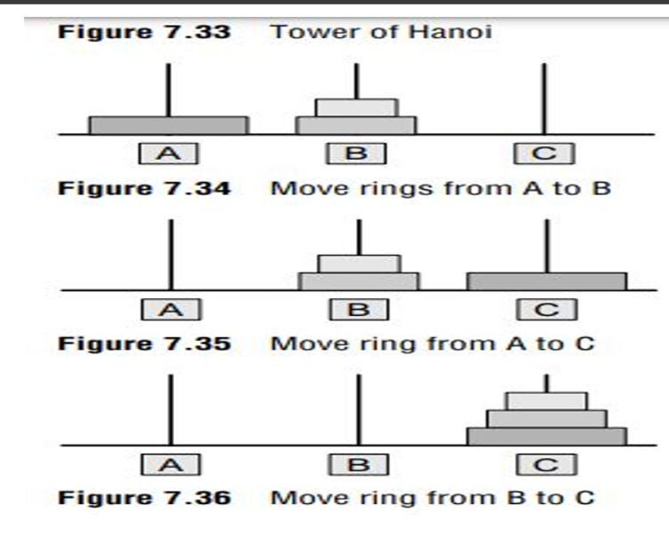 
- A = Source rod
- B = Auxiliary (spare) rod
- C = Destination rod

### Rules

1. Move only one disk at a time.
2. Only the top disk can be moved.
3. A smaller disk must always be above a larger disk.

### Steps for moving `n` disks from A to C

1. Move the top `n-1` disks from A to B using C.
2. Move the remaining largest disk from A to C.
3. Move the `n-1` disks from B to C using A.

Minimum number of moves: `T(n) = 2^n - 1`

For 3 disks, the minimum number of moves is `2^3 - 1 = 7`.

## 9. Stack as an ADT

A stack is a linear Abstract Data Type (ADT) in which insertion and deletion take place at one end called the TOP. It follows the LIFO (Last In, First Out) principle.

An ADT specifies the operations that can be performed, not how they are implemented.

| Operation | Description | Complexity |
|---|---|---|
| `Create()` | Creates an empty stack | `O(1)` |
| `Push(x)` | Inserts an element at the top | `O(1)` |
| `Pop()` | Removes and returns the top element | `O(1)` |
| `Peek()` | Returns the top element without removing it | `O(1)` |
| `isEmpty()` | Checks whether the stack is empty | `O(1)` |
| `isFull()` | Checks whether an array stack is full | `O(1)` |
| `Size()` | Returns the number of elements | `O(1)` |

## 10. C Program: Stack Operations

This simple program performs push, pop, peek, and display using an array.

```c
#include <stdio.h>
#define MAX 5

int stack[MAX], top = -1;

void push(int val)
{
    if (top == MAX - 1)
        printf("STACK OVERFLOW");
    else
        stack[++top] = val;
}

int pop()
{
    if (top == -1)
    {
        printf("STACK UNDERFLOW");
        return -1;
    }
    return stack[top--];
}

int peek()
{
    if (top == -1)
    {
        printf("STACK IS EMPTY");
        return -1;
    }
    return stack[top];
}

void display()
{
    int i;

    if (top == -1)
        printf("STACK IS EMPTY");
    else
    {
        for (i = top; i >= 0; i--)
            printf("%d ", stack[i]);
    }
}

int main()
{
    push(10);
    push(20);
    push(30);

    display();
    printf("\nTop element: %d", peek());
    printf("\nDeleted element: %d", pop());
    printf("\nStack after pop: ");
    display();

    return 0;
}
```

### Output

```text
30 20 10
Top element: 30
Deleted element: 30
Stack after pop: 20 10
```

## Quick Revision

- Stack = LIFO.
- Push = insert.
- Pop = remove and return the top element.
- Peek = return the top element without removing it.
- Overflow = pushing into a full stack.
- Underflow = popping from an empty stack.
- Recursion uses the system stack.
- Tower of Hanoi is an application of recursion.
- Basic stack operations listed in the ADT table take `O(1)` time.

***
u think this was difficult? wait untill u see queue and linkedlist, (i bet u will be dead when trees and graph comes)