# Queues 
> [!caution] DONT COPY MY CODE CODE COMMENTS OR ALGOTIHM COMMENTS IN EXAM DONT 

## 1. Introduction to Queue

A **queue** is a linear data structure that follows **FIFO (First-In, First-Out)**. The element inserted first is the first element removed.

Real-life examples:
- People waiting for a bus or at a ticket counter.
- Cars waiting at a toll bridge.
- Luggage moving on a conveyor belt.

### Basic terms
- **FRONT:** Points to the element that will be deleted next.
- **REAR:** Points to the position where a new element is inserted.
- **Enqueue / Insert:** Add an element at the rear.
- **Dequeue / Delete:** Remove an element from the front.
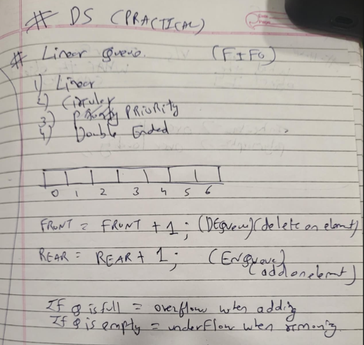 
A queue can be implemented using an array or a linked list.

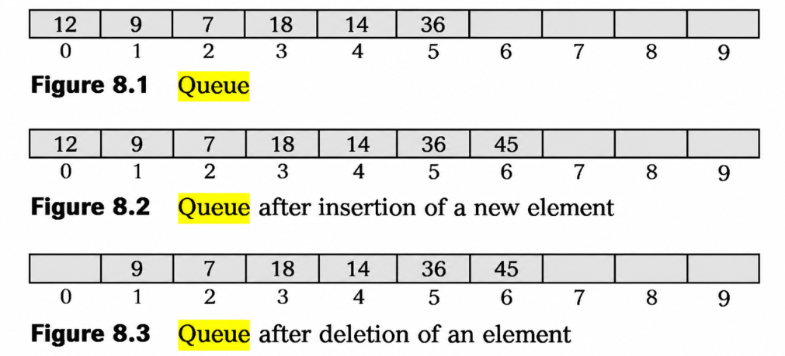 

---

## 2. Queue Using an Array (Linear Queue)

A linear queue can be represented using an array and two variables, `FRONT` and `REAR`.
 

### Initial conditions
- Initially, `FRONT = -1` and `REAR = -1`.
- When the first element is inserted, set `FRONT = 0` and `REAR = 0`.
- For each subsequent insertion, increment `REAR`.
- For deletion, increment `FRONT`.

### Insertion algorithm (Enqueue)

```JS
Step 1: IF REAR = MAX - 1
            PRINT "OVERFLOW"
            Go to Step 4
        [END OF IF]

Step 2: IF FRONT = -1 and REAR = -1 // check if queue is empty
            SET FRONT = REAR = 0 //set starting values for both
        ELSE
            SET REAR = REAR + 1 // i++; counter by 1 to add eleement there
        [END OF IF]

Step 3: SET QUEUE[REAR] = NUM // elemenet is actually added there

Step 4: EXIT
```

### Deletion algorithm (Dequeue)

```js
Step 1: IF FRONT = -1 OR FRONT > REAR
            PRINT "UNDERFLOW"
        ELSE
            SET VAL = QUEUE[FRONT] // We save the value before moving `FRONT`, so we don't lose track of which element was deleted.
            SET FRONT = FRONT + 1 //now the element is not needed so we bring the front to front 
        [END OF IF]

Step 2: EXIT
```

### Overflow and underflow
- **Overflow:** Insertion is attempted when `REAR = MAX - 1`.
- **Underflow:** Deletion is attempted when the queue is empty. In the linear queue described in the PDF, this is checked using `FRONT = -1` or `FRONT > REAR`.
- When `FRONT = -1` and `REAR = -1`, the queue is empty.

### Limitation of a linear queue
A fixed-size array has a limited capacity. After deletions, empty positions at the beginning cannot be reused by ordinary linear-queue insertion. The queue may report overflow when `REAR = MAX - 1` even though there are unused positions before `FRONT`.

Shifting elements to the left can reclaim space, but it can be time-consuming. A circular queue avoids this problem by reusing vacant positions.

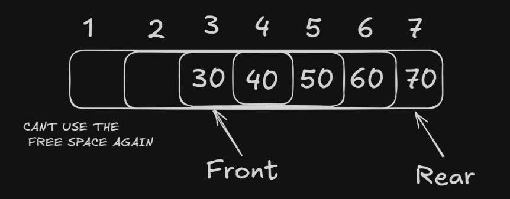 

---

## 3. Queue Using a Linked List

A linked queue stores elements in nodes. Each node contains data and a link to the next node. The queue maintains `FRONT` and `REAR` pointers.

- Insertion takes place at `REAR`.
- Deletion takes place at `FRONT`.
- When the queue is empty, `FRONT = NULL`.
- For the first insertion, both `FRONT` and `REAR` point to the new node.
- For later insertions, link the current rear node to the new node and update `REAR`.

### Insertion algorithm in a linked queue
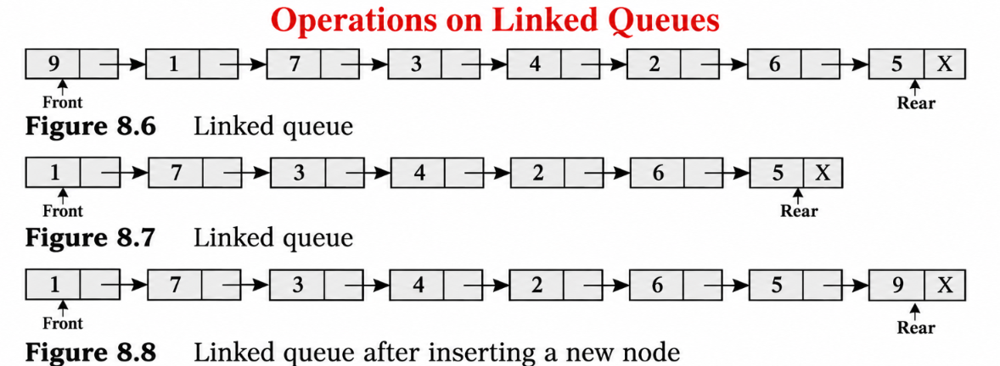 
```JS
Step 1: Allocate memory for the new node and name it PTR
Step 2: SET PTR->DATA = VAL //Store the value to be inserted in the `DATA` part of the new node.
Step 3: IF FRONT = NULL //Check whether the queue is empty
            SET FRONT = REAR = PTR // Since there is no existing node, the new node becomes both the first and the last node.
            SET FRONT->NEXT = NULL // because there is no next node.
        ELSE
            SET REAR->NEXT = PTR //connect the current last node to the new node.
            SET REAR = PTR //move `REAR` to the new last node.
            SET REAR->NEXT = NULL //mark the new last node as the end of the queue.
        [END OF IF]
Step 4: END
```

### Deletion algorithm in a linked queue
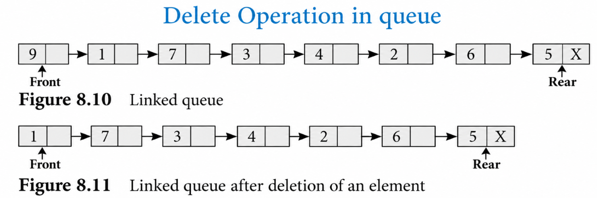 
```JS
Step 1: IF FRONT = NULL //Check whether the queue is empty
            Write "Underflow"
            Go to Step 5
        [END OF IF]
Step 2: SET PTR = FRONT //Store the address of the first node
Step 3: SET FRONT = FRONT->NEXT //Move FRONT to the next node
Step 4: FREE PTR
Step 5: END
```

### Advantages and use
- The size can grow dynamically, subject to available memory.
- It avoids reserving a large fixed array in advance.
- For a linked queue with `n` elements, storage is `O(n)` and typical insertion/deletion time is `O(1)`.

> **Diagram placeholder:** Draw nodes connected by arrows, with `FRONT` pointing to the first node and `REAR` to the last node.

---

## 4. Circular Queue
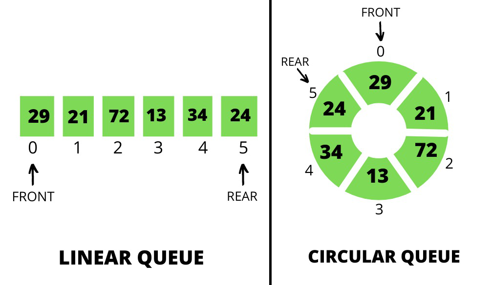 
A **circular queue** connects the last array position back to the first position conceptually. After reaching the final index, the rear can wrap around to index `0` if there is space.

### Why it is needed
In a linear queue, deleting elements from the front leaves unused spaces that cannot normally be reused once `REAR = MAX - 1`. A circular queue reuses those spaces instead of wasting them.
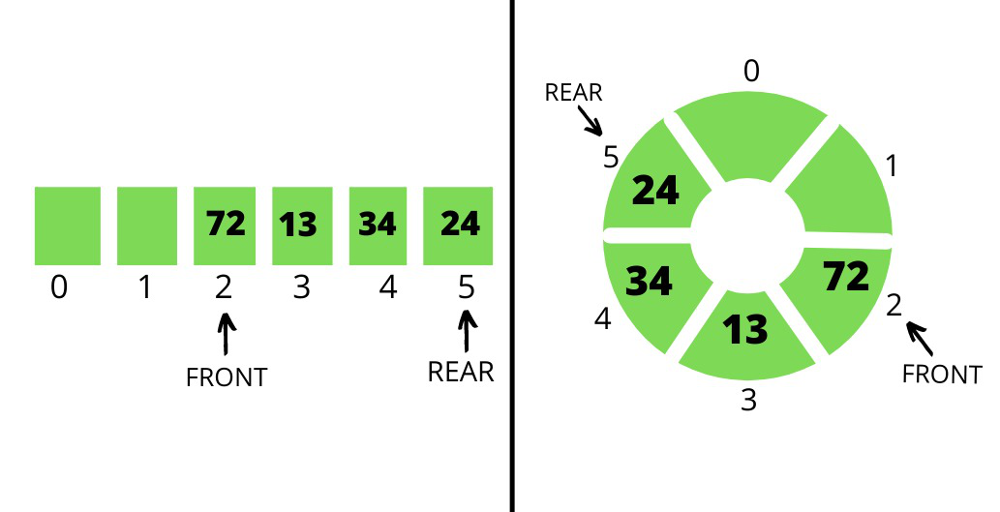 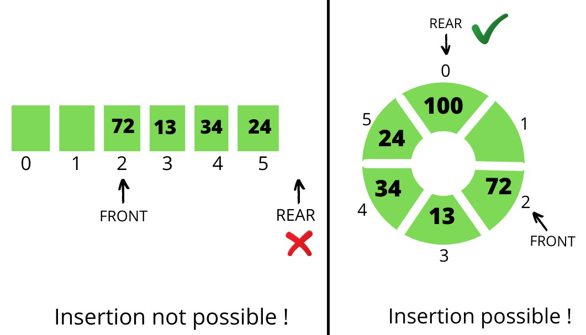 
### Conditions and insertion
According to the provided PDF's algorithm:
1. If `FRONT = 0` and `REAR = MAX - 1`, report **OVERFLOW**.
2. If the queue is empty (`FRONT = -1` and `REAR = -1`), set `FRONT = REAR = 0`.
3. If `REAR = MAX - 1` and `FRONT != 0`, set `REAR = 0`.
4. Otherwise, increment `REAR`.
5. Store the value at `QUEUE[REAR]`.

### Insertion algorithm

```js
Step 1: IF FRONT = 0 and REAR = MAX - 1
            Write "OVERFLOW"
            Go to Step 4
        [END OF IF]

Step 2: IF FRONT = -1 and REAR = -1
            SET FRONT = REAR = 0
        ELSE IF REAR = MAX - 1 and FRONT != 0
            SET REAR = 0
        ELSE
            SET REAR = REAR + 1
        [END OF IF]

Step 3: SET QUEUE[REAR] = VAL
Step 4: EXIT
```

### Deletion conditions
1. If `FRONT = -1`, the queue is empty: report **UNDERFLOW**.
2. If `FRONT = REAR`, deleting the only element makes the queue empty, so set `FRONT = REAR = -1`.
3. If `FRONT = MAX - 1`, set `FRONT = 0` after deletion.
4. Otherwise, increment `FRONT`.

### Deletion algorithm

```js
Step 1: IF FRONT = -1
            Write "UNDERFLOW"
            Go to Step 4
        [END OF IF]

Step 2: SET VAL = QUEUE[FRONT]

Step 3: IF FRONT = REAR
            SET FRONT = REAR = -1
        ELSE IF FRONT = MAX - 1
            SET FRONT = 0
        ELSE
            SET FRONT = FRONT + 1
        [END OF IF]

Step 4: EXIT
```


---

## 5. Deque (Double-Ended Queue)
 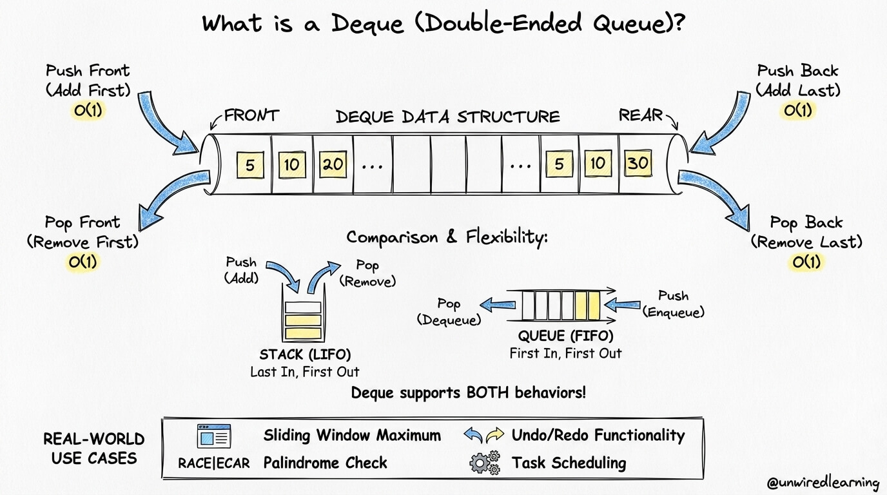 
A **deque** (pronounced “deck”) is a linear data structure in which insertion and deletion can be performed at **both FRONT and REAR**. No insertion or deletion is performed in the middle.

It can be implemented using a circular array or a circular doubly linked list. In a doubly linked list, each node has both `PREV` and `NEXT` pointers.

### Types of deque
- **Input-restricted deque:** Insertion is allowed at only one end; deletion is allowed at both ends.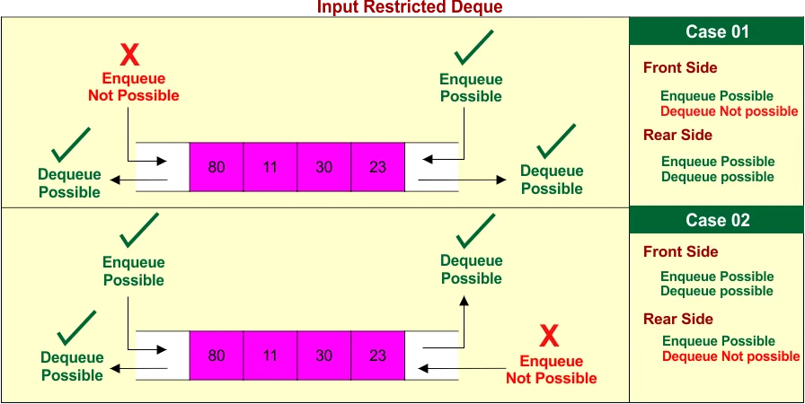 
- **Output-restricted deque:** Deletion is allowed at only one end; insertion is allowed at both ends.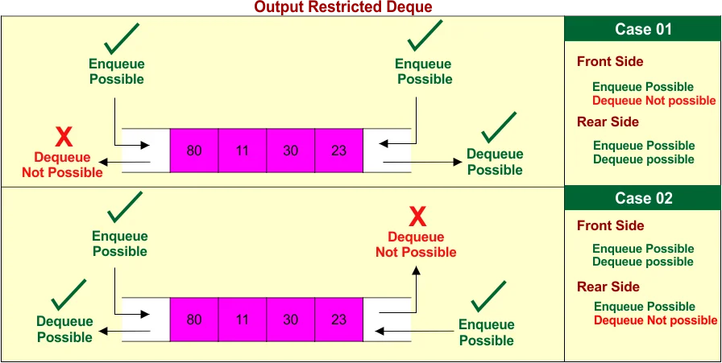 

### Main operations

| Operation | Purpose |
|---|---|
| `insertFront()` | Insert at the front |
| `insertRear()` | Insert at the rear |
| `deleteFront()` | Delete from the front |
| `deleteRear()` | Delete from the rear |
| `getFront()` | Return the front element |
| `getRear()` | Return the rear element |
| `isEmpty()` | Check whether the deque is empty |
| `isFull()` | Check whether the deque is full |
| `size()` | Return the number of elements |

### Advantages
- Insertion and deletion are possible at both ends.
- More flexible than a standard queue.
- Can be used to implement both a stack and a queue.
- Useful in scheduling and sliding-window algorithms.

### Disadvantages
- More complex than a simple stack or queue.
- Array implementations require careful management of `FRONT` and `REAR`.
- A fixed-size array deque can become full.
- Linked implementations require extra memory for pointers.


---

## 6. Priority Queue

A **priority queue** is a data structure in which each element has an associated priority. Elements are processed according to priority rather than simply in insertion order.

### Rules
- The element with higher priority is processed before an element with lower priority.
- Elements with equal priority are processed on a **First-Come-First-Served (FCFS)** basis.

Priority queues can be implemented using arrays or linked lists. The PDF also lists heaps and balanced search trees as possible implementations.

### Types

**Max-priority queue:** The element with the largest priority value is removed first.

Example: `A(3), B(5), C(1), D(4)`

Deletion order: `B(5) → D(4) → A(3) → C(1)`

**Min-priority queue:** The element with the smallest priority value is removed first.

For the same elements, deletion order is:

`C(1) → A(3) → D(4) → B(5)`

### Array implementation (unsorted array)
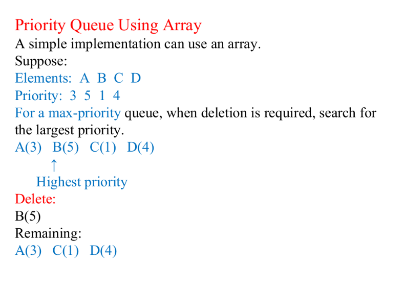 
For an unsorted array:
- Insert: `O(1)`
- Find highest priority: `O(n)`
- Delete highest priority: `O(n)`
- Peek: `O(n)`

Finding or deleting the highest-priority element requires searching the array.

### Linked-list implementation
In a priority queue implemented using a sorted linked list, nodes are arranged by priority. For a descending-priority list, the first node has the highest priority.
- **Insertion:** Place the new node at its appropriate priority position.
- **Deletion:** Remove the first node.
- If two elements have equal priority, preserve FCFS order.

### Applications
- Operating-system process scheduling.
- CPU scheduling.
- Hospital emergency systems.
- Event simulation.


---

## 7. Comparison of Stack, Queue, Circular Queue, and Deque

| Feature | Stack | Queue | Circular Queue | Deque | Priority Queue |
| --- | --- | --- | --- | --- | --- |
| Principle | LIFO | FIFO | FIFO, circular arrangement | Operations at both ends | Based on priority |
| Insertion | Top | Rear | Rear | Front or rear | According to priority (or at the end in an unsorted array) |
| Deletion | Top | Front | Front | Front or rear | Highest-priority element first |
| Main access | Top | Front/rear | Front/rear | Front/rear | Highest-priority element |
| Main advantage | Simple LIFO processing | Simple FIFO processing | Reuses vacant array positions | Flexible end operations | Processes important elements first |
| Main limitation | Restricted access | Linear array may waste space | More complex than a simple queue | More complex implementation | Finding the highest priority can require searching |

---

## 8. Important Terms to Memorize

- **FIFO:** First-In, First-Out.
- **LIFO:** Last-In, First-Out.
- **FRONT:** Position of the next element to be deleted from a queue.
- **REAR:** Position where the next element is inserted.
- **Enqueue:** Insert into a queue.
- **Dequeue:** Delete from a queue.
- **Overflow:** Attempt to insert when the queue is full.
- **Underflow:** Attempt to delete from an empty queue.
- **Deque:** Double-ended queue; insertion and deletion are possible at both ends.
- **Priority queue:** Processes elements according to priority, using FCFS for equal priorities.

---

## 10. Quick Revision

- Queue follows **FIFO**; insertion is at `REAR`, deletion is at `FRONT`.
- Linear queue can waste array space after deletions.
- Circular queue reuses vacant positions by wrapping around.
- Linked queue uses `FRONT` and `REAR` pointers and can grow dynamically.
- Deque allows insertion and deletion at both ends.
- Priority queue processes elements according to priority; equal priorities follow FCFS.
- For a linked queue with `n` elements, the PDF states storage `O(n)` and typical operation time `O(1)`.
- For an unsorted-array priority queue, insertion is `O(1)`, while finding/deleting the highest priority and peek are `O(n)`.
