## 1. Introduction to Linked Lists

A **linked list** is a linear collection of data elements called **nodes**. Each node stores data and a pointer (address) to another node. Linked lists can be used as building blocks for data structures such as stacks and queues.

Unlike an array, the nodes of a linked list **do not need to occupy consecutive memory locations**. Nodes are connected through pointers, and memory is allocated as required.

### Structure of a node

In a basic singly linked list, each node contains two parts:
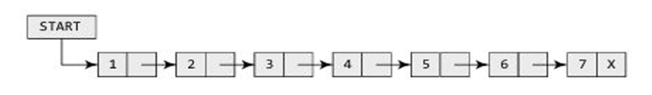 
- **DATA:** The information stored in the node.
- **NEXT:** The address of the next node.

The last node stores `NULL` in its `NEXT` field to indicate the end of the list. In the PDF diagrams, `X` represents `NULL`. The pointer variable `START` stores the address of the first node.

If `START = NULL`, the list is empty.

```c
struct node
{
    int data;
    struct node *next;
};
```

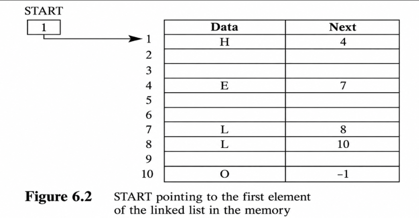 
`-1 indicates END while NULL indicates EMPTY`
### Important terms

| Term | Meaning |
|---|---|
| `START` | Pointer containing the address of the first node |
| `DATA` | Value stored in a node |
| `NEXT` | Address of the next node |
| `NULL` | Indicates that there is no next node |
| `PTR` | Temporary pointer used to access/traverse nodes |
| `AVAIL` | Pointer to available free memory nodes (free pool) |
| `NEW_NODE` | Pointer referring to the node being inserted |
| `PREPTR` | Pointer to the node preceding the node pointed to by `PTR` |
| `VAL` | New value to be inserted |
| `NUM` | Value used to identify a target node |
| `TEMP` | Temporary pointer used during deletion |

### Memory allocation and the free pool

When a new node is required, the program takes an available memory cell and uses it for the node. The computer maintains a list of available memory cells called the **free pool**. The PDF uses `AVAIL` to refer to this available space.

- **Overflow:** Occurs when `AVAIL = NULL`, meaning no free memory cell is available.
- When a node is deleted, its memory should be released using `FREE`.

> **Diagram placeholder:** Show nodes stored at non-consecutive addresses and connected by `NEXT` pointers. Add a separate group labelled “free pool”.
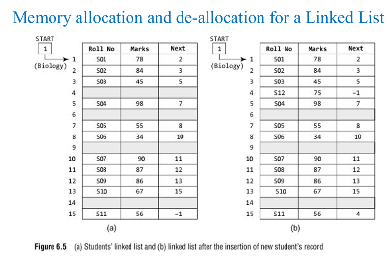 
---

## 2. Singly Linked Lists

A **singly linked list** is the simplest linked list. Each node contains data and a pointer to the next node. Traversal is possible in only one direction: forward.

Example:

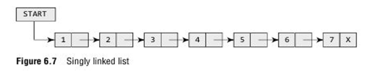 

### Characteristics

- Each node has one `NEXT` pointer.
- The last node points to `NULL`.
- Traversal is only forward.
- Nodes do not need contiguous memory locations.
- The list can grow or shrink as memory is allocated or freed.

---

## 3. Traversing, Counting, and Searching a Singly Linked List

### 3.1 Traversing a linked list

**Traversal** means visiting the nodes one by one to perform an operation, such as displaying their data.


```js
Step 1: [INITIALIZE] SET PTR = START
Step 2: Repeat Steps 3 and 4 while PTR != NULL
Step 3:     Apply Process to PTR->DATA
Step 4:     SET PTR = PTR->NEXT
          [END OF LOOP]
Step 5: EXIT
```

**Explanation:** Set `PTR` to the first node, process its data, move to the next node, and stop when `PTR = NULL`.

### 3.2 Counting the nodes

The count begins at zero and increases by one for each node visited.

```js
Step 1: [INITIALIZE] SET COUNT = 0
Step 2: [INITIALIZE] SET PTR = START
Step 3: Repeat Steps 4 and 5 while PTR != NULL
Step 4:     SET COUNT = COUNT + 1
Step 5:     SET PTR = PTR->NEXT
          [END OF LOOP]
Step 6: Write COUNT
Step 7: EXIT
```

### 3.3 Searching for a value

The algorithm checks each node's `DATA` against `VAL`. If a match is found, `POS` stores the address of that node. If the value is not found, `POS` is set to `NULL`.

```js
Step 1: [INITIALIZE] SET PTR = START
Step 2: Repeat Step 3 while PTR != NULL
Step 3:     IF VAL = PTR->DATA
                SET POS = PTR
                Go to Step 5
            ELSE
                SET PTR = PTR->NEXT
            [END OF IF]
          [END OF LOOP]
Step 4: SET POS = NULL
Step 5: EXIT
```

**Example from the PDF:** To search for `VAL = 4` in `1 → 7 → 3 → 4 → 2 → 6 → 5 → NULL`, inspect 1, 7, and 3 before finding 4. `POS` then stores the address of the node containing 4.
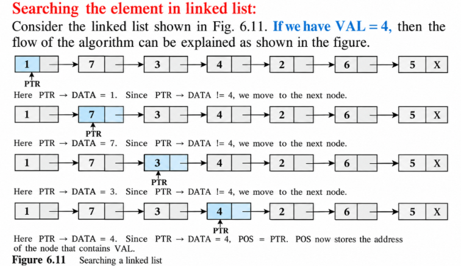 

---

## 4. Insertion in a Singly Linked List

Insertion means adding a new node to an existing list. The PDF describes four cases:

1. At the beginning
2. At the end
3. After a given node
4. Before a given node

Before inserting, check whether a free node is available. If `AVAIL = NULL`, report `OVERFLOW`.

### 4.1 Insert a node at the beginning

**Purpose:** Make the new node the first node.

The PDF's algorithm:

```js
Step 1: IF AVAIL = NULL
            Write OVERFLOW
            Go to Step 7
        [END OF IF]
Step 2: SET NEW_NODE = AVAIL
Step 3: SET AVAIL = AVAIL->NEXT
Step 4: SET NEW_NODE->DATA = VAL
Step 5: SET NEW_NODE->NEXT = START
Step 6: SET START = NEW_NODE
Step 7: EXIT
```

**What happens:** Take a free node from `AVAIL`, store `VAL`, link the new node to the current first node, and move `START` to the new node.

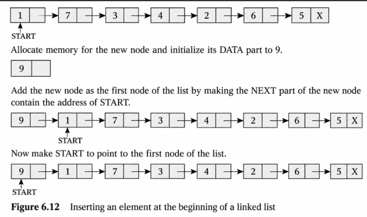 
### 4.2 Insert a node at the end

**Purpose:** Attach the new node after the current last node.

The PDF's algorithm:

```js
Step 1: IF AVAIL = NULL
            Write OVERFLOW
            Go to Step 10
        [END OF IF]
Step 2: SET NEW_NODE = AVAIL
Step 3: SET AVAIL = AVAIL->NEXT
Step 4: SET NEW_NODE->DATA = VAL
Step 5: SET NEW_NODE->NEXT = NULL
Step 6: SET PTR = START
Step 7: Repeat Step 8 while PTR->NEXT != NULL
Step 8:     SET PTR = PTR->NEXT
          [END OF LOOP]
Step 9: SET PTR->NEXT = NEW_NODE
Step 10: EXIT
```

**What happens:** Create the node and store the value; set its `NEXT` to `NULL`; use `PTR` to find the current last node; then link the old last node to `NEW_NODE`.

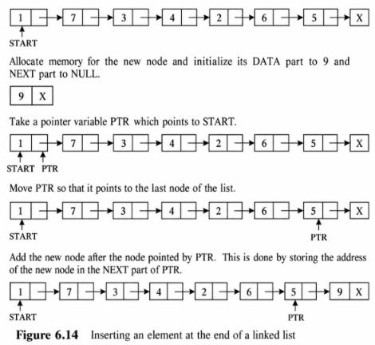 
*Note: The printed algorithm assumes the list already contains a node; it does not show a separate empty-list case.*

### 4.3 Insert a node after a given node

**Purpose:** Insert a new node immediately after the node containing a specified value.

The PDF illustrates insertion of `9` after the node containing `3`:

```js
Before:  1 → 7 → 3 → 4 → 2 → 6 → 5 → NULL
After:   1 → 7 → 3 → 9 → 4 → 2 → 6 → 5 → NULL
```

The diagram shows `PTR` moving to the target node and `PREPTR` identifying the node before it during traversal.

**Pointer changes:**
1. Set the new node's `NEXT` to the target node's current `NEXT`.
2. Set the target node's `NEXT` to the new node.

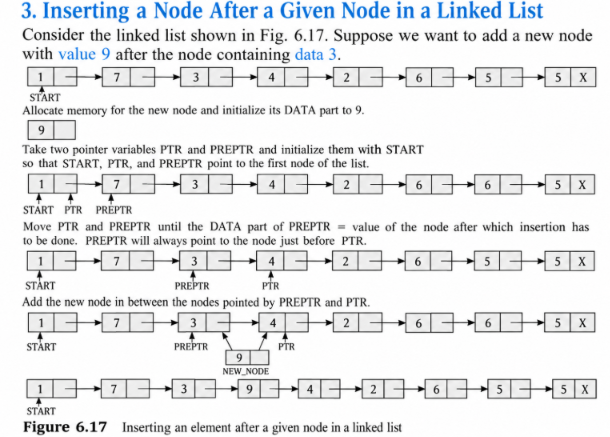 

*The PDF illustrates this case with a diagram but does not provide a separate numbered algorithm for it.*

### 4.4 Insert a node before a given node
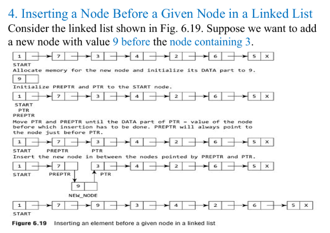 
**Purpose:** Insert a new node immediately before the node containing `NUM`.

The PDF's algorithm:

```js
Step 1: IF AVAIL = NULL
            Write OVERFLOW
            Go to Step 12
        [END OF IF]
Step 2: SET NEW_NODE = AVAIL
Step 3: SET AVAIL = AVAIL->NEXT
Step 4: SET NEW_NODE->DATA = VAL
Step 5: SET PTR = START
Step 6: SET PREPTR = PTR
Step 7: Repeat Steps 8 and 9 while PTR->DATA != NUM
Step 8:     SET PREPTR = PTR
Step 9:     SET PTR = PTR->NEXT
          [END OF LOOP]
Step 10: SET PREPTR->NEXT = NEW_NODE
Step 11: SET NEW_NODE->NEXT = PTR
Step 12: EXIT
```

**What happens:** `PTR` moves until it points to the node containing `NUM`; `PREPTR` keeps track of the previous node. Link `PREPTR` to the new node and link the new node to `PTR`.


---

## 5. Deletion from a Singly Linked List

Deletion removes a node from the list. The PDF covers three cases:

1. Delete the first node.
2. Delete the last node.
3. Delete the node after a given node.

**Underflow** occurs when deletion is attempted on an empty list (`START = NULL`). The memory of a deleted node must be released using `FREE`.

### 5.1 Delete the first node

The PDF's algorithm:

```js
Step 1: IF START = NULL
            Write UNDERFLOW
            Go to Step 5
        [END OF IF]
Step 2: SET PTR = START
Step 3: SET START = START->NEXT
Step 4: FREE PTR
Step 5: EXIT
```

**What happens:** Check whether the list is empty, save the first node's address in `PTR`, move `START` to the next node, and free the old first node.

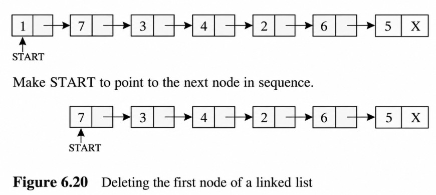 

### 5.2 Delete the last node

The PDF's algorithm:

```js
Step 1: IF START = NULL
            Write UNDERFLOW
            Go to Step 8
        [END OF IF]
Step 2: SET PTR = START
Step 3: Repeat Steps 4 and 5 while PTR->NEXT != NULL
Step 4:     SET PREPTR = PTR
Step 5:     SET PTR = PTR->NEXT
          [END OF LOOP]
Step 6: SET PREPTR->NEXT = NULL
Step 7: FREE PTR
Step 8: EXIT
```

**What happens:** `PTR` moves to the last node while `PREPTR` stays at the node before it. Set `PREPTR->NEXT = NULL` to make it the new last node, then free the old last node.

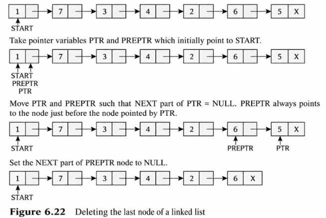 

*Note: The printed algorithm does not show a separate case for a list containing only one node.*

### 5.3 Delete the node after a given node

The PDF's algorithm:

```js
Step 1: IF START = NULL
            Write UNDERFLOW
            Go to Step 10
        [END OF IF]
Step 2: SET PTR = START
Step 3: SET PREPTR = PTR
Step 4: Repeat Steps 5 and 6 while PREPTR->DATA != NUM
Step 5:     SET PREPTR = PTR
Step 6:     SET PTR = PTR->NEXT
          [END OF LOOP]
Step 7: SET TEMP = PTR
Step 8: SET PREPTR->NEXT = PTR->NEXT
Step 9: FREE TEMP
Step 10: EXIT
```

**What happens:** Search for the node containing `NUM`. `PREPTR` points to that node and `PTR` points to the node after it. Save the node to be removed in `TEMP`, link `PREPTR` directly to the node after `PTR`, and free `TEMP`.

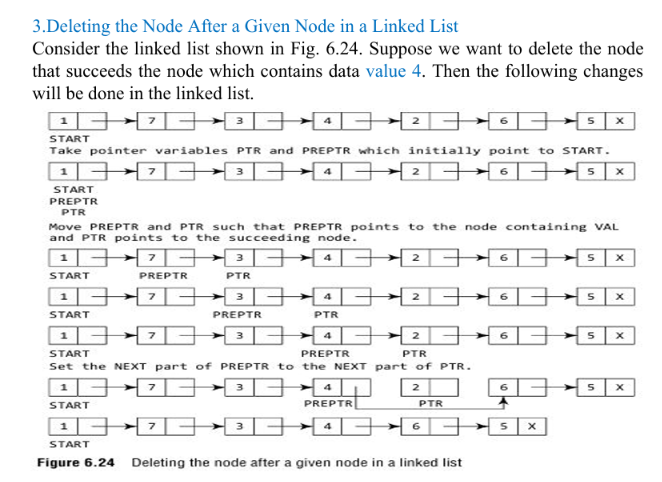 


## Advantages, Disadvantages, and Applications of Singly Linked Lists

### Advantages

| No. | Advantage | Explanation |
| --- | --- | --- |
| 1   | Dynamic size | The list can grow or shrink as required. |
| 2   | Efficient insertion and deletion | Nodes can be inserted or deleted without shifting other elements when the required position is known. |
| 3   | Non-contiguous memory | Nodes do not need to be stored in consecutive memory locations. |
| 4   | Memory allocated as required | Memory is allocated when new nodes are needed. |

### Disadvantages

| No. | Disadvantage | Explanation |
| --- | --- | --- |
| 1   | No backward traversal | Nodes can only be traversed in the forward direction. |
| 2   | Extra memory required | Each node needs extra memory to store the `NEXT` pointer. |
| 3   | Sequential access | Accessing an element by position requires traversing the list from the beginning. |
| 4   | Searching takes `O(n)` time | In the worst case, every node must be checked to find an element. |

### Applications

| No. | Application | Explanation |
| --- | --- | --- |
| 1   | Implementing stacks and queues | Linked lists can store elements dynamically in stacks and queues. |
| 2   | Polynomial representation | Each node can store a polynomial term, such as its coefficient and exponent. |
| 3   | Dynamic memory management | Linked lists can be used to maintain and manage available memory blocks. |
| 4   | Graph adjacency lists | Linked lists can store the neighbouring vertices of a graph vertex. |
| 5   | Maintaining dynamic collections | Useful for storing collections of data whose size changes during program execution. |

***

## 6. Circular Linked Lists

In a **circular linked list**, the last node points back to the first node instead of pointing to `NULL`. A circular linked list can be singly circular or doubly circular.

Example:

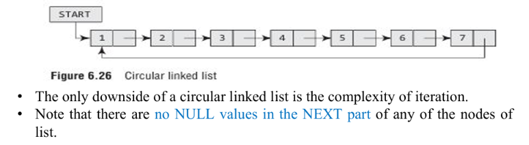 

### Characteristics

- The last node's `NEXT` points to `START`.
- There is no `NULL` in the `NEXT` field of the nodes.
- Traversal can continue around the list.
- There is no natural end, so traversal must stop when it reaches the starting node again.
- The PDF notes that circular lists can be more complex to iterate through and may cause an infinite loop if the stopping condition is wrong.

### 6.1 Insert a node at the beginning

The PDF's algorithm:

```js
Step 1: IF AVAIL = NULL
            Write OVERFLOW
            Go to Step 11
        [END OF IF]
Step 2: SET NEW_NODE = AVAIL
Step 3: SET AVAIL = AVAIL->NEXT
Step 4: SET NEW_NODE->DATA = VAL
Step 5: SET PTR = START
Step 6: Repeat Step 7 while PTR->NEXT != START
Step 7:     SET PTR = PTR->NEXT
          [END OF LOOP]
Step 8: SET NEW_NODE->NEXT = START
Step 9: SET PTR->NEXT = NEW_NODE
Step 10: SET START = NEW_NODE
Step 11: EXIT
```

**What happens:** Find the last node by moving `PTR` until its `NEXT` points to `START`. Make the new node point to the old `START`, make the old last node point to the new node, and update `START`.
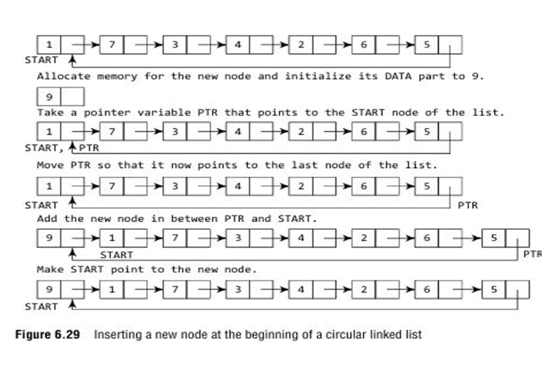 
### 6.2 Insert a node at the end

The PDF's algorithm:

```js
Step 1: IF AVAIL = NULL
            Write OVERFLOW
            Go to Step 10
        [END OF IF]
Step 2: SET NEW_NODE = AVAIL
Step 3: SET AVAIL = AVAIL->NEXT
Step 4: SET NEW_NODE->DATA = VAL
Step 5: SET NEW_NODE->NEXT = START
Step 6: SET PTR = START
Step 7: Repeat Step 8 while PTR->NEXT != START
Step 8:     SET PTR = PTR->NEXT
          [END OF LOOP]
Step 9: SET PTR->NEXT = NEW_NODE
Step 10: EXIT
```

The new node points to `START`, and the old last node points to the new node. `START` remains unchanged.

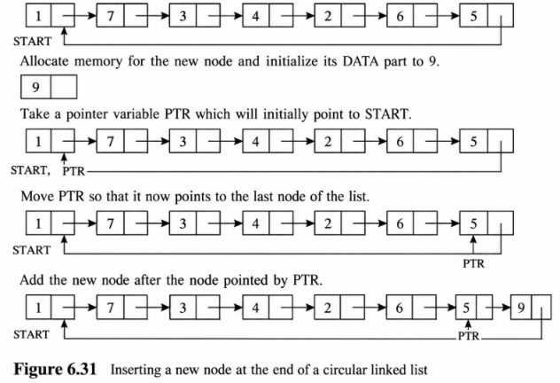 

### 6.3 Delete the first node

The PDF's algorithm:

```js
Step 1: IF START = NULL
            Write UNDERFLOW
            Go to Step 8
        [END OF IF]
Step 2: SET PTR = START
Step 3: Repeat Step 4 while PTR->NEXT != START
Step 4:     SET PTR = PTR->NEXT
          [END OF LOOP]
Step 5: SET PTR->NEXT = START->NEXT
Step 6: FREE START
Step 7: SET START = PTR->NEXT
Step 8: EXIT
```

**What happens:** Move `PTR` to the last node, make the last node point to the second node (`START->NEXT`), free the old first node, and update `START` to the second node.

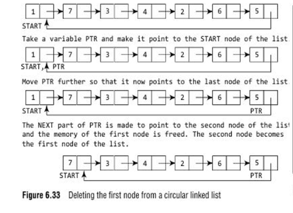 

### 6.4 Delete the last node

The PDF's algorithm:

```js
Step 1: IF START = NULL
            Write UNDERFLOW
            Go to Step 8
        [END OF IF]
Step 2: SET PTR = START
Step 3: Repeat Steps 4 and 5 while PTR->NEXT != START
Step 4:     SET PREPTR = PTR
Step 5:     SET PTR = PTR->NEXT
          [END OF LOOP]
Step 6: SET PREPTR->NEXT = START
Step 7: FREE PTR
Step 8: EXIT
```

**What happens:** `PTR` reaches the last node, while `PREPTR` points to the node before it. Make `PREPTR->NEXT = START`, then free the old last node.

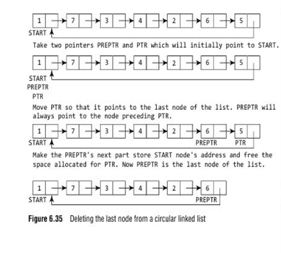 

### Advantages

- Traversal can continue continuously.
- Suitable for cyclic processing.
- No `NULL` pointer is needed at the end.
- Useful when the last element must connect back to the first.

### Disadvantages

- Traversal needs a careful stopping condition.
- An incorrect condition can cause an infinite loop.
- A singly circular list does not support backward traversal.

### Applications

- Round-robin CPU scheduling
- Multiplayer game turn management
- Circular queues
- Music/video playlists
- Token-passing systems

*Source note: The printed circular deletion algorithms do not show a separate case for a one-node list. -* 
> [!missing] SCREW U SOURCE NOTE  SHUT UP
>  DONT U EVEN DARE TO REMIND THEM TO HANDLE THAT EDGE CASE OTHERWISE MY BRAIN WILL LITERARLY RESGIN AT THIS POINT but BEFORE IT DOES I SWEAR I WILL ERASE UR SOURCE FROM EXISTENCE

---

## 7. Doubly Linked Lists

A **doubly linked list** (or two-way linked list) stores a pointer to both the next node and the previous node. Each node has three parts: `PREV`, `DATA`, and `NEXT`.

```c
struct node
{
    struct node *prev;
    int data;
    struct node *next;
};
```

The first node's `PREV` is `NULL`, and the last node's `NEXT` is `NULL`.

Example:

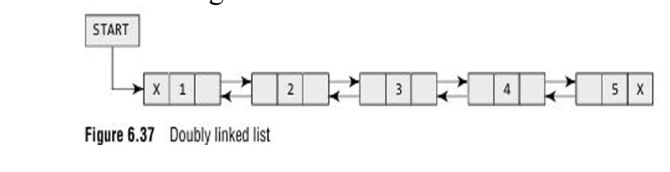 

### Characteristics

- Traversal is possible forward and backward.
- Each node links to both its predecessor and successor.
- It requires more memory than a singly linked list because each node has an extra pointer.
- More pointer changes are needed during insertion and deletion.

### 7.1 Insert a node at the beginning

The PDF's algorithm:

```js
Step 1: IF AVAIL = NULL
            Write OVERFLOW
            Go to Step 9
        [END OF IF]
Step 2: SET NEW_NODE = AVAIL
Step 3: SET AVAIL = AVAIL->NEXT
Step 4: SET NEW_NODE->DATA = VAL
Step 5: SET NEW_NODE->PREV = NULL
Step 6: SET NEW_NODE->NEXT = START
Step 7: SET START->PREV = NEW_NODE
Step 8: SET START = NEW_NODE
Step 9: EXIT
```

**What happens:** Set the new node's `PREV` to `NULL` and its `NEXT` to the old first node. Update the old first node's `PREV`, then move `START` to the new node.
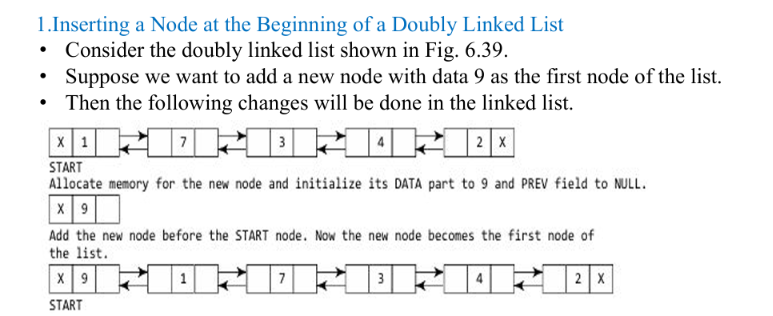 

### 7.2 Insert a node at the end

The PDF's algorithm:

```js
Step 1: IF AVAIL = NULL
            Write OVERFLOW
            Go to Step 11
        [END OF IF]
Step 2: SET NEW_NODE = AVAIL
Step 3: SET AVAIL = AVAIL->NEXT
Step 4: SET NEW_NODE->DATA = VAL
Step 5: SET NEW_NODE->NEXT = NULL
Step 6: SET PTR = START
Step 7: Repeat Step 8 while PTR->NEXT != NULL
Step 8:     SET PTR = PTR->NEXT
          [END OF LOOP]
Step 9: SET PTR->NEXT = NEW_NODE
Step 10: SET NEW_NODE->PREV = PTR
Step 11: EXIT
```

**What happens:** Find the last node, connect its `NEXT` to the new node, and make the new node's `PREV` point to the old last node. The new node's `NEXT` is `NULL`.

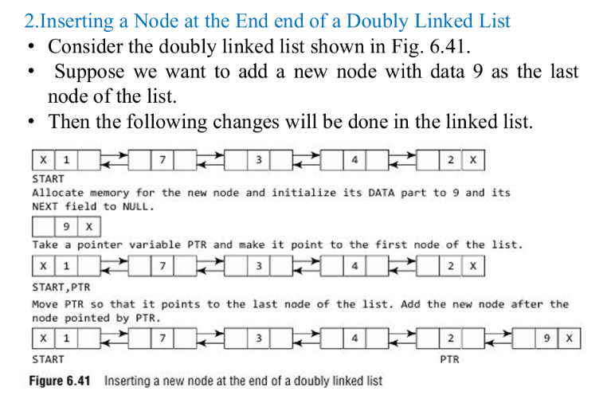 

### 7.3 Insert a node after a given node

The PDF's printed algorithm:

```js
Step 1: IF AVAIL = NULL
            Write OVERFLOW
            Go to Step 12
        [END OF IF]
Step 2: SET NEW_NODE = AVAIL
Step 3: SET AVAIL = AVAIL->NEXT
Step 4: SET NEW_NODE->DATA = VAL
Step 5: SET PTR = START
Step 6: Repeat Step 7 while PTR->DATA != NUM
Step 7:     SET PTR = PTR->NEXT
          [END OF LOOP]
Step 8: SET NEW_NODE->NEXT = PTR->NEXT
Step 9: SET NEW_NODE->PREV = PTR
Step 10: SET PTR->NEXT = NEW_NODE
Step 11: SET PTR->NEXT->PREV = NEW_NODE
Step 12: EXIT
```

**Meaning:** Find the node containing `NUM`, set the new node's `NEXT` to the target's successor, set the new node's `PREV` to the target, and connect the target to the new node.

**Source warning:** As printed, Step 11 appears inconsistent with the preceding steps: after Step 10, `PTR->NEXT` is `NEW_NODE`, so Step 11 makes the new node's `PREV` point to itself. The intended update for the successor's backward link is `NEW_NODE->NEXT->PREV = NEW_NODE` (when a successor exists). This printed-source issue is flagged rather than silently changed.
> [!help]  suppose at this  point every brain cell in my brain has died
> so every cell of my body except brain cells cause they are on error 404 not found, have pleaded to the god of guility that "I dont care anymore, whaetever the hell happens bring it on i will never correct myself nor someone else and if anyone accuses me for a crime that i didnt commit and for that i have to go to prison then i will do so but just spare me dont suffer"

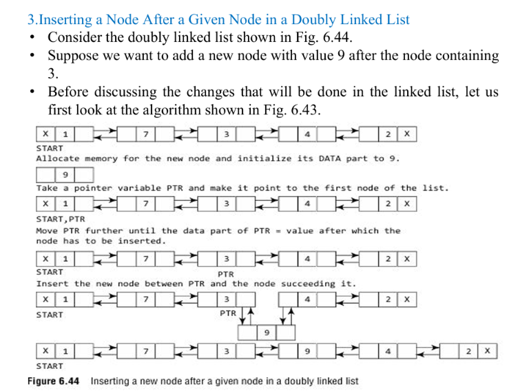 

### 7.4 Insert a node before a given node

The PDF's printed algorithm:

```js
Step 1: IF AVAIL = NULL
            Write OVERFLOW
            Go to Step 12
        [END OF IF]
Step 2: SET NEW_NODE = AVAIL
Step 3: SET AVAIL = AVAIL->NEXT
Step 4: SET NEW_NODE->DATA = VAL
Step 5: SET PTR = START
Step 6: Repeat Step 7 while PTR->DATA != NUM
Step 7:     SET PTR = PTR->NEXT
          [END OF LOOP]
Step 8: SET NEW_NODE->NEXT = PTR
Step 9: SET NEW_NODE->PREV = PTR->PREV
Step 10: SET PTR->PREV = NEW_NODE
Step 11: SET PTR->PREV->NEXT = NEW_NODE
Step 12: EXIT
```

**Meaning:** Find the target node, connect the new node before it, and update the `NEXT` and `PREV` links.

**Source warning:** As printed, Step 11 appears inconsistent: after Step 10, `PTR->PREV` is `NEW_NODE`, so Step 11 sets the new node's `NEXT` to itself. The intended update for the previous node's forward link is `NEW_NODE->PREV->NEXT = NEW_NODE` (when a previous node exists). This printed-source issue is flagged rather than silently changed.

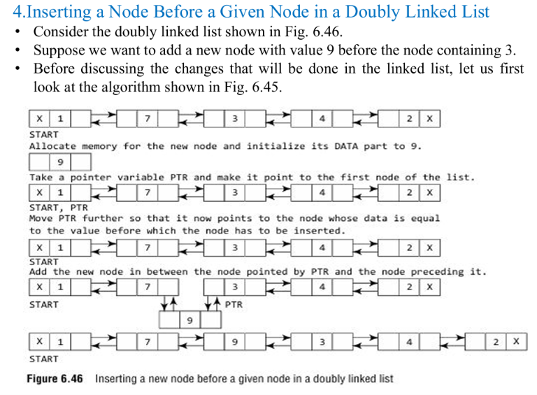 

---

## 8. Deletion from a Doubly Linked List

The PDF covers four cases: delete the first node, last node, node after a given node, and node before a given node. Underflow occurs if `START = NULL`. The removed node's memory is released using `FREE`.

### 8.1 Delete the first node

The PDF's algorithm:

```js
Step 1: IF START = NULL
            Write UNDERFLOW
            Go to Step 6
        [END OF IF]
Step 2: SET PTR = START
Step 3: SET START = START->NEXT
Step 4: SET START->PREV = NULL
Step 5: FREE PTR
Step 6: EXIT
```

**What happens:** Store the first node in `PTR`, move `START` to the next node, set the new first node's `PREV` to `NULL`, and free the old node.

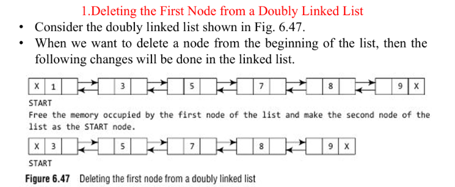 
*Source note: The printed algorithm does not separately handle the special case where the list has only one node.*
> [!checklist]  attempted murder
> the author has been arrested for attempted murder on source note
> although the source note is still barely alive but the author has swore that as soon as they escape the prison they will wipe their existence


### 8.2 Delete the last node

The PDF's algorithm:

```js
Step 1: IF START = NULL
            Write UNDERFLOW
            Go to Step 7
        [END OF IF]
Step 2: SET PTR = START
Step 3: Repeat Step 4 while PTR->NEXT != NULL
Step 4:     SET PTR = PTR->NEXT
          [END OF LOOP]
Step 5: SET PTR->PREV->NEXT = NULL
Step 6: FREE PTR
Step 7: EXIT
```

**What happens:** Move `PTR` to the last node, set the previous node's `NEXT` to `NULL`, and free the old last node.

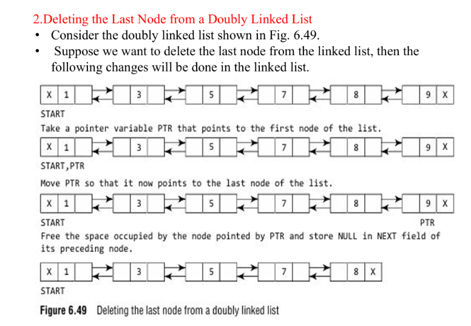 

### 8.3 Delete the node after a given node

The PDF's algorithm:

```js
Step 1: IF START = NULL
            Write UNDERFLOW
            Go to Step 9
        [END OF IF]
Step 2: SET PTR = START
Step 3: Repeat Step 4 while PTR->DATA != NUM
Step 4:     SET PTR = PTR->NEXT
          [END OF LOOP]
Step 5: SET TEMP = PTR->NEXT
Step 6: SET PTR->NEXT = TEMP->NEXT
Step 7: SET TEMP->NEXT->PREV = PTR
Step 8: FREE TEMP
Step 9: EXIT
```

**What happens:** Find the node containing `NUM`. Store the following node in `TEMP`, connect the target node to the node after `TEMP`, fix that node's `PREV`, and free `TEMP`.

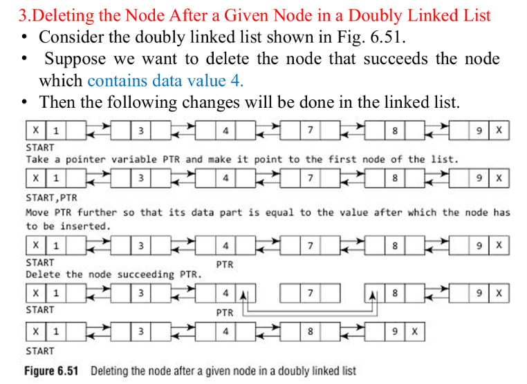 
### 8.4 Delete the node before a given node

The PDF's algorithm:

```js
Step 1: IF START = NULL
            Write UNDERFLOW
            Go to Step 9
        [END OF IF]
Step 2: SET PTR = START
Step 3: Repeat Step 4 while PTR->DATA != NUM
Step 4:     SET PTR = PTR->NEXT
          [END OF LOOP]
Step 5: SET TEMP = PTR->PREV
Step 6: SET TEMP->PREV->NEXT = PTR
Step 7: SET PTR->PREV = TEMP->PREV
Step 8: FREE TEMP
Step 9: EXIT
```

**What happens:** Find the target node, store the preceding node in `TEMP`, connect the target to the node before `TEMP`, update the target's `PREV`, and free `TEMP`.

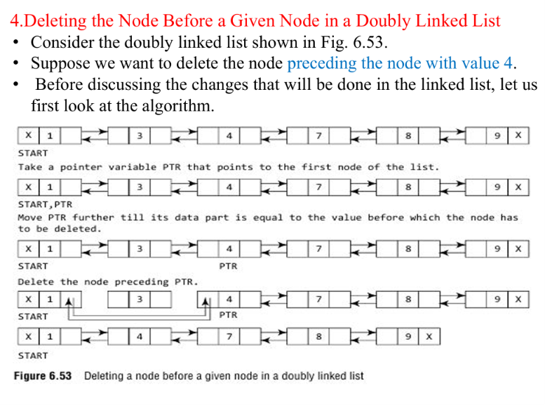 

*Boundary cases:* These algorithms, as printed, assume the required preceding or succeeding node exists. For example, deleting the node before the first node or after the last node needs separate handling.

> [!danger] if i could time trabel back to past i would definitely stop myself to learn the letter D S A

---

## 9. Comparison of Singly, Circular, and Doubly Linked Lists

| Feature | Singly Linked List | Circular Linked List | Doubly Linked List |
|---|---|---|---|
| Pointers per node | 1 (`NEXT`) | 1 or 2, depending on type | 2 (`PREV`, `NEXT`) |
| Traversal | Forward | Circular | Forward and backward |
| Last node points to | `NULL` | First node | `NULL` through `NEXT` |
| Backward traversal | No | No in singly circular form | Yes |
| Memory requirement | Low | Low/medium | Higher |
| Implementation | Simple | Moderate | More complex |
| Infinite-loop risk | Low | Higher if stopping condition is wrong | Moderate |
| Suitable for | Simple dynamic lists | Cyclic processing | Two-way navigation |
| Example | Stack implementation | Round-robin scheduling | Browser history |

---

## 10. Advantages, Disadvantages, and Applications

### General advantages

- **Dynamic size:** The list can grow or shrink as nodes are allocated or freed.
- **Efficient insertion and deletion:** Links can be changed without shifting all later elements when the relevant position/node is known.
- **No contiguous memory required:** Nodes can be stored at different memory locations.
- **Memory allocated as required:** Does not require reserving a fixed-size array in advance.

### General disadvantages

- Extra memory is required for pointer fields.
- Sequential access only; no direct/random access like an array.
- Searching is generally `O(n)`.
- Accessing an element by position requires traversal.
- Pointer handling makes insertion/deletion logic more complex.

### Applications of linked lists

- **Stacks and queues:** Used to implement LIFO stacks and FIFO queues.
- **Dynamic memory allocation:** Supports dynamic allocation and release of nodes.
- **Graph representation:** Adjacency lists can use linked lists.
- **Hash tables:** Separate chaining can use linked lists to handle collisions.
- **Undo/redo:** Doubly linked lists can support navigation between states.
- **Music playlists and image viewers:** Doubly linked lists can support moving forward and backward.
- **Polynomial manipulation:** Nodes can store a coefficient and exponent.
- **Sparse matrices:** Store only non-zero elements to save memory.
- **Browser history:** Doubly linked lists can support Back/Forward navigation.
- **File systems:** Some file-allocation methods use linked lists to connect disk blocks.
- **Round-robin scheduling:** Circular linked lists support repeated cyclic processing.
- **Multiplayer game turns and token-passing systems:** Circular lists can cycle through participants.

---

## 13. Quick Revision

- A **node** contains data and one or more links.
- `START = NULL` means the list is empty.
- The last node in a standard singly linked list points to `NULL`.
- `AVAIL = NULL` means no free node is available and insertion reports `OVERFLOW`.
- Deleting from an empty list reports `UNDERFLOW`.
- **Singly linked list:** forward traversal; one link per node.
- **Circular linked list:** last node points to the first; use a careful stopping condition.
- **Doubly linked list:** `PREV` and `NEXT` allow forward and backward traversal.
- `PTR` is used to traverse; `PREPTR` tracks a previous node; `TEMP` can preserve a node's address before freeing it.
- After deletion, free the removed node's memory.
- Searching a linked list is generally `O(n)`.

---


## Source Coverage Note

The uploaded PDF is 60 pages. These notes cover its explanations, algorithms, diagram examples/placeholders, comparison table, applications, and questions at the end. Where the PDF shows only a diagram rather than a numbered algorithm, that distinction is stated. Some doubly-linked insertion algorithm lines in the PDF appear to contain inconsistent pointer updates; those have been flagged rather than silently changed.

