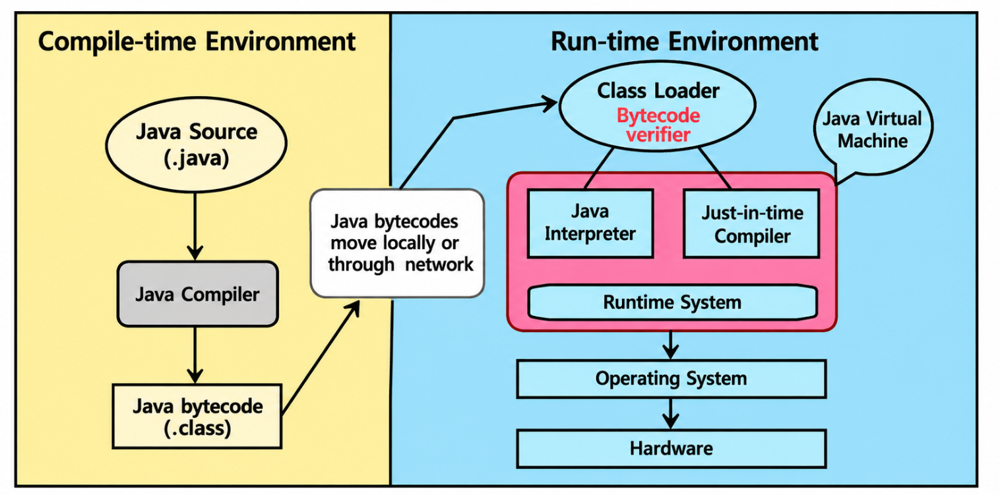
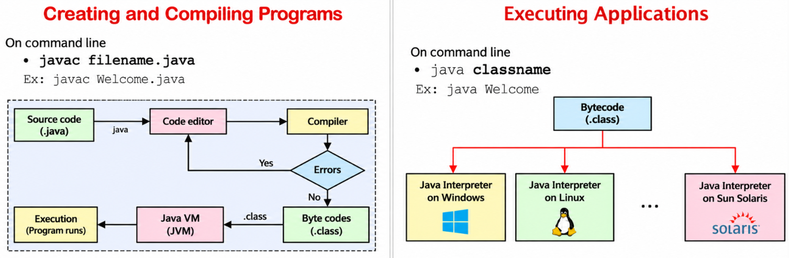

# se chp 1 notes part 2
> [!abstract] read the entire stuffs like a story book and in case of programs read it once and try to write it without looking 


## 1. Introduction to Software Engineering

### Definition

Software Engineering is a **systematic, disciplined, and organized approach** to designing, developing, testing, deploying, and maintaining software.

It applies engineering principles to develop software that is reliable, efficient, cost-effective, and meets user requirements.

**Example:** Developing a Bank Management System to manage customer accounts, deposits, withdrawals, and money transfers.

### Roles of Software Engineering

1.  **Requirement Analysis:** Understanding what the user needs.
    
    -   Example: Identifying that the bank system must support deposits and withdrawals.
        
2.  **System Design:** Planning the structure and components of the software.
    
    -   Example: Designing separate modules for customers, accounts, and transactions.
        
3.  **Development/Coding:** Writing the actual program using a programming language.
    
    -   Example: Writing Java code for the deposit and withdrawal functions.
        
4.  **Testing and Debugging:** Finding and fixing errors in the software.
    
    -   Example: Checking whether a withdrawal is rejected when the account has insufficient balance.
        
5.  **Maintenance:** Updating and improving the software after deployment.
    
    -   Example: Adding a new feature to generate monthly account statements.
        

## 2. Nature of Software

Software is a collection of **programs, procedures, and related data** that instructs a computer to perform specific tasks.

Software consists of three main components:

1.  **Programs:** Instructions that perform operations.
    
    -   Example: Code that transfers money between two bank accounts.
        
2.  **Data:** Information processed or stored by the software.
    
    -   Example: Customer names, account numbers, and account balances.
        
3.  **Documentation:** Documents explaining how the software works and how to use it.
    
    -   Example: A user manual explaining how to deposit or withdraw money.
        

## 3. Characteristics of Software

1.  **Intangible:** Software cannot be physically touched.
    
    -   Example: The bank application is software, unlike the computer on which it runs.
        
2.  **Engineered, Not Manufactured:** Software is developed through design and coding rather than being physically manufactured.
    
    -   Example: Developers write the bank application's code instead of manufacturing it like a physical product.
        
3.  **Evolves Over Time:** Software changes as user requirements change.
    
    -   Example: Adding support for online money transfers.
        
4.  **Does Not Wear Out Physically:** Software does not wear out like hardware, but it can become outdated or fail because of bugs and changing environments.
    
    -   Example: The bank application may need updates to support a newer operating system.
        
5.  **Quality Depends on Development:** Software quality depends on proper design, coding, and testing.
    
    -   Example: Thoroughly testing transactions helps prevent incorrect account balances.
        
6.  **Requires Maintenance:** Software needs corrections, improvements, and updates after deployment.
    
    -   Example: Fixing a bug that causes an incorrect transaction receipt.
        

## 4. Types of Software

### 4.1 System Software

System software manages computer hardware and provides a platform for application software.

-   **Operating System:** Manages computer resources.
    
    -   Examples: Windows, Linux, macOS.
        
-   **Utility Software:** Performs maintenance and security tasks.
    
    -   Examples: Antivirus software, disk cleaners.
        

**Bank system connection:** The bank application runs on an operating system such as Windows or Linux.

### 4.2 Application Software

Application software helps users perform specific tasks.

-   **General-Purpose Software:** Used for common tasks.
    
    -   Examples: MS Word, web browsers.
        
-   **Specific-Purpose Software:** Developed for a particular task or industry.
    
    -   Examples: Banking systems, hospital management systems.
        

**Bank system connection:** The Bank Management System is specific-purpose application software.

### 4.3 Embedded Software

Embedded software is built into a device to control its functions.

-   Examples: Software in ATMs, cars, washing machines, and industrial machines.
    

**Bank system connection:** An ATM uses embedded software to control its keypad, card reader, cash dispenser, and other hardware.

### 4.4 Programming Software

Programming software provides tools for writing, testing, and debugging programs.

-   Examples: Compilers, interpreters, and IDEs such as Visual Studio and Eclipse.
    

**Bank system connection:** A developer can use an IDE such as Eclipse to write and debug the bank application's Java code.

## 5. Programming

Programming is the process of writing instructions in a programming language to make a computer perform a task.

Examples of programming languages include Java, C, C++, and Python.

### Five Basic Elements of Programming

1.  **Input:** Accepting data from the user.
    
    -   Example: Entering an account number and withdrawal amount.
        
2.  **Output:** Displaying the result.
    
    -   Example: Displaying the updated account balance.
        
3.  **Arithmetic Operations:** Performing mathematical calculations.
    
    -   Example: Calculating the balance after a withdrawal: `Balance - Amount`.
        
4.  **Conditional Statements:** Making decisions based on conditions.
    
    -   Example: Checking whether the account balance is greater than or equal to the withdrawal amount.
        
5.  **Looping:** Repeating a set of instructions.
    
    -   Example: Repeatedly displaying the banking menu until the user chooses to exit.
        

## 6. Computer Program and Programming Languages

### 6.1 Computer Program

A computer program is a **set of instructions** written in a programming language to perform a specific task.

Programs can be written using low-level or high-level programming languages.

**Example:** A program that accepts a withdrawal amount, checks the balance, and updates the account.

### 6.2 Low-Level Languages

Low-level languages are closer to the computer's hardware and are generally harder for humans to understand.

**Characteristics:**

-   Often hardware- or architecture-specific.
    
-   Closer to machine instructions.
    
-   More difficult to read and write.
    

**Types:**

1.  **Machine Language:** Uses binary digits (`0` and `1`).
    
2.  **Assembly Language:** Uses symbolic instructions such as `MOV` and `ADD`.
    

**Bank system connection:** Low-level programming could be used for hardware-specific operations in an ATM controller.

### 6.3 High-Level Languages

High-level languages use more human-readable instructions and make programs easier to write and maintain.

**Characteristics:**

-   Easier to understand and debug.
    
-   Generally more portable across different platforms.
    
-   Require a compiler or interpreter, or a suitable runtime environment.
    

**Examples:** C++, Java, Python, Pascal, Visual Basic.

**Bank system connection:** Java can be used to develop the Bank Management System because it supports structured application development.

## 7. Programming Approaches

The three programming approaches covered here are structured programming, procedural programming, and object-oriented programming.

### 7.1 Structured Programming

Structured programming divides a program into simple, logical structures. Its three basic control structures are sequence, selection, and repetition.

**A. Sequence:** Instructions execute one after another in order.

Example:

```text
START
  Enter account number
  Enter deposit amount
  Add amount to balance
  Display updated balance
STOP
```

**B. Selection:** A condition determines which instructions execute.

Example:

```text
IF balance >= withdrawal_amount
    Withdraw money
ELSE
    Display "Insufficient balance"
END IF
```

**C. Repetition:** Instructions execute repeatedly while a condition is satisfied.

Example:

```text
WHILE user has not selected Exit
    Display banking menu
    Accept user's choice
END WHILE
```

### 7.2 Procedural Programming

Procedural programming organizes a program into **procedures, routines, or functions**. Each procedure performs a specific task.

It is derived from structured programming and focuses on the steps required to perform an operation.

**Examples of procedural languages:** C, Pascal, BASIC, Fortran, ALGOL, COBOL.

**Bank Management System connection:** The system can be divided into these procedures:

1.  `createAccount()` – Creates a new account.
    
2.  `getAccount()` – Retrieves account details.
    
3.  `deposit()` – Adds money to an account.
    
4.  `withdraw()` – Removes money from an account.
    
5.  `transfer()` – Transfers money between accounts.
    
6.  `recordTransaction()` – Records account transactions.
    

### 7.3 Object-Oriented Programming (OOP)

Object-oriented programming organizes a program around **objects and data** rather than only functions and logic.

An object has:

-   **Attributes:** Data or properties of the object.
    
-   **Behaviour:** Actions the object can perform.
    

**Examples of OOP languages:** Java, C++, Python, JavaScript.

**Bank Management System connection:**

Consider an `Account` object.

-   **Attributes:** `accountNumber`, `holderName`, `balance`.
    
-   **Behaviour:** `deposit()`, `withdraw()`, `displayBalance()`.
    

Thus, the account's data and related operations are grouped together.

## 8. Difference Between C and Java

| Feature | C   | Java |
| --- | --- | --- |
| Programming approach | Primarily procedural | Class-based, object-oriented |
| Pointers | Supports pointers and direct pointer manipulation | Uses references; no direct pointer manipulation |
| Preprocessor | Supports directives such as `#include` and `#define` | Does not use a C-style preprocessor |
| Code organization | Commonly uses header and source files | Uses classes and packages |
| Memory management | Supports manual allocation using `malloc()` and `calloc()` | Automatic memory management through garbage collection |
| Database connectivity | Requires suitable libraries or APIs | Commonly uses JDBC (Java Database Connectivity) |
| Code translation | Usually compiled into native machine code | Compiled into bytecode and executed by the JVM |
| Complex data types | Supports structures and unions | Uses classes and objects |

**Bank Management System connection:** Both C and Java can be used to implement banking operations. C commonly organizes the program around functions, while Java can organize it around classes and objects such as `Account` and `Customer`.

***

> [!abstract] read the entire stuffs like a story book and in case of programs read it once and try to write it without looking 

## 1. What is Java?

Java is a high-level, object-oriented, robust, and secure programming language. It is used to develop desktop, web, mobile, and enterprise applications.

Java is both a **programming language and a platform**.

### What is a Platform?

A platform is a hardware or software environment in which a program runs.

Java is called a platform because it provides the **Java Runtime Environment (JRE)** and **Java API**, which allow Java programs to run and access predefined classes and methods.

**Example:** Java can be used to develop a Bank Management System that manages customer accounts, deposits, withdrawals, and transfers.

## 2. Features of Java


| Feature | Description |
|---|---|
| Simple | Java has easy-to-understand syntax, avoids explicit pointers, and provides automatic garbage collection. |
| Object-Oriented | Java organizes programs using classes and objects that combine data and behaviour. |
| Portable | Java bytecode can run on different platforms with a compatible Java runtime. |
| Platform Independent | Java follows WORA (Write Once, Run Anywhere) because bytecode runs on any platform with a compatible JVM. |
| Secure | Java provides bytecode verification and prevents direct pointer manipulation. |
| Robust | Java uses strong type checking, exception handling, and automatic garbage collection to improve reliability. |
| Architecture Neutral | Java bytecode is not dependent on a specific processor architecture, and primitive data types have fixed sizes. |
| Interpreted | The JVM executes Java bytecode using interpretation and may also use JIT compilation. |
| High Performance | Java uses JIT compilation to improve execution speed by converting frequently executed bytecode into native machine code. |
| Multithreaded | Java allows multiple threads to execute concurrently within a program. |
| Distributed | Java provides networking APIs that allow applications to communicate and exchange data over a network. |
| Dynamic | Java supports loading classes at runtime when they are required. |
     

## 3. Features of Java in Detail

### 3.1 Simple

Java is considered simple because its syntax is easy to understand and it removes many complicated features found in languages such as C++.

-   Its syntax is similar to C++.
    
-   It does not support explicit pointer manipulation.
    
-   It does not support operator overloading for user-defined classes.
    
-   It provides automatic garbage collection.
    

**Example:** Developers can write banking operations in Java without manually managing memory.

### 3.2 Object-Oriented

Java is an object-oriented programming language. It organizes software using classes and objects that combine data and behaviour.

The main concepts of OOP are:

1.  Object
    
2.  Class
    
3.  Inheritance
    
4.  Polymorphism
    
5.  Abstraction
    
6.  Encapsulation
    

**Example:** A banking application can contain an `Account` class with attributes such as `accountNumber` and `balance`, and methods such as `deposit()` and `withdraw()`.

### 3.3 Portable

Java is portable because Java bytecode can be transferred to different platforms that have a compatible Java runtime environment.

**Example:** A compiled banking application can be moved from one compatible computer system to another without rewriting the source code.

### 3.4 Platform Independent

Java follows the principle **Write Once, Run Anywhere (WORA)**. Java source code is compiled into bytecode, which can run on any platform with a compatible Java Virtual Machine (JVM).

Unlike C programs, which are commonly compiled into platform-specific machine code, Java bytecode is designed to run across platforms.

**Example:** The same compiled banking application can run on Windows or Linux if a compatible JVM is available.

### 3.5 Secure

Java provides security features that help develop safer applications.

-   It does not allow direct pointer manipulation.
    
-   Java bytecode is checked by the JVM before execution.
    
-   Java provides security mechanisms and controlled access to resources.
    

**Example:** These features help reduce certain memory-related risks in a banking application.

### 3.6 Robust

Robust means strong and reliable. Java is robust because it provides mechanisms that help detect and handle errors.

-   Strong type checking helps detect incompatible data types.
    
-   Exception handling helps manage runtime errors.
    
-   Automatic garbage collection manages unused objects.
    
-   Memory management reduces certain memory-related errors.
    

**Example:** Exception handling can manage an invalid transaction amount or a database connection error in the banking application.

### 3.7 Architecture Neutral

Java is architecture neutral because its bytecode is not designed for only one specific processor architecture.

Java also defines fixed sizes for its primitive numeric types, helping maintain consistent behaviour across platforms.

**Example:** Java's `int` occupies 4 bytes on both 32-bit and 64-bit platforms.

### 3.8 Interpreted

Java source code is compiled into bytecode. The JVM executes this bytecode using interpretation and, in many implementations, Just-In-Time (JIT) compilation.

**Example:** The bytecode of a banking application is executed by the JVM on the target computer.

### 3.9 High Performance

Java provides high performance through features such as Just-In-Time (JIT) compilation, which converts frequently executed bytecode into native machine code.

Its performance is generally better than that of purely interpreted languages, although results depend on the application and environment.

**Example:** JIT compilation can improve the performance of frequently used banking operations.

### 3.10 Multithreaded

Multithreading allows a Java program to execute multiple threads concurrently. A thread is a separate path of execution within a program.

Threads share the process's memory, although each thread has its own execution stack.

**Example:** A banking application can process different customer requests concurrently while also handling notifications.

### 3.11 Distributed

Java supports distributed application development through networking APIs and libraries that allow programs to communicate over a network.

**Example:** A banking application can communicate with a remote server to retrieve account information.

### 3.12 Dynamic

Java is dynamic because classes can be loaded when required during program execution. Java also supports runtime linking and automatic memory management.

**Example:** A banking application can load an additional module when a particular feature is needed.

## 4. Objects in Java

An object is an instance of a class that has state, behaviour, and identity. Objects can represent physical or logical entities.

### Characteristics of an Object

1.  **State:** Represents the data or values stored in an object.
    
    -   Example: An account's `accountNumber` and `balance`.
        
2.  **Behaviour:** Represents the operations an object can perform.
    
    -   Example: `deposit()`, `withdraw()`, and `displayBalance()`.
        
3.  **Identity:** Distinguishes one object from another. In Java, object references allow programs to access objects; object identity is not normally exposed as a user-visible ID.
    
    -   Example: Two bank accounts can have the same balance but still be separate account objects.
        

**Conclusion:** An object combines data and related operations to represent an entity in a program.

## 5. Classes in Java

A class is a blueprint or template used to create objects. It defines the data and behaviour that its objects can have.

A class is a logical entity, not a physical object.

### Components of a Class

A Java class can contain:

1.  **Fields:** Store the object's data.
    
2.  **Methods:** Define the object's behaviour.
    
3.  **Constructors:** Initialize objects when they are created.
    
4.  **Blocks:** Contain initialization statements.
    
5.  **Nested Classes and Interfaces:** Classes or interfaces declared inside another class or interface.
    

**Example:**

```java
class Account {
    int accountNumber;
    double balance;

    void deposit(double amount) {
        balance = balance + amount;
    }

    void displayBalance() {
        System.out.println(balance);
    }
}
```

Here, `Account` is a class, `accountNumber` and `balance` are fields, and `deposit()` and `displayBalance()` are methods.

An object can be created using:

```java
Account a1 = new Account();
```

Here, `a1` refers to the newly created `Account` object.

## 6. Inheritance in Java

Inheritance is an OOP mechanism in which one class acquires accessible fields and methods from another class. It promotes code reuse and allows new classes to extend existing classes.

-   **Parent class:** The class whose features are inherited.
    
-   **Child class:** The class that inherits those features.
    
-   Inheritance represents an **IS-A relationship**.
    

## Types of Inheritance

1.  **Single Inheritance:** One child class inherits from one parent class.
    
2.  **Multilevel Inheritance:** A class inherits from another child class, forming a chain of inheritance.
    
3.  **Hierarchical Inheritance:** Multiple child classes inherit from the same parent class.
    

## 1. Single Inheritance

One child class inherits from one parent class.

**Example:**

```java
class Account {
    void display() {
        System.out.println("This is an Account");
    }
}

class SavingsAccount extends Account {
    void show() {
        System.out.println("This is a Savings Account");
    }
}

class Main {
    public static void main(String[] args) {
        SavingsAccount s = new SavingsAccount();
        s.display();
        s.show();
    }
}
```

**Output:**

```text
This is an Account
This is a Savings Account
```

Here, `SavingsAccount` inherits the `display()` method from `Account`.

## 2. Multilevel Inheritance

A class inherits from another child class, forming a chain of inheritance.

**Example:**

```java
class Account {
    void display() {
        System.out.println("This is an Account");
    }
}

class SavingsAccount extends Account {
    void calculateInterest() {
        System.out.println("Calculating interest");
    }
}

class PremiumSavingsAccount extends SavingsAccount {
    void showBenefits() {
        System.out.println("Premium benefits available");
    }
}

class Main {
    public static void main(String[] args) {
        PremiumSavingsAccount p = new PremiumSavingsAccount();
        p.display();
        p.calculateInterest();
        p.showBenefits();
    }
}
```

**Output:**

```text
This is an Account
Calculating interest
Premium benefits available
```

Here, `PremiumSavingsAccount` inherits methods from both `SavingsAccount` and `Account`.

## 3. Hierarchical Inheritance

Multiple child classes inherit from the same parent class.

**Example:**

```java
class Account {
    void display() {
        System.out.println("This is an Account");
    }
}

class SavingsAccount extends Account {
    void calculateInterest() {
        System.out.println("Calculating interest");
    }
}

class CurrentAccount extends Account {
    void checkOverdraft() {
        System.out.println("Checking overdraft");
    }
}

class Main {
    public static void main(String[] args) {
        SavingsAccount s = new SavingsAccount();
        s.display();
        s.calculateInterest();

        CurrentAccount c = new CurrentAccount();
        c.display();
        c.checkOverdraft();
    }
}
```

**Output:**

```text
This is an Account
Calculating interest
This is an Account
Checking overdraft
```

Here, both `SavingsAccount` and `CurrentAccount` inherit the `display()` method from `Account`.

## Multiple Inheritance in Java

Multiple inheritance means one child class inherits from multiple parent classes. Java does not support multiple inheritance through classes, but similar functionality can be achieved using interfaces.

**Example:**

```java
interface Depositable {
    void deposit();
}

interface Withdrawable {
    void withdraw();
}

class Account implements Depositable, Withdrawable {
    public void deposit() {
        System.out.println("Depositing money");
    }

    public void withdraw() {
        System.out.println("Withdrawing money");
    }
}
```

Here, `Account` implements two interfaces, `Depositable` and `Withdrawable`.

**Note:** Java supports single, multilevel, and hierarchical inheritance through classes. Multiple inheritance can be achieved through interfaces.
## 7. Polymorphism in Java

Polymorphism means **one name or interface can have many forms**. It allows the same operation to behave differently in different situations.

The word comes from two Greek words: _poly_ meaning many and _morph_ meaning forms.


### Types of Polymorphism

1. **Compile-Time Polymorphism:** Achieved through method overloading, where methods have the same name but different parameter lists.

2. **Runtime Polymorphism:** Achieved through method overriding, where a child class provides its own implementation of an inherited method.

### Program Example

```java
class Account {
    // Compile-time polymorphism (method overloading)
    void deposit(int amount) {
        System.out.println("Deposited: " + amount);
    }

    void deposit(double amount) {
        System.out.println("Deposited: " + amount);
    }
}

class SavingsAccount extends Account {
    // Runtime polymorphism (method overriding)
    @Override // uses the child class method instead of the parent class method
    void deposit(int amount) {
        System.out.println("Savings account deposit: " + amount);
    }
}

class Main {
    public static void main(String[] args) {
        Account a = new Account();

        a.deposit(1000);   // compile time polymorphism since method is selected based on argument type
        a.deposit(500.50); // compile time polymorphism since method is selected based on argument type

        Account s = new SavingsAccount(); // run time polymorphism since which method to be used is decided at runtime
        s.deposit(2000); // calls SavingsAccount's deposit() method instead of Account's deposit() method
    }
}
````

Output:

```
Deposited: 1000
Deposited: 500.5
Savings account deposit: 2000
```

### Explanation

1.  Method Overloading: The `Account` class has two `deposit()` methods with different parameter types (`int` and `double`).
    
2.  Method Overriding: The `SavingsAccount` class provides its own implementation of the inherited `deposit(int)` method.
    
3.  Runtime Behaviour: The overridden method is called according to the actual object type, which is `SavingsAccount`.
    

Conclusion: Polymorphism allows the same method name to perform different actions through method overloading and method overriding.


## 8. Abstraction in Java

**Definition:** Abstraction is the process of hiding implementation details and showing only the essential functionality to the user.

It reduces complexity by allowing users to focus on what an operation does rather than how it works internally.

**Example:** In a banking application, the user calls the `withdraw()` method without knowing how the system checks the balance and processes the withdrawal internally.

Abstraction in Java can be achieved using **abstract classes and interfaces**.

### Program Example

```java
abstract class Account {
    abstract void withdraw();
}

class SavingsAccount extends Account {
    void withdraw() {
        System.out.println("Money withdrawn");
    }
}

class Main {
    public static void main(String[] args) {
        Account a = new SavingsAccount();
        a.withdraw();
    }
}
````

Output:

```
Money withdrawn
```

### Explanation

1.  `Account` is an abstract class containing the abstract `withdraw()` method.
    
2.  `SavingsAccount` provides the implementation of the `withdraw()` method.
    
3.  The `Main` class calls `withdraw()` without needing to know its internal implementation.
    


## 9. Encapsulation in Java

Encapsulation is the process of combining data and the methods that operate on that data into a single unit, such as a class. It also helps protect data by controlling access through access modifiers and methods.

**Example:** A bank account can keep its `balance` field private and provide a `deposit()` method to update it safely.

```java
class Account {
    private double balance;

    public void deposit(double amount) {
        if (amount > 0) {
            balance = balance + amount;
        }
    }
}
```

Here, `balance` cannot be accessed directly from outside the class. The `deposit()` method controls how the balance is updated.

## 10. Difference Between Abstraction and Encapsulation

| Abstraction | Encapsulation |
| --- | --- |
| Hides implementation details. | Combines data and methods into a single unit. |
| Focuses on what an object does. | Focuses on protecting and controlling access to data. |
| Achieved using abstract classes and interfaces. | Achieved using classes and access modifiers. |
| Example: Hiding the internal steps of a money transfer. | Example: Keeping `balance` private and updating it through methods. |

## 11. Applications of Java

Java is used in several areas:

1.  **Desktop Applications:** Software such as media players and desktop tools.
    
2.  **Web Applications:** Applications that run through a web server and browser.
    
3.  **Enterprise Applications:** Large business systems, including banking applications.
    
4.  **Mobile Applications:** Android applications.
    
5.  **Smart Cards:** Applications that run on smart-card platforms.
    
6.  **Robotics:** Software for controlling robotic systems.
    
7.  **Games:** Games and game-related applications.
    

**Example:** A Bank Management System is an enterprise application that uses software to manage customer accounts and transactions.

***
### Java Program Compilation and Execution Process
 
 


# Java Programs with Runtime Input

## 1. Climate Intelligence for Heatwave Monitoring, Prediction, and Early Warning
Create a Java program using a class and object to store temperature data and use inheritance to determine whether a heatwave warning should be generated

**Logic:** If the temperature is 40°C or above, display a heatwave warning. Otherwise, display no heatwave warning.

```java
import java.util.Scanner;

class Temperature {
    double temp;

    void input() {
        Scanner sc = new Scanner(System.in);
        System.out.print("Enter temperature in Celsius: ");
        temp = sc.nextDouble();
    }
}

class Heatwave extends Temperature {
    void checkWarning() {
        if (temp >= 40) {
            System.out.println("Heatwave Warning!");
        } else {
            System.out.println("No Heatwave Warning.");
        }
    }
}

class Main {
    public static void main(String[] args) {
        Heatwave h = new Heatwave();
        h.input();
        h.checkWarning();
    }
}
```

### Sample output 1: Heatwave warning

```text
Enter temperature in Celsius: 42
Heatwave Warning!
```

### Sample output 2: No heatwave warning

```text
Enter temperature in Celsius: 35
No Heatwave Warning.
```

### Sample output 3: Temperature exactly 40°C

```text
Enter temperature in Celsius: 40
Heatwave Warning!
```

---

## 2. Irrigation Advisory System for Sugarcane Crop
Create a Java program using a class and object to store soil moisture and use inheritance to provide irrigation advice for a sugarcane crop

**Logic:** If soil moisture is below 40%, irrigation is required. Otherwise, irrigation is not required.

```java
import java.util.Scanner;

class Soil {
    int moisture;

    void input() {
        Scanner sc = new Scanner(System.in);
        System.out.print("Enter soil moisture percentage: ");
        moisture = sc.nextInt();
    }
}

class Sugarcane extends Soil {
    void checkIrrigation() {
        if (moisture < 40) {
            System.out.println("Irrigation Required.");
        } else {
            System.out.println("Irrigation Not Required.");
        }
    }
}

class Main {
    public static void main(String[] args) {
        Sugarcane s = new Sugarcane();
        s.input();
        s.checkIrrigation();
    }
}
```

### Sample output 1: Low soil moisture

```text
Enter soil moisture percentage: 25
Irrigation Required.
```

### Sample output 2: Sufficient soil moisture

```text
Enter soil moisture percentage: 60
Irrigation Not Required.
```

### Sample output 3: Soil moisture exactly 40%

```text
Enter soil moisture percentage: 40
Irrigation Not Required.
```

---

## 3. Urine Test Strip Reader Using Colorimetry
Create a Java program using a class and object to store the color of a urine test strip and use inheritance to identify whether the test result is normal or abnormal

**Logic:** For this basic programming demonstration, yellow is treated as normal and any other color as abnormal. This is only an illustrative rule, not a medically valid interpretation of a urine test.

```java
import java.util.Scanner;

class TestStrip {
    int color;

    void input() {
        Scanner sc = new Scanner(System.in);
        System.out.print("Enter 1 for Yellow or 2 for Red: ");
        color = sc.nextInt();
    }
}

class UrineTest extends TestStrip {
    void checkResult() {
        if (color == 1) {
            System.out.println("Test Result: Normal");
        } else {
            System.out.println("Test Result: Abnormal");
        }
    }
}

class Main {
    public static void main(String[] args) {
        UrineTest u = new UrineTest();
        u.input();
        u.checkResult();
    }
}
```

### Sample output 1: Yellow color

```text
Enter 1 for Yellow or 2 for Red: 1
Test Result: Normal
```

### Sample output 2: Red color

```text
Enter 1 for Yellow or 2 for Red: 1
Test Result: Normal
```


**Note:** Actual urine test interpretation depends on the test pad, reagent, and manufacturer's color chart. Color alone cannot establish whether a test is normal or abnormal.

---

## 4. AI-Based Autonomous Inter-Satellite Data Routing and Multi-Mode Amateur Radio Communication
Create a Java program using a class and object to store satellite information and use inheritance to send data through a communication system

**Logic:** Accept satellite information, data, and communication mode from the user, then simulate sending the data.

```java
import java.util.Scanner;

class Satellite {
    String name;
    String data;

    void input() {
        Scanner sc = new Scanner(System.in);

        System.out.print("Enter satellite name: ");
        name = sc.nextLine();

        System.out.print("Enter data to send: ");
        data = sc.nextLine();
    }
}

class Communication extends Satellite {
    void sendData() {
        Scanner sc = new Scanner(System.in);

        System.out.print("Enter communication mode: ");
        String mode = sc.nextLine();

        System.out.println("Satellite: " + name);
        System.out.println("Data: " + data);
        System.out.println("Communication Mode: " + mode);
        System.out.println("Data Sent Successfully.");
    }
}

class Main {
    public static void main(String[] args) {
        Communication c = new Communication();
        c.input();
        c.sendData();
    }
}
```

### Sample output 1: Radio communication

```text
Enter satellite name: SAT-1
Enter data to send: Weather Data
Enter communication mode: Radio
Satellite: SAT-1
Data: Weather Data
Communication Mode: Radio
Data Sent Successfully.
```

### Sample output 2: Satellite-to-satellite data

```text
Enter satellite name: SAT-2
Enter data to send: Position Data
Enter communication mode: Inter-Satellite
Satellite: SAT-2
Data: Position Data
Communication Mode: Inter-Satellite
Data Sent Successfully.
```

### Sample output 3: Different input

```text
Enter satellite name: SAT-3
Enter data to send: Temperature Data
Enter communication mode: Digital
Satellite: SAT-3
Data: Temperature Data
Communication Mode: Digital
Data Sent Successfully.
```

**Note:** This program simulates data transmission. It does not implement actual AI routing or satellite/radio communication.

---


## Quick Revision

| Term | Meaning |
| --- | --- |
| Java | High-level, class-based, object-oriented programming language |
| Platform | Hardware or software environment in which a program runs |
| JVM | Executes Java bytecode |
| JRE | Provides the runtime environment needed to run Java applications |
| Java API | Collection of predefined classes and interfaces |
| Object | Instance of a class with state, behaviour, and identity |
| Class | Blueprint used to create objects |
| Inheritance | Acquiring accessible features from another class |
| Polymorphism | One name or interface with many forms |
| Abstraction | Hiding implementation details |
| Encapsulation | Combining data and methods and controlling access to data |
| WORA | Write Once, Run Anywhere |