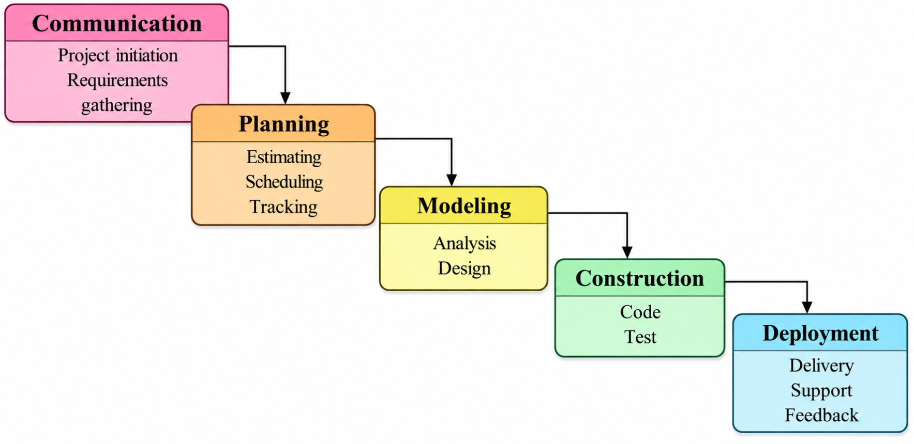
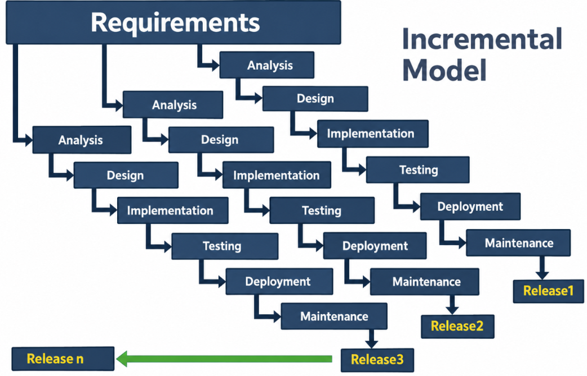
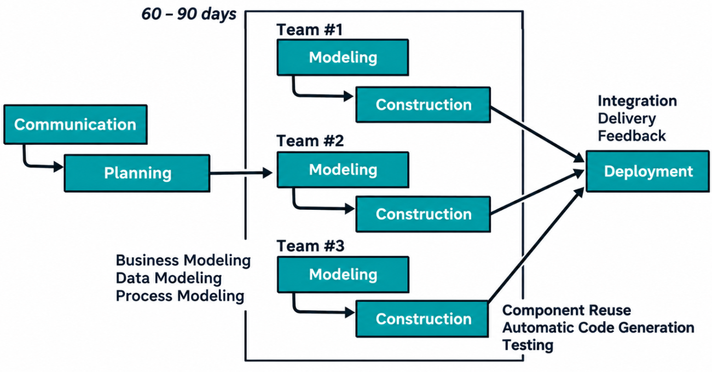

## SE chapter 2 Notes
> [!warning] Only read this; do not study it in much detail.
>
> ### 1. Customer Myths
>
> | No. | Myth | Reality |
> |---|---|---|
> | 1 | A general statement of objectives is enough to start coding. | Clear and detailed requirements are needed before development. |
> | 2 | Requirements can be changed anytime without much impact. | Changes may increase development time, cost, and complexity. |
>
> ### 2. Management Myths
>
> | No. | Myth | Reality |
> |---|---|---|
> | 1 | A standards book provides everything developers need. | Proper methods, tools, and training are also required. |
> | 2 | Adding more programmers to a delayed project will make it finish sooner. | Training and coordination of new programmers may cause further delays. |
> | 3 | Outsourcing means the organization can leave everything to the vendor. | The organization must monitor progress, communicate requirements, and check quality. |
>
> ### 3. Practitioner Myths
>
> | No. | Myth | Reality |
> |---|---|---|
> | 1 | Once the program works, the job is done. | Testing, documentation, maintenance, and improvements are still required. |
> | 2 | Software quality cannot be assessed until the program runs. | Reviews, inspections, and design checks can assess quality before execution. |
> | 3 | The only deliverable is the working program. | Documentation, test cases, and user manuals are also deliverables. |
> | 4 | Software engineering documentation slows development. | Proper documentation improves communication and maintenance. |
>
> ### Software Process vs. Generic Process Model
>
> | Software Process | Generic Process Model |
> |---|---|
> | Defines the activities used to develop software. | Provides a general framework for organizing development activities. |
> | Activities vary according to the project and model. | Common activities include communication, planning, modeling, construction, and deployment. |
>
> **Quick Revision:**
> - Customer myths = Requirements
> - Management myths = Planning and control
> - Practitioner myths = Coding, testing, and documentation

> [!warning] Read only — do not study these topics in detail.
>
> - Detailed explanations of the Software Process.
> - Long sugarcane irrigation case-study examples.
> - Detailed descriptions of sensors, Arduino, AI/ML algorithms, database design, and mobile app development.
> - Detailed lists of UML diagrams.
> - Detailed examples of risks, cost estimation, team roles, and scheduling.

---

## 1. Software Process

A software process is a structured set of activities used to develop, test, deploy, and maintain software. It provides an organized approach to building reliable software.

## 2. Generic Process Model

A Generic Process Model is a basic framework describing the common activities followed in software development.

| Activity | Meaning | Example |
|---|---|---|
| Communication | Gather requirements from customers and stakeholders. | Understand farmers' irrigation needs. |
| Planning | Estimate time, cost, resources, and risks. | Prepare the project schedule. |
| Modeling | Analyze requirements and design the system. | Design the database and application interface. |
| Construction | Write code and test the software. | Develop and test the irrigation system. |
| Deployment | Deliver the software and collect feedback. | Install the system on farms. |

***

### Explain Testing with Example: Unit, Integration, System, Acceptance, Regression 

These five levels of testing cover the full quality assurance cycle, from the smallest code unit to the full end-user experience.

#### 1. Unit Testing

> [!hint] Definition
> 
> Tests the **smallest individual function or component** of the code in isolation.
> 
> **Example:** Checking that the specific function which **validates the password length** returns the correct true/false result.

#### 2. Integration Testing

> [!hint] Definition
> 
> Tests how **two or more related modules** or components communicate and work together.
> 
> **Example:** Checking that the **Login Form** successfully connects to and verifies the credentials against the **Database Module**.

#### 3. System Testing

> [!hint] Definition
> 
> Tests the **entire, fully integrated application** (end-to-end) against all original technical and functional requirements.
> 
> **Example:** Running a full scenario to ensure a user can **successfully log in**, access their main dashboard, and then securely **log out**.

#### 4. User Acceptance Testing (UAT)

> [!hint] Definition
> 
> Formal testing done by the **actual end-users or customers** to validate the system meets their specific business needs.
> 
> **Example:** The client formally verifies that all users from the HR department can **successfully log in** and access their assigned roles/permissions.

#### 5. Regression Testing

> [!hint] Definition
> 
> Tests existing, unchanged functionality to ensure that **new code changes** have not introduced new bugs or broken previous features.
> 
> **Example:** After adding a new "Forgot Password" feature, rerunning the **original login test cases** to ensure the standard login still works.

***
## Software Development Life Cycle (SDLC)

The Software Development Life Cycle (SDLC) is a structured process used to develop high-quality software. It consists of different phases, each with specific activities and deliverables. It ensures that software is developed systematically, within budget, on time, and according to user requirements.

### Phases of SDLC

1. Planning and Feasibility Analysis
2. Requirement Specification (SRS)
3. System Design
4. Development (Coding)
5. Testing
6. Deployment
7. Maintenance

### 1. Planning and Feasibility Analysis

This is the first phase of SDLC. It determines whether the project is feasible and prepares a plan for development.

**Activities:**
1. Feasibility Analysis: Checks whether the project is practical.
2. Cost Estimation: Estimates the total development cost.
3. Scheduling: Prepares a timeline for project completion.
4. Resource Planning: Identifies the required people, tools, and hardware.

**Types of Feasibility:**
- Technical Feasibility: Checks whether the required technology is available.
- Economic Feasibility: Determines whether the project is affordable.
- Operational Feasibility: Checks whether users can operate the system.
- Schedule Feasibility: Checks whether the project can be completed on time.

**Output:** Project Plan and Feasibility Report.

### 2. Requirement Specification (SRS)

In this phase, the requirements are collected from customers and stakeholders, validated, and documented in the Software Requirement Specification (SRS).

**Types of Requirements:**

1. Functional Requirements: Describe what the system must do.
   Example: The system shall monitor battery temperature and activate cooling when it exceeds 45°C.

2. Non-Functional Requirements: Describe how the system should perform.
   Example: The dashboard shall update sensor readings every second and provide secure authentication.

**Requirement Validation:**
-   Complete: Nothing important is missing.
-   Correct: Requirements are accurate.
-   Feasible: Requirements can be achieved.
-   Consistent: Requirements do not contradict each other.
-   Unambiguous: Requirements have only one clear meaning.
-   Testable: Requirements can be checked through testing.

**Output:** Software Requirement Specification (SRS).

### 3. System Design

In this phase, the approved requirements are converted into a technical blueprint for software development.

**Types of Design:**

1. High-Level Design (HLD): Describes the overall system architecture, technology stack, database, and major modules.

2. Low-Level Design (LLD): Describes the detailed design, including APIs, data structures, and workflows.

**Output:** Design Document Specification (DDS).

### 4. Development (Coding)

In this phase, developers write the actual code according to the approved design.

**Activities:**
1. Coding: Implements the modules according to the design.
2. Code Reviews: Detects errors and improves code quality and readability.
3. Version Control: Tracks code changes and supports collaboration.
4. Unit Testing: Tests individual modules independently.

**Output:** Source code and executable application.

### 5. Testing

Testing is performed to identify defects and verify that the software meets the specified requirements.

**Types of Testing:**

1. Unit Testing: Tests individual components independently.
2. Integration Testing: Checks whether different modules work correctly together.
3. System Testing: Tests the complete integrated application.
4. User Acceptance Testing (UAT): Confirms that the software meets user and business requirements.

**Test Case:** A test case contains a test case ID, module name, input data, expected result, actual result, and test status (Pass/Fail).

**Output:** Test cases, defect reports, and quality metrics.

### 6. Deployment

In this phase, the tested software is released to users for actual use.

**Activities:**
1. Setting up the production environment.
2. Installing and releasing the software.
3. Performing smoke testing to check basic functionality.

**Output:** Live application.

### 7. Maintenance

Maintenance is performed after deployment to keep the software functional, reliable, and up to date.

**Activities:**
1. Bug Fixing: Corrects errors found after release.
2. Performance Tuning: Improves software performance.
3. Updates: Keeps the software compatible and secure.
4. Feature Enhancements: Adds or improves functionality.

**Output:** Patches, updates, and new versions.

### Quick Revision Table

| Phase | Main Activity | Output |
|---|---|---|
| Planning | Feasibility, cost, and scheduling | Project Plan |
| Requirement Specification | Gather and document requirements | SRS |
| System Design | Prepare technical design | DDS |
| Development | Write the code | Source code |
| Testing | Find and fix defects | Test reports |
| Deployment | Release software | Live application |
| Maintenance | Fix and improve software | Patches and updates |

***

# Waterfall Model

The Waterfall Model is a linear and sequential software development model in which each phase is completed before the next phase begins. The output of one phase becomes the input for the next phase.

## Phases of the Waterfall Model
 

### 1. Communication Phase
This is the first phase, where the development team understands the customer's needs and defines the project objectives. The team identifies stakeholders, defines the project scope, and conducts a feasibility study. Requirement gathering is also carried out to identify functional and non-functional requirements. These requirements are documented in the Software Requirements Specification (SRS).

**Output:** Software Requirements Specification (SRS).

### 2. Planning Phase
In this phase, the team decides how the project will be completed within the available time, budget, and resources. The project cost, development time, and required resources are estimated. Tasks are divided, responsibilities are assigned, and milestones are defined. A project schedule is prepared, and progress is tracked to identify delays and take corrective action.

**Output:** Project schedule and milestone plan.

### 3. Modeling Phase
In this phase, the requirements are analyzed and converted into a technical design for the software. During analysis, the team studies the requirements and identifies system constraints. During design, the system architecture, database, and user interface are planned. High-Level Design (HLD) and Low-Level Design (LLD) are prepared to guide developers during coding.

**Output:** Analysis model and Design Document Specification (DDS).

### 4. Construction Phase
In this phase, the actual coding work begins. Developers write source code and develop software modules according to the design. Code reviews are performed, and modules are integrated to form the complete system. Testing is carried out to identify and fix errors. It includes unit testing, integration testing, system testing, and acceptance testing.

**Output:** Tested software and test reports.

### 5. Deployment Phase
In this phase, the completed software is delivered to the customer and made available for use. The software is installed and configured, and users may be trained to operate it. After deployment, technical support is provided to resolve user issues and fix bugs. Security patches and updates may be released to improve performance. User feedback is collected to identify future improvements.

**Output:** Live software, updated software, and feedback reports.

## Advantages of the Waterfall Model

1. **Easy to understand:** It follows a simple, step-by-step process.
2. **Clear documentation:** Each phase is properly documented, making maintenance easier.
3. **Easy to manage:** Every phase has defined goals and deliverables.
4. **Suitable for fixed requirements:** It works well when requirements are clear and unlikely to change.
5. **Defined milestones:** Progress can be tracked through the completion of each phase.

## Disadvantages of the Waterfall Model

1. **Not flexible:** Changes are difficult and expensive once a phase is completed.
2. **Late testing:** Most testing takes place after development.
3. **Limited customer involvement:** Customer feedback is limited during development.
4. **Not suitable for changing requirements:** Frequent changes can disrupt the sequential process.
5. **Higher risk:** Errors in an early phase can affect later phases.

## When to Use the Waterfall Model

The Waterfall Model is preferred when project requirements are clearly defined, fixed, and unlikely to change. It is suitable for small or simple projects with a clear scope and timeline, especially when detailed documentation and planning are required.

**Examples:**
1. Government exam portal
2. Library management system
3. Payroll processing system

***
## Incremental Model

The **Incremental Model** is a Software Development Life Cycle (SDLC) model in which the software is developed, tested, and delivered in small parts called **increments**. Initially, a basic working version of the software is developed. In subsequent increments, new features are added to the existing software until the complete system is finished. Each increment follows the SDLC phases of requirement analysis, design, implementation, testing, and deployment. This model is useful when the basic requirements are known and important features need to be delivered early.
  
## Phases of the Incremental Model

### 1. Requirement Analysis

In this phase, the requirements for the current increment are identified and analyzed. The development team determines which features need to be included in the current release based on their importance and the overall project requirements. Only the requirements related to the current increment are considered, while the remaining features are planned for future increments.

### 2. System Design

Once the requirements are clear, the next step is to design the features included in the current increment. The team decides how these features will work and how they will connect with the existing system. This includes planning the system structure, database, user interface, and interaction between modules. Proper design also helps in integrating future increments with the existing software.

### 3. Implementation (Coding)

In this phase, developers write the actual source code according to the design. The features planned for the current increment are developed and integrated with the previously completed parts of the software. The development team ensures that the new features work correctly without affecting the existing functionality.

### 4. Testing

After implementation, the current increment is tested to identify and fix errors. Unit testing is performed to check individual modules, integration testing checks whether different modules work together correctly, and system testing checks the overall functionality of the increment. Previously developed features may also be checked to ensure that the new changes have not affected them.

### 5. Deployment

Once testing is completed successfully, the working increment is delivered to the customer or released to users. The new features are added to the existing working software, providing users with an improved version of the system. This allows the customer to start using important features without waiting for the entire project to be completed.

### 6. Feedback

After deployment, feedback is collected from users to understand their experience and identify problems or possible improvements. The development team analyzes the feedback and uses it to plan the requirements and features of the next increment. These phases are repeated until all the required features are developed and the complete software system is delivered.

## Example – Railway Ticket Booking System

A railway ticket booking system can be developed using the Incremental Model. In the first increment, basic features such as train search and ticket booking are developed and released. In the second increment, seat selection and online payment facilities are added. In the third increment, SMS notifications and booking status updates are introduced. Each increment adds new features to the existing working system until the complete application is ready.

## When to Use the Incremental Model

The Incremental Model is preferred when the basic software requirements are known and the customer needs an early working version of the product. It is suitable for large projects that can be divided into smaller modules and for applications where important features can be delivered first and additional features can be added gradually.

## Advantages of the Incremental Model

1.  **Early delivery:** Important features are delivered to the customer at an early stage.
    
2.  **Easy testing and debugging:** Smaller increments make errors easier to identify and fix.
    
3.  **Customer feedback:** Feedback can be collected after each release and used to improve future increments.
    
4.  **Lower risk:** Problems can be identified and handled during individual increments.
    
5.  **Flexibility:** Changes can be implemented more easily than in the Waterfall Model.
    

## Disadvantages of the Incremental Model

1.  **Requires careful planning:** Proper planning and system architecture are needed before development.
    
2.  **Integration complexity:** Combining different increments can become difficult.
    
3.  **Higher cost:** Multiple releases may increase the overall development cost.
    
4.  **Unclear requirements:** It is not suitable when the requirements are completely unclear.
    
5.  **Continuous customer involvement:** Regular feedback and coordination are required.
    
***
## RAD (Rapid Application Development) Model

The **Rapid Application Development (RAD) Model** is an evolutionary software development model that focuses on developing and delivering high-quality software quickly. It follows an iterative and incremental approach and emphasizes continuous customer involvement, rapid prototyping, reusable components, and development tools. The project is divided into smaller modules that can be developed by different teams simultaneously and later integrated into a complete system. The RAD Model aims to reduce development time and may deliver software within approximately 60–90 days, depending on the project.

## Phases of the RAD Model
 
### 1. Communication

Communication is the first phase of the RAD Model. In this phase, developers and stakeholders communicate to understand the project objectives, customer needs, and user expectations. Functional and non-functional requirements are gathered, and the project scope and constraints are identified. These requirements form the basis for planning and dividing the project into smaller modules.

**Output:** Software Requirements Specification (SRS) and initial project requirements.

### 2. Planning

In this phase, the project is planned to ensure rapid development and timely delivery. The gathered requirements are divided into smaller modules, and different teams may be assigned to develop them simultaneously. The project cost, development time, resources, and development tools are determined. A development schedule is also prepared to coordinate the work of different teams.

**Output:** Project plan, development schedule, and resource allocation plan.

### 3. Modeling

In this phase, the requirements are converted into business, data, and process models. It consists of three subphases:

**i. Business Modeling:** Business modeling identifies the main business processes and the flow of information between different functions of the system. It helps the team understand business objectives, user roles, and how information is produced and used.

**ii. Data Modeling:** Data modeling identifies the data required by the system and the relationships between different data entities. It includes identifying entities, defining their attributes, and designing database tables and relationships.

**iii. Process Modeling:** Process modeling describes how data is processed to perform different system functions. It defines business logic, system workflows, and user interactions. Diagrams such as Data Flow Diagrams (DFDs), flowcharts, and UML activity diagrams may be used.

**Output:** Business process models, ER diagrams, database schema, DFDs, and other process diagrams.

### 4. Construction

Construction is the main development phase of the RAD Model, where the application is built rapidly using reusable components, development tools, and automation. It consists of the following activities:

**i. Component Reuse:** Instead of developing everything from scratch, existing software components, libraries, APIs, and pre-built user interface components are reused. This reduces coding effort, development time, and cost.

**ii. Automatic Code Generation:** RAD tools and visual development platforms can automatically generate parts of the application code. Features such as forms, database connections, and CRUD operations can be created using visual design tools, reducing manual coding.

**iii. Testing:** Testing is performed continuously during development rather than being postponed until the end. Unit testing checks individual modules, integration testing checks interactions between modules, system testing checks the complete application, and User Acceptance Testing (UAT) verifies whether the software meets user expectations. Errors are identified and corrected during development.

**Output:** Tested software, bug reports, and the final application.

### 5. Deployment

After development and testing, the completed modules are integrated into a single system and delivered to the customer. The application is installed and made available for users. Feedback and any remaining issues can be addressed to improve the delivered software.

**Output:** Integrated and deployed software.

## Advantages of the RAD Model

1.  **Rapid development:** Software can be developed and delivered in a short time.
    
2.  **Early working prototype:** Users can evaluate an early version of the software.
    
3.  **Continuous customer involvement:** Regular feedback helps improve the product.
    
4.  **Easy to accommodate changes:** Requirements can be modified during development.
    
5.  **Component reuse:** Reusing existing components reduces coding effort and development time.
    
6.  **Higher productivity:** Development tools and automation speed up implementation.
    
7.  **Reduced project risk:** Continuous testing helps identify and resolve problems early.
    

## Disadvantages of the RAD Model

1.  **Requires skilled developers:** Developers must be familiar with RAD tools and rapid development techniques.
    
2.  **High customer involvement:** Continuous communication and feedback from customers are necessary.
    
3.  **Not suitable for every project:** Very large or highly complex systems may require more extensive planning.
    
4.  **High initial cost:** Specialized tools and experienced development teams can be expensive.
    
5.  **Dependence on reusable components:** Development may slow down if suitable components are unavailable.
    
6.  **Less detailed documentation:** Documentation may be less comprehensive than in traditional models such as Waterfall.
    
7.  **Scalability challenges:** Integrating and managing the system may become difficult as the project grows.
    

## When to Use the RAD Model

The RAD Model is preferred when software must be developed quickly, requirements can be divided into smaller modules, and customers are available to provide regular feedback. It is suitable for applications where reusable components and rapid prototyping can speed up development.

**Example:** An online shopping application can be developed using RAD. One team can develop user registration, another can develop product browsing, and another can develop the shopping cart and payment module. The modules are developed simultaneously, tested, and integrated into a complete application.

***
## Spiral Model

The **Spiral Model**, proposed by Barry Boehm in 1986, is a risk-driven software development model that combines the features of the Waterfall, Prototyping, and Iterative models. In this model, software is developed through repeated cycles called **spirals**, with each cycle producing a more complete version of the software. It focuses on identifying and managing risks at every stage of development. The model is mainly suitable for large, complex, and high-risk projects.

## Phases of the Spiral Model

Each spiral consists of four major phases:

### 1. Planning

In this phase, the development team communicates with the customer to understand the project objectives and requirements. The team identifies the goals, constraints, available resources, and possible alternatives. The project cost, development time, and schedule are estimated, and a plan is prepared for the current development cycle.

**Output:** Project plan, cost estimation, and schedule.

### 2. Risk Analysis

In this phase, the team identifies and evaluates the possible risks associated with the project. Technical, financial, and operational risks are analyzed, and suitable solutions are planned to reduce their impact. A prototype may be developed to test an idea or resolve uncertainty before proceeding with full development.

**Output:** Risk assessment report and possible solutions or prototype.

### 3. Engineering and Execution

In this phase, the actual software is designed, developed, and tested according to the plan. The team analyzes the requirements, prepares the system design, writes the source code, and integrates the software modules. Testing is performed to identify and fix errors before the current version is delivered for evaluation.

**Output:** Developed and tested software increment.

### 4. Customer Evaluation

In this phase, the developed version of the software is presented to the customer for evaluation. The customer reviews the features and provides feedback. The team identifies necessary improvements and uses the feedback to plan the next spiral. These cycles continue until the final software product is completed.

**Output:** Customer feedback, updated requirements, and plan for the next cycle.

## Example – Defense System Software

A defense system software project can use the Spiral Model because it involves complex requirements and high risks. In the first spiral, the team identifies requirements and develops a basic prototype. In the next spiral, technical and security risks are analyzed, and the software is developed and tested. Customer feedback is collected after each cycle, and improvements are made in subsequent spirals until the complete system is ready.

## Advantages of the Spiral Model

1. **Early risk identification:** Risks are identified and addressed during every development cycle.
2. **Supports changing requirements:** Changes can be incorporated in later cycles.
3. **Continuous customer involvement:** Regular feedback helps improve software quality.
4. **Suitable for complex projects:** It is useful for large and high-risk projects.
5. **Early prototyping:** Prototypes help identify problems before full development.

## Disadvantages of the Spiral Model

1. **High cost:** Repeated risk analysis, prototyping, and testing increase development costs.
2. **Requires skilled experts:** Experienced professionals are needed for risk assessment and management.
3. **Complex management:** Multiple cycles require careful planning and coordination.
4. **Time-consuming:** Repeated evaluation and testing may increase development time.
5. **Not suitable for small projects:** Its cost and complexity may not be justified for simple projects.

## When to Use the Spiral Model

The Spiral Model is preferred when the project is large-scale, complex, and involves significant risks. It is suitable when requirements may change during development and when frequent risk assessment, prototyping, and customer feedback are necessary.

**Examples:** Defense system software, aerospace systems, and large banking applications.

***
