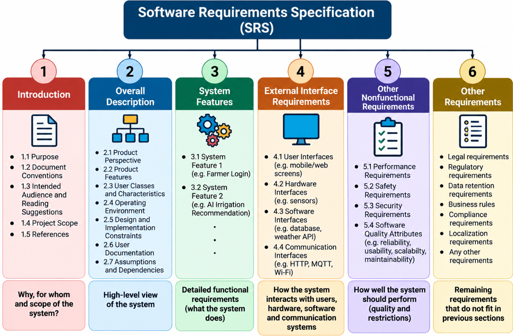
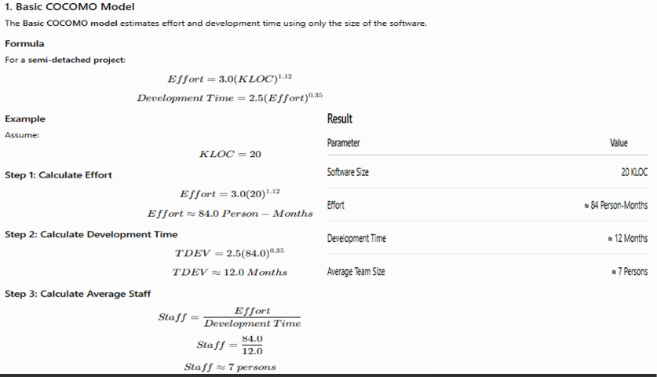
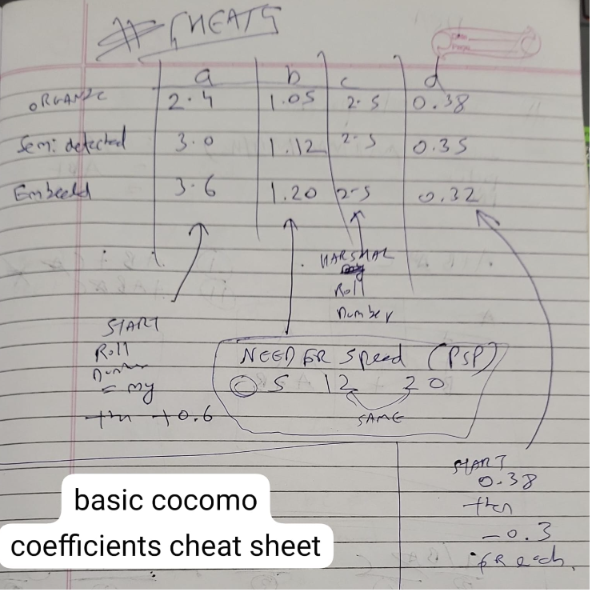
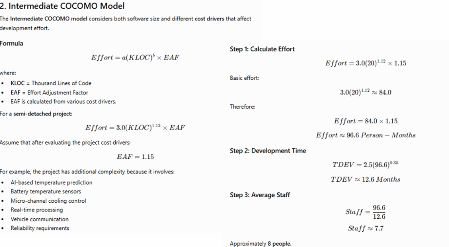
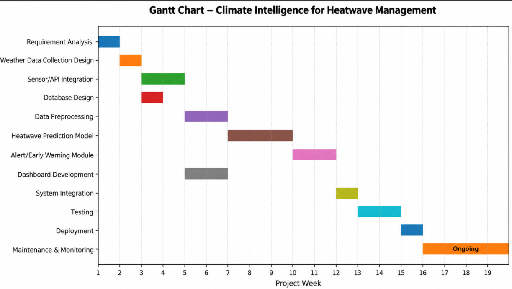
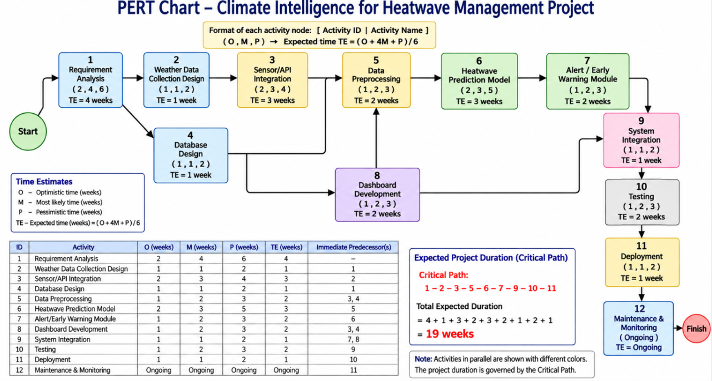
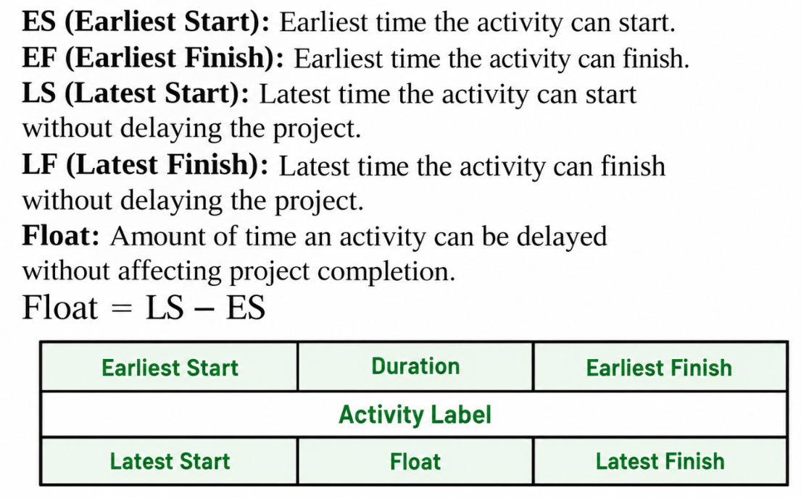
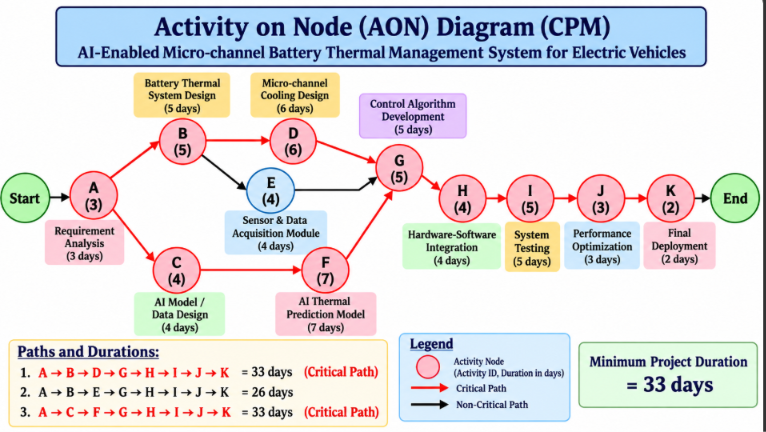
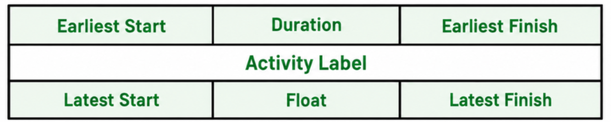

# se chapter 3

## 1. Requirements Analysis

Requirements analysis is an important phase of software development in which the needs and expectations of users and stakeholders are identified, studied, and documented. It ensures that the software is developed according to customer requirements and achieves its intended goals.

### Types of Software Requirements

Software requirements are mainly classified into two types:

**1. Functional Requirements**

Functional requirements define the specific features and operations that a system must perform. They describe what the system should do and how it interacts with users or other systems. These requirements represent the functions that can be observed and tested in the final product.

**Example:** In an irrigation advisory system, the software collects soil moisture and weather data and provides irrigation recommendations to farmers.

**2. Non-Functional Requirements**

Non-functional requirements define how well the system should operate rather than specifying its individual features. They focus on the performance, security, reliability, and overall quality of the software.

Examples include:
- **Performance:** The system should respond quickly.
- **Security:** The system should prevent unauthorized access.
- **Usability:** The system should be easy to use.
- **Reliability:** The system should operate consistently.
- **Scalability:** The system should handle an increase in users or data.
- **Maintainability:** The system should be easy to update and fix.
- **Portability:** The system should run in different environments.

## 2. Steps in Requirement Analysis

### 1. Requirement Gathering
In this step, requirements are collected from customers, users, managers, and other stakeholders. Techniques such as interviews, questionnaires, observation, meetings, and brainstorming are used to understand their needs.

### 2. Requirement Analysis
The collected requirements are studied in detail. The team identifies missing requirements, conflicts, duplicate information, and unclear statements to ensure that the requirements are properly understood.

### 3. Requirement Classification
The requirements are classified into functional and non-functional requirements. Functional requirements describe what the system should do, while non-functional requirements describe how well the system should perform.

### 4. Requirement Prioritization
Requirements are arranged according to their importance so that the most essential features can be developed first. For example, user login may have high priority, report generation medium priority, and theme customization low priority.

### 5. Requirement Validation
In this step, requirements are checked to ensure that they are suitable for software development.

Requirements must be:
- **Correct:** They represent the actual needs.
- **Complete:** Nothing important is missing.
- **Consistent:** They do not contradict each other.
- **Feasible:** They can be implemented.
- **Unambiguous:** They have only one clear meaning.
- **Testable:** They can be checked through testing.

### 6. Requirement Documentation
After validation, the final requirements are documented in a Software Requirements Specification (SRS). This document describes the functional and non-functional requirements and acts as a reference for design, development, and testing.

## 3. Requirement Analysis and Modeling

Requirement analysis and modeling involves understanding the customer's needs, documenting those needs, and creating models that describe how the proposed software should work.

The main aim of analysis modeling is to represent the **information, functions, and behaviour** of the system to be developed. These are later converted into architectural, interface, and component-level designs during design modeling.

Different diagrams are used to represent the system's information, functions, behaviour, and interactions. The analysis model acts as a bridge between the system requirements and the design model.

## 4. System Engineering

System engineering is a systematic approach to defining, developing, and managing a complete system. A software system may be part of a larger system containing hardware, software, people, data, procedures, and external systems.

During requirement analysis, system engineering helps identify the following:

1. **System objectives:** What the system should achieve.
2. **Stakeholders:** People who use or interact with the system.
3. **System boundaries:** What is included in and excluded from the system.
4. **System environment:** External systems and conditions affecting the system.
5. **Hardware and software requirements:** The required hardware and software.
6. **Functional and non-functional requirements:** The system's functions and quality requirements.
7. **Constraints and limitations:** Restrictions affecting development.
8. **System interfaces:** Connections with other systems.

## 5. Software Requirement Analysis Techniques

Software requirements can be analyzed using different modeling techniques.

> A. Scenario-Based 

Scenario-based modeling describes how users interact with the system to perform specific tasks. It helps understand the system from the user's point of view.

**Common techniques:** Use case diagrams, use cases, user stories, and activity descriptions.

> B. Class-Based Modeling

Class-based modeling identifies the important classes or objects in the system, their attributes, and their relationships. It helps represent the structure of the system.

**Common technique:** Class diagram.

> C. Behavioral Modeling

Behavioral modeling describes how the system behaves in response to events or user actions. It shows how the system changes its state or responds to different situations.

> D. Flow-Oriented Modeling

Flow-oriented modeling shows how data moves through the system and how it is processed to produce the required output.

**Common techniques:** Data Flow Diagram (DFD), data dictionary, and process specifications.

## 6. Rules of Requirement Analysis and Modeling

The following guidelines should be followed while preparing a requirements model:

1. **Focus on requirements:** The model should describe the customer's needs and the problem domain rather than explaining implementation details.
2. **Improve understanding:** Each element of the model should help stakeholders understand the system's information, functions, and behaviour.
3. **Keep design details for later:** Decisions about implementation and infrastructure should generally be considered after understanding the problem domain.
4. **Minimize coupling:** Avoid unnecessary dependencies between classes and functions so that changes can be made more easily.
5. **Provide value to stakeholders:** The model should help customers validate requirements, designers prepare the design, and testers plan acceptance tests.
6. **Keep the model simple:** Avoid unnecessary diagrams and complex notations when simpler representations are sufficient.

## 7. Requirement Modeling

Requirement modeling is the process of representing software requirements using diagrams and structured models. It helps developers understand the system's functions, data, behaviour, and interactions before design and development begin.

Consider an **Irrigation Advisory System for Sugarcane Crop using AI and Sensor-Based Technology**.

- **Input:** Soil moisture, temperature, humidity, rainfall forecast, and crop stage.
- **Processing:** The AI system analyzes the collected data.
- **Output:** An irrigation recommendation is provided to the farmer.

### Types of Requirement Models

1. **Use Case Diagram:** Represents interactions between users and the system.
2. **Activity Diagram:** Represents the workflow or sequence of activities.
3. **Data Flow Diagram (DFD):** Represents the movement of data through the system.
4. **Class Diagram:** Represents classes, attributes, and relationships.
5. **Sequence Diagram:** Represents interactions between objects over time.
6. **ER Diagram:** Represents data entities and their relationships.
   

***
## Software Requirements Specification (SRS)

## 1. Definition of SRS

A Software Requirements Specification (SRS) is a formal document that describes in detail what a software system is expected to do and the constraints under which it must operate. It acts as an agreement and reference document between the customer, developers, testers, project managers, and other stakeholders.

**Example:** For an AI Irrigation Advisory System for Sugarcane, the SRS defines how the system collects sensor and weather data, predicts crop water requirements, recommends irrigation, and sends alerts to farmers.

## 2. Structure of SRS
 
The SRS consists of the following major sections:

1.  Introduction
    
2.  Overall Description
    
3.  System Features
    
4.  External Interface Requirements
    
5.  Other Nonfunctional Requirements
    
6.  Other Requirements
    

## 3. Introduction

The Introduction section explains the purpose, conventions, intended audience, scope, and references of the SRS document.

### 3.1 Purpose

This section explains why the software is being developed and what it aims to achieve.

**Example:** The purpose of the AI Irrigation Advisory System is to provide AI-based irrigation recommendations to sugarcane farmers using sensor data, weather information, and historical data to reduce water wastage and improve crop productivity.

### 3.2 Document Conventions

This section explains the conventions and terms used in the SRS document.

-   **Shall:** Indicates a mandatory requirement.
    
-   **Should:** Indicates a recommended requirement.
    
-   **May:** Indicates an optional requirement.
    

**Example:** The system shall authenticate the farmer before providing access to the application.

### 3.3 Intended Audience and Reading Suggestions

This section identifies the people who should read the SRS and provides guidance on how the document is organized.

The intended audience includes customers, developers, testers, project managers, farmers, and agricultural experts.

### 3.4 Project Scope

The project scope defines the boundaries of the software by specifying what is included and excluded from the system.

**Included:**

-   Soil moisture, temperature, humidity, and rainfall data collection.
    
-   Weather data integration.
    
-   AI-based prediction of crop water requirements.
    
-   Irrigation recommendations.
    
-   Farmer notifications through mobile or web applications.
    
-   Historical data viewing.
    

**Not included:**

-   Automatic physical operation of irrigation pumps.
    
-   Purchase of agricultural equipment.
    
-   Physical installation and maintenance of sensors.
    

### 3.5 References

This section lists external documents and resources used while preparing the SRS.

Examples include IEEE standards, government regulations, research papers, existing system documentation, API documentation, user manuals, and company standards.

## 4. Overall Description

The Overall Description section provides a high-level overview of the entire system. It explains the system's purpose, users, operating environment, major features, limitations, and dependencies without describing every requirement in detail.

### 4.1 Product Perspective

This section describes how the proposed system relates to existing systems, hardware, software, and external services.

**Example:** The AI Irrigation Advisory System interacts with soil moisture sensors, temperature and humidity sensors, weather APIs, a database, an AI model, and a mobile or web application.

### 4.2 Product Features

This section provides a high-level list of the major functions offered by the system.

The main features are:

1.  Farmer registration and login.
    
2.  Sensor data collection.
    
3.  Weather data collection.
    
4.  Data storage and management.
    
5.  AI-based prediction of crop water requirements.
    
6.  Irrigation recommendations.
    
7.  Farmer notifications and alerts.
    
8.  Historical data viewing.
    
9.  Administrator monitoring.
    

Detailed explanations of individual features are provided in the System Features section.

### 4.3 User Classes and Characteristics

This section identifies different categories of users and describes their characteristics.

**Farmer:**

-   Has basic technical knowledge.
    
-   Uses a mobile or web application.
    
-   Views irrigation recommendations and alerts.
    

**Administrator:**

-   Has technical knowledge.
    
-   Manages farmer accounts.
    
-   Monitors sensors and system performance.
    
-   Maintains the system.
    

**Agricultural Expert:**

-   Has knowledge of sugarcane cultivation and irrigation.
    
-   Uses crop and environmental data to understand irrigation recommendations.
    
-   Helps assess the suitability of recommendations for crop growth.
    

### 4.4 Operating Environment

This section describes the hardware, software, and network environment in which the system operates.

**Hardware:** Soil moisture sensors, temperature and humidity sensors, servers, mobile phones, and an IoT gateway.

**Network:** Wi-Fi, 4G/5G, or internet connectivity.

**Software:** Operating system, database, web server, AI/ML framework, and IoT communication protocols.

### 4.5 Design and Implementation Constraints

Constraints are limitations that developers must follow while designing and implementing the software.

Examples include:

-   The system must work with the existing soil moisture sensors.
    
-   Limited hardware resources may restrict processing capabilities.
    
-   The system must follow security standards.
    
-   The system should handle limited or intermittent network connectivity.
    
-   Developers may be required to use a particular programming language or database.
    

**Example:** The system shall use the existing soil moisture sensors installed in the sugarcane field.

### 4.6 User Documentation

This section specifies the documents and guides provided to users to help them operate the system.

Examples include:

-   User manual.
    
-   Installation guide.
    
-   Online help.
    
-   Frequently Asked Questions (FAQ).
    
-   Troubleshooting guide.
    
-   Administrator manual.
    

**Example:** The farmer's user manual explains how to view soil moisture readings and interpret irrigation recommendations.

### 4.7 Assumptions and Dependencies

**Assumptions** are conditions believed to be true while developing or operating the system.

**Example:** It is assumed that the farm has internet connectivity at least periodically and that the installed sensors provide usable readings.

**Dependencies** are external systems or services on which the software relies.

**Example:** The system depends on an external weather API to obtain rainfall forecasts. If the API becomes unavailable, weather-based predictions may be affected.

## 5. System Features

This section describes individual system functions in detail, including their description, inputs, processing, and outputs.

### 5.1 Farmer Login

**Description:** The farmer shall be able to log in using registered credentials.

**Input:**

-   Username or mobile number.
    
-   Password.
    

**Processing:**

-   Validate the entered credentials.
    
-   Authenticate the farmer.
    

**Output:**

-   Successful login and access to the dashboard.
    
-   An error message if the credentials are invalid.
    

### 5.2 AI-Based Irrigation Recommendation

**Description:** The system shall analyze sensor readings, weather information, and crop-stage data to predict water requirements and recommend suitable irrigation.

**Input:**

-   Soil moisture.
    
-   Temperature.
    
-   Humidity.
    
-   Rainfall information.
    
-   Sugarcane crop stage.
    
-   Historical and environmental data.
    

**Processing:**

-   Validate the collected data.
    
-   Process sensor and weather readings.
    
-   Use the AI model to predict the crop's water requirements.
    
-   Generate an irrigation recommendation.
    

**Output:**

-   Irrigation required or not required.
    
-   Recommended irrigation time and amount, where applicable.
    
-   An alert sent to the farmer through the mobile or web application.
    

**Example:** If the sensors detect dry soil and the weather data does not indicate sufficient rainfall, the system may recommend irrigation to the farmer.

## 6. External Interface Requirements

This section describes how the software interacts with users, hardware, other software, and communication systems.

### 6.1 User Interfaces

This section describes how users interact with the software through screens and application features.

Examples:

-   Login screen.
    
-   Farmer dashboard.
    
-   Sensor data screen.
    
-   Irrigation recommendation screen.
    
-   Notification screen.
    
-   Historical reports.
    

**Example:** The dashboard shall display current soil moisture readings and the latest irrigation recommendation.

### 6.2 Hardware Interfaces

This section describes how the software interacts with physical hardware devices.

**Example:** The system receives soil moisture, temperature, and humidity readings from sensors through an IoT gateway.

### 6.3 Software Interfaces

This section describes how the system interacts with other software applications and services.

Examples:

-   Database.
    
-   Weather API.
    
-   AI/ML model.
    
-   Authentication service.
    
-   Notification service.
    

**Example:** The system shall retrieve weather forecast data through an external weather API.

### 6.4 Communication Interfaces

This section defines the communication methods and protocols used for data exchange between system components.

Examples:

-   HTTP/HTTPS.
    
-   MQTT (Message Queuing Telemetry Transport).
    
-   Wi-Fi.
    
-   Bluetooth.
    
-   REST API.
    
-   TCP/IP.
    

**Example:** The system may use MQTT to receive sensor readings and HTTPS to securely exchange data with the web application.

## 7. Other Nonfunctional Requirements

Functional requirements describe **what the system does**, whereas nonfunctional requirements describe **how well the system performs** and the quality or restrictions under which it operates.

### 7.1 Performance Requirements

These specify the expected response time, processing speed, and system performance.

**Example:** The system should process incoming sensor readings and display updated irrigation recommendations within an acceptable response time.

### 7.2 Safety Requirements

These specify requirements intended to prevent unsafe operation or harmful outcomes.

**Example:** The system should clearly identify unavailable or unreliable sensor data so that farmers are not given recommendations based on invalid readings.

### 7.3 Security Requirements

These specify how the system protects user accounts, data, and communications against unauthorized access.

**Example:** The system shall authenticate farmers before allowing access to their accounts and shall use HTTPS for sensitive communication.

### 7.4 Software Quality Attributes

These describe the quality characteristics expected from the software, such as reliability, usability, maintainability, availability, and efficiency.

**Example:** The application should be easy for farmers to use, provide reliable recommendations when valid data is available, and be maintainable when the AI model or sensors are updated.

## 8. Other Requirements

This section contains requirements that do not fit naturally into the previous sections.

Examples include:

-   **Legal requirements:** Compliance with applicable laws.
    
-   **Regulatory requirements:** Following relevant agricultural or technology regulations.
    
-   **Data retention requirements:** Specifying how long historical sensor and irrigation data must be stored.
    
-   **Business rules:** Defining rules for generating irrigation recommendations.
    
-   **Compliance requirements:** Meeting applicable standards.
    
-   **Localization requirements:** Supporting the languages used by farmers.
    

**Example:** The system may need to display recommendations in a language understood by local sugarcane farmers.

## Conclusion

An SRS defines the functional and nonfunctional requirements, interfaces, constraints, assumptions, and features of a software system. For the AI Irrigation Advisory System, it provides a common reference for developing a system that uses sensor, weather, and historical data to recommend irrigation and help reduce water wastage.

***

## Software Project Estimation

## 1. Definition

Software Project Estimation is the process of predicting the size, effort, cost, time, and resources required to develop a software system. It is an important activity in software project planning because it helps the project manager determine how much software needs to be developed, how many people are required, how long development will take, and what the approximate project cost will be.

The two estimation techniques covered here are:

1.  LOC (Lines of Code) Estimation
    
2.  Function Point (FP) Estimation
    

## 2. LOC (Lines of Code) Estimation

LOC is a software estimation technique used to estimate the size of a software system by predicting the number of lines of source code required to develop it. Generally, larger software systems require more development effort, time, and cost.

**KLOC** means Kilo Lines of Code, where 1 KLOC = 1,000 LOC.

### Example: AI Irrigation Advisory System for Sugarcane

Suppose we are developing an AI Irrigation Advisory System that uses sensor data and weather information to recommend when and how much water a sugarcane crop needs.

The estimated size of each module is:

| Module | Estimated LOC |
| --- | ---: |
| Login and User Management | 1,000 |
| Farmer/Crop Management | 3,000 |
| Sensor Data Management | 2,500 |
| Irrigation Recommendation | 3,000 |
| Weather API Integration | 1,500 |
| Reports | 2,000 |
| **Total** | **13,000 LOC** |

Therefore,

Total LOC = 13,000

KLOC = 13,000 / 1,000 = **13 KLOC**

### Effort Estimation Using LOC

Suppose historical project data shows that the development team can produce 1,000 LOC per person-month.

**Formula:**

`Effort = Estimated LOC / Productivity`

**Calculation:**

Effort = 13,000 / 1,000

Effort = **13 person-months**

This means the project requires an estimated total effort of 13 person-months, assuming the given productivity rate.

### Advantages of LOC

1.  Simple to understand and calculate.
    
2.  Software can be divided into smaller modules to estimate their sizes separately.
    
3.  Historical LOC and productivity data can help estimate effort and cost.
    

### Disadvantages of LOC

1.  LOC is difficult to estimate accurately before coding begins.
    
2.  It is programming-language dependent; the same functionality may require different numbers of lines in Java and Python.
    
3.  It does not directly measure the functionality delivered to the user.
    
4.  Counting rules may differ regarding comments, blank lines, and generated code.
    

## 3. Function Point (FP) Estimation

Function Point Analysis (FPA) is a software estimation technique that measures the functional size of a system from the user's point of view. It measures the functions provided by the software rather than the number of lines of source code.

Unlike LOC, Function Point estimation does not directly depend on the programming language.

### Example: AI Irrigation Advisory System for Sugarcane

The system provides the following functions:

-   Soil moisture, temperature, and humidity monitoring.
    
-   Weather information.
    
-   AI-based irrigation recommendations.
    
-   Historical data reports.
    
-   Alerts and notifications to farmers.
    
-   Farmer and crop data management.
    

Function Point Analysis estimates the functional size of these features using five components.

### 3.1 Components of Function Point Analysis

**1. External Input (EI)**

External Input is data entering the system from an external source that is used to create, modify, or maintain internal data.

Examples:

-   Farmer registration details.
    
-   Soil moisture readings received from sensors.
    
-   Temperature and humidity readings.
    
-   Crop type and field area.
    

**2. External Output (EO)**

External Output is processed information produced by the system and sent to an external user or system.

Examples:

-   Irrigation recommendations.
    
-   Heat or drought warnings.
    
-   Daily crop reports.
    
-   Water requirement reports.
    
-   Farmer notifications.
    

**3. External Inquiry (EQ)**

External Inquiry is a request from an external user that retrieves information and provides a response without updating internal data.

Examples:

-   Searching historical soil moisture data.
    
-   Viewing previous irrigation records.
    
-   Checking sensor readings.
    
-   Viewing previous weather information.
    

**4. Internal Logical File (ILF)**

An Internal Logical File is a logical collection of data that is maintained by the application itself.

Examples:

-   Farmer database.
    
-   Crop database.
    
-   Sensor readings.
    
-   Irrigation history.
    
-   Field information.
    

**5. External Interface File (EIF)**

An External Interface File contains data used by the application but maintained by another application or system.

Examples:

-   External weather database.
    
-   Government agricultural database.
    
-   External soil information database.
    
-   External crop information service.
    

### 3.2 Function Point Calculation

Each component is assigned a weight based on its complexity: Low, Average, or High. The weights are multiplied by the number of components to calculate Unadjusted Function Points (UFP).

| Component | Low | Average | High |
| --- | ---: | ---: | ---: |
| External Input (EI) | 3   | 4   | 6   |
| External Output (EO) | 4   | 5   | 7   |
| External Inquiry (EQ) | 3   | 4   | 6   |
| Internal Logical File (ILF) | 7   | 10  | 15  |
| External Interface File (EIF) | 5   | 7   | 10  |

**Formula:**

```UFP = Sum of (Number of functions × Corresponding weight)```

### Example of UFP Calculation

Suppose the irrigation system has the following estimated functions. For this example, assume each function falls under Average complexity.

| Component | Number | Average Weight | Total |
| --- | ---: | ---: | ---: |
| EI  | 5   | 4   | 20  |
| EO  | 4   | 5   | 20  |
| EQ  | 8   | 4   | 32  |
| ILF | 2   | 10  | 20  |
| EIF | 1   | 7   | 7   |
| **Total UFP** |     |     | **99** |

Therefore,

UFP = 20 + 20 + 32 + 20 + 7

**UFP = 99**

_Note: These counts are illustrative assumptions for the example, not measured counts from an implemented system._
### 3.3 Value Adjustment Factor (VAF)

The basic UFP does not account for the overall characteristics of the software. Traditional Function Point Analysis uses 14 General System Characteristics (GSCs) to calculate the Value Adjustment Factor (VAF).

Each characteristic is assigned a Degree of Influence (DI) rating from 0 to 5.

**Formula:**

```Total DI = Sum of all 14 ratings```

Minimum Total DI = 0

Maximum Total DI = 14 × 5 = 70

**Traditional VAF Formula:**

```VAF = 0.65 + (0.01 × Total DI)```

Therefore, the traditional VAF ranges from 0.65 to 1.35.

#### 14 General System Characteristics (GSCs)

The following are illustrative ratings for the AI Irrigation Advisory System for Sugarcane.

| No. | General System Characteristic | Example in Irrigation System | DI Score |
|---:|---|---|---:|
| 1 | Data communications | Sensors transmit readings to the server. | 4 |
| 2 | Distributed data processing | Sensors and remote servers handle processing. | 3 |
| 3 | Performance | Recommendations must be generated quickly. | 4 |
| 4 | Heavily used configuration | Server handles readings from many sensors. | 3 |
| 5 | Transaction rate | Frequent sensor readings are processed. | 4 |
| 6 | Online data entry | Farmers enter crop and field details. | 3 |
| 7 | End-user efficiency | Recommendations must be easy to understand. | 4 |
| 8 | Online update | Farmers update crop information. | 3 |
| 9 | Complex processing | AI analyzes sensor and weather data. | 5 |
| 10 | Reusability | The recommendation module can be reused for other crops. | 3 |
| 11 | Installation ease | The application should be easy to install. | 2 |
| 12 | Operational ease | Farmers and administrators operate the system. | 3 |
| 13 | Multiple sites | The system supports farms in different locations. | 3 |
| 14 | Facilitation of change | AI models and irrigation rules can be updated. | 4 |
| | **Total DI** | | **48** |

#### Example of VAF Calculation

Suppose the total Degree of Influence for the AI Irrigation Advisory System is 48.

VAF = 0.65 + (0.01 × Total DI)

VAF = 0.65 + (0.01 × 48)

VAF = 0.65 + 0.48

**VAF = 1.13**

### 3.4 Adjusted Function Point Calculation

The adjusted Function Points are calculated by multiplying UFP by VAF.

**Formula:**

```FP = UFP × VAF```

Given:

UFP = 99

VAF = 1.13

**Calculation:**

FP = 99 × 1.13

FP = 111.87

Therefore, the adjusted Function Point count is approximately **112 FP**.

### 3.5 Effort Estimation Using Function Points

Once the Function Points are calculated, the project effort can be estimated using historical productivity data.

Suppose the team's productivity is 10 FP per person-month.

**Formula:**

```Effort = FP / Productivity```

**Calculation:**

Effort = 112 / 10

**Effort = 11.2 person-months**

Therefore, the estimated effort is 11.2 person-months.

If the team has four people, a simplified calendar-time estimate is:

Calendar time ≈ Effort / Team size

Calendar time ≈ 11.2 / 4

**Calendar time ≈ 2.8 months**

This is a simplified estimate. Actual project duration may differ because of task dependencies, coordination, testing, and other scheduling factors.

**Note:** The DI scores are illustrative assumptions for learning the calculation. Actual scores must be determined based on the project's characteristics.

> [!abstract] QUICK FLASHBACK
> Software Project Estimation — Formula Summary

## 1. LOC (Lines of Code) Estimation

| No. | Purpose | Formula |
|---:|---|---|
| 1 | Convert LOC to KLOC | `KLOC = LOC / 1,000` |
| 2 | Calculate effort | Effort (person-months) = `LOC / Productivity (LOC per person-month)` |
| 3 | Calculate development cost | `Cost = Effort × Cost per person-month` |
| 4 | Estimate calendar time (simplified) | `Calendar Time = Effort / Number of People` |

**Example:**

Given:
- Estimated LOC = 13,000
- Productivity = 1,000 LOC/person-month

Effort = 13,000 / 1,000 = **13 person-months**

KLOC = 13,000 / 1,000 = **13 KLOC**

---

## 2. Function Point (FP) Estimation

### A. Unadjusted Function Points (UFP)

| Component | Low | Average | High |
|---|---:|---:|---:|
| External Input (EI) | 3 | 4 | 6 |
| External Output (EO) | 4 | 5 | 7 |
| External Inquiry (EQ) | 3 | 4 | 6 |
| Internal Logical File (ILF) | 7 | 10 | 15 |
| External Interface File (EIF) | 5 | 7 | 10 |

**Formula:**

```UFP = Σ (Number of components × Corresponding weight)```

### B. Degree of Influence (DI)

| Item | Formula |
|---|---|
| Total Degree of Influence | `Total DI = Sum of all 14 GSC ratings` |
| Minimum Total DI | 0 |
| Maximum Total DI | 14 × 5 = 70 |

Each of the 14 General System Characteristics (GSCs) receives a rating from 0 to 5.

### C. Value Adjustment Factor (VAF)

| Purpose | Formula |
|---|---|
| Calculate VAF | `VAF = 0.65 + (0.01 × Total DI)` |
| Minimum VAF | 0.65 |
| Maximum VAF | 1.35 |

### D. Adjusted Function Points (FP)

**Formula:**

```FP = UFP × VAF```

**Example:**

Given:
- UFP = 99
- Total DI = 48

VAF = 0.65 + (0.01 × 48) = **1.13**

FP = 99 × 1.13 = 111.87 ≈ **112 FP**

### E. Effort and Time Estimation Using FP

| No. | Purpose | Formula |
|---:|---|---|
| 1 | Calculate effort | ```Effort (person-months) = FP / Productivity (FP per person-month)``` |
| 2 | Calculate development cost | `Cost = Effort × Cost per person-month` |
| 3 | Estimate calendar time (simplified) | `Calendar Time = Effort / Number of People` |

**Example:**

Given:
- FP = 112
- Productivity = 10 FP/person-month
- Team size = 4 people

Effort = 112 / 10 = **11.2 person-months**

Calendar Time = 11.2 / 4 = **2.8 months**

---

## 3. Important Symbols

| Symbol | Meaning |
|---|---|
| LOC | Lines of Code |
| KLOC | Thousand Lines of Code |
| UFP | Unadjusted Function Points |
| FP | Adjusted Function Points |
| EI | External Input |
| EO | External Output |
| EQ | External Inquiry |
| ILF | Internal Logical File |
| EIF | External Interface File |
| DI | Degree of Influence |
| GSC | General System Characteristic |
| VAF | Value Adjustment Factor |

**Note:** Productivity, cost per person-month, and team size must be provided or estimated. Calendar-time formulas are simplified estimates; actual schedules depend on task dependencies and coordination.
## 4. Difference Between LOC and Function Point Estimation

| LOC Estimation | Function Point Estimation |
| --- | --- |
| Measures software size using lines of source code. | Measures software size using functionality delivered to users. |
| Depends on the programming language. | Does not directly depend on the programming language. |
| Usually easier to count after coding. | Can be estimated from requirements before coding. |
| Requires an estimated LOC count and LOC productivity rate. | Requires functional counts, complexity weights, and FP productivity data. |
| Example: 13,000 LOC = 13 KLOC. | Example: 99 UFP × 1.05 VAF ≈ 104 FP. |
| May favor longer implementations if used carelessly as a productivity measure. | Focuses on the amount of functionality provided to the user. |

## Conclusion

Software Project Estimation helps predict the size, effort, time, and cost required to develop a software system. LOC estimates size through source-code lines, whereas Function Point Analysis estimates size through user-visible functionality. 

For the AI Irrigation Advisory System, the illustrative LOC estimate is 13 KLOC with 13 person-months of effort, while the Function Point estimate is approximately 104 FP with 10.4 person-months of effort. 

These results use different productivity assumptions and should not be treated as a direct accuracy comparison.

***
## SOFTWARE PROJECT COST ESTIMATION AND COCOMO MODEL

## 1. Cost Estimation

Cost estimation is the process of predicting the effort, time, cost, and number of people required to develop a software project.

It helps project managers plan resources, prepare budgets, assign tasks, and estimate the project completion date.

The main factors considered during cost estimation are:
1. Project size.
2. Project complexity.
3. Team experience and capability.
4. Available tools and technology.
5. Required development time.
6. Hardware and software requirements.

## 2. COCOMO Model

COCOMO stands for Constructive Cost Model. It was developed by `Barry Boehm` to estimate the effort, development time, and staffing required for a software project.

COCOMO estimates software development effort mainly using the size of the software in KLOC (thousand lines of code).

### Types of COCOMO

There are three types of COCOMO models:

1. Basic COCOMO
2. Intermediate COCOMO
3. Detailed COCOMO

## 3. Project Types in COCOMO

COCOMO classifies software projects into three categories based on their size, complexity, and development environment.

### 3.1 Organic Mode

Organic projects are small and relatively simple. The development team usually has experience with the application domain and the technology being used.

Example: Library Management System or Payroll Management System.

### 3.2 Semi-Detached Mode

Semi-detached projects have moderate complexity. The development team may consist of people with different levels of experience, and the project may involve a mixture of familiar and unfamiliar requirements.

Example: Compiler or a moderately complex database application.

### 3.3 Embedded Mode

Embedded projects are highly complex and operate under strict hardware, software, performance, or operational constraints.

Example: Aircraft control software or vehicle safety-control software.

## 4. Basic COCOMO Model

Basic COCOMO estimates software development effort and time using the project's size in KLOC and its project type.

It uses fixed coefficients based on whether the project is Organic, Semi-Detached, or Embedded.

### 4.1 Formulas

Effort(PM) = `a*(KLOC)^b`

Development_Time(Months) = `2.5*(Effort)^d`

Average_Staff = `Effort/Development_Time`

Development_Cost = `Effort*Cost_Per_Person_Month`

Where:

- Effort = Estimated effort in person-months.
- KLOC = Thousand lines of code.
- Development Time = Estimated development duration in months.
- Average Staff = Average number of people required.
- a, b, d = COCOMO coefficients.
- PM = Person-months.
 
### 4.2 Basic COCOMO Coefficients
 
| Project Mode | a | b | d |
|---|---:|---:|---:|
| Organic | 2.4 | 1.05 | 0.38 |
| Semi-Detached | 3.0 | 1.12 | 0.35 |
| Embedded | 3.6 | 1.20 | 0.32 |

### 4.3 Example: AI-Based Battery Thermal Management System

Given:

- Project type = Semi-Detached
- Software size = 20 KLOC
- a = 3.0
- b = 1.12
- d = 0.35

**Step 1: Calculate effort**

Effort=3.0*(20)^1.12

Effort≈85.9 person-months

**Step 2: Calculate development time**

Development_Time=2.5*(85.9)^0.35

Development_Time≈11.9 months

**Step 3: Calculate average staff**

Average_Staff=85.9/11.9

Average_Staff≈7.2 people

Therefore, the estimated effort is approximately 85.9 person-months, the development time is approximately 11.9 months, and the average staffing requirement is approximately 7 people.

These are estimates, not guaranteed project outcomes.

### 4.4 Advantages of Basic COCOMO

1. Simple and easy to calculate.
2. Requires only an estimate of software size and project type.
3. Useful for early project planning.
4. Helps estimate effort, time, and staffing.

### 4.5 Disadvantages of Basic COCOMO

1. Does not consider detailed project-specific cost drivers.
2. Accuracy depends on the correctness of the KLOC estimate.
3. Does not account sufficiently for differences in team capability and tools.
4. May be less accurate for complex projects.

## 5. Intermediate COCOMO Model

Intermediate COCOMO improves Basic COCOMO by considering additional factors that affect software development effort.

It uses the estimated software size, project type, and an Effort Adjustment Factor (EAF).

EAF is calculated using effort multipliers associated with 15 cost drivers.

### 5.1 Formulas

EAF=`EM1*EM2*EM3*...*EM15`

Effort(PM)=`a*(KLOC)^b*EAF`

Development_Time(Months)=`2.5*(Effort)^d`

Average_Staff=`Effort/Development_Time`

Development_Cost=`Effort*Cost_Per_Person_Month`

Where:

- EAF = Effort Adjustment Factor.
- EM = Effort multiplier for an individual cost driver.
- KLOC = Thousand lines of code.
- a, b, d = Coefficients based on the project mode.
 
### 5.2 Cost Drivers in Intermediate COCOMO

The 15 cost drivers are classified into four categories.

#### A. Product Attributes

These describe the characteristics and complexity of the software product.

1. Required Software Reliability: The level of reliability required from the software.
2. Size of Application Database: The size of the database handled by the application.
3. Product Complexity: The complexity of the software being developed.

#### B. Hardware Attributes

These describe the hardware and execution environment constraints.

4. Runtime Performance Constraints: Restrictions on execution speed and performance.
5. Memory Constraints: Limitations on available memory.
6. Virtual Machine Volatility: Changes in the hardware or software environment.
7. Computer Turnaround Time: Time required to obtain results from the computer system.

#### C. Personnel Attributes

These describe the skills and experience of the development team.

8. Analyst Capability: Ability of analysts to understand and specify requirements.
9. Software Engineering Capability: Ability of developers to design and develop software.
10. Application Experience: Experience with the application domain.
11. Virtual Machine Experience: Experience with the target operating environment.
12. Programming Language Experience: Experience with the programming language being used.

#### D. Project Attributes

These describe the tools, methods, and schedule requirements of the project.

13. Use of Software Tools: Availability and effectiveness of software development tools.
14. Application of Software Engineering Methods: Use of systematic software engineering methods.
15. Required Development Schedule: Time constraints imposed on the project.

### 5.3 Advantages of Intermediate COCOMO

1. More realistic than Basic COCOMO.
2. Considers product, hardware, personnel, and project factors.
3. Provides improved effort estimates when cost-driver ratings are available.
4. Useful for projects with varying levels of complexity.

### 5.4 Disadvantages of Intermediate COCOMO

1. Requires more information than Basic COCOMO.
2. Cost-driver ratings may be subjective.
3. Calculations are more complex.
4. Accuracy still depends on the quality of the project-size estimate.

## 6. Detailed COCOMO Model

Detailed COCOMO is an extension of Intermediate COCOMO. It considers the cost drivers in greater detail and applies them to individual development phases or subsystems.

It estimates the effort required for different stages of software development instead of treating the entire project as one unit.

### 6.1 Development Phases

1. Planning and Requirements: Understand project requirements and establish the project plan.
2. System Design: Define the overall software architecture.
3. Detailed Design: Specify the design of individual modules.
4. Module Code and Test: Implement and test individual modules.
5. Integration and Test: Combine the modules and test the complete system.

### 6.2 Formulas

Effort(PM)=`a*(KLOC)^b*EAF`

Total_Effort=`Effort_Phase1+Effort_Phase2+...+Effort_PhaseN`

Development_Cost=`Total_Effort*Cost_Per_Person_Month`

Average_Staff=`Total_Effort/Development_Time`

Detailed COCOMO distributes estimated effort across the development phases using phase-specific cost-driver considerations.

### 6.3 Advantages of Detailed COCOMO

1. Provides detailed estimates for individual development phases.
2. Helps allocate resources more effectively.
3. Supports detailed project planning and monitoring.
4. Useful for large and complex software projects.

### 6.4 Disadvantages of Detailed COCOMO

1. Requires extensive project information.
2. Takes more time to apply.
3. Requires experience to estimate phase-wise effort accurately.
4. Can be difficult to use during the earliest stages when requirements are unclear.

## 7. Comparison of the Three COCOMO Models

| Feature | Basic COCOMO | Intermediate COCOMO | Detailed COCOMO |
|---|---|---|---|
| Main input | Software size and project mode | Software size, project mode, and cost drivers | Software size, cost drivers, and phase-wise details |
| Cost drivers | Not separately considered | Uses 15 cost drivers through EAF | Applies cost-driver analysis in greater detail across phases |
| Complexity | Low | Moderate | High |
| Effort estimation | Overall project | Overall project with adjustment | Overall and phase-wise effort |
| Best suited for | Early estimation | More refined estimation | Detailed planning of complex projects |

## 8. Importance of Software Cost Estimation

1. Budget Planning: Helps determine the expected project cost.
2. Resource Allocation: Helps estimate the number of developers required.
3. Schedule Planning: Helps estimate the time needed to complete the project.
4. Project Management: Supports planning, monitoring, and control.
5. Risk Management: Helps identify possible cost and schedule problems early.
6. Decision Making: Helps organizations decide whether a project is feasible.

## 9. General Advantages of COCOMO

1. Provides a systematic approach to software cost estimation.
2. Estimates effort, development time, and staffing.
3. Helps with budgeting and resource planning.
4. Offers different levels of estimation detail.
5. Can be used to compare alternative project plans.

## 10. General Disadvantages of COCOMO

1. Accurate estimation of KLOC can be difficult at the beginning of a project.
2. Estimates may be inaccurate when requirements change significantly.
3. The model relies on coefficients and assumptions that may not fit every project.
4. Cost-driver ratings can involve subjective judgment.
5. It may not directly account for every modern development practice or project-specific factor.

## 11. Important Formula Summary

KLOC=`LOC/1000`

Effort(PM)=`a*(KLOC)^b`

Effort_Intermediate(PM)=`a*(KLOC)^b*EAF`

EAF=`EM1*EM2*EM3*...*EM15`

Development_Time=`2.5*(Effort)^d`

Average_Staff=`Effort/Development_Time`

Development_Cost=`Effort*Cost_Per_Person_Month`

Total_Effort=`Sum_of_Effort_for_All_Phases`

## 12. Important Points to Remember

- COCOMO stands for Constructive Cost Model.
- It was developed by Barry Boehm.
- KLOC means thousand lines of code.
- PM means person-months.
- The three project modes are Organic, Semi-Detached, and Embedded.
- The three COCOMO models are Basic, Intermediate, and Detailed.
- Basic COCOMO uses project size and project mode.
- Intermediate COCOMO uses 15 cost drivers through EAF.
- Detailed COCOMO estimates effort in greater detail across development phases.
- COCOMO is a software cost-estimation model, not an SDLC model.

***
# PROJECT SCHEDULING AND TRACKING – GANTT CHART

## 1. Project Scheduling and Tracking

Project Scheduling and Tracking are important activities in software project management. Scheduling determines what activities must be done, when they should be done, and who will perform them. Tracking determines whether the project is progressing according to the planned schedule.

### 1.1 Project Scheduling

**Definition:** Project scheduling is the process of identifying project activities, determining their sequence, estimating the time required for each activity, assigning resources, and fixing start and completion dates.

**Example: Climate Intelligence for Heatwave Management**

The system follows this sequence:

Collect weather data → Analyze temperature → Predict heatwaves → Generate alerts → Inform authorities and citizens.

### 1.2 Project Tracking

Project tracking involves monitoring the progress of project activities and comparing actual progress with the planned schedule. It helps identify delays and take corrective actions to complete the project on time.

## 2. Gantt Chart

**Definition:** A Gantt Chart is a visual project management tool that represents tasks along a timeline using horizontal bars.

Each horizontal bar represents a task and shows its duration, start and end dates, task ownership, and progress status.

### 2.1 Purpose of a Gantt Chart

1. Break down projects into manageable tasks.
2. Identify task dependencies and sequences.
3. Allocate resources effectively.
4. Track progress against planned timelines.
5. Communicate project status clearly with stakeholders.
6. Ensure accountability across teams.

### 2.2 Key Components of a Gantt Chart

1. **Task List:** A breakdown of all activities required to complete the project.
2. **Timeline:** The overall project duration divided into units such as days, weeks, or months.
3. **Bars:** Horizontal bars representing the duration of each task.
4. **Milestones:** Key checkpoints or significant events in the project.
5. **Dependencies:** Relationships between tasks, where one task may need to finish before another can start.
6. **Progress Indicators:** Show the completion status of tasks.
7. **Resources Assigned:** Individuals or teams responsible for completing tasks.

### 2.3 Features of Gantt Charts

1. **Effective Project Visualization:** Provides a high-level overview of the entire project timeline, making planning and tracking easier.
2. **Easy to Use:** Most tools offer drag-and-drop functionality, allowing quick updates to timelines and tasks.
3. **Seamless Integration:** Can be integrated with existing project management tools and workflows.
4. **Ideal for Complex Projects:** Handles multiple tasks, subtasks, and dependencies efficiently.
5. **Insightful Decision-Making:** Highlights critical paths and potential bottlenecks, helping managers prioritize tasks.

## 3. Proposed Project Schedule

The PPT provides a proposed schedule for the Climate Intelligence for Heatwave Management project.

| No. | Activity | Duration | Dependency | Deliverable |
|---:|---|---|---|---|
| 1 | Requirement Analysis | 1 week | None | SRS |
| 2 | Weather Data Collection Design | 1 week | 1 | Data specification |
| 3 | Sensor/API Integration | 2 weeks | 2 | Data collection module |
| 4 | Database Design | 1 week | 1 | Database schema |
| 5 | Data Preprocessing | 2 weeks | 3, 4 | Clean dataset |
| 6 | Heatwave Prediction Model | 3 weeks | 5 | ML model |
| 7 | Alert/Early Warning Module | 2 weeks | 6 | Warning system |
| 8 | Dashboard Development | 2 weeks | 3, 4 | Monitoring dashboard |
| 9 | System Integration | 1 week | 7, 8 | Integrated system |
| 10 | Testing | 2 weeks | 9 | Test report |
| 11 | Deployment | 1 week | 10 | Deployed system |
| 12 | Maintenance & Monitoring | Ongoing | 11 | Updated system |

**Note:** A dependency indicates which task must be completed before another task can proceed. For example, Data Preprocessing (Task 5) depends on both Sensor/API Integration (Task 3) and Database Design (Task 4).

## 4. Gantt Chart Example (Practice this and then only move forward)

 

## 5. Advantages of a Gantt Chart

1. Provides a clear visual representation of the project schedule.
2. Helps monitor task progress and identify delays.
3. Shows task dependencies and overlapping activities.
4. Improves coordination and communication among team members.
5. Helps allocate resources and manage time effectively.
6. Makes it easier to identify scheduling conflicts and bottlenecks.

## 6. Limitations of a Gantt Chart


1. Large projects with many tasks can make the chart difficult to read.
2. Frequent changes in task duration or dependencies require schedule updates.
3. A Gantt Chart shows the schedule but does not, by itself, explain every task's details.
4. Incorrect duration estimates can make the planned schedule unrealistic.

## 7. Important Points to Remember

- Project scheduling determines the activities, sequence, duration, resources, and dates.
- Project tracking compares actual progress with the planned schedule.
- A Gantt Chart uses horizontal bars to represent tasks along a timeline.
- Dependencies show the relationships between tasks.
- Milestones represent important checkpoints.
- Progress indicators show the completion status of tasks.


***

# PROJECT SCHEDULING AND TRACKING – PERT AND CPM

## 1. PERT Chart

**Definition:** PERT (Program Evaluation and Review Technique) is used to plan, schedule, and monitor projects when activity durations are uncertain.

### PERT Time Estimates

1.  **Optimistic Time (O):** Minimum time required if everything goes well.
    
2.  **Most Likely Time (M):** Normal expected time required.
    
3.  **Pessimistic Time (P):** Maximum reasonable time required if problems occur.
    

### Formula

Expected Time = `(O + 4*M + P) / 6`

**Example:** For Sensor/API Integration, O = 2, M = 3, P = 4 weeks.

Expected Time = (2 + 4*3 + 4) / 6 = 3 weeks

### Critical Path (Practice this)

The critical path is the longest sequence of dependent activities. It determines the minimum project completion time.
| Activity | O (weeks) | M (weeks) | P (weeks) | Expected Time |
| --- | --- | --- | --- | --- |
| Requirement Analysis | 2   | 4   | 6   | 4 weeks |
| Weather Data Collection Design | 1   | 1   | 2   | 1 week |
| Sensor/API Integration | 2   | 3   | 4   | 3 weeks |
| Database Design | 1   | 1   | 2   | 1 week |
| Data Preprocessing | 1   | 2   | 3   | 2 weeks |
| Heatwave Prediction Model | 2   | 3   | 5   | 3 weeks |
| Alert/Early Warning Module | 1   | 2   | 3   | 2 weeks |
| Dashboard Development | 1   | 2   | 3   | 2 weeks |
| System Integration | 1   | 1   | 2   | 1 week |
| Testing | 1   | 2   | 3   | 2 weeks |
| Deployment | 1   | 1   | 2   | 1 week |

 
Critical Path = `1 → 2 → 3 → 5 → 6 → 7 → 9 → 10 → 11`

Project Duration = **19 weeks**

### Advantages of PERT

1.  Estimates project completion time.
    
2.  Identifies activities with slack time.
    
3.  Helps determine the critical path.
    
4.  Represents project activities in an organized diagram.
    

### Disadvantages of PERT

1.  Complex to implement for large projects.
    
2.  Time estimates may be subjective.
    
3.  Maintaining the network can be expensive.
    
4.  Actual activity durations may differ from estimates.
    

## 2. Critical Path Method (CPM)

**Definition:** CPM is a project management technique used to plan, schedule, and control activities. It identifies the critical path and minimum project completion time.

**Critical Task:** An activity with zero float. Delaying it delays the project.

**Critical Path:** The longest sequence of dependent activities through the project network.

### Steps to Find the Critical Path

1.  Identify all activities.
    
2.  Determine their sequence and dependencies.
    
3.  Estimate activity durations.
    
4.  Draw the Activity-on-Node (AON) diagram.
    
5.  Perform the forward pass.
    
6.  Perform the backward pass.
    
7.  Calculate float and identify the critical path.
    

### AON Diagram Rules (practice this)
| Activity | Project Activity | Duration | Predecessor |
| --- | --- | --- | --- |
| A   | Requirement Analysis | 3 days | —   |
| B   | Battery Thermal System Design | 5 days | A   |
| C   | AI Model/Data Design | 4 days | A   |
| D   | Micro-channel Cooling Design | 6 days | B   |
| E   | Sensor & Data Acquisition Module | 4 days | B   |
| F   | AI Thermal Prediction Model | 7 days | C   |
| G   | Control Algorithm Development | 5 days | D, F |
| H   | Hardware-Software Integration | 4 days | E, G |
| I   | System Testing | 5 days | H   |
| J   | Performance Optimization | 3 days | I   |
| K   | Final Deployment | 2 days | J   |
-   Each node represents an activity and its duration.
    
-   Arrows represent dependencies.
    
-   Time flows from left to right.
    
-   The network should have one start node and one end node.
    
-   Avoid loops and dangling activities.
 
### Important Terms and Formulas

| Term | Meaning / Formula |
| --- | --- |
| ES  | Earliest Start |
| EF  | Earliest Finish |
| LS  | Latest Start |
| LF  | Latest Finish |
| Earliest Finish | EF = ES + Duration |
| Latest Start | LS = LF - Duration |
| Earliest Start | ES = Maximum EF of predecessors |
| Latest Finish | LF = Minimum LS of successors |
| Float | Float = LS - ES |
| Alternative Float Formula | Float = LF - EF |

**Note:** An activity with zero float is a critical activity.

### CPM Worked Example: EV Battery Thermal Management System

 
> [!attention] DONT DRAW LIKE THIS IN EXAM U NEED TO USE PERT STYLE BUT SHOW CPM IN DIAGRAM
>  

The two critical paths are:

-   Path 1: A → B → D → G → H → I → J → K
    
-   Path 2: A → C → F → G → H → I → J → K
    

Duration of each critical path = **33 days**

Minimum Project Duration = **33 days**

Activity E (Sensor & Data Acquisition Module) has 7 days of float. The other listed activities have zero float.

### Advantages of CPM

1.  Identifies critical activities.
    
2.  Determines minimum project duration.
    
3.  Helps identify available float.
    
4.  Improves project planning and coordination.
    
5.  Helps anticipate delays and manage risks.
    

## 3. PERT vs CPM

| PERT | CPM |
| --- | --- |
| Uses three time estimates: O, M, P. | Uses specified activity durations. |
| Useful when activity durations are uncertain. | Useful for scheduling and controlling activities. |
| Calculates expected activity time. | Calculates earliest/latest times and float. |
| Focuses on uncertainty and expected completion time. | Focuses on critical activities and project duration. |

## 4. Formula Summary

Expected Time = (O + 4*M + P) / 6

EF = ES + Duration

LS = LF - Duration

Float = LS - ES

Float = LF - EF

Project Duration = Duration of the Critical Path

## 5. Important Exam Points

-   PERT = Program Evaluation and Review Technique.
    
-   CPM = Critical Path Method.
    
-   Critical path is the longest dependent path.
    
-   Critical activities have zero float.
    
-   PERT heatwave project duration = 19 weeks.
    
-   CPM battery project duration = 33 days.
    
-   Refer to the PERT network diagram on page 4 and the CPM AON diagram on page 12 of the PPT.